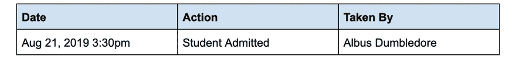
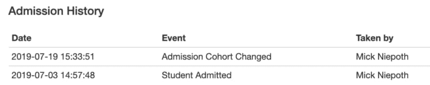

# 直到如何选择与 Ecto 合并。询问

> 原文：<https://dev.to/ktravers/til-how-to-select-merge-with-ecto-query-1944>

场景是这样的:您正在使用 Elixir 和 Ecto，您需要从一个表中检索数据，还可能需要从一个非关联的表中检索一两个字段。在过去，每当我遇到这种情况，我都会做一些我不完全满意的事情——可能更新模式，将它分解成多个查询，或者如果我觉得有趣，构建一个多选语句。

幸运的是，今天我知道有更好的方法。您可以使用`Ecto.Query#select_merge/3.`在一个查询表达式中完成相同的最终结果

让我们通过一个例子来看看它是如何工作的。

## 设置

假设您在一所设有招生部门的学校工作，并且您的任务是显示一个事件日志，该日志显示与给定录取相关的所有事件，并分为三列:1)日期，2)采取的操作，以及 3)操作者。

[](https://res.cloudinary.com/practicaldev/image/fetch/s--9KmkZx34--/c_limit%2Cf_auto%2Cfl_progressive%2Cq_auto%2Cw_880/https://miro.medium.com/max/2668/1%2A71xPk-6eU5-GAXn9ImMjqw.png)

首先，我们有一个类似于
的`AdmissionEvent`模式

```
defmodule Registrar.Tracking.AdmissionEvent do
  use Ecto.Schema

  schema "admission_events" do
    field(:action, :string)
    field(:admission_id, :integer)
    field(:admitter_uuid, Ecto.UUID)
    field(:occurred_at, :naive_datetime)
  end
end 
```

…和一个看起来像这样的`User`模式:

```
defmodule Registrar.User do
  use Ecto.Schema

  schema "users" do
    field(:uuid, Ecto.UUID)
    field(:full_name, :string)
  end
end 
```

这里的问题是 admitter 的全名存在于 users 表中，该表目前与 admissions_events 表没有关联。因此，如果我们做一个简单的选择查询，我们将得到填充表所需的入院事件，而不是入院者的全名。

```
defmodule Registrar.Tracking.AdmissionEvent do
  use Ecto.Schema
  import Ecto.Query, only: [from: 2]

  alias Registrar.Tracking.AdmissionEvent

  schema "admission_events" do
    field(:action, :string)
    field(:admission_id, :integer)
    field(:admitter_uuid, Ecto.UUID)
    field(:occurred_at, :naive_datetime)
  end

  def for_admission(query \\ AdmissionEvent, admission) do
    from(ae in query,
      where: ae.admission_id == ^admission.id,
      order_by: [desc: ae.occurred_at]
    )
  end
end 
```

把我们的查询函数在控制台上旋转一下:

```
iex(1)> admission = Repo.get(Admission, 1)
iex(2)> AdmissionEvent.for_admission(admission) |> Repo.all()
[
  %Registrar.Tracking.AdmissionEvent{
    __meta__: #Ecto.Schema.Metadata<:loaded, "admission_events">,
    action: "Student Admitted",
    admission_id: 3,
    admitter_uuid: "7edd4d7f-a790-41f9-b4ef-16f1dc3b33ea",
    id: 1,
    occurred_at: ~N[2019-07-29 02:22:18]
  }
] 
```

[](https://res.cloudinary.com/practicaldev/image/fetch/s--5nvWcD7n--/c_limit%2Cf_auto%2Cfl_progressive%2Cq_auto%2Cw_880/https://miro.medium.com/max/2400/0%2AK1SakwybU7UPsrEn)

那么，我们要如何获得全名呢？我们有很多选项可供选择，但在这篇文章中，我们将比较两个:一个是人们可能首先达到的(添加关联和预加载数据)，另一个是我们希望更经常达到的(选择合并)。

## 选项 1:添加关联，预加载数据

如果我们关联了`users`和`admissions_events`表，那么我们可以预加载关联的`User`结构并从中读取全名。

```
defmodule Registrar.Tracking.AdmissionEvent do
  use Ecto.Schema
  import Ecto.Query, only: [from: 2]

  alias Registrar.Tracking.AdmissionEvent
  alias Registrar.User

  schema "admission_events" do
    field(:action, :string)
    field(:admission_id, :integer)
    field(:admitter_uuid, Ecto.UUID)
    field(:occurred_at, :naive_datetime)
    # New association
    belongs_to(:admitter, User, foreign_key: :uuid)
  end
end

defmodule Registrar.User do
  use Ecto.Schema

  alias Registrar.Tracking.AdmissionEvent

  schema "users" do
    field(:uuid, Ecto.UUID)
    field(:full_name, :string)
    # New association
    has_many(:admission_events, AdmissionEvent)
  end
end 
```

在控制台中尝试我们的新关联:

```
iex(1)> admission = Repo.get(Admission, 1)
iex(2)> events = AdmissionEvent.for_admission(admission) |> Repo.all() |> Repo.preload(:admitter)
[
  %Registrar.Tracking.AdmissionEvent{
    __meta__: #Ecto.Schema.Metadata<:loaded, "admission_events">,
    action: "Student Admitted",
    admission_id: 3,
    admitter: %Registrar.User{
      __meta__: #Ecto.Schema.Metadata<:loaded, "users">,
      id: 1,
      name: "Albus Dumbledore",
      uuid: "7edd4d7f-a790-41f9-b4ef-16f1dc3b33ea"
    },
    admitter_uuid: "7edd4d7f-a790-41f9-b4ef-16f1dc3b33ea",
    id: 1,
    occurred_at: ~N[2019-07-29 02:22:18]
  }
]
iex(3)> event = List.first(events)
iex(4)> event.admitter.name
"Albus Dumbledore" 
```

这种方法完成了工作，但是有点重。我们只需要承认者的全名，那么为什么要检索整个用户结构呢？您还可以看到这种模式如何导致超级混乱的用户模式。现在它有许多录取事件，但很快它会有许多申请事件、面试事件、计费事件等。

## 选项二:✨选择合并✨

给了我们一个更加简洁和精确的选择。看看这个光滑度:

```
defmodule Registrar.Tracking.AdmissionEvent do
  use Ecto.Schema
  import Ecto.Query, only: [from: 2]

  alias Registrar.User
  alias Registrar.Tracking.AdmissionEvent

  schema "admission_events" do
    field(:action, :string)
    field(:admission_id, :integer)
    field(:admitter_uuid, Ecto.UUID)
    field(:occurred_at, :naive_datetime)

    ###### STEP ONE #######
    #  Add Virtual Field  #
    #######################
    field(:admitter_name, :string, virtual: true)
  end

  def for_admission(query \\ AdmissionEvent, admission) do
    from(ae in query,
      where: ae.admission_id == ^admission.id,
      order_by: [desc: ae.occurred_at],

      #### STEP TWO ####
      #  Join on User  #
      ##################
      join: u in User,
      on: ae.admitter_uuid == u.uuid,

      ############ STEP THREE #############
      #  Select Merge into Virtual Field  #
      #####################################
      select_merge: %{admitter_name: u.full_name}
    )
  end
end 
```

在控制台尝试选择合并:

```
iex(1)> admission = Repo.get(Admission, 1)
iex(2)> AdmissionEvent.for_admission(admission) |> Repo.all()
[
  %Registrar.Tracking.AdmissionEvent{
    __meta__: #Ecto.Schema.Metadata<:loaded, "admission_events">,
    action: "Student Admitted",
    admission_id: 3,
    admitter_name: "Albus Dumbledore",
    id: 1,
    occurred_at: ~N[2019-07-29 02:22:18]
  }
]
iex(3)> event = List.first(events)
iex(4)> event.admitter_name
"Albus Dumbledore" 
```

通过添加一个虚拟字段并用`select_merge`填充它，我们最终得到一个轻量级的解决方案。我们准确地获得了我们需要的数据，而无需添加任何新的关联，保持了模式的解耦。此外，如果我们需要为不同类型的事件引入事件日志，我们可以遵循一种模式，这种模式更具可扩展性。

[](https://res.cloudinary.com/practicaldev/image/fetch/s--g-6M4YpQ--/c_limit%2Cf_auto%2Cfl_progressive%2Cq_auto%2Cw_880/https://miro.medium.com/max/3200/0%2AzImY0s5zkUkGdkgT)

## 总结

`Ecto.Query#select_merge/3`允许我们在选择查询中直接填充虚拟字段，在设计模式和编写查询时，为我们提供了各种各样的灵活性。

10/10 将再次组成。

## 资源

*   [埃克托。查询#select_merge/3 单据](https://hexdocs.pm/ecto/Ecto.Query.html#select_merge/3)
*   [埃克托。查询#select_merge/3 源代码](https://github.com/elixir-ecto/ecto/blob/master/lib/ecto/query.ex#L1168-L1209)