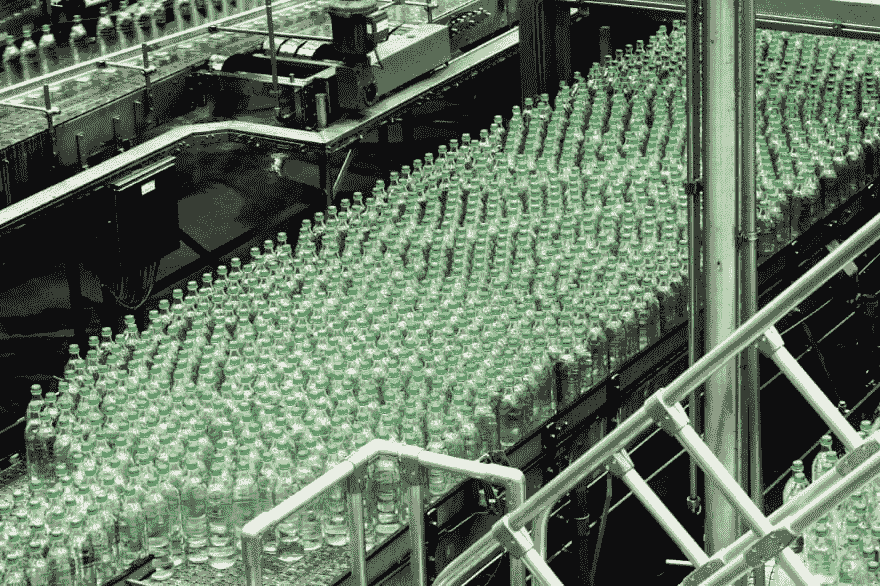

# TIL —静态工厂方法

> 原文：<https://dev.to/bowlendev/til-static-factory-methods-5d8d>

今天，我的工作任务引导我阅读了静态工厂方法，这是一种不同的初始化 Java 类的方法。

[](https://res.cloudinary.com/practicaldev/image/fetch/s--mOvkJ3vb--/c_limit%2Cf_auto%2Cfl_progressive%2Cq_auto%2Cw_880/https://miro.medium.com/max/1400/0%2ARFyOEFIPJqOZMCtZ)

《有效的 Java 》( Addison-Wesley 2018)帮助我理解了这个概念，以下是我对该阅读的简要看法:
瓶子在实际工厂中移动。瓶子在真正的工厂里移动。

-静态工厂方法被赋予名称，这有助于我们作为开发人员更好、更快地理解它们做什么。它们在你的程序中节省时间和内存，因为它们在运行时不需要创建新的实例。
-他们可以创建不同版本的子类型。这些子类型甚至不需要在编写方法时编写它们的类。
——他们当然不能解决所有问题。它们不能随着参数的增加而很好地扩展。但是书中给出的例子说明了这个概念的用途:

```
public static Boolean valueOf(boolean b) {
       return b ? Boolean.TRUE : Boolean.FALSE;
} 
```

这里你用简洁易懂的代码动态返回一个初始化的布尔值。这完全值得。
干杯。