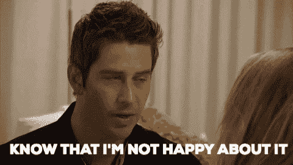

# 度假时编码还是不编码:这是我的问题

> 原文：<https://dev.to/knheidorn/to-code-or-not-to-code-on-vacation-that-is-my-question-4bio>

我刚从两周的假期回来。这是我的第一个长假，因为我真的把我的牙齿埋进了激情项目，我发现自己编码比我预期的多。

我个人是*编码的时候插*。我戴上超大的耳机，听我喜欢的音乐，试着去解决问题。当我在家的时候，我很少给自己设定时间限制，我在假期继续这种模式。值得注意的是，我发现编码有治疗作用。我可以发挥我的创造力，我是一个内向的人，所以编码给了我一个从社交互动中充电的机会，我有时会觉得很累。

在这个假期里，我无意中把自己与朋友和家人隔离开来。

虽然每个人似乎都很满意，没有提到我的缺席，但我不禁觉得我错过了度假的打算。我没有沉浸在我的书中，也没有坐在草坪椅子上与人聊天，而是在电脑屏幕前消磨时间。事实上，除了环境和我自己选择解决有趣的问题之外，我的日常活动没有任何变化。现在我回来了，我后悔限制我的屏幕时间。我认为有这样一种观念，假期应该是与人们重新联系，加强现有的关系，同时也找到一些远离蓝色屏幕灯光的*私人时间*。我忍不住这种痛苦的感觉，我错过了假期中一些有价值的部分。

所以我对社区的问题是，你在度假的时候编码吗？如果是，你什么时候有时间编码？当你在人们周围编码时，你有什么感觉？

自私地说，我不想在休假时停止编码。那么，你有什么建议可以帮助我在未来的旅行中避免负罪感呢？
[T3】](https://res.cloudinary.com/practicaldev/image/fetch/s--Ehyy-69Q--/c_limit%2Cf_auto%2Cfl_progressive%2Cq_66%2Cw_880/https://media3.giphy.com/media/wHd6y7EUkSKxpaEBbA/giphy.gif%3Fcid%3D790b761159881bd04b9c5018ff41f874a096a58c3631cefe%26rid%3Dgiphy.gif)