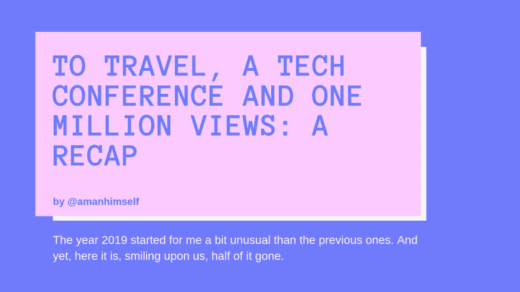

# 旅行，一个技术会议和一百万次浏览:一个回顾

> 原文：<https://dev.to/amanhimself/to-travel-a-tech-conference-and-one-million-views-a-recap-1245>

对我来说，2019 年的开始有点不同寻常。我从没想过我的博客帖子会受到如此多的关注，这些帖子大多发表在 Medium 上。只计划了一次旅行，结果去了两次。最后也参加了一个科技会议。当我开始我的开发职业生涯时，我从来没有想过。

六个月已经过去了，因此，如果你在 Twitter 上，你可能每天至少会看到下面这条推文。

> 年进度@ year _ progress▓▓▓▓▓▓▓▓░░░░░░░50%2019 年 7 月 02 日下午 12:001445027097

今年到目前为止一直是过山车。类似于我在 1 月的
[经历的一次，但是有点慢。](https://www.instagram.com/p/BtK7sa3BOG3/)

[https://www.instagram.com/p/BtK7sa3BOG3/embed/captioned](https://www.instagram.com/p/BtK7sa3BOG3/embed/captioned)