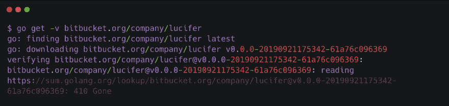

# 今天我学到了——修复:读取 sum.golang.org/lookup 时获取私有存储库返回错误

> 原文：<https://dev.to/bxcodec/today-i-learned-fix-go-get-private-repository-return-error-reading-sumgolangorglookup-4kjh>

#### 修复错误:在私有模块上获取 gomodule，错误消息模式验证 git-host…读取 sum.golang.org/lookup…410 消失

[](https://res.cloudinary.com/practicaldev/image/fetch/s--9DZK7gzi--/c_limit%2Cf_auto%2Cfl_progressive%2Cq_auto%2Cw_880/https://cdn-images-1.medium.com/max/1024/1%2AcTBtBcPBD7gbyWy5RKGWLw.png)

今天是阳光明媚的一天，周日，但是被一件让我愤怒了一个小时的事情给毁了。事实上，我从昨晚(周六晚上)开始就一直坚持这个问题，但由于我真的很累，我决定停下来休息一下，周日再继续。

所以，我一直在做 Mabar ( [https://mabar.id](https://mabar.id) )作为我的副业项目之一。现在还是测试版，仍然缺少很多功能，可以在 Android Play 商店上试试[这里](http://bit.ly/2mcWvv0)

我对这个 Mabar 有很高的期望，它应该是一个平台，可以在许多界面上使用(移动、桌面、网络)。对于技术栈，我使用 Golang 作为后端，Kubernetes 作为基础设施，数字海洋作为服务器。

#### 问题

所以问题是，我有一个私有模块(Golang 模块)，一个将由我的后端 API 导入的简单库。但不知何故，我无法获得模块，并且在执行 go get 命令时总是出错。

假设包名是路西法。它总是在终端上抛出错误。这真的让我很生气。

```
$ go get -v bitbucket.org/compay/lucifer
go: finding bitbucket.org/compay/lucifer latest
go: downloading bitbucket.org/compay/lucifer v0.0.0-20190921175342-61a76c096369
**verifying bitbucket.org/compay/lucifer@v0.0.0-20190921175342-61a76c096369: bitbucket.org/compay/lucifer@v0.0.0-20190921175342-61a76c096369: reading** [**https://sum.golang.org/lookup/bitbucket.org/**](https://sum.golang.org/lookup/bitbucket.org/gokar/lucifer@v0.0.0-20190921175342-61a76c096369) **compay** [**/lucifer@v0.0.0-20190921175342-61a76c096369**](https://sum.golang.org/lookup/bitbucket.org/gokar/lucifer@v0.0.0-20190921175342-61a76c096369) **: 410 Gone** 
```

Enter fullscreen mode Exit fullscreen mode

如果你看信息，它说包裹不见了或者在 sum.golang.org 不可得到。

起初，我认为发生这种情况是因为我忘记了在 bitbucket 上执行 SSH，因为我曾经在这里写过:[https://medium . com/easy read/today-I-learned-fix-go-get-private-repository-return-error-terminal-prompts-disabled-8c 5549d 89045](https://medium.com/easyread/today-i-learned-fix-go-get-private-repository-return-error-terminal-prompts-disabled-8c5549d89045)

但是，它仍然没有很好地工作。当我执行 go get 命令时，它仍然不断返回一个错误，即使我只使用 SSH 来强制它。

#### 根本原因

所以，在互联网上搜索这个问题后，我找到了根本原因。这种情况只发生在 Golang 1.13 版本上。我可以在读完这篇新闻稿后证实这一点[https://golang.org/doc/go1.13#modules](https://golang.org/doc/go1.13#modules)

所以，这是因为在 Golang 版本中有一个关于代理的新特性。

#### 方案

事实上，我们可以选择几个解决方案。

*   **使用 GOPRIVATE**

正如 Go 1.13 发布文档中所述，

> 新的 GOPRIVATE 环境变量指示不公开的模块路径。它充当较低级别的 GONOPROXY 和 GONOSUMDB 变量的默认值，这些变量提供了对通过代理获取哪些模块以及使用校验和数据库验证哪些模块的更细粒度的控制。

意思是，要解决上面的问题，我们可以在系统中填充 GOPRIVATE 变量。将此命令添加到~/. bashrc .**根据您的公司/组织名称更改导出值。*

```
**export**  **GOPRIVATE** ="gitlab.com/ **idmabar** ,bitbucket.org/ **idmabar** ,github.com/ **idmabar**" 
```

Enter fullscreen mode Exit fullscreen mode

为了验证这是否有效，您可以执行 go env 命令。应该更像这样。

```
$ go env
GO111MODULE=""
GOARCH="amd64"
GOBIN=""
GOCACHE="/Users/imantumorang/Library/Caches/go-build"
GOENV="/Users/imantumorang/Library/Application Support/go/env"
GOEXE=""
GOFLAGS=""
GOHOSTARCH="amd64"
GOHOSTOS="darwin"  
GOOS="darwin"
GOPATH="/Users/imantumorang/go"
**GOPRIVATE="gitlab.com/idmabar,bitbucket.org/idmabar,github.com/idmabar"**
GOPROXY="[https://proxy.golang.org,direct](https://proxy.golang.org,direct)"
GOROOT="/usr/local/Cellar/go/1.13/libexec"
GOSUMDB="sum.golang.org"
GOTMPDIR=""
GOTOOLDIR="/usr/local/Cellar/go/1.13/libexec/pkg/tool/darwin\_amd64"
GCCGO="gccgo"
AR="ar"
CC="clang"
CXX="clang++"
CGO\_ENABLED="1"
GOMOD=""
CGO\_CFLAGS="-g -O2"
CGO\_CPPFLAGS=""
CGO\_CXXFLAGS="-g -O2"
CGO\_FFLAGS="-g -O2"
CGO\_LDFLAGS="-g -O2" 
```

Enter fullscreen mode Exit fullscreen mode

现在我可以对我的私有存储库执行 go get 命令了。

```
$ go get bitbucket.org/company/lucifer
go: finding bitbucket.org/company/lucifer latest
go: downloading bitbucket.org/company/lucifer v0.0.0-20190921175342-61a76c096369
go: extracting bitbucket.org/company/lucifer v0.0.0-20190921175342-61a76c096369 
```

Enter fullscreen mode Exit fullscreen mode

所以这个 env 变量将告诉 go get 命令使用私有主机代理来检索包。

*   **使用 GONOSUMDB**

另一个解决方案是使用 GONOSUMDB 变量。我还是不去尝试这个，但是看了这个提案之后好像很管用[https://go . Google source . com/proposal/+/master/design/25530-sumdb . MD](https://go.googlesource.com/proposal/+/master/design/25530-sumdb.md)

所以您可以在您的环境变量:
中设置它

```
**export**  **GONOSUMDB** ="gitlab.com/idmabar,bitbucket.org/idmabar,github.com/idmabar" 
```

Enter fullscreen mode Exit fullscreen mode

实际上这个问题只发生在 Golang 及以后的新版本中。所以在更新你的 Golang 版本之前，确保设置这个环境变量。

这里有几个可能与这个问题有关的链接，感谢 [noveaustack](https://stackoverflow.com/users/12052086/noveaustack) 发现这个问题并在 Stackoverflow 中发布，我只是重新发布这个，因为我刚刚知道这个问题，这是我学到的新东西。

#### **参考文献**

*   Stackoverflow 回答:[https://stackoverflow.com/a/57887036/4075313](https://stackoverflow.com/a/57887036/4075313)
*   关于 Go 模块的 Go Sum DB 的建议:[https://Go . Google source . com/proposal/+/master/design/25530-sumdb . MD](https://go.googlesource.com/proposal/+/master/design/25530-sumdb.md)
*   代理校验和数据库:[https://docs.gomods.io/configuration/sumdb/](https://docs.gomods.io/configuration/sumdb/)
*   与此问题相关的 Github 问题: [#33985](https://github.com/golang/go/issues/33985) 和 [#32291](https://github.com/golang/go/issues/32291)

* * *