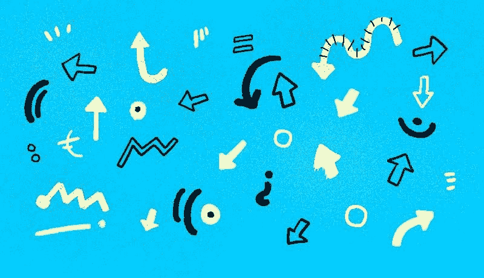
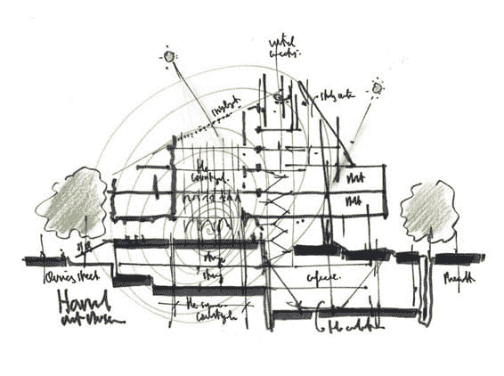
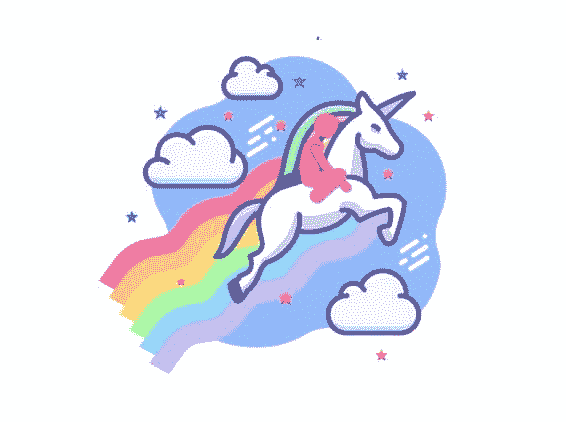
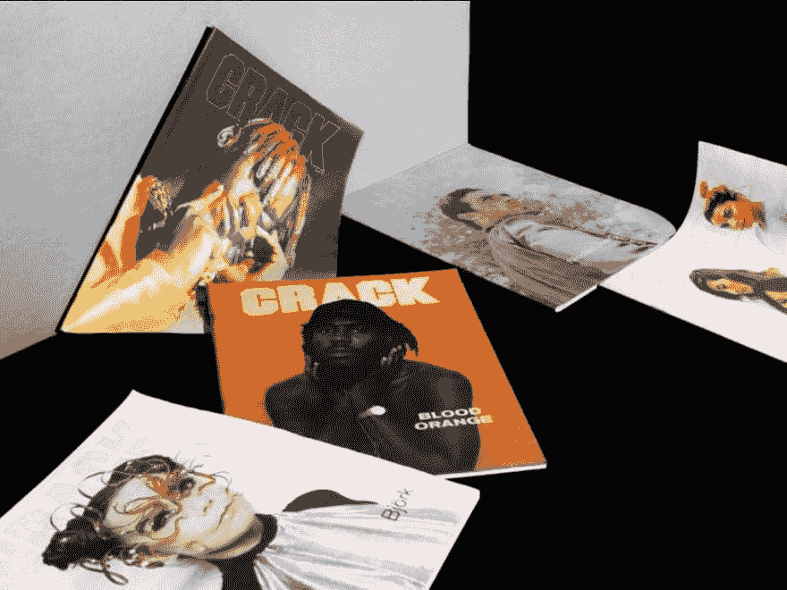
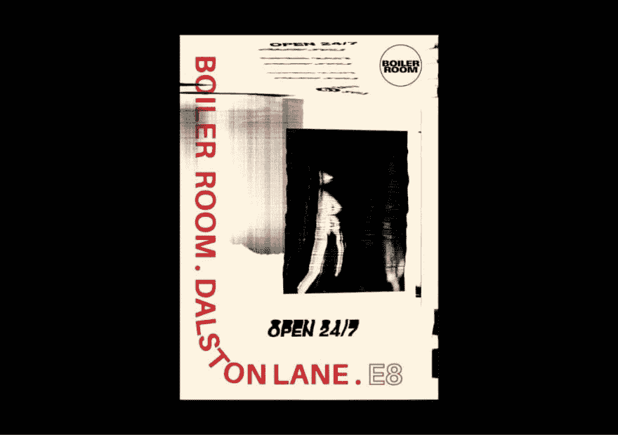

# 太多的灵感，手工设计，Figma 插件——本周还有更多 UX

> 原文：<https://dev.to/uxcollective/too-much-inspiration-designing-by-hand-figma-plugins-and-more-ux-this-week-1l1f>

#### *每周精选的设计链接，由你在 UX 集体的朋友带给你。*

本周的清单很好地结合了重要的话题(如卡莉·费舍尔关于无障碍的文章)和愚蠢的次要项目(包括为英国新首相鲍里斯·约翰逊制定的讽刺品牌指南)。

希望你喜欢！

*   [**数字无障碍**](https://alistapart.com/article/getting-to-the-heart-of-digital-accessibility/) →数字无障碍之旅的 4 个阶段。
*   [**灵感太多？**](https://99u.adobe.com/articles/59641/design-debate-is-there-such-a-thing-as-too-much-inspiration) →有这种东西吗？灵感的利弊。
*   [**迅捷软件**](https://craigmod.com/essays/fast_software/) →迅捷软件的好处，以及它对 UX 的影响。

### 来自社区的故事

[**忘了电脑**](https://uxdesign.cc/forget-the-computer-heres-why-you-should-write-and-design-by-hand-19031089138f?source=friends_link&sk=896ad45d23380768f16463b0f7053473) →

下面是为什么要手写设计。

[**停止为随机人群设计**](https://uxdesign.cc/stop-designing-products-for-random-people-4734423cbfe6?source=friends_link&sk=82f8fffcd420b206176633232e7a3744) →

聚焦高期望客户。

[**UX:做得少，但有感觉**](https://uxdesign.cc/ux-do-less-but-with-feeling-e58e2c8b3c90?source=friends_link&sk=e035333514d9369b06521845dcdb53c3) →

实用主义和享乐主义之间的平衡不再均衡。

更多头条新闻:

*   [**为什么每个 UX 设计师都要去参加黑客马拉松**](https://uxdesign.cc/why-every-ux-designer-should-go-to-a-hackathon-50c78bb4a522?source=friends_link&sk=d7dec12abe9ae7eccbf3c222cc9e2c23) →
*   [**UX 人员需要了解的业务**](https://uxdesign.cc/user-researchers-need-to-understand-the-business-fe5338378f36?source=friends_link&sk=a856d7feffdf158f4d88032966ad493c) →
*   [**成为更好的 UX 作家的 5 种方法**](https://uxdesign.cc/5-ways-to-be-a-better-ux-writer-b131f63ca776?source=friends_link&sk=098e14fce71dbef7af8ad635f9271fae) →
*   [**7 个简单的&有效的方法让视觉/UI 设计变得更好**](https://uxdesign.cc/7-simple-methods-to-get-better-at-visual-ui-design-21fec0f417b5?source=friends_link&sk=af74f98780c995d675b2bb4c5d9a8159) →
*   **→**
***   [**如何做一个酷设计师**](https://uxdesign.cc/how-to-be-a-cool-designer-313161f9de05?source=friends_link&sk=e16f85108b2c2ca4129a6578360968a7) →**

 **### 新闻&观点

*   **→英国新首相的品牌指南。**
***   [**丑陋的格里字体**](https://uglygerry.com/) →你的国会选区创造的字体。*   [**键盘-触控板**](https://www.theverge.com/2019/8/1/20748281/mokibo-keyboard-trackpad-review-ipad-mouse) →触控式键盘=触控板。*   [**坏消息游戏**](https://getbadnews.com/) →抛开一切伦理道德，成为一个无良的传媒大亨。**

 **

精选作品:[**Y**](https://dribbble.com/mattpamer)[**asseen Faik**](https://www.yasseenfaik.xyz/)→

### 工具&资源

*   [**Figma 插件**](https://www.figma.com/blog/introducing-figma-plugins/) →大家最喜欢的工具现在提供插件。
*   [**卫报设计**](https://design.theguardian.com/) →卫报数字设计指南。
*   [**漂亮的 UI**](https://buildingbeautifuluis.github.io/index.html)→免费课程让你入门做 UI 设计师。
*   [**洛蒂文件**](https://lottiefiles.com/) →洛蒂和 Bodymovin 的动画库。

* * *****