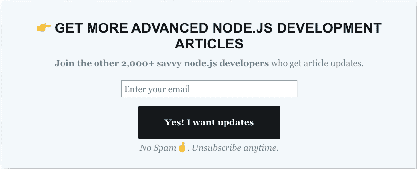
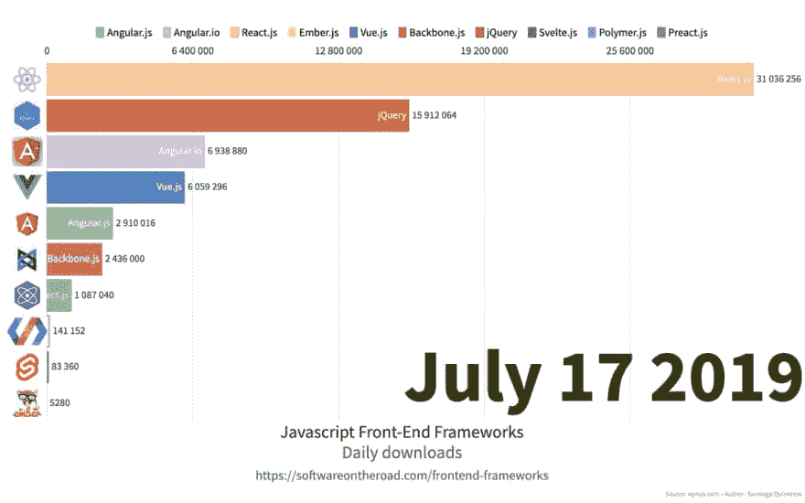

# 下载量排名前十的前端框架[2015-2019]

> 原文：<https://dev.to/santypk4/top-10-front-end-frameworks-by-downloads-2015-2019-2427>

**原贴于[softwareontheroad.com](https://softwareontheroad.com/frontend-frameworks/)T3】**

我厌倦了阅读有偏见的文章，声称什么框架是最好的，基于错误的假设或来自赞助的钱(是的，这是一件事)。

所以下面是我对 2015 年 3 月到 2019 年 7 月最日常下载框架的研究。

[https://www.youtube.com/embed/gcqddfFAnoo](https://www.youtube.com/embed/gcqddfFAnoo)

**TL；DR: React.js 是 2019 年日下载量最大的前端框架。**

# 以下是我对每个框架的看法

*   jQuery
*   反应
*   提前
*   Angular.js
*   Angular.io
*   某视频剪辑软件
*   余烬
*   聚合物
*   毅力
*   苗条的
*   结论

# jQuery

是的，我听到你在尖叫，jQuery 不是一个框架而是一个库。

我决定包括它，因为它是最著名的 javascript 工具之一。开发 PHP(和 WordPress)的人都知道 jQuery。连我父亲(说来话长)都知道它的存在。

我已经看到了太多用 jQuery 开发页面的“框架”或方法的普通实现，以至于我不得不考虑它。

# React.js

当我在 2015 年 12 月第一次尝试 React.js 时，我讨厌它。

CSS 和 javascript 怎么敢混用？

那些日子已经过去了，现在我喜欢在我的 react 组件中声明 CSS， [*你应该顺便试试 Emotion。*T3】](https://npmjs.com/package/emotion)

# 预动作

两年前，当人们阅读 React.js 的源代码时，发现他们可以通过剥离大量代码来改进它。

这是 Preact 和类似框架的诞生，我现在不记得名字了。

他们甚至使 API 兼容，所以你可以在你的应用中替换所有的调用来使用 Preact。

我对此没什么可说的，我从来没有机会尝试过。

# Angular.js(经典)

哦，我的初恋，Angular.js，我从 1.3 版本开始使用它，它太容易出错了。

好吧，也许没那么糟糕，我们是糟糕的开发者。

你可以很容易地通过手工操作$scope 来搞乱你的应用程序，因为一切都是可变的，本质上不可变性的概念在当时并不流行。

我也不会开始谈论渲染和调用$digest 和$apply。

几个朋友仍然在 Angular.js *上开发和维护遗留应用程序(他们讨厌这样。)*

Angular.js 是改变这一切的框架，我们应该为有机会使用它而自豪。

# 👉获取更高级的节点。JS 开发文章

加入其他 2000 多名精通 node.js 的开发人员的行列，获取文章更新。

# angular . io(2/4/6/8/等)

那时候我是个棱角分明的粉丝(谁不是呢？)但是我知道并且承认 angular.js 有它的缺陷。

天哪，他们让第二版的等待时间变得更长了！！

幸运的是，当它出来时，我有机会为公司实现一个全新的应用程序，angular2 是我的选择。

我喜欢它有组织的代码，应用程序的稳定性，以及它强迫你遵循的坚实原则。

这无疑是我第二喜欢的框架。

# 视图

我和 vue.js 有过两次邂逅

1.  一天下午，我决定打开源代码，只是为了偷看一下，发现注释中有中文(不太确定)字符，吓得退出了。
2.  必须写 3 个组件，因为客户端的前端开发人员从地球上消失了。

我不能说它很棒，我只是觉得它很普通。没有什么是你不能做的反应或角度。

# 余烬

我从未见过任何开发人员部署过 Ember 产品应用程序，只是我的朋友 Fernando 是一个通晓多种语言的开发人员，喜欢尝试各种语言和框架。

所以这让我认为这是你在所有这些类型的帖子中看到的那些框架之一，提到它只是为了填充列表，这很可悲。

你用余烬吗？[在推特上告诉我](https://twitter.com/santypk4)

# 聚合物

谷歌“支持”的那个，我在 2016 年只尝试过一次聚合物，做了一个“网络组件”，给我的同事看，再也没碰过它。

也许我一直在使用谷歌的一个用聚合物编写的应用程序，但从来没有注意到它。

# 骨干

优秀的老骨干。

我太年轻了，不能说它不好，因为当我在 2014 年初被介绍到 web 开发时，我跳过了 jQuery 和 PHP，直接学习 Angular.js。

但是我的老开发者朋友 Gonzalo 说它很稳定，也很有趣。

我相信 openenglish.com 的一个版本是用它开发的…

# 身材苗条

去年，在我以前的工作中，我们做了一个深夜部署*(是的，我不想谈论它)*和*超级*前端，总是向我展示新的前端东西，正在开发我们主要产品的一个新的替代版本(他非常热爱他的工作，和他一起工作是如此的愉快)。

我认为产品经理不喜欢为了改变框架而重写应用程序的想法，但这是一个快速而稳定的构建，我喜欢。

# 结论

有大量的前端框架，但是只有少数几个值得尝试，只有几个值得使用。

试着和你更喜欢的人呆在一起，并且和他一起工作感觉很舒服，你可能需要成为这方面的专家，所以最好明智地选择。

 [<source type="image/webp">
<source type="image/jpeg">
](///static/73986baddb656c0c3f767b6b277c0d88/c3447/conclusion.jpg) 

# 👉获取更高级的节点。JS 开发文章

加入其他 2000 多名精通 node.js 的开发人员的行列，获取文章更新。

而且不要错过这个大作，相信你会喜欢的:)

 [## 防弹 node.js 项目架构🛡️

### Sam Apr 18 ' 1911 分钟读取

#node #javascript #webdev #tutorial](/santypk4/bulletproof-node-js-project-architecture-4epf)