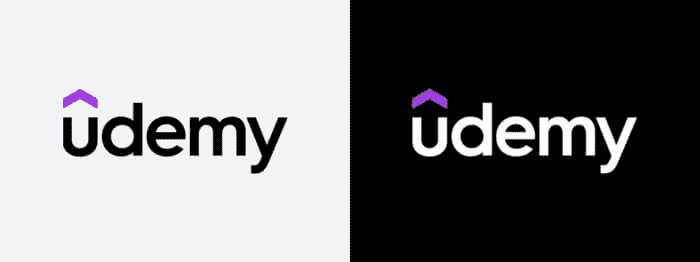

# 2022 年学习编码的 22 个最佳地点和在线平台

> 原文：<https://dev.to/javinpaul/top-20-websites-to-learn-coding-with-java-python-sql-algorithms-and-git-for-free-in-2019-best-of-lot-l2l>

*披露:这篇文章包括附属链接；如果您从本文提供的不同链接购买产品或服务，我可能会收到报酬。*
[T5】](https://www.educative.io/courses/python-101-interactively-learn-how-to-program-with-python-3?affiliate_id=5073518643380224)

你好，如果你正在自学编程和编码，并且正在寻找一些很棒的资源，那么你来对地方了。在这篇文章中，我将分享 [21 个网站](http://www.java67.com/2018/06/21-websites-to-learn-how-to-code-for.html)，你可以在舒适的办公室和家里免费使用这些网站来学习代码。

## **1。**

 **网上学习的最佳场所之一。您将获得所有最新技术和编程语言的在线课程，如 [Java](https://medium.freecodecamp.org/these-are-the-best-free-courses-to-help-you-learn-java-8-and-java-9-a7615c8644ab) 、 [Spring](https://javarevisited.blogspot.com/2016/12/top-5-spring-and-hibernate-training-courses-java-jee-programmers.html) 、[数据结构和算法](http://www.java67.com/2019/02/top-10-free-algorithms-and-data.html)、Selenium、REST 等。它提供免费和付费资源。

这里有几个有用的免费课程，可以学习一些有趣的技术:

1.  **Java 完全初学者教程** ( [链接](http://bit.ly/2zO3AHT))
2.  **Python 编程入门** ( [链接](http://bit.ly/2D5vvnV))
3.  **易于高级的数据结构** ( [链接](http://bit.ly/introduction-to-data-structures))
4.  **高级面向对象的 JavaScript 和 ES6** ( [链接](http://bit.ly/2Dk46PJ)

它充满了一些伟大的老师，如柯尔特·斯蒂尔，罗伯·帕西瓦尔，斯蒂芬·格里德，乔希·波尔蒂利亚，约翰·珀塞尔，安吉拉·余等。付费的 Udemy 课程也很便宜，在经常发生的闪购期间，你只需花 9.99 美元就能买到。例如，我在 Udemy 大甩卖上只花了 10 美元就买到了安吉拉·于的《100 天的代码:2022 年 Python Pro Bootcamp 教程》和其他几本书。

* * *

## **2。**[**educative . io**T7】](https://www.educative.io?affiliate_id=5073518643380224)

这是一个学习编程的好网站。这个高度互动的平台采用了一些最流行的技术，如 [JavaScript](https://medium.com/javarevisited/10-best-online-courses-to-learn-javascript-in-2020-af5ed0801645) 、 [Java](https://medium.com/javarevisited/10-books-java-developers-should-read-in-2020-e6222f25cc72) 、 [Kubernetes](https://medium.com/javarevisited/7-free-online-courses-to-learn-kubernetes-in-2020-3b8a68ec7abc) 、 [Python](https://medium.com/javarevisited/10-free-python-tutorials-and-courses-from-google-microsoft-and-coursera-for-beginners-96b9ad20b4e6) 等等。无论你是想学习新技术还是准备面试，这都是一个很好的网站。

所有课程都以浏览器内编码环境为特色，这意味着不需要任何设置。它们包括测验和挑战，以进一步测试你对材料的理解。

我第一次知道他们是在我参加他们的热门课程时，比如[探索系统设计面试](https://www.educative.io/collection/5668639101419520/5649050225344512?affiliate_id=5073518643380224)和[探索编码面试:编码问题的模式](https://www.educative.io/collection/5668639101419520/5671464854355968?affiliate_id=5073518643380224)，我对基于文本的互动课程的质量和理念印象深刻。你不需要跳过，它比传统的在线课程快得多。

他们还有很多有用的免费课程，我鼓励你去看看:

*   [从零开始学习 Python](https://www.educative.io/courses/learn-python-from-scratch?affiliate_id=5073518643380224)
*   [从零开始学 Java】](https://www.educative.io/courses/learn-java-from-scratch?affiliate_id=5073518643380224)
*   [从零开始学习 c++](https://www.educative.io/courses/learn-cpp-from-scratch?affiliate_id=5073518643380224)
*   [从头开始学习 HTML、CSS 和 JavaScript】](https://www.educative.io/courses/learn-web-development-from-scratch?affiliate_id=5073518643380224)

而且，如果你发现他们的付费课程有用，你可以通过 **[教育订阅](https://www.educative.io/subscription?affiliate_id=5073518643380224)** 比购买个人课程节省很多钱。订阅费每月 18 美元( **50%折扣，现在是**)，这是每个程序员都可以负担得起的，也是他们可以投资学习的东西。

* * *

## **3。** [**骏马**](https://coursera.pxf.io/c/3294490/1164545/14726?u=https%3A%2F%2Fwww.coursera.org%2F)

这是另一个令人敬畏的在线学习网站。它由斯坦福大学的教授吴恩达和达芙妮柯勒创建，提供课程、专业和在线学位。

Coursera 最棒的部分是它提供了斯坦福大学、伦敦大学、密歇根大学、科罗拉多大学、伦敦帝国学院等大学的在线课程。

它提供免费和付费的在线课程和专业课程。来自 Coursera 的一些我最喜欢的免费编程课程是:

1.  《算法第一部分和第二部分》作者罗伯特·塞奇维奇 k ( [链接](http://bit.ly/algorithms-part1)
2.  **机器学习由吴恩达** ( [链接](https://coursera.pxf.io/c/3294490/1164545/14726?u=https%3A%2F%2Fwww.coursera.org%2Flearn%2Fmachine-learning))
3.  **Python 为大家** ( [链接](https://coursera.pxf.io/c/3294490/1164545/14726?u=https%3A%2F%2Fwww.coursera.org%2Fspecializations%2Fpython))

Coursera 还为你提供认证，你可以在你的 Linkedin 个人资料中展示，但你需要付费。

* * *

## 4。[T3【freecodecamp.org】T5](https://www.freecodecamp.org/)

这是最棒的社区网站之一，它将帮助你免费学习编码，构建真实世界的项目，并获得一份开发者的工作。

它拥有海量的互动教程和练习，学习 JavaScript、[数据结构](https://hackernoon.com/10-data-structure-algorithms-and-programming-courses-to-crack-any-coding-interview-e1c50b30b927)和[算法](https://medium.freecodecamp.org/these-are-the-best-free-courses-to-learn-data-structures-and-algorithms-in-depth-4d52f0d6b35a)、[前端开发](https://hackernoon.com/the-2019-web-developer-roadmap-ab89ac3c380e)等等。

由昆西·拉森创建，这是一个开始你的编码之旅的非常棒的地方。他们甚至有一个很大的脸书群( [freecodecampearth](https://www.facebook.com/groups/freeCodeCampEarth/) )，在那里你可以提问和分享你的学习经验。

* * *

## **5。**

 **学习任何技术或 IT 课程的最佳网站之一，如编程语言如 [Java](http://www.java67.com/2018/08/top-10-free-java-courses-for-beginners-experienced-developers.html) ，Web 开发框架如 [Spring Framework](https://javarevisited.blogspot.com/2018/06/top-6-spring-framework-online-courses-Java-programmers.html) ， [Hibernate](https://javarevisited.blogspot.com/2018/01/top-5-hibernate-and-jpa-courses-for-java-programmers-learn-online.html) 等。

它现在也收购了 CodeSchool，该公司早期允许你通过做来学习网络技术。我用这个网站很快就学到了很多很酷的东西。

## **6。**[**try . github . io**](http://try.github.io/)

一个在 15 分钟内学会 Git 的神奇网站。这个网站最好的部分是它是一个元网站，这意味着它包含了一些最有用的在线学习 Git 的资源，如 [**学习 Git 分支**](https://learngitbranching.js.org/) ，它将教你从你的 web 浏览器直接使用 Git 命令。

它不仅能帮助你理解基本的 git 命令，还能挑战 git 概念，如分支、合并、恢复、精选、重定基础等。

还有另一个很棒的资源， [**可视化 Git**](http://git-school.github.io/visualizing-git/) ，它将帮助您探索 Git 命令如何在您的 web 浏览器中以自由探索模式影响存储库的结构，以及一些构建的场景。

## **7。**

 **一个月学会编码和构建 web 应用。这并不是一个免费的网站，你需要购买一个训练营式的课程。

该网站有在 30 天内学习 Python、T2、Ruby 和 T4 JavaScript 的课程，他们以训练营的方式授课，这使得它成为一个非常有效的学习场所。

顺便说一句，他们有免费试用！还有一些免费课程，如[命令行课程](https://medium.com/javarevisited/top-10-courses-to-learn-linux-command-line-in-2020-best-and-free-f3ee4a78d0c0)，他们也可以免费学习编码，一个月的播客即将推出。

## **8。**[**Codecademy.com**](https://bit.ly/codecademyhome)

交互式教程，免费学习一些最流行的技术，如 [JavaScript](https://javarevisited.blogspot.com/2018/06/top-10-courses-to-learn-javascript-in.html) 、 [Java](https://javarevisited.blogspot.com/2018/05/top-5-java-courses-for-beginners-to-learn-online.html) 、 [Linux](http://www.java67.com/2018/02/5-free-linux-unix-courses-for-programmers-learn-online.html) 。它还有一些付费课程，学习关于 [Python](https://javarevisited.blogspot.com/2019/09/5-websites-to-learn-python-for-free.html) 、 [Java](https://javarevisited.blogspot.com/2018/07/top-5-websites-to-learn-coding-in-java.html) 、[数据科学](https://medium.com/javarevisited/10-free-data-science-online-courses-for-beginners-a5fe78c2cb7b)和 [JavaScript](https://medium.com/javarevisited/5-best-javascript-books-for-beginners-and-experienced-web-developers-2c6353d1cc85) 的高级概念。

顺便说一句，这是第一个将互动学习带入图片的网站。它的 [JavaScript 课程](https://medium.com/javarevisited/12-free-courses-to-learn-javascript-and-es6-for-beginners-and-experienced-developers-aa35874c9a32)可能是在线学习 JavaScript 最受欢迎的课程。

## **8。**

 **另一个学习编码的好网站包含了大量免费的编程练习，让你在 [Python](https://javarevisited.blogspot.com/2018/12/10-free-python-courses-for-programmers.html) 和 [Java](https://javarevisited.blogspot.com/2018/05/top-5-java-courses-for-beginners-to-learn-online.html) 中建立编码意识。

## **9。**

 **开始学习编码和计算机科学基础的完美网站。我的孩子通过这个网站玩[《我的世界》游戏](https://www.amazon.com/Minecraft-Windows-10-Starter-Collection/dp/B07JCRY8WP?tag=javamysqlanta-20)来学习编码

## **10。**[**code4startup.com**](https://code4startup.com/?ref=javinpaul)

一个伟大的网站，通过建立真正的公司和真正的项目来学习如何编码。

这是从零开始学习 Web 开发的最好地方之一，在 3 个月内建立 4 个真正的在线企业，如 [Airbnb](https://code4startup.com/projects/build-airbnb-with-ruby-on-rails-level-1?ref=javinpaul) 、[优步](https://code4startup.com/projects/uber-app-for-food-with-python-django-and-swift?ref=javinpaul)等。不需要经验。

它还有很多免费课程，比如:
1。[新手在 1 小时内反应](https://code4startup.com/projects/reactjs-for-newbies?ref=javinpaul)
2。[学习 Rails 上的 Ruby、Heroku 和 Wistia API](https://code4startup.com/projects/hero-learn-ruby-on-rails-and-wistia-apis-by-cloning-code4startup-version-newbies?ref=javinpaul)

如果你喜欢基于项目的学习，那么你会喜欢这个网站。

## **11。**

 **另一个很棒的网站，有很多编程练习来学习编码和提高你在任何编程语言中的编码技能。

## **12。**

 **毫无疑问，SQL 是任何 IT 专业程序员的必备技能之一，不幸的是，很少有[网站](https://javarevisited.blogspot.com/2015/06/5-websites-to-learn-sql-online-for-free.html#axzz5cjYskFQQ)或[免费课程](http://www.java67.com/2018/02/5-free-database-and-sql-query-courses-programmers.html)可以让你学习 SQL。

对于初学者来说，这是学习 SQL 和提高你的 SQL 查询技能的最好地方。

它提供了交互式 SQL 教程和测验，非常适合提高您的 SQL 查询技能

## **13。**[**【git 浸润】**](http://gitimmersion.com/index.html)

这是学习 Git 和 [GitHub](https://medium.com/u/8df3bf3c40ae) 的最佳网站之一，GitHub 是当今程序员必备的技能之一。它提供了一个引导之旅，通过 [Git](https://dev.to/javinpaul/5-free-courses-to-learn-git-and-github-in-depth-jpp) 的基本原理，灵感来自于这样一个前提:知道一件事就是去做它。

这是学习 Git 的最佳课程之一，作者是已故的伟大的 T2 吉姆·威里奇。

本课程中建议的[别名](http://gitimmersion.com/lab_11.html)可以大大提高你的工作效率，如果你把它们包括在你的。bashrc 和. gitconfig。

## 14。[T3】学 Git 分支 T5】](https://learngitbranching.js.org/)

分支和合并是任何源代码控制工具(如 SVN、CVS)都难以掌握的概念，在 Git 中也是如此，但现在已经不是了。这个交互式网站将教你在 git 中进行独一无二的合并和分支。

“学习 Git 分支”是在互联网上学习 Git 的最直观和互动的方式之一。有很多具有挑战性的令人兴奋的水平的练习，给出了强大功能的一步一步的演示，甚至可能在过程中有一点乐趣。

## **15。codecombat.com**

你可以玩游戏，学习用 [Python](http://javarevisited.blogspot.sg/2018/03/top-5-courses-to-learn-python-in-2018.html) 和 [Javascript](https://javarevisited.blogspot.com/2018/08/5-programming-language-every-programmer-learn.html) 编码。在线学习最好的互动和乐趣之一。

## **16。**

 **通过免费互动课程学习 Haskell。

## **17。railsforzombies.org**

通过观看视频和完成练习来学习 Ruby on Rails，它现在与 Pluarlsight 合并了。

## **18。thinkful.com**

一个不同类型的网站，在那里你可以选择一门课程并被指派一名导师。

## **19。rubymonk.com**

免费的互动教程帮助你在浏览器中发现 Ruby 习惯用法。该网站为初级、中级和专家 Ruby 开发人员提供了单独的课程，以进一步磨练他们对 Ruby 编程语言的知识。

## **20。tryRuby.org**

另一个在线学习 Ruby 的好网站。这也与 [Pluarlsight](https://medium.com/javarevisited/top-10-pluralsight-courses-to-learn-programming-and-software-development-during-covid-19-stay-at-30b7d8a4f88f) 合并，你需要一个会员才能访问它的内容

## **21。**

 **学习 Python 基础知识的好网站。这十年来最流行的编程语言之一，它允许你做很多事情，从简单的自动化琐碎的事情到开发网站，现在用于[机器学习](http://www.java67.com/2019/01/5-free-courses-to-learn-machine-and-deep-learning-in-2019.html)和[数据科学](https://javarevisited.blogspot.com/2018/10/data-science-and-machine-learning-courses-using-python-and-R-programming.html)。如果你需要更多学习 Python 的理由，请看这篇文章。

以上是关于免费学习如何编码的一些最好的网站。这些网站是学习编程语言如 [Python](http://www.java67.com/2018/02/5-free-python-online-courses-for-beginners.html) 和 [Java](http://javarevisited.blogspot.sg/2017/11/top-5-free-java-courses-for-beginners.html#axzz4zuIICRs9) ，SQL 等常青树技术，Linux 等操作系统，Ruby On Rails 等 Web 开发框架，Haskel 等函数式编程语言，学习建立网站和其他几种免费课程的绝佳资源。

其他对程序员有用的免费资源

*   [学习 SQL 的免费课程](http://www.java67.com/2018/02/5-free-database-and-sql-query-courses-programmers.html)
*   [学习 Python 的免费课程](https://hackernoon.com/10-free-python-programming-courses-for-beginners-to-learn-online-38312f3b9912)
*   [学习算法的免费课程](https://hackernoon.com/10-free-data-structure-and-algorithm-courses-junior-developers-should-explore-978b72871af5)
*   [学习 C++的免费课程](https://hackernoon.com/top-5-free-c-courses-to-learn-programming-in-2019-d27352277da0)
*   [学习 Linux 的免费课程](http://www.java67.com/2018/02/5-free-linux-unix-courses-for-programmers-learn-online.html)
*   [学习区块链的免费课程](http://www.java67.com/2018/02/5-free-blockchain-technology-courses.html)
*   [学习网页开发的免费课程](http://www.java67.com/2018/03/top-5-free-courses-to-learn-web-development.html)
*   [学习 JavaScript 的免费课程](http://www.java67.com/2018/04/top-5-free-javascript-courses-to-learn.html)
*   [免费学习棱角分明的课程](http://www.java67.com/2018/01/top-5-free-angular-js-online-courses-for-web-developers.html)
*   [学习 React JS 的免费课程](http://www.java67.com/2018/02/5-free-react-courses-for-web-developers.html)
*   [学习 OOP 的免费课程](http://www.java67.com/2018/02/5-free-object-oriented-programming-online-courses.html)
*   [学习 Java 的免费课程](http://www.java67.com/2018/08/top-10-free-java-courses-for-beginners-experienced-developers.html)
*   [学习 HTML 和 CSS 的免费课程](http://www.java67.com/2018/02/5-free-html-and-css-courses-to-learn-web-development.html)
*   [学习数据结构和算法的免费课程](http://www.java67.com/2019/02/top-10-free-algorithms-and-data.html)
    *   [学习 Python 的最佳课程](https://medium.com/better-programming/top-5-courses-to-learn-python-in-2018-best-of-lot-26644a99e7ec)

感谢您阅读本文。如果你喜欢这篇文章，请与你在脸书的朋友分享。如果您有任何问题或反馈，请留言。

如果你喜欢这篇文章，那么请考虑在 twitter 上关注我。如果你想在每篇新帖子上得到通知，别忘了在 Twitter 上关注[**javarevited**](https://twitter.com/javarevisited)！******************