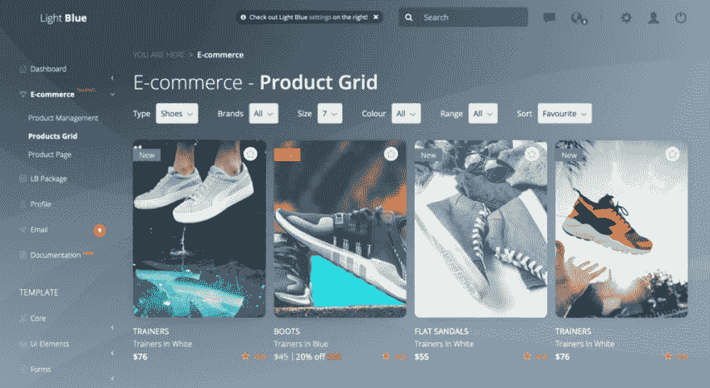
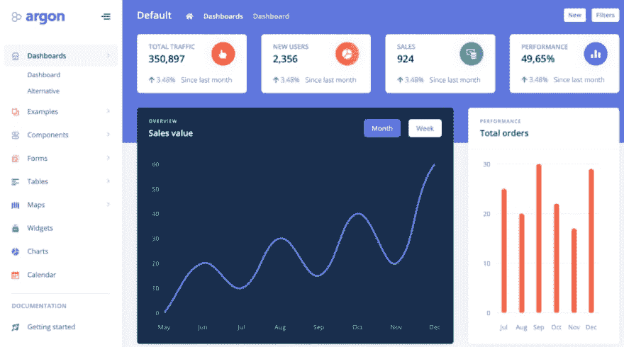
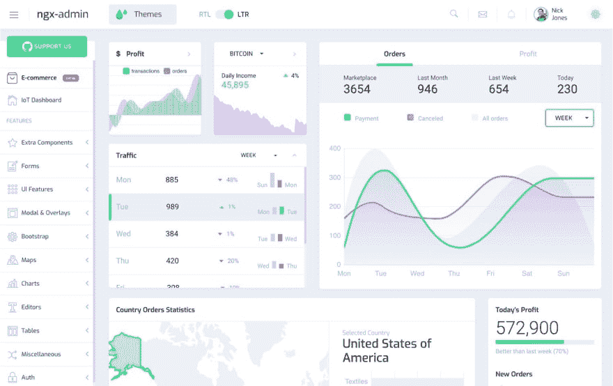
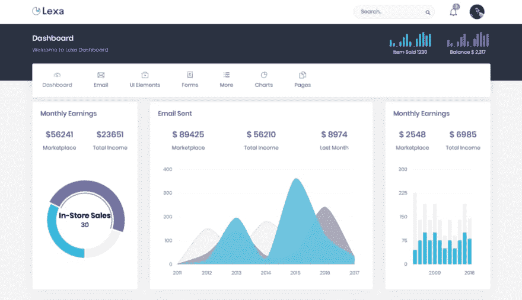

# 带节点的前 5 个管理模板。JS 后端

> 原文：<https://dev.to/flatlogic/top-5-admin-templates-with-node-js-backend-2fmh>

越来越多的开发人员目前决定提高他们的工作流程，尽量减少不必要的任务，并通过 Node.js 后端的管理面板来构建他们的虚拟桌面。

你可能会问为什么是 Node.js？Node.js 是一个 JavaScript 运行时环境。这意味着使用这个平台的主要优势是你可以在一种编程语言中拥有前端和后端。这允许你同步应用程序两个部分的数据。这大大加快了开发过程。

带有 Node.js 后端的管理模板不仅为您提供了应用程序的前端部分，还包括一些预先制作的后端。各种登录方法，产品管理，CRUD 应用程序，PostgreSQL 可以已经与管理面板集成。

众所周知，在你的发展角色中变得更大、更好、更强需要某种形式的转换或转变，以便让你高效地工作。高效和忙碌是有很大区别的，尽管有效进行这种转换的关键是给自己配备准确的工具。今天，我们将这样做。我们将使用 Node.js 后端浏览五个不同的管理模板，以帮助您提高当前的开发效率。

## **[浅蓝色 React Node.js 管理模板](https://flatlogic.com/admin-dashboards/light-blue-react-node-js)**

浅蓝色 React Node.js 是一个 React admin 模板，集成了 Node.js 后端和 PostgreSQL。它非常适合任何希望构建电子商务应用程序、CMS、SASS web 应用程序、CRM 等的人。因为它包含随时可用的工作身份验证、社交登录和产品管理组件。该模板还附带了 60 多个现成的可定制 UI 组件。为了开始，你需要做的就是部署应用程序，然后你就可以开始了。
[T3】](https://res.cloudinary.com/practicaldev/image/fetch/s--h6nBUXgl--/c_limit%2Cf_auto%2Cfl_progressive%2Cq_auto%2Cw_880/https://flatlogic.com/blog/wp-content/uploads/2019/08/Screen-Shot-2019-08-07-at-1.50.29-PM-1024x560.png)

## **特色**

*   PostgreSQL 集成版
*   CRUD 应用
*   60 多个现成的可定制 UI 组件
*   反应 16.5.2
*   背景深厚
*   8 个图表库
*   电子商务科

**定价:$99.95**

[了解更多](https://flatlogic.com/admin-dashboards/light-blue-react-node-js)

[试玩](https://demo.flatlogic.com/light-blue-react/#/app/main/dashboard)

[文档](https://demo.flatlogic.com/light-blue/documentation/)

## **[氩管理仪表板 Pro Node.js](https://www.creative-tim.com/product/argon-dashboard-pro-nodejs)**

对于这个管理模板，Creative Tim 与 Udevoffice 合作，提供了一个完全编码的“前端+后端”解决方案。它具有大量的组件，以帮助您创建任何您想要的网站。这个仪表板的主要好处是它提供了一种轻量级、快速、可扩展的现代方式来构建您的应用程序。
[T3】](https://res.cloudinary.com/practicaldev/image/fetch/s--lW-_qTSZ--/c_limit%2Cf_auto%2Cfl_progressive%2Cq_auto%2Cw_880/https://flatlogic.com/blog/wp-content/uploads/2019/08/Screen-Shot-2019-08-07-at-2.00.02-PM-1024x570.png)

## **特色**

*   16 个定制插件
*   200 个手工元素
*   25 页示例
*   SASS 文件
*   草图文件

**定价:$149**
[了解更多](https://www.creative-tim.com/product/argon-dashboard-pro-nodejs)
[演示](https://argon-dashboard-pro-nodejs.creative-tim.com/dashboard)
[文档](https://argon-dashboard-pro-nodejs.creative-tim.com/docs/getting-started/overview.html)

## **[唱吧 App Vue Node.js 管理模板](https://flatlogic.com/admin-dashboards/sing-app-vue-node-js)**

Sing App Vue Node.js 是一个与 Node.js 后端和 Postgres 数据库集成的管理模板。产品管理页面和各种登录方法已经实施并准备使用。该应用程序已准备好部署到任何亚马逊 aws，heroku 等。如果您正在构建 SAAS、CMS、电子商务应用程序并希望节省时间和金钱，这将是一个很好的起点。您还会看到 60 多个现成的可定制 UI 组件。
[T3】](https://res.cloudinary.com/practicaldev/image/fetch/s--oCQ6Csqv--/c_limit%2Cf_auto%2Cfl_progressive%2Cq_auto%2Cw_880/https://flatlogic.com/blog/wp-content/uploads/2019/08/Screen-Shot-2019-08-07-at-2.08.15-PM-1024x539.png)

## **特色**

*   60 多个现成的可定制 UI 组件
*   Vue.js 的最新版本
*   CRUD 应用
*   PostgreSQL 集成版
*   主题支持
*   电子商务科
*   静态和悬停侧边栏

**定价:$99.95**
[了解更多](https://flatlogic.com/admin-dashboards/sing-app-vue-node-js)
[演示](https://flatlogic.com/admin-dashboards/sing-app-vue-node-js/demo)
[文档](https://demo.flatlogic.com/sing-app/documentation/)

## **[Node.js MongoDB 入门包](https://store.akveo.com/collections/all/products/nodejs-mongodb-ngx-admin-angular-starter-bundle)**

这个包是与 Node.js 后端集成的 ngx-admin 的最小包。它包含用户界面、后端和基本用户管理的 JWT 认证。您可以根据自己的需要从两个不同的包中进行选择:入门包或电子商务包。电子商务工具包有一些额外的功能，如订单详情页面和示例订单表。仪表板基于 Angular ngx-admin、Express REST API、MongoDB 和其他流行且有用的技术。如果您正在搜索该模板的文档，您应该知道文档是随可交付文档一起提供的。
[T3】](https://res.cloudinary.com/practicaldev/image/fetch/s--yiYc_lZG--/c_limit%2Cf_auto%2Cfl_progressive%2Cq_auto%2Cw_880/https://flatlogic.com/blog/wp-content/uploads/2019/08/ngx-admin-screenshot.jpg)

## **特色**

*   Angular 和 Node.js 项目
*   ExpressJS，MongoDB 集成
*   公共和 JWT 安全 API 端点
*   授权/注册/密码恢复表单和 API
*   个人资料页面 CRUDL

**定价:39-140 美元**

[了解更多](https://store.akveo.com/collections/all/products/nodejs-mongodb-ngx-admin-angular-starter-bundle)
[试玩](https://bundle-demo.azurewebsites.net/pages/dashboard)

## 

莱克萨是用 Bootstrap 4、Node.js 和 JQuery 构建的。这是一个完全响应的、干净的用户界面，包括一个伟大的组件、部件和 UI 元素的集合。

这个管理模板的水平布局看起来不错，这是一个非常好的特点。莱克萨为所有版本维护了非常高质量的代码，因此开发人员可以根据他们的要求轻松定制。这是一个灵活的管理模板，可以用来建立各种项目。
[T3】](https://res.cloudinary.com/practicaldev/image/fetch/s--Fsd5Vh8C--/c_limit%2Cf_auto%2Cfl_progressive%2Cq_auto%2Cw_880/https://flatlogic.com/blog/wp-content/uploads/2019/08/Screen-Shot-2019-08-07-at-2.59.12-PM-1024x590.png)

## **特色**

*   水平和垂直布局
*   节点版本 9.11.2
*   SASS 支持
*   登录、注册、错误页面
*   日历视图
*   表单验证
*   带有准备打印按钮的发票
*   目录列表页面
*   谷歌地图
*   拖放区文件上传
*   摘要编辑器
*   6+图表库
*   数据表

**定价:22 美元**

[了解更多](https://themeforest.net/item/lexa-responsive-nodejs-admin-dashboard-template/23211691)
[试玩](https://themesbrand.com/lexa-node/)

最初发布于[https://flat logic . com/blog/top-5-admin-templates-with-node-js-back end/](https://flatlogic.com/blog/top-5-admin-templates-with-node-js-backend/)