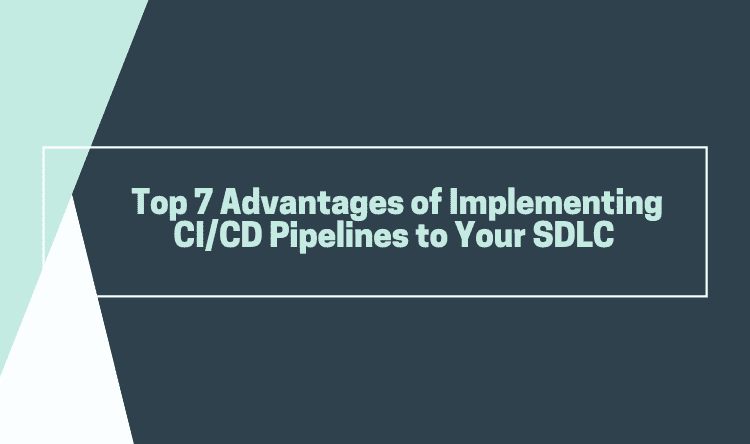

# 在 SDLC 中实施 CI/CD 管道的 7 大优势

> 原文：<https://dev.to/katalon/top-7-advantages-of-implementing-ci-cd-pipelines-to-your-sdlc-3gdk>

## **简介**

在软件工程中，CI/CD 指的是持续集成和持续交付的组合实践。CI/CD 实施的重要性是基于它带来的好处来考虑的。为了帮助您决定这是否是您的组织应该采取的正确步骤，在本文中，我们将向您介绍在您的软件开发生命周期中实现 CI/CD 管道的 7 个最佳优势。

## **对您的 SDLC 实施 CI/CD 管道的 7 大优势**

### 1。较小的代码更改

在您的日常软件开发过程中实现 CI/CD 的一个技术优势是，它允许您一次集成一小部分代码。这些代码更改比大块的代码更简单，也更容易处理，因此，以后需要修复的问题更少。使用持续测试，这些小部分一旦集成到代码库中就可以被测试，允许开发人员在太多工作完成之前发现问题。这对于那些远程工作的大型开发团队以及那些在内部工作的团队来说非常有效，因为团队成员之间的交流可能具有挑战性。

### 2。更快的释放速率

故障被更快地检测到，因此可以更快地修复，从而提高发布率。然而，只有当代码是在一个持续移动的系统中开发的时候，频繁的发布才是可能的。CI/CD 不断地合并代码，并在全面测试后不断地将它们部署到生产中，使代码保持发布就绪状态。作为部署的一部分，建立一个与最终用户最终使用的环境非常相似的生产环境是非常重要的。容器化是在生产环境中测试代码的一个很好的方法，只测试受发布影响的区域。

### 3。较小的积压

将 CI/CD 管道整合到您组织的开发过程中，可以减少您的积压工作中非关键缺陷的数量。这些小缺陷在生产之前就被检测出来，并在交付给最终用户之前得到修复。提前解决非关键问题有很多好处。例如，您的开发人员有更多的时间关注更大的问题或改进系统，而您的测试人员可以更少地关注小问题，这样他们就可以在发布之前发现更大的问题。另一个好处(也许是最好的一个)是通过防止客户在你的产品中发现许多错误来让他们高兴。

### 4。更高的测试可靠性

使用 CI/CD，由于咬入尺寸和引入系统的特定变化，测试可靠性提高，允许进行更准确的阳性和阴性测试。CI/CD 内的测试可靠性也可以认为是连续可靠性。随着新产品和新功能的不断合并和发布，知道质量在整个过程中是最重要的，可以保证利益相关者的投资是值得的。

### 5。更快的 MTTR(平均解决时间)

MTTR 测量可修复功能的可维护性，并设置修复损坏功能的平均时间。基本上，它可以帮助您跟踪从故障中恢复所花费的时间。CI/CD 降低了 MTTR，因为代码变化更小，故障隔离更容易检测。最重要的业务风险保证之一是将故障保持在最低限度，并从发生的任何故障中快速恢复。应用程序监控工具是查找和修复故障的好方法，同时还可以记录问题，以便更快地发现趋势。

### 6。故障隔离

故障隔离指的是这样设计系统的实践，即当错误发生时，负面结果被限制在一定范围内。限制问题的范围减少了潜在的损害，并使系统更容易维护。使用 CI/CD 设计您的系统可确保故障隔离更快检测到，更容易实施。故障隔离将监控系统、识别故障发生的时间以及触发故障定位结合起来。因此，应用程序中出现的错误的后果是有限的。通过在问题对整个系统造成损害之前隔离问题，可以防止突发故障和其他关键问题的发生。

### 7。降低成本

CI/CD 流程中的自动化减少了 CI 和 CD 的许多重复步骤中可能发生的错误数量。这样做也解放了开发人员的时间，他们可以把时间花在产品开发上，因为如果错误很快被发现，就没有那么多代码需要修改。另一件要记住的事情是:通过自动化提高代码质量也会提高你的投资回报率。

想了解更多关于 CI/CD 优势的详细信息吗？[了解更多信息](https://www.katalon.com/resources-center/blog/benefits-continuous-integration-delivery/)

## **结论**

CI/CD 有许多好处，因为它是一种强大而流行的软件开发方法，已经被许多组织采用。然而，这并不是一个万能的解决方案。因此，在将这些实践整合到您组织的开发过程中之前，请确保您了解这些实践的所有好处和风险。