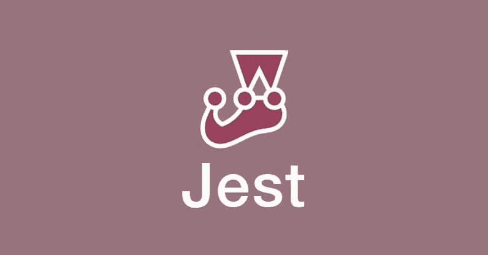
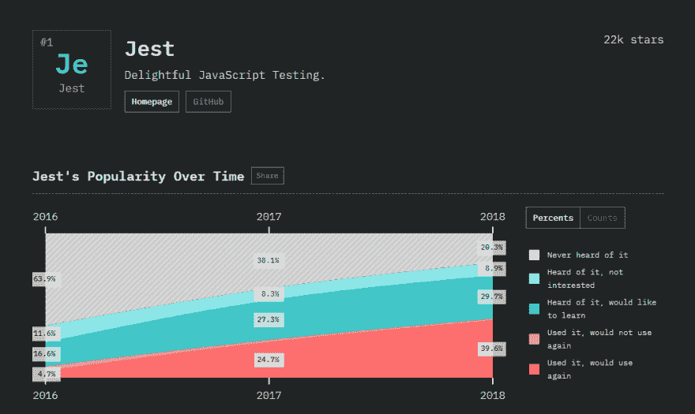
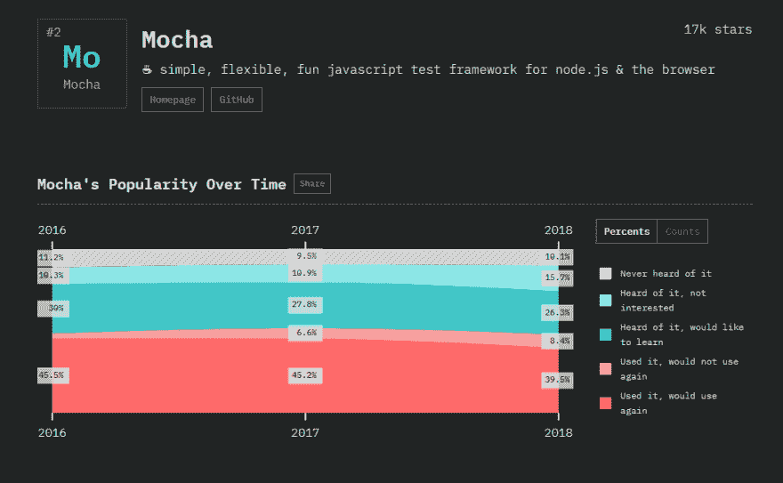
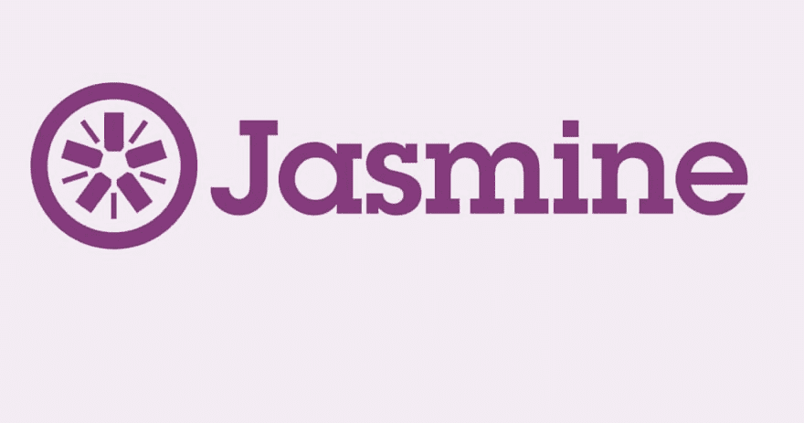
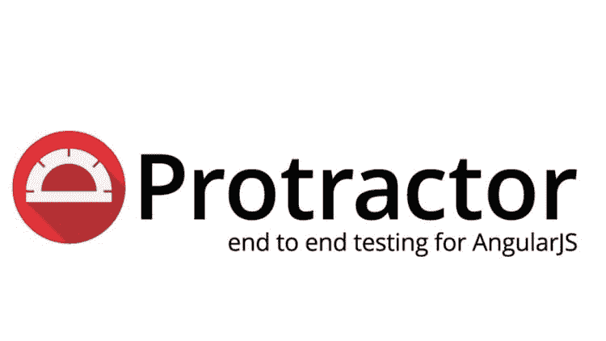
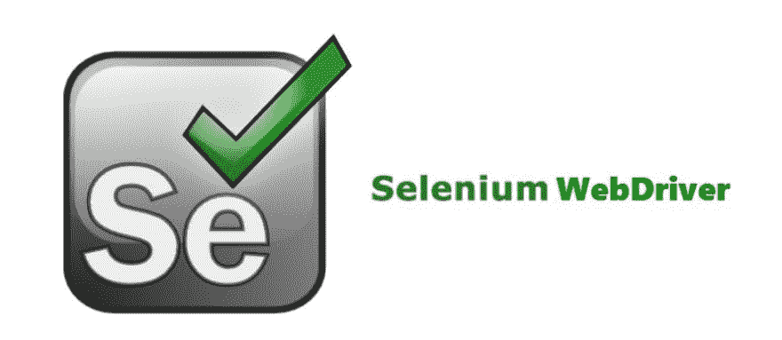
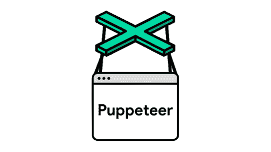
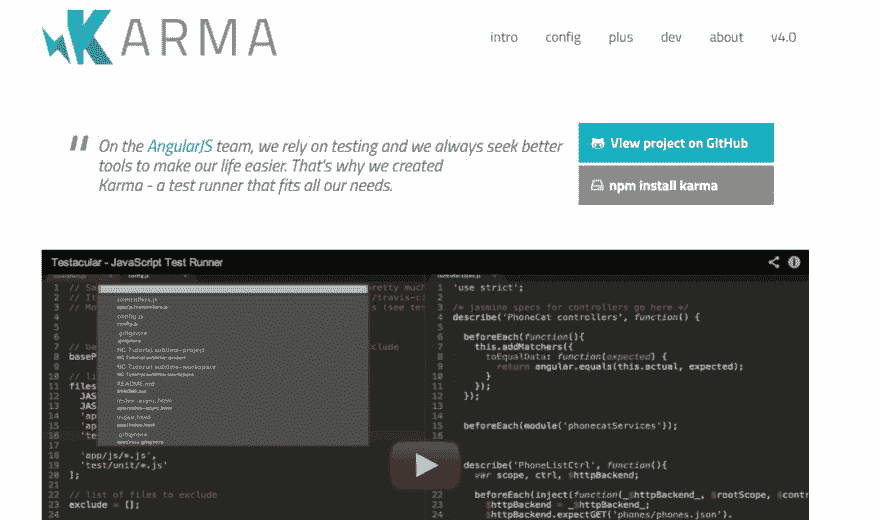
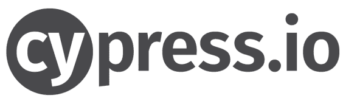
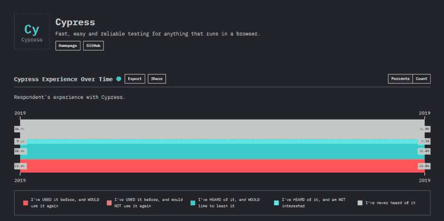

# 最佳 9 个 JavaScript 测试框架

> 原文：<https://dev.to/lambdatest/top-8-javascript-automation-testing-frameworks-in-2019-32dk>

我们正迈向自动化时代。每一家公司，无论是初创公司还是大型企业，他们都在努力尽可能高效地将自动化测试整合到他们的发布周期中。原因很简单，因为自动化测试大大减少了验证重复测试场景的工作量。JavaScript 不再被称为开发人员专用的编程语言。随着对[测试自动化](https://www.lambdatest.com/automation-testing?utm_source=devto&utm_medium=organic&utm_campaign=apr13-kj&utm_term=kj&utm_content=blog)需求的增加，JavaScript 测试框架应运而生以满足不同的目的，有些适合单元测试，有些则是为 E2E(端到端)测试而设计的。难怪全球的自动化测试人员都非常喜欢这些 JavaScript 测试框架。

自动化测试人员可用的各种 JavaScript 测试框架已经成为许多人困惑的原因。这是很自然的，你面前的选择越多，你就要花越多的时间来决定哪个 [JavaScript 自动化测试](https://www.lambdatest.com/javascript-automation-testing?utm_source=devto&utm_medium=organic&utm_campaign=apr13-kj&utm_term=kj&utm_content=blog)框架最适合你。

不过不要担心！我将重点介绍 9 大 JavaScript 测试框架，它们可以根据您的测试需求简化测试。

你也可以阅读我们关于 2019 年顶级 JavaScript 框架的另一篇博客[，在那里我们讨论了前端、后端和测试合适的框架。事不宜迟，让我们详细看看这些。](https://www.lambdatest.com/blog/top-javascript-frameworks-for-2019/?utm_source=devto&utm_medium=organic&utm_campaign=apr13-kj&utm_term=kj&utm_content=blog)

## 1。他来了

[](https://res.cloudinary.com/practicaldev/image/fetch/s--IvFah3vb--/c_limit%2Cf_auto%2Cfl_progressive%2Cq_auto%2Cw_880/https://cdn-images-1.medium.com/max/2000/1%2AugFiM20m0MB8u00yOpxZig.jpeg)

被 [stateofjs](https://2018.stateofjs.com/testing/jest/) 调查评为 2018 年排名第一的 **JavaScript 自动化测试框架**。Jest 由脸书开发，用于测试 JavaScript 代码，尤其是使用 React JS 开发的应用程序。从你的免费实用 [React Redux 测试](https://www.lambdatest.com/testing-cloud/react-redux-testing?utm_source=devto&utm_medium=organic&utm_campaign=apr13-kj&utm_term=kj&utm_content=blog)开始。

[](https://res.cloudinary.com/practicaldev/image/fetch/s--QQ3bu155--/c_limit%2Cf_auto%2Cfl_progressive%2Cq_auto%2Cw_880/https://cdn-images-1.medium.com/max/2110/1%2A_C4fQm1EsrCDSp-KYVWUXQ.png)

## 安装的先决条件

Jest 的特别之处在于它提供了一个集成框架，不需要任何配置经验。该工具已经可以使用了，如果您正在使用 npm，您可以通过运行以下命令立即设置它。

```
npm install --save-dev jest 
```

Enter fullscreen mode Exit fullscreen mode

## 是什么让 Jest 成为流行的 JavaScript 自动化测试框架？

*   使用 Jest 的最大好处是最小化配置和设置的开箱即用体验，因为它提供了对断言库的模仿支持。就像任何新的测试库一样，测试用例是使用行为驱动的开发方法编写的。您可以将您的测试用例放在一个名为 *tests* 的文件夹中，并开始运行它们。

*   Jest 被认为是一个非常好的文档，一个快速执行的 JavaScript 测试框架。

*   Jest 提供了一个健壮的开发工具，代码不易出错。

*   该框架还可以通过捕获屏幕截图来执行可视化回归测试。当使用 React JS 开发应用程序时，这个特性对于防止意外导致的 UI 错误非常方便。它的工作原理是记录渲染组件的截图，然后与将来渲染的组件进行比较。如果添加了任何新功能，截图可以很容易地更新。

## Jest 可以做得更好的领域！

*   与 Jasmine 之类的框架相比，它不支持太多的库或工具，而这些库或工具有时对于在不支持 Jest 的 ide 中调试测试用例非常方便。

*   不喜欢 Jest 的人说学习曲线很难。

*   Jest 的快照测试对于较大的快照文件来说并不可行。

## Jest 是不是最适合你的 JavaScript 自动化测试框架？

好吧，你想用 Jest 还是 Jasmine，完全看你的要求。如果您的项目需要在不支持 Jest 的 IDE 中调试测试用例，Jasmine 显然是最好的选择。尽管如此，我还是建议给 Jest 一个机会是完全值得的，因为脸书目前正在进行投资，React 开发者社区正在获得积极的体验。

**注意:** [ES6 类](https://www.lambdatest.com/web-technologies/es6-class?utm_source=devto&utm_medium=organic&utm_campaign=apr13-kj&utm_term=kj&utm_content=web_technologies)让创建对象和处理继承变得更容易，这是面向对象编程的基本构建块。

## 2。摩卡

[](https://res.cloudinary.com/practicaldev/image/fetch/s--HR1tf8Op--/c_limit%2Cf_auto%2Cfl_progressive%2Cq_auto%2Cw_880/https://cdn-images-1.medium.com/max/2000/1%2A45OCfuJKnrgoDw680gfu5w.png)

Mocha 是一个 **JavaScript 测试框架**，旨在测试使用 Node.js 运行的应用程序。Mocha 被评为 2018 年 stateofjs 调查中排名第二的 JavaScript 自动化测试框架。

[](https://res.cloudinary.com/practicaldev/image/fetch/s--lMwhW0PC--/c_limit%2Cf_auto%2Cfl_progressive%2Cq_auto%2Cw_880/https://cdn-images-1.medium.com/max/2100/1%2AxnjRPBgkNG8kvQuXDSRNwA.png)

## 安装的先决条件

安装非常简单。您只需要一台工作站，并使用以下命令安装 Mocha。

对于全局安装，运行以下命令:
NPM I–global mocha。

如果您想安装 mocha 作为开发的依赖项，请运行 NPM I–save-dev mocha。

您可以将该认证作为 JavaScript 测试自动化领域专业知识的证明，以增强您的能力并促进您的职业发展。

下面是来自 LambdaTest 的 Selenium JavaScript 101 认证的简要介绍:

[https://www.youtube.com/embed/DQwSRfCkhSM](https://www.youtube.com/embed/DQwSRfCkhSM)

## 是什么让 Mocha 成为流行的 JavaScript 自动化测试框架？

开发人员和测试人员喜欢 Mocha 有很多原因。

*   该应用程序是开源的，具有灵活性。

*   它可以轻松支持发电机。

*   因为它比较老，所以网上有很多教程和文档。

*   测试用例的顺序执行和灵活的报告。

*   Mocha 帮助您轻松地将异常与相关的测试用例对应起来。

## 摩卡可以做得更好的领域！

*   Mocha 可以用开发者工具做得更好。

*   随着 Jest 的出现，Mocha 已经大大降低了在测试人员社区中的受欢迎程度。

*   在整体性能和机载功能方面，Mocha 可以做得更好。

## Mocha 是不是最适合你的 JavaScript 自动化测试框架？

设置和配置所需的时间使 Mocha 成为一个不太受欢迎的框架。转向 Jest 的组织没有找到更好的替代方案。Jest 使得测试速度大大加快，而且对配置的要求很低。虽然摩卡的生态系统相当庞大，但随之而来的复杂性有时并不值得。

## 3。茉莉

[](https://res.cloudinary.com/practicaldev/image/fetch/s--4MwJ-Vwo--/c_limit%2Cf_auto%2Cfl_progressive%2Cq_auto%2Cw_880/https://cdn-images-1.medium.com/max/3040/1%2ApjjzxtNc4Ah1dU89QcfZHA.jpeg)

Jasmine 主要用于异步测试，是一个功能丰富的 JavaScript 自动化测试框架。该应用程序运行在 Node.js 上，通过连续运行测试用例，允许准确而灵活的错误报告。根据 stateofjs 2018，Jasmine 在 JavaScript 测试框架中排名第三。

[](https://res.cloudinary.com/practicaldev/image/fetch/s--P_7p0MpM--/c_limit%2Cf_auto%2Cfl_progressive%2Cq_auto%2Cw_880/https://cdn-images-1.medium.com/max/2066/1%2AuI7Lf9K7ekieThOjD5KVbQ.png)

## 安装的先决条件

Jasmine 的安装非常简单。您需要的只是一台能够连接互联网的工作站。在 cmd/ terminal 中运行下面的命令来安装 Jasmine。

```
npm install -g jasmine 
```

Enter fullscreen mode Exit fullscreen mode

不过配置比 Jest 复杂一点。在运行测试用例之前，您必须设置和配置 test.js 文件。

## 是什么让 Jasmine 成为流行的 JavaScript 自动化测试框架？

*   Jasmine 最大的优势是它可以兼容你选择的所有框架或库，这使它成为最灵活的 JavaScript 测试框架之一。无论您是想用 Sinon 来嘲讽，还是想用 Chai 来断言测试用例，Jasmine 都会毫无困难地帮助您。

*   Jasmine 的社区非常大，你会得到各种形式的支持，包括图书馆、博客或视频教程。

*   有了更大的社区，Jasmine 的学习曲线非常平滑。你也得到了令人印象深刻的文档。

*   提供优雅的编程风格和模式。

## 茉莉可以做得更好的领域！

*   Jasmine 就是需要大量的配置。用户在使用它之前必须明确地选择一个模仿框架或断言库。如果您的项目需要这种灵活性，它会很有用。否则，配置过程可能会有点令人沮丧。

*   Jasmine 通过使用 jasmine 快照库来支持快照测试。然而，集成它可能有点困难。

*   笑话的流行导致了茉莉花越来越不受欢迎。

## Jasmine 是不是最适合你的 JavaScript 自动化测试框架？

如果你的项目很大，并且需要与外部库集成，那么显然 Jasmine 是最好的选择，因为它有悠久的历史和庞大的用户群。如果你的项目很小，特别是如果你正在使用 React JS，我们建议使用 Jest，因为它在其他用户中越来越受欢迎。

现在，我们已经完成了 2018 年的前三大测试框架。我将强调一些框架，虽然它们不是调查的一部分，但我认为测试社区认为它们非常有用。

**注意:** [**JavaScript 模块通过脚本标签**](https://www.lambdatest.com/web-technologies/es6-module?utm_source=devto&utm_medium=organic&utm_campaign=apr13-kj&utm_term=kj&utm_content=web_technologies)——一次加载多个 ES6 JavaScript 模块

## 4。守夜

[](https://res.cloudinary.com/practicaldev/image/fetch/s--FrcyBjHK--/c_limit%2Cf_auto%2Cfl_progressive%2Cq_auto%2Cw_880/https://cdn-images-1.medium.com/max/2100/1%2AHQeDb4KYQML3tK___tgPYA.jpeg)

对于[自动化 web 应用测试](https://www.lambdatest.com/?utm_source=devto&utm_medium=organic&utm_campaign=apr13-kj&utm_term=kj&utm_content=blog)，尤其是使用 Node.js 开发的应用， [Nightwatch JS](https://www.lambdatest.com/blog/nightwatch-js-tutorial-for-test-automation-beginners/?utm_source=devto&utm_medium=organic&utm_campaign=apr13-kj&utm_term=kj&utm_content=blog) 是一个强大的自动化框架，它使用 Selenium WebDriver API，允许用户执行端到端测试。Nightwatch 的主要目标是简化编写自动化测试用例的过程，并帮助在开发周期中建立持续集成。

## 安装的先决条件

因为 Nightwatch 是用来测试 Node.js 应用程序的，所以您的工作站应该安装了 Node.js 的最新稳定版本。此外，还要安装 npm，因为安装框架需要它。

为了在本地运行框架，您还需要一个独立的 Selenium 服务器和 WebDriver API。这将帮助您使用 Firefox 或 Chrome 在本地测试应用程序。

一旦您的工作站准备就绪，在 cmd 中运行以下命令。

```
$npm install Nightwatch 
```

Enter fullscreen mode Exit fullscreen mode

## 是什么让 Nightwatch 成为流行的 JavaScript 自动化测试框架？

*   首先，设置非常简单。

*   您只需要导入 Selenium 库。

*   这个社区非常大，如果您需要任何关于设置或编写测试用例的帮助，可以通过博客和教程的形式获得很多资源。

*   语言很简单。你将只需要一个面向对象编程的基础知识。

*   如果测试人员属于一个 Java 团队，后端团队成员可以轻松地获取知识，并帮助测试人员编写自动化测试用例，从而提高团队的整体生产力。

## 夜巡可以做得更好的领域！

*   测试用例不像其他框架那样可读性强。语法不清楚，用户也不可能对每一步都进行清晰的描述。你可以用注释的形式来做，但是如果任何测试用例失败，它不会显示在日志中。

*   为了找到哪里出错了，您可以为每一步添加一个清晰的错误消息，但是这将使得保持清晰的语法变得困难。

## night watch 是不是最适合你的 JavaScript 自动化测试框架？

对于基于 Node.js 的 web 应用程序的端到端测试，Nightwatch 显然是最好的，但如果你考虑更大的情况，它有很多依赖性。你没有太多的选择来使用外部单元测试应用程序，并且比量角器或 WebDriverIO 支持的少。

## 5。量角器

[](https://res.cloudinary.com/practicaldev/image/fetch/s--f6cs43RD--/c_limit%2Cf_auto%2Cfl_progressive%2Cq_auto%2Cw_880/https://cdn-images-1.medium.com/max/2000/1%2A8FualX4XQbOUJDrg8yQAjQ.jpeg)

我们已经为 React JS 应用程序的自动化测试开发了 Jest。但是有棱角的开发者呢。作为开发单页面应用程序的最古老和最流行的框架之一，有一个专门测试 Angular JS 和 Angular 应用程序的框架是很好的。量角器来了。这是一个**端到端自动化测试框架**,专门用于在真实浏览器中测试你的 angular 应用，让自动化交互就像真实用户一样。

## 安装的先决条件

首先，您需要在系统中安装 npm 和 Angular。我们希望您已经有了，因为您正在开发一个角度应用程序。您还需要一个 Selenium 服务器，它将使应用程序能够运行跨浏览器兼容的测试用例。一旦您的系统设置完毕，在 cmd 中运行以下命令。

```
npm install -g protractor 
```

Enter fullscreen mode Exit fullscreen mode

就是这样。你可以走了。开始编写测试用例，享受测试 angular 应用程序的乐趣。

## 是什么让量角器成为流行的 JavaScript 自动化测试框架？

*   因为框架运行在 Selenium WebDriver 之上，所以跨浏览器测试变得更加容易。量角器支持 WebDriver 的所有基本功能。

*   与 Selenium WebDriver 相比，您将拥有额外的定位器，如 repeater、model、binding 等等。

*   您可以轻松地编写和管理页面对象。

*   有一个默认的等待功能，其目的是等待 WebDriver 中没有的 angular。

*   如果您的应用程序是使用行为驱动的方法开发的，那么这个框架是完美的，因为它支持 Cucumber、Jasmine、Mocha 等框架。

*   自动截图捕捉和比较在量角器中更容易。

*   该框架还支持在多个工作站上并行执行测试用例。

## 量角器可以做得更好的地方！

*   最大的缺点是框架在 Chrome 中运行完美。它在其他浏览器上不提供太多支持。

*   它也不支持机器人类。

*   与上市时间更长的 Selenium 相比，社区支持较少。

## 量角器是不是最适合你的 JavaScript 自动化测试框架？

再说一次，量角器是测试角度应用程序的最佳框架，但由于它只适用于 Chrome，如果您的项目需要跨浏览器测试，最好使用 Selenium。Selenium 适用于角度应用程序，提供 XPath 也将定义等待和其他定位器。Selenium 还拥有强大的社区支持，并且由于支持多种浏览器，使得跨浏览器测试更加容易。

**注意:** [ES6 Number](https://www.lambdatest.com/web-technologies/es6-number?utm_source=devto&utm_medium=organic&utm_campaign=apr13-kj&utm_term=kj&utm_content=web_technologies) 扩展了内置的 Number 对象，以提供额外的常数和方法，这些常数和方法对世界上存在的与数字相关的概念进行建模。

## 6。Selenium Webdriver

[](https://res.cloudinary.com/practicaldev/image/fetch/s--khPUgWTi--/c_limit%2Cf_auto%2Cfl_progressive%2Cq_auto%2Cw_880/https://cdn-images-1.medium.com/max/2000/1%2A-yauD1PxgsdiOJQMqnmu1w.jpeg)

说到 **JavaScript 测试框架**，Selenium WebDriver 无疑是最被广泛接受和喜爱的 web 应用程序自动化测试框架。您可以使用 Selenium 以彻底的方式执行自动化的跨浏览器测试。事实上，它是开源的，这使得 Selenium WebDriver 成为业界顶尖的 JavaScript 测试框架之一。您不仅可以使用 Selenium 通过 JavaScript 执行自动化测试，还可以将它用于其他编程语言。

## 是什么让 Selenium 成为流行的 JavaScript 自动化测试框架？

*   IDE 是开放源码的，因此可以很容易地被业内的新测试人员或想进入 web 测试领域的人所学习。

*   在这个行业呆了很长时间，Selenium 的社区非常庞大，对于任何帮助或查询，该社区总是在那里解决您的问题。

*   虽然它有自己的语言，但它提供语言绑定来支持 Java、JavaScript、PHP 等编码。

## 硒可以做得更好的领域！

*   该框架是开源的，由社区支持，你不会得到任何问题的即时解决方案。

*   为了利用 Selenium 的完整特性，您将需要任何第三方插件。

*   可伸缩性——您不能使用 Selenium WebDriver 执行并行测试。这就是为什么 Selenium 提出了 Selenium Grid 来帮助您并行运行多个测试。Selenium Grid 的一个缺点是，如果您有一个大型测试套件，并且需要并行运行多个测试，那么它将需要一个庞大的基础设施。

## LambdaTest 如何帮助您充分利用您的 Selenium 脚本？

LambdaTest 是一个跨浏览器测试工具，它提供了一个测试自动化，包括 3000 多个运行在各种操作系统和设备上的桌面和移动浏览器。LambdaTest [Selenium](https://www.lambdatest.com/selenium-automation?utm_source=devto&utm_medium=organic&utm_campaign=apr13-kj&utm_term=kj&utm_content=blog) Grid 可以帮助您克服 Selenium 执行带来的限制。

*   LambdaTest Selenium Grid 提供了与每一个支持 Selenium 执行的测试自动化框架和语言的兼容性。

*   我们的技术专家随时准备帮助您解决在使用 Selenium 执行自动化测试时可能遇到的任何问题。只需给我们全天候的客户聊天支持打一个 **hello** 即可。

*   使用 LambdaTest Selenium Grid，您可以毫不费力地进行扩展，而不必担心维护或任何停机时间。

*   通过进行更多的并发会话，使用 Selenium 脚本运行[并行测试。](https://www.lambdatest.com/blog/speed-up-automated-parallel-testing-in-selenium-with-testng/?utm_source=devto&utm_medium=organic&utm_campaign=apr13-kj&utm_term=kj&utm_content=blog)

*   [LambdaTest 将](https://www.lambdatest.com/integrations?utm_source=devto&utm_medium=organic&utm_campaign=apr13-kj&utm_term=kj&utm_content=blog)与 Jenkins、CircleCI 等众多 CI/CD 工具相集成，帮助您调整发布渠道。

*   使用我们开放的 [Selenium API](https://www.lambdatest.com/blog/lambdatest-launches-api-for-selenium-automation/?utm_source=devto&utm_medium=organic&utm_campaign=apr13-kj&utm_term=kj&utm_content=blog) 提取测试报告，甚至不需要登录我们的平台。

## Selenium 是不是最适合你的 JavaScript 自动化测试框架？

好吧，说到[自动化跨浏览器测试](https://www.lambdatest.com/?utm_source=devto&utm_medium=organic&utm_campaign=apr13-kj&utm_term=kj&utm_content=blog)，没有比 Selenium 更好的框架了。Selenium 的优点远大于缺点，而且它的免费性使它成为许多组织的首选工具。随着 Selenium 4 在[的发布，测试人员目前面临的旧文档和缺少插件的问题将很快得到解决。](https://www.lambdatest.com/blog/what-to-expect-from-the-new-version-of-selenium-4-alpha/?utm_source=devto&utm_medium=organic&utm_campaign=apr13-kj&utm_term=kj&utm_content=blog)

## 7。木偶师(图书馆)

[](https://res.cloudinary.com/practicaldev/image/fetch/s--a5JkNlzj--/c_limit%2Cf_auto%2Cfl_progressive%2Cq_auto%2Cw_880/https://cdn-images-1.medium.com/max/2000/1%2A7FpVClFKd_D_Wu9pzL8eTw.png)

Puppeteer 是另一个基于 Node.js 的自动化测试库，它提供了一个 API 来帮助用户通过覆盖标准的 DevTools 协议来控制 Chrome。许多可以在浏览器中手动完成的场景可以在木偶师的帮助下实现自动化

## 安装的先决条件

木偶师会要求你的工作站在安装 Chrome 的同时安装最新版本的 Chrome。您还需要在系统中安装 yarn 或 npm。Node.js 是另一个必须拥有的，因为这个框架是用来测试基于 Node.js 的 web 应用程序的。

## 是什么让木偶戏如此受欢迎？

使用 Puppeteer 编写的自动化脚本覆盖了 DevTools 协议 API。调用 API 将自动完成，而不是手工制作 web sockets 有效负载

*   推出 chrome

*   在浏览器中打开一个新标签

*   导航到所需的测试站点。

*   捕捉截图并关闭浏览器。

木偶师允许用户模仿资源，从而避免可靠性、一致性和速度问题。您可以操纵外部资源，如 CSS 选择器，以使您的特定测试用例执行得更快。

## 木偶师可以做得更好的领域！

木偶师最大的缺点是只能和 Chrome 配合使用。如果您的项目要求应用程序是跨浏览器兼容的，您将不得不依赖 NightWatch 或其他框架来跨其他浏览器测试应用程序。

## 该不该用木偶师？

它使无头测试变得更容易，这是 Puppeteer 受欢迎的主要原因。然而，如前所述，只有在开发一个专门用于 Chrome 的应用程序时，使用 Puppeteer 才有意义。如果您正在开发一个跨浏览器兼容的 web 应用程序，您可以使用 TestCafe、Nightwatch 或其他框架来简化跨多个浏览器的端到端测试。

## 8。Karma(试跑者)

[](https://res.cloudinary.com/practicaldev/image/fetch/s--gHUFsELh--/c_limit%2Cf_auto%2Cfl_progressive%2Cq_auto%2Cw_880/https://cdn-images-1.medium.com/max/2000/1%2A-lBRfNcY9yr53I9RkbbcRw.png)

[](https://res.cloudinary.com/practicaldev/image/fetch/s--LrTI6L5_--/c_limit%2Cf_auto%2Cfl_progressive%2Cq_auto%2Cw_880/https://cdn-images-1.medium.com/max/2156/1%2A0yN9Hs293XTNhrK0m60iJQ.png)

Karma 的开发是为了给开发者带来一个测试环境。一个他们不必太担心配置的环境。他们只能编写代码，并从测试用例中立即获得反馈。

## 安装先决条件

因为应用程序基于 Node.js，所以您需要在系统上安装 Node.js。之后，您可以通过在 CMD 上运行以下命令来全局安装 Karma。

```
npm install -g karma 
```

Enter fullscreen mode Exit fullscreen mode

## 是什么让因果报应如此流行？

*   Karma 帮助您在真实的设备和浏览器上轻松地执行自动化测试。您可以在平板电脑、手机或类似 headless 实例的 PhantomJS 上运行测试用例。

*   您可以直接从 IDE 或 CMD 控制整个工作流。你只需要保存一个文件，框架就会为你运行测试用例。

*   您可以使用 Mocha、Jasmin、QUnit 或您选择的适配器运行测试用例。

*   由于该应用程序是开源的，您会从社区中找到很多帮助。

*   它还支持使用 Jenkins、Semaphore 或 Travis 的持续集成。

## 因果报应可以做得更好的领域！

令人惊讶的是，使用因果报应并没有什么明显的缺点。

## 该不该用因果报应？

目前，Karma 被认为是最好的 JS 框架之一。与 Jest 相比，Jest 有许多未修复的错误，并且不支持。本机环境中的 mjs 文件。甚至，一个错误有多个 Jest 错误消息。然而，这些问题在业力中并不存在。

## 9。柏树

[](https://res.cloudinary.com/practicaldev/image/fetch/s--1YYp0bMd--/c_limit%2Cf_auto%2Cfl_progressive%2Cq_auto%2Cw_880/https://cdn-images-1.medium.com/max/2000/1%2A21LLjXL8vgr9OsQRuFlSFA.png)

Cypress 是为现代网络构建的下一代前端测试工具。使用 Cypress，开发人员可以编写端到端测试、集成测试和单元测试。Cypress 基于 JavaScript——流行的前端语言，只支持 Mocha JS 框架。

[](https://res.cloudinary.com/practicaldev/image/fetch/s--pe5lFc2w--/c_limit%2Cf_auto%2Cfl_progressive%2Cq_auto%2Cw_880/https://cdn-images-1.medium.com/max/2252/1%2Aqp-Z6SVGhJ0k44QpWq3TvA.png)

## 安装的先决条件

由于 Mocha 框架运行在 Node.js 上，所以在安装 Cypress 之前，您需要安装相关的包:

*   节点 JS

*   类似 Visual Studio 代码的 IDE

一旦安装了节点 JS，我们就使用 npm(节点包管理器)从终端安装 Mocha 和 Cypress。

在终端上运行以下命令来安装 Mocha:

```
npm install mocha 
```

Enter fullscreen mode Exit fullscreen mode

在终端上运行以下命令来安装 Cypress:

```
npm install cypress 
```

Enter fullscreen mode Exit fullscreen mode

## 
  
是什么让柏树如此受欢迎？

*   Cypress 框架更有能力交付一致的结果。

*   Cypress 在每个测试步骤都拍摄快照。这使得开发人员能够检查测试脚本中任何特定步骤的状态和活动。

*   Cypress 允许您直接修改 DOM 元素，例如，显示要显示的隐藏元素。

*   使用 Cypress 执行的测试没有网络延迟和碎片，因为测试是在浏览器内部执行的，并且可以完全同步地看到应用程序中发生的一切。

*   Cypress 可以访问前后部分，这使它能够修改进出浏览器的所有内容。。

## 柏树可以做得更好的领域！

*   Cypress 只适用于 Chrome、Firefox、Edge、Brave 和 Electron 浏览器，这使得它成为跨浏览器测试的次优选择。

*   它只支持 JavaScript 框架来创建测试用例。

*   它不支持远程执行。

*   Cypress 永远不会支持处理多个浏览器标签。

*   默认情况下，Cypress 不支持多浏览器实例或同时控制多个打开的浏览器。

## 该不该用柏木？

Cypress 是为解决开发人员和 QA 工程师在开发测试应用程序时面临的主要难题而构建的。Cypress 提供了像自动滚动这样的成功功能；实时重新加载，时间旅行，顶级的执行速度，以及其他框架所不具备的更多功能。如果您精通 JavaScript，并且正在寻找一个可以在本地机器上执行自动化测试的工具，那么您应该看看 Cypress。综上所述，如果您的 web 应用程序是使用 React、Angular 等现代 JavaScript 框架构建的。并且跨浏览器测试不是最重要的，Cypress 可能符合要求。

## 包装完毕！

这都是我们这边的。我们列出了专门用于测试基于特定框架的 web 应用程序的框架，以及用于自动测试任何基于 JavaScript 的 web 应用程序的一般应用程序。你应该选择哪一个完全取决于你的要求。衡量标准，如跨浏览器兼容性、用于开发的框架、开发方法，并决定适合您需求的标准。此外，如果您遇到过其他测试框架，请告诉我们，为什么它们更适合测试您的 web 应用程序。测试愉快！🙂