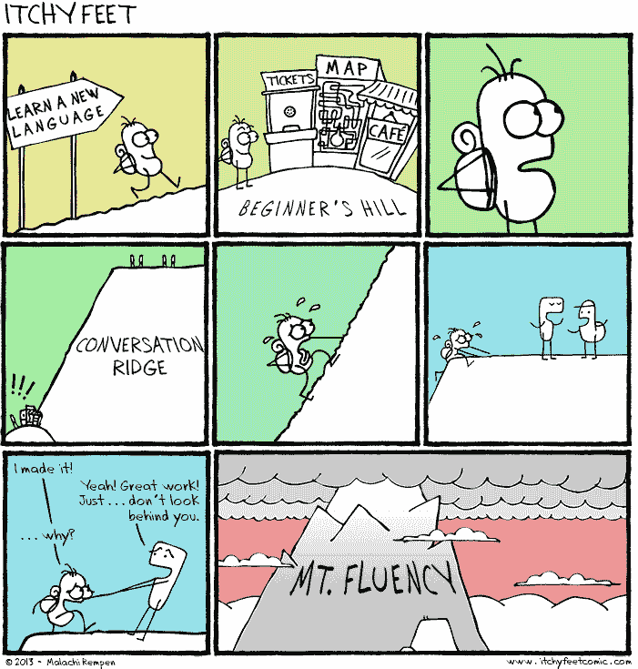

# 走向复杂

> 原文：<https://dev.to/deciduously/towards-complexity-341i>

# 更强、更好、更快、更强

最近，我收到了一些有益的建设性批评。这篇文章是关于我将对此做些什么。

长期以来，我对我的代码样本组合感到不安全，因为我不知道它“应该”是什么样子才能看起来可雇佣。我不知道我的代码是不是一塌糊涂，或者是错误的语言，或者是糟糕的例子，或者是不够完善，或者你知道，任何我可能会搞砸的地方。在近乎完全隔离的状态下自学的副作用。我也不知道这是否重要，陪审团还在考虑这个问题。

事实证明，除了总体有用性之外，我的示例代码中确实有一个可以修复的漏洞。我在各种工具中有一堆小东西，并且知道如何沿着各种轴比较和对比这些工具，但是我还没有证明我可以将一堆小东西编排成一个大东西。我最大的样本总共有 1000-1500 行。我对工具有很好的掌握，可以解决微观问题，但是谁能说我擅长宏观问题呢？

我想我知道这一点，但我不认为我确切地理解了规模的差异代表了什么，直到它以这种方式展示出来。

是时候从抽象层面提升了。

## 补救措施

我想我已经准备好迎接挑战了，但是只有一个方法可以证明。我被建议的项目是一个简单的游戏，但分阶段进行:

1.  单人纸牌游戏终端
2.  单人纸牌游戏-图形
3.  双人游戏
4.  多人联网游戏
5.  电脑播放器

我不认为孤立地使用这些组件会有什么复杂的问题(也许除了第五点)，我的硬盘上散布着一些实际上涵盖了这些不同部分的信息。我没有解决的部分我相信我也能解决。我知道我可以用我现有的工具解决一些小问题。问题是，我从来没有尝试过杂耍一堆小解决方案，这正是我想让自己受雇做的。

## 选择

我不确定用什么来建造这个。一方面，我想尽可能地使用基本的工具，自己探索整个问题 web 路线的零框架全栈 JavaScript，或者借此机会学习 SDL/C++/sockets 或其他东西，以更好地配合我的学校作业，而不是太分散。这样我就专注于问题，而不是工具。

那也可能是搬起石头砸自己的脚。看到了吗？我不知道！没做过。也许我应该使用 Flask 和 React，抽象掉许多挑剔的东西，使用一个我更喜欢的平台和范例，但最终得到的是一个不太通用的解决方案，可能是一个不太有效的学习体验。

我得考虑一下。

这也意味着忽略另外两个我最近开始并希望有一天能完成的兼职项目。两者都很有趣，但都是类似的小问题，而且都不紧急。我想现在就充分利用我的业余项目时间，也许等我有更多空闲时间的时候再来看看。

## 我们的工作永远不会结束

我在我的 C++ journal 帖子的结尾使用了一个山的比喻，你可能对这个漫画版本很熟悉:

*[来源](http://www.itchyfeetcomic.com/2013/09/view-from-top.html)*

这适用于各种领域，不仅仅是语言学习，现在感觉特别贴切。我想我已经到达山脊了，是时候练习抱石了。从这里开始只会越来越危险。

照片由 Neil Rosenstech 在 Unsplash 上拍摄。