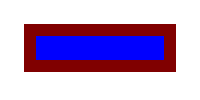
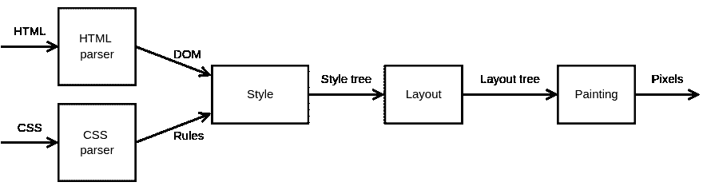

# TypeScript 的玩具浏览器引擎

> 原文：<https://dev.to/sanemat/toy-browser-engine-by-typescript-4dhf>

# 目标:了解如何将 html 和 css 转化为图像。

```
node_modules/.bin/ts-node example/toy-engine.ts --css=example/color.css --html=example/color.html --width=200 --height=100 | feh - 
```

Enter fullscreen mode Exit fullscreen mode

[](https://res.cloudinary.com/practicaldev/image/fetch/s--yzb17_KK--/c_limit%2Cf_auto%2Cfl_progressive%2Cq_auto%2Cw_880/https://thepracticaldev.s3.amazonaws.com/i/a3bf2hmflsbaxoqqlgse.png)T3】

```
<html>
  <body>
    <div class="outer">
      <div class="inner"></div>
    </div>
  </body>
</html> 
```

Enter fullscreen mode Exit fullscreen mode

```
* { display: block; padding: 12px; }
.outer { background: #800000; }
.inner { background: #0000ff; } 
```

Enter fullscreen mode Exit fullscreen mode

## 管道

了解这个渲染管道[](https://res.cloudinary.com/practicaldev/image/fetch/s--SrX4Wc2E--/c_limit%2Cf_auto%2Cfl_progressive%2Cq_auto%2Cw_880/https://raw.githubusercontent.com/sanemat/ts-toy-engine/dd28f20e632bf65fcfdfef9cd59c27ca68174801/example/pipeline.svg)[【https://limpet.net/mbrubeimg/2014/pipeline.svg】](https://limpet.net/mbrubeimg/2014/pipeline.svg)。

输入 html 和 css，然后输出像素。

## 如何运行

```
// node_modules/.bin/ts-node example/toy-engine.ts --css=example/color.css --html=example/color.html --width=200 --height=100 | feh -
import * as meow from "meow";
import * as fs from "fs";
import { htmlParse } from "../src/html";
import { cssParse } from "../src/css";
import { styleTree } from "../src/style";
import { Dimensions, EdgeSizes, layoutTree, Rect } from "../src/layout";
import { Canvas, paint } from "../src/painting";
import * as Jimp from "jimp";

const cli = meow(
  `
  node_modules/.bin/ts-node example/toy-engine.ts --css=example/color.css --html=example/color.html --width=200 --height=100 | feh -
`,
  {
    flags: {
      css: { type: "string" },
      html: { type: "string" },
      width: { type: "string", default: 200 },
      height: { type: "string", default: 100 }
    },
    inferType: true
  }
);

let canvas: Canvas;

Promise.all([
  fs.promises.readFile(cli.flags["html"], "utf-8").then(value => {
    return htmlParse(value);
  }),
  fs.promises.readFile(cli.flags["css"], "utf-8").then(value => {
    return cssParse(value);
  })
])
  .then(values => {
    const [domNode, stylesheet] = values;
    const styleRoot = styleTree(domNode, stylesheet);
    const viewport = new Dimensions(
      new Rect(0, 0, cli.flags["width"], cli.flags["height"]),
      new EdgeSizes(0, 0, 0, 0),
      new EdgeSizes(0, 0, 0, 0),
      new EdgeSizes(0, 0, 0, 0)
    );
    const layoutRoot = layoutTree(styleRoot, viewport);
    canvas = paint(layoutRoot, viewport.content);
    return Jimp.create(canvas.width, canvas.height);
  })
  .then(value => {
    let buffer = value.bitmap.data;
    for (let i = 0; i < canvas.pixels.length; i++) {
      buffer[i * 4] = canvas.pixels[i].r;
      buffer[i * 4 + 1] = canvas.pixels[i].g;
      buffer[i * 4 + 2] = canvas.pixels[i].b;
      buffer[i * 4 + 3] = canvas.pixels[i].a;
    }
    return value.getBufferAsync(Jimp.MIME_PNG);
  })
  .then(value => {
    process.stdout.write(value);
  })
  .catch(error => {
    console.error(error);
  }); 
```

Enter fullscreen mode Exit fullscreen mode

## 详细信息

*   [sanemat/ts-toy-engine](https://github.com/sanemat/ts-toy-engine)
*   [让我们来打造浏览器引擎吧！在 typescript vol0 玩具浏览器引擎](https://dev.to/sanemat/let-s-build-browser-engine-in-typescript-vol0-toy-browser-engine-egm)

## 参考文献

*   [我们来搭建一个浏览器引擎吧！第 1 部分:入门](https://limpet.net/mbrubeck/2014/08/08/toy-layout-engine-1.html)
*   [姆布鲁贝克/罗宾逊](https://github.com/mbrubeck/robinson)
*   [sanemat/js-toy-engine](https://github.com/sanemat/js-toy-engine)