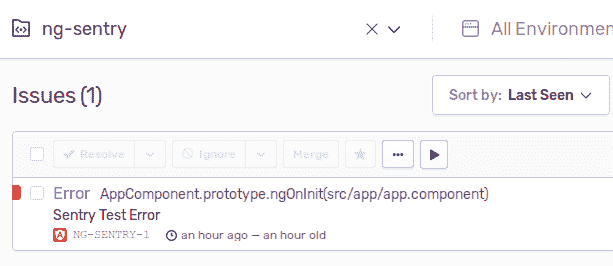
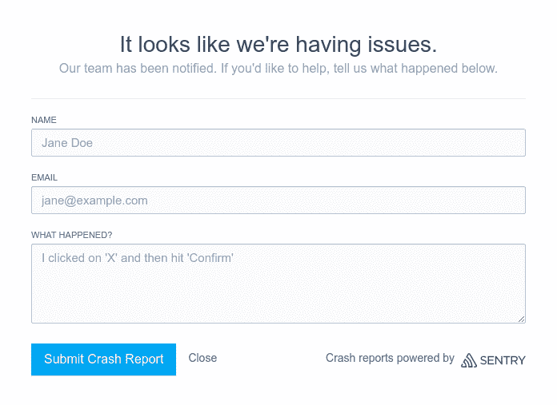

# 哨兵角度跟踪误差

> 原文：<https://dev.to/angular/tracking-errors-in-angular-with-sentry-4oo0>

<small>*原载于[nils-mehl horn . de](https://nils-mehlhorn.de/posts/angular-error-tracking-with-sentry)*T5】</small>

你知道你的 Angular 应用程序在运行时发生了什么吗？虽然在服务器端设置日志记录很常见，但在客户端却经常被忽略。然而，随着越来越多的逻辑出现在用户的浏览器中，我们可能想要控制我们的代码在生产中可能会出现的奇怪现象。

## 用户不会联系你，他们会离开

听起来很刺耳，没有监控，你实际上是在假设一切都很好，除非有人告诉你。但是先说实话。你上一次在手机应用崩溃后点击“提交错误报告”是什么时候？如果没有这样的报告机制呢？期望用户起草一份详细的电子邮件，包括他们之前做了什么以及他们使用的浏览器的版本，这是相当乐观的。如果某样东西不起作用，你会尝试别的东西。应用程序大多是生产力工具。用户不会在本该节省他们时间的东西上多花一秒钟。

## console.log 不会让你走远

尽管对于什么时候登录或者什么时候调试 T2 还存在一些争议，但是浏览器控制台在开发过程中绝对是一个有用的工具。然而，你的一切都留在你的浏览器中，一旦你部署了你的应用程序，它就不再仅仅在你的 T4 浏览器中运行了。你无法访问人们的浏览器控制台，因此丢失了那些宝贵的堆栈跟踪，而这些跟踪可能有助于修复一个讨厌的错误。

## 在你的 Angular app 中使用哨兵

[Sentry](https://sentry.io) 是一个[开源的](https://github.com/getsentry/sentry)错误跟踪解决方案，允许你在浏览器控制台之外记录错误。你可以[运行自己的服务器](https://docs.sentry.io/server/)或者使用[托管的变种](https://sentry.io/pricing/)(有一个免费层，如果你是学生，你还可以从 [GitHub 学生包](https://education.github.com/pack)中受益)。

一旦您准备好了任何一个变体，您就可以通过运行
来安装 JavaScript SDK

```
npm i --save @sentry/browser 
```

Enter fullscreen mode Exit fullscreen mode

然后你将实现 Angular 的 [ErrorHandler](https://angular.io/api/core/ErrorHandler) 接口，如下所示。为此，您需要项目的数据源名称(DSN ),它将告诉 Sentry 将错误转发到哪里。

```
import { Injectable, ErrorHandler} from '@angular/core'
import * as Sentry from '@sentry/browser'

@Injectable()
export class SentryErrorHandler implements ErrorHandler {

  constructor() {
    Sentry.init({
      dsn: '<your-sentry-project-dsn>'
    })
  }

  handleError(error) {
    Sentry.captureException(error.originalError || error)
  }
} 
```

Enter fullscreen mode Exit fullscreen mode

通过实现这个接口，我们能够在一个中心点捕获应用程序中发生的所有错误。这是由 [zone.js](https://github.com/angular/angular/tree/master/packages/zone.js) 实现的，Angular 使用它来包装我们的应用程序代码，从而挂钩任何抛出的错误。现在我们只需要告诉 Angular 使用我们的错误处理程序，而不是默认的错误处理程序——默认的错误处理程序只会记录到控制台。我们通过在`app.module.ts` :
中提供我们的错误处理程序来做到这一点

```
import { ErrorHandler } from '@angular/core'
import { SentryErrorHandler} from './error-handler'

@NgModule({
  ...
  providers: [
    {provide: ErrorHandler, useClass: SentryErrorHandler}
  ]
})
export class AppModule { } 
```

Enter fullscreen mode Exit fullscreen mode

现在，运行时抛出的任何错误都会显示在 Sentry 中。您可能想通过在代码中的某个地方抛出一个错误来测试这一点，例如在您的`app.component.ts` :
的`ngOnInit`中

```
@Component({...})
export class AppComponent implements OnInit {

    ngOnInit(): void {
        throw new Error('Sentry Test Error') // TODO: remove
    }
} 
```

Enter fullscreen mode Exit fullscreen mode

它应该像这样显示在您的哨兵仪表板上:

<figure>

[](https://res.cloudinary.com/practicaldev/image/fetch/s--sBaCQ-rX--/c_limit%2Cf_auto%2Cfl_progressive%2Cq_auto%2Cw_880/https://thepracticaldev.s3.amazonaws.com/i/kxickbfgst7wzj0hfl5u.png)

<figcaption>Test error in Sentry dashboard</figcaption>

</figure>

## 与环境打交道

我们可以完成一些简单的步骤，让我们的操作变得更复杂一些。您可能已经注意到，一旦您替换了默认的错误处理程序，错误就不会再出现在控制台中。我们可能希望将它们收回用于开发目的。因此，我们将通过利用一个提供者工厂
在生产[环境](https://angular.io/guide/build)中提供我们的错误处理程序

```
import { ErrorHandler } from '@angular/core'
import * as Sentry from '@sentry/browser'
import { environment } from './../environments/environment'

class SentryErrorHandler implements ErrorHandler { ... }

export function getErrorHandler(): ErrorHandler {
  if (environment.production) {
    return new SentryErrorHandler()
  }
  return new ErrorHandler()
} 
```

Enter fullscreen mode Exit fullscreen mode

我们现在可以使用工厂来封装处理程序条款，如下所示:

```
import { ErrorHandler } from '@angular/core'
import { getErrorHandler} from './error-handler'

@NgModule({
  ...
  providers: [
    {provide: ErrorHandler, useFactory: getErrorHandler}
  ]
})
export class AppModule { } 
```

Enter fullscreen mode Exit fullscreen mode

此外，如果你有多个环境应该将错误转发给 Sentry，但不希望它们混淆，你可以在初始化期间[告诉 Sentry 它正在运行的环境](https://docs.sentry.io/enriching-error-data/environments/?platform=browser)。为此，我们可以在我们的`environment.<name>.ts`中维护一个环境名称的属性，并传递它:

```
class SentryErrorHandler implements ErrorHandler { 

  constructor() {
    Sentry.init({
      dsn: '<your-sentry-project-dsn>',
      environment: environment.name
    })
  }

... 
```

Enter fullscreen mode Exit fullscreen mode

## 提供上下文

堆栈跟踪本身有时不足以找出出错的原因。Sentry 还会为你提供用户浏览器、操作系统以及 ip 地址的信息。它还会显示错误发生时用户所在的 url。

如果你想添加更多的信息，你可以通过修改 Sentry 的[范围](https://docs.sentry.io/enriching-error-data/scopes/?platform=browser)来实现。这样，您就可以在错误报告中包含当前已验证的用户:

```
const user = this.getUser() // get's user from some service
Sentry.configureScope(scope => {
  scope.setUser({
    id: user.id,
    username: user.name,
    email: user.mail,
  })
}) 
```

Enter fullscreen mode Exit fullscreen mode

这里有一件事可能会让您犯错误，那就是让用户进入您的错误处理程序。你通常会通过注入服务来做到这一点(例如你的 [NgRx 商店](https://ngrx.io/guide/store))。然而，如果您尝试注入到错误处理程序中，您将会以这个错误结束:`Provider parse errors: Cannot instantiate cyclic dependency!`

由于错误处理程序是任何 Angular 应用程序不可或缺的一部分，它在任何常规服务开始之前就被加载了。因此，它不能直接依赖这些服务。你可以通过依赖 Angular 的[注入器](https://angular.io/api/core/Injector)和[在`handleError`方法中获取所需的服务](https://angular.io/api/core/Injector#example-1)来解决这个问题。然而，将作用域配置完全移出我们的处理程序可能会更干净。因此，我们将直接配置作用域来响应成功的登录。这不仅可以解决循环依赖，还可以最小化错误处理程序中的代码。这样我们就不太可能在*报告错误的同时*导致额外的错误——这可能会导致无限循环。为此，我们可以创建一个监控服务，如下所示:

```
import { Injectable} from '@angular/core'
import * as Sentry from '@sentry/browser'

@Injectable({providedIn: 'root'})
export class MonitoringService {

  monitorUser(user: User): void {
    Sentry.configureScope(scope => {
      scope.setUser({
        id: user.id,
        username: user.name,
        email: user.mail,
      })
    })
  }
} 
```

Enter fullscreen mode Exit fullscreen mode

有了这个设置，我们还可以很容易地测试出`monitorUser`——以及范围配置——是通过[依赖注入](https://angular.io/guide/testing#services-with-dependencies)从另一个服务调用的。

除了附加用户之外，您还可以将[键-值对](https://docs.sentry.io/enriching-error-data/context/?platform=browser#tagging-events)放入范围中，或者设置一个[严重性级别](https://docs.sentry.io/enriching-error-data/context/?platform=browser#setting-the-level)。还可以提供任意的[额外内容](https://docs.sentry.io/enriching-error-data/context/?platform=browser#extra-context)，这可能有助于你重现用户的工作流程。但是在转储整个应用程序状态之前要小心，因为这个字段最多只能容纳 200kB。

## 收集反馈

Sentry 还能够在出错时收集用户反馈。尽管大多数时候它可能会被忽略，但在某些时候它可能会成为有用的信息来源。您可以在您的错误处理程序中启动它，如下所示:

```
const eventId = Sentry.captureException(error.originalError || error);
Sentry.showReportDialog({ eventId }); 
```

Enter fullscreen mode Exit fullscreen mode

它将打开一个如下所示的模式对话框:

<figure>

[](https://res.cloudinary.com/practicaldev/image/fetch/s--wBDzsAKS--/c_limit%2Cf_auto%2Cfl_progressive%2Cq_auto%2Cw_880/https://thepracticaldev.s3.amazonaws.com/i/v8knzm71d3cb5q5mab5r.png)

<figcaption>Sentry reporting dialog</figcaption>

</figure>

## 包装完毕

对应用程序进行某种监控通常是常识。然而，对于浏览器应用程序来说，这已经被忽略了——可能是因为没有像本地移动应用程序那样的复杂解决方案(例如 [Crashlytics](https://firebase.google.com/products/crashlytics) )。

Sentry 和 alike 让您能够深入了解 Angular 应用程序中正在发生的事情，从而更加自信地进行开发。根据目前的考虑，我们能够以有角度的方式整合它。

在 Sentry 上你还可以做很多其他的事情，比如跟踪发布错误和自动归档 bug。