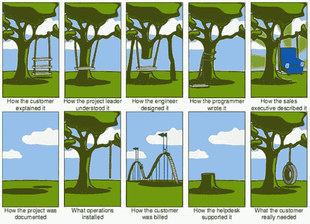
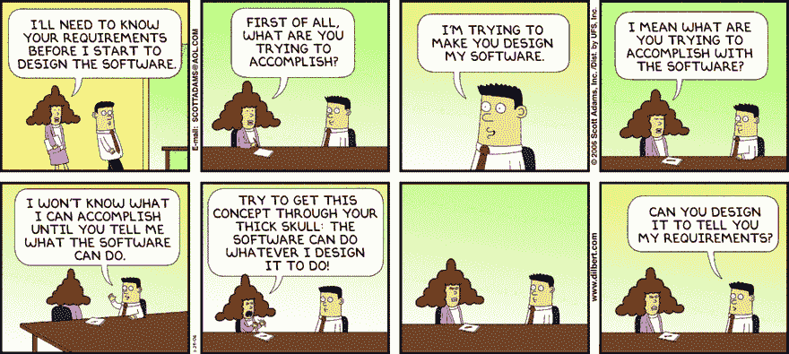
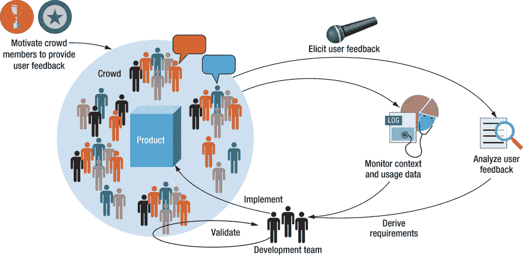
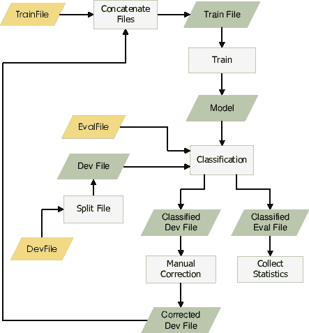
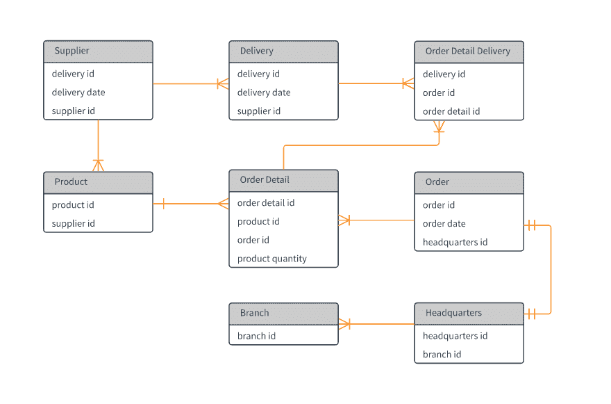

# 可悲的被低估的软技能:需求管理

> 原文：<https://dev.to/erikwhiting88/tragically-underrated-soft-skill-requirements-management-17ne>

作为开发人员，我们有大量的技术技能需要掌握。作为初级开发人员，我们试图通过更多地了解我们的技术堆栈，熟悉新的框架，以及用复杂的辅助项目挑战自己来脱颖而出。很容易忘记磨练我们的软技能，即使这些可以帮助我们更加突出。今天，我想谈谈一个没有得到应有关注的软技能:需求管理。

> 我尽量把我的大部分文章控制在 4 分钟以内，但这是一个重要的话题，有很多要说的，所以系好安全带。

# 什么是需求管理，真的是软技能吗？

“需求”是系统或软件为了满足涉众(为系统付费的人)的愿望而必须做的事情。他们可以

*   功能性:比如“用户可以评论另一个用户的帖子”
*   非功能性的:比如“当多达 1000 个并发用户使用时，系统不应该出现任何明显的延迟”

需求管理是获取和维护这些需求的实践。在学术界，这被称为“需求工程”“工程”是因为有一个已定义的过程和预期的结果。我不喜欢这个术语的“工程”部分，因为依我拙见，它使高级人际交流中本质上的练习失去了人性。

当人们想到软技能时，他们指的是沟通、创造力和团队合作。需求管理包括所有这些事情，甚至更多，到了一个相当激烈的程度。这些是我们可以(也应该)在学习技术技能的同时学习的东西。对于开发人员来说，这是一项非常重要的技能，这使得它在开发人员中非常罕见。但是为什么它如此重要呢？

# 需求管理的重要性

一句话，为什么需求~~工程~~管理很重要？因为“...在开发阶段后期修复需求缺陷的成本比在开发早期识别和修复它的成本要高得多”[潘迪，D. &潘迪，V. (2012)](https://pdfs.semanticscholar.org/ad85/93ce74f392ce1924eadd420762d258711a8b.pdf) 。

对需求的每一个改变都有一个代价，并且这个代价随着改变的实现越晚而变得越大。有效的需求管理确保需求被尽可能彻底和尽早地理解，从而最小化未来的变化。因此，需求管理是开发人员能够拥有的最有价值的技能之一。

> 我觉得提到需求管理不是开发人员的唯一责任是很重要的。在更大的团队中，需求管理是拥有“业务分析师”头衔的人的责任在较小的团队中，这项工作的主要部分可能会落在主要的开发人员、测试人员或者项目经理身上。但是最终，产品的最终质量(以及所有有助于质量的实践)是每个人的责任。

# 需求为什么会变化？

无论团队的需求管理能力有多高，需求都会改变。这有几个促成因素。

根据 Ian Sommerville(著名的学者和软件工程的作者，可能是最常见的 SWE 101 教科书)的说法，需求变化主要有以下几个原因:

*   **世界在变**:不管你的业务目标是否改变，新的法律是否通过，或者其他各种各样的原因，世界都在变。需求可以而且确实会随着世界的变化而变化。
*   **难以想象一个未来的系统**:你会发现很多时候，利益相关者和客户不能真正告诉你他们到底想要什么，直到你把一个原型放在他们面前。期望一个用户确切地解释他们对一个软件的期望，而没有任何东西与之比较，这是不现实和不公平的。
*   **多个利益相关者**:通常情况下，您开发的系统会被您的组织或客户群中跨多个部门或生活方式的人使用。有了这么多不同的观点，一个人认为“正确”的东西，另一个人可能会认为“错误”、“无用”，甚至“愚蠢”。
*   **需求是妥协**:用户总会想要更多，没关系。问题是，我们没有时间或资源给他们想要的一切。如果我们有无限的时间，我们可以给他们世界，但我们没有，所以我们必须找到一个点，在这个点上投入的时间值得我们从中获得的价值。有时这个值会改变，因此需求也会改变。
*   组织政治:有时用户确实**而不是**想要使用你的产品，他们的老板只是强迫他们这么做。其他时候，一个新经理可能只是简单地否决一个项目，因为他们不喜欢启动它的人。这种情况时有发生(这不是你的错，所以不要往心里去)。

尽管变化确实是不可避免的，但是在需求的有效管理中仍然可以获得大量的金钱价值。

# 许多伟大的开发人员都非常擅长需求管理

> 作为免责声明，我应该提到我只做了一年的开发人员，并且在那之前做了一年的 QA 工程师，所以我并不是一个经验丰富的专家。我给出的建议来自于我在这段时间里的个人经历，以及对我的资深同事如何工作的观察。

我所知道的最好的开发人员，除了在键盘后面像向导一样，是一个伟大的需求经理。我记得来自客户(公司内部的一个部门)的一个特别奇怪的需求，估计需要大约一个月的时间来实现。开发人员指出，另一个特性几乎满足了这个需求，用户只需付出微不足道的额外努力就能解决他们的问题。

想象一下这种观察的商业价值。开发者的时间并不便宜，所以我们构建的功能必须给客户带来真正的价值。能够向客户指出他们实际上在一些他们不需要的东西上花了太多的钱(当然是机智地)对公司的底线有真正的价值。

# 管理需求的技巧

如果你想作为初级开发人员脱颖而出，除了掌握你的技术堆栈，擅长需求管理将对你的团队的表现产生真正的影响。记住你的公司和团队文化，在应用这些技巧时尊重你团队的流程(也就是说，不要走进会计副总裁的办公室说“这个要求太愚蠢了！”).

在需求工程课上，你会学到这个过程有 4 个阶段:启发、分析、验证和文档化。在每个阶段，您都可以做一些事情来确保需求是高质量的(被很好地理解和实际需要)。

所有这些小技巧可以归结为两个态度调整:
1——感同身受。尽最大努力从客户的角度来看待系统。2 -要谦虚。作为一名开发人员，很难承认你构建的东西最终可能毫无用处。此外，确保你不是在推动或反对一个需求，因为你特别想/不想构建它。

## 启发

这是你让顾客说出他们想要什么的地方。这可能是正式的应用程序团队和业务之间的会议，也可能是非正式的饮水机谈话。无论哪种方式，您都希望从客户那里获得尽可能多的信息(而不是细节)。

我的一个策略是，一步一步地说出我认为用户在寻找什么，并让他们发表评论。类似于:
*“所以你想登录，点击一个按钮，看到一个列表，上面有你今天要做的所有事情的简短描述，对吗？”*

像这样拼写出来是有帮助的，因为它让客户想象实际使用该系统。有时您会得到肯定的回答，有时您会得到类似于*“不，我希望列表在我登录后就已经在那里了”*。在启发阶段清除这些东西是一个自动的胜利。

作为一名开发人员，尤其是初级开发人员，您可能没有其他团队成员那样多的时间与客户面对面交流，因此您可能需要通过更高级别的团队成员来传递您的问题。不要害怕问问题，如果你的公司文化允许的话，不要害怕发一封简短的电子邮件，甚至和客户打一个五分钟的电话。

## 分析

这通常发生在诱导之后。您查看需求并思考客户的真正问题是什么。这个阶段产生了很多图表，但我个人认为只有两个是有效的:数据流图(DFD)和实体关系图(ERD)。

DFD 将一个过程概念化为这样一幅图:
 
你可以将它们制作成合适的 UML(统一建模语言)图，但是在这个阶段，更重要的是要有一个你认为过程如何工作或者将如何工作的草图。

ERD 是显示不同数据对象之间关系的图表。以我个人的经验，这些作为开发人员和分析师之间的交流工具更有用，作为与客户交流的工具就不那么有用了。这里有一个 ERD 的例子:

 
上面的例子使用了所谓的“鱼尾纹符号”,用来显示基数。你可以把上图解读为比如“产品有很多订单明细”“订单有且只有一个总部”。

这个阶段也是制作原型的时候，如果你的团队正在做的话。使用或不使用原型是另一个需要考虑的问题，所以现在只要说你在这个阶段制作原型就足够了。

从开发人员的角度来看，您可能不包括在这些东西的制作中，并且可能最终成为这些文档的消费者。如果你确实发现自己在分析阶段做出了贡献，这是练习你的同理心的最佳阶段。尽最大努力站在客户的角度，从他们的角度看问题。他们告诉你他们想要解决的问题可能并不是真正的问题。你既要从他们的角度考虑问题，也要从系统的 10，000 英尺的高度考虑问题。

## 验证

记住这是需求管理阶段中的一个阶段。因此，在这种情况下,**而不是**验证是指用户在系统构建后对其进行测试。我们验证的是我们理解需求，以及它们是否能被满足。

这通常是在初次诱导对话之后与客户的下一次对话。在这种情况下，你要向客户展示你想出的东西(DFD、原型，如果适用的话，任何其他东西)，并解释你提议的解决方案。

同样，作为一名开发人员，尤其是一名初级开发人员，您可能不会发现自己参与到这个阶段中，但这也并不罕见。这是一个谦逊很重要的时代。你可能误解了一个需求，你可能误解了一个流程，你可能完全没有注意到。**在这个阶段，倾听**你的客户，提出后续问题，尽最大努力真正了解他们想要什么。

这也是你应该问类似“**这真的需要吗？**“这是一个如此重要的问题，却没有得到足够的提问。这肯定需要一些机智；你实际上是在说“好吧，但这是你*真正的意思吗？”但你无论如何都要问。思考一下贵公司现有的解决方案。如果你已经在用 Slack 了，还需要系统内聊天吗？当您可以导入 Excel 文件时，您是否需要从 Excel 文件中复制粘贴行的能力？*

## 文档

在需求管理的上下文中，这个阶段指的是写下被接受的需求。当我们说接受时，这意味着客户已经同意我们知道他们的问题是什么，并且他们准备好让我们尝试我们提出的解决方案。这通常是当需求变成吉拉票或看板卡并分配给开发人员的时候。

除了在设计摘要/标签/卡片中准确传达要求之外，在这一阶段你没有什么可以确保高质量要求的。

# 结论

正如我在本文开始时所说的，需求管理是一种软技能，许多开发人员并没有在自己内部培养这种技能。然而，这是一项非常重要的技能，对团队和公司的业绩有很大的影响。

学会问好问题，这样你就可以尽早明确需求。你不需要成为一名忍者就能脱颖而出。花时间去了解业务、你的客户和他们的需求会让你脱颖而出。