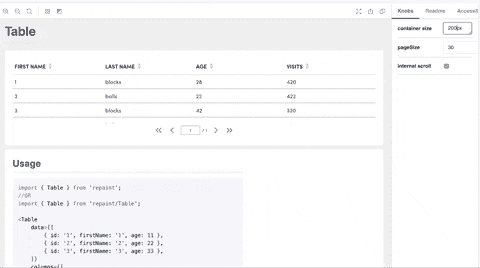
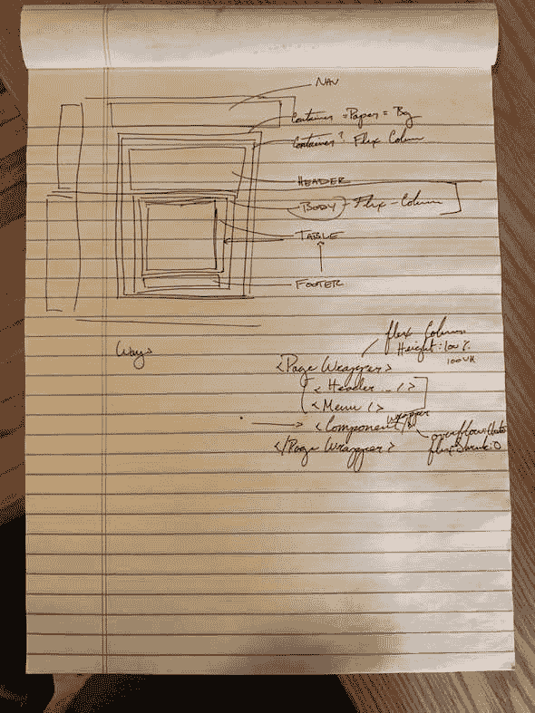

# CSS 中的试验:使内容适合窗口

> 原文：<https://dev.to/stephencweiss/trials-in-css-fit-content-to-window-4p5c>

我在网页布局方面面临的一个挑战是，网站并没有自然的终点。不像一张 8.5 英寸 x11 英寸的纸，一个网站可以永远存在。

这就是我在试图让一个布局响应窗口*的尺寸而不引用窗口或视窗*时所面临的症结。基本上，我想知道是否有一种方式来设计我的组件，以适当地约束其内容，而这正是*想要*增长的。

我什么意思？这个视频展示了桌子*希望*如何增长，但是如果`internalScroll`是`true`，它将折叠，只填充可用的部分。 [](https://i.giphy.com/media/fxBhkyHhjEGpd3DXhd/giphy.gif)

这是一个好的开始——但是你注意到作为约束的`containerSize`道具了吗？由于用户可能使用的屏幕尺寸和分辨率会有很大的不同，所以我想要一个动态的解决方案。这意味着虽然`internalScroll`是有用的，但它只是等式的一半。我还需要容器的尺寸。

更有趣的是，我正在处理的页面看起来有点像这样: [](///static/458bb30ae4bca017be6861444e38a157/c2b56/sketch.jpg)

不仅仅是一个容器和一张桌子。因此，我提出的任何解决方案都必须考虑到所有这些因素。

屈身救援。为了确保我理解如何操作，我用 JSFiddle 搭建了一个模型。

我用基本的 HTML 拼凑了一个大概的应用程序布局。

```
<div class="wrapper">
  <div class="flexbox-item header"> Nav </div>
  <div class="wrapper">
    <div class="page-header flexbox-item">Page Header</div>
    <div class='table-container fill-area content flexbox-item-grow'>
      <div class='table-body flexbox-item fill-area content'>
        Content
        <br /> <br />
        "Lorem ipsum …” // Put enough in here to make sure that it will exceed the height of the page.
      </div>
      <div class='table-footer flexbox-item'>footer</div>
    </div>
  </div>
</div> 
```

有了这些，是时候研究 CSS 了。幸运的是，足够多的谷歌搜索让我有了一个好的起点。

最后，我的解决方案很简单:

```
/* Every wrapping container is 100% height */
.wrapper {
  height: 100%;
  display: flex;
  flex-direction: column;
}

/* This is the key to the whole thing */
.fill-area {
  overflow: auto;
  flex: 1;
} 
```

当我看到它这样写出来的时候，我觉得我应该能够更快地找到解决方案！

不管怎样，我找到了一个可行的解决方案，我对结果很满意！

我要感谢 Eric @ Visual Pulse，他的 JSFiddle 是我找到自己的解决方案所需的灵感，我还要感谢 Sung Kim，感谢他的慧眼和帮助我完善早期的解决方案。⁴

脚注:

*   [可滚动的内部内容-js dild](https://jsfiddle.net/stephencweiss/zyjwgptr/)
*   [Flexbox 项目中的 100%高度| js dild](https://jsfiddle.net/MadLittleMods/LmYay/)
*   埃里克的小提琴
*   ⁴ [宋明金|发展到](https://dev.to/dance2die)