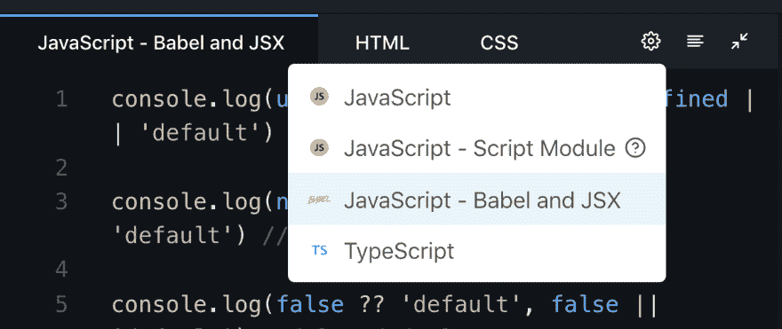
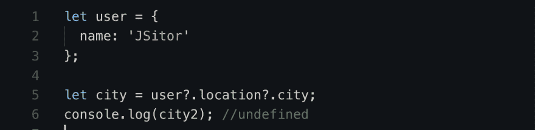
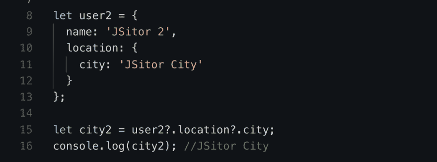
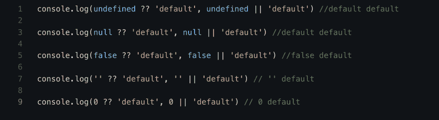

# 在 JSitor 上尝试可选的链接和 Nullish 合并

> 原文：<https://dev.to/ashvin777/try-optional-chaining-and-nullish-coalescing-on-jsitor-its-live-573a>

JSitor ，现在支持

*   **可选链接** -示例-【https://jsitor.com/bIhQS-b4Y T2】
*   **无效合并** -示例-【https://jsitor.com/QIPOSicZu T2】

利用巴别塔插件的力量
[https://Babel js . io/docs/en/Babel-plugin-proposal-optional-chaining](https://babeljs.io/docs/en/babel-plugin-proposal-optional-chaining)
[https://Babel js . io/docs/en/Babel-plugin-proposal-nullish-coalescing-operator](https://babeljs.io/docs/en/babel-plugin-proposal-nullish-coalescing-operator)。

### 如何使用

只需在 JavaScript 视图设置中设置“JavaScript 巴别塔和 JSX”模式，它就为你准备好了。下面是截图找一下

### 可选链接

可选的链接操作符？。允许读取位于连接对象链深处的属性值，而不必明确验证链中的每个引用是否有效。那个？。运算符的功能类似于。链接运算符，不同之处在于，如果引用为空或未定义，表达式不会导致错误，而是使用返回值 undefined 进行短路。当用于函数调用时，如果给定的函数不存在，则返回 undefined。

试举-[【https://jsitor.com/bIhQS-b4Y】](https://jsitor.com/bIhQS-b4Y)

### 无效合并

无效合并建议(？？)添加一个新的短路运算符来处理默认值。

您可能已经熟悉了其他短路运算符&&和||。这两个运算符都处理“真”和“假”值。想象代码样本 lhs && rhs。如果 lhs (read，左手边)为 falsy，则表达式的计算结果为 lhs。否则，计算结果为 rhs(读取，右侧)。对于代码样本 lhs || rhs，情况正好相反。如果 lhs 为 the，则表达式的计算结果为 lhs。否则，它评估为 rhs。

试举-[https://jsitor.com/QIPOSicZu](https://jsitor.com/QIPOSicZu)

尝试一下并分享您的反馈。我们很想听听你们的意见。

阿什温·苏塔尔(JSitor.com 的创造者)
在推特上关注我们-[https://twitter.com/JSitorEditor](https://twitter.com/JSitorEditor)