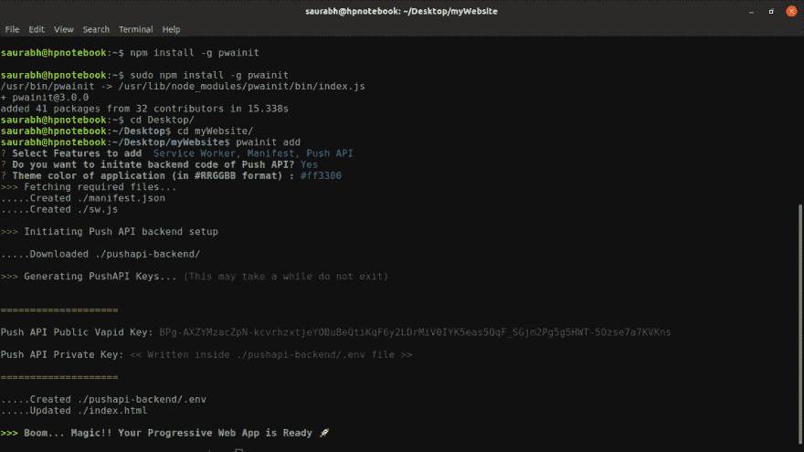

# 使用 PWAinit 在 1 分钟内将现有网站转换为 PWA

> 原文：<https://dev.to/saurabhdaware/turn-existing-website-to-pwa-in-1-minute-using-pwainit-8do>

[](https://res.cloudinary.com/practicaldev/image/fetch/s--ibgENVSm--/c_limit%2Cf_auto%2Cfl_progressive%2Cq_auto%2Cw_880/https://thepracticaldev.s3.amazonaws.com/i/og9qgi3tvt0qdr40h5nm.png)

# 那么什么是 PWAinit 呢？

[PWAinit](https://saurabhdaware.github.io/pwainit) 是一个命令行工具，可以使用`npm install -g pwainit`安装。PWAinit 允许您启动一个新的渐进式 web 应用程序，或者您甚至可以将 PWA 功能(如服务人员、Web 应用程序清单、PushAPI)添加到您现有的网站中，以将其转变为一个完整的渐进式 Web 应用程序。

# 安装&用法

下载 [NodeJS](https://nodejs.org) 如果你的机器里还没有的话

```
# Check if npm is installed using `npm -v` then.. npm install -g pwainit 
```

现在光盘到您现有的网站，并运行命令`pwainit add`

```
cd existingWebsite
pwainit add 
```

只要回答问题就行了！🎉如果您选择添加推送 api 后端，您将完全不需要配置！！

### 演示:

[](https://res.cloudinary.com/practicaldev/image/fetch/s--YAHt-FTH--/c_limit%2Cf_auto%2Cfl_progressive%2Cq_auto%2Cw_880/https://thepracticaldev.s3.amazonaws.com/i/yoxzv3qhaep2x832k9vl.png)

## 运行 PushAPI 后端

```
cd pushapi-backend/
node index.js 
```

PWAinit 文件:https://saulbdawa . github . io/pwainit
【github:https://github . com/saulbdawa/pwainit
【NPM】:https://npmj . org/package/pwainit
v = bj 85 adbogs