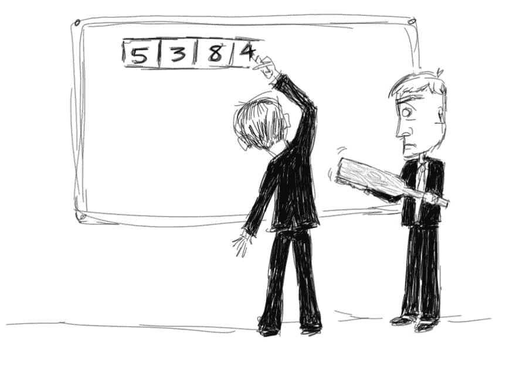

# 将技术爱好变成旁门左道

> 原文：<https://dev.to/daedtech/turning-tech-hobbies-into-side-hustle-386n>

我刚翻出一条我 6 年前发的微博。我这样做是因为我记得说过这句话，也因为它完美地说明了我今天要做的一个区分。

具体来说，我就说说技术爱好和旁门左道的区别。然后，我会主张侧推。但首先，推文。

> 埃里克·迪特里希[@ daedtech](https://dev.to/daedtech)现在，我想我要开始学习 F #22:50PM-2013 年 2 月 12 日00

简明扼要。

那是 2013 年，在芝加哥又一个闷热的冬天，我想学 F#。当时，我作为一家公司的首席信息官管理着一个 IT 部门，我开始怀念写代码的日子。因此，我开始使用 Twitter，并威胁要自学另一种编程语言。

我对这条推文感到尴尬，从某种意义上来说。

你可能会认为我从来没有学过 F#这个事实让我很尴尬。但是不，我会克服的。

相反，这种情绪的无方向、无目标的本质让我感到尴尬。不管怎么说，在职业背景下是这样的。

### 编程爱好

在我继续讲下去之前，我想谈谈爱好和职业的概念。

有时候，我喜欢自己的爱好，比如弹吉他、烹饪、家居装修等等。鉴于我一直以软件开发为生，没人会把这些爱好和职业游戏混为一谈。

然而，考虑到某些其他因素，这条线有点模糊。

例如，在我职业生涯的很长一段时间里，我可以将写作视为一种爱好。然而，如今人们明确地付钱给我，让我以各种身份写作。对我来说，这种写作超出了纯粹爱好的范畴。此外，你还可以在工作之外做些自己谋生的事情。

比方说，回家学 F#。

它不能支付你的账单，但你可以在“[磨锯子”的标题下归档。](https://blog.codinghorror.com/sharpening-the-saw/)“当然，我的工作可能不需要 F#，但它让我成为一名更好的程序员(我猜，也是一名更好的首席信息官)。所以算事业什么的。

对吗？

实际上，我现在会说，不，不是的。

如果我回家学习 F#，为了学习 F#，我会从事一项爱好而不是职业游戏。你不能盲目地把与你的工作无关的事情算作职业发展。

然而，我们做到了。很多。

### 识别我们真正的动机

无论是业余爱好还是伪职业爱好，一系列复杂的因素激励着我们的行动。即使我们有不同的想法，我们通常不会因为一个简单的原因去追求某样东西。

我不会有一天坐下来想，“学习 F#会给我提供一个机会，让我明年额外挣 4000 美元。”取而代之的是，某种不安、无聊、兴趣、怀旧以及谁知道还有什么东西的混合体给了我一个想法。

但回过头来看，我能挑出一个特别的虚荣动机。如果我说实话，我知道我说过:

> “我想成为那种*知道* F#的人。我想成为那种为了乐趣而进行函数式编程的人。”

如果你诚实，我打赌你能回忆起同样想法的例子。

出于许多原因，我们追求额外的编程技能和知识。这些包括享受，满足于迎接挑战，以及“磨利锯子”的普遍愿望。

但我们也这样做，至少在某种程度上，是为了建立我们的信誉，给我们的同行留下深刻印象。我对这些动机都没有异议，但并不是所有的动机都能产生同样的效果。

### 打动同行而不是买家

很多年前，当我第一次建立我的网站时，我把它展示给我父亲看，他当时是首席财务官。我告诉他，我计划兼职做自由职业者，我会写关于编程话题的博客。

他皱着眉头指出，那些愿意雇佣我做编程的人可能不在乎阅读编程主题。他建议我给节目服务的潜在买家写信。

我向他保证，我的工作与他习惯的不同。毕竟，我最钦佩的成功的程序员都写博客，看看他们。

他耸耸肩。

现在回想起来，我陷入了我在文章开头提到的同样的尴尬。天哪，但他是对的。

我们在编程界倾向于尊敬那些给出最好的会议演讲和积累大量堆栈溢出分数的人。但在那之后的几年里，我惊讶地发现，大量的 twitter 粉丝、预定的演讲时间表和技术名人并不一定会转化为更多的钱，甚至更多的机会。

有时候会。但有时候，在 GiganTech 的面试过程中，拥有所有这些东西的人最终会像其他人一样，在白板上潦草地写下合并排序。

区别？

那些将技术名人转化为机会的公司是通过将他们的受众确立为购买者来实现的。那些没有把它变成机会的人仅仅满足于*给他们的观众留下深刻印象。*

### 地位与机会

如果你想更详细地理解我的意思，看一看 k .斯科特艾伦。他和其他人一样都是科技名人，但据我所知，他也有一个*般美好的*生活。作为一个绝对的传奇人物，他创造了一些有史以来最受欢迎的球场，净收入高达 7 位数。

懂吗？

他的技术名人意味着机会，因为他不仅对程序员同事说话，也对买家说话。他给顾客留下深刻印象。

现在，对照那些只有身份的人。比方说，我曾兴致勃勃地追求我的 F#爱好，在晚上和周末投入大量学习。

最终，我成为了一名杰出的专家和 F# MVP，这为我赢得了大量的堆栈溢出点和在会议上发言的邀请。我在业余时间以这种方式参与社区活动...但我继续做着同样的工作，也许，我感到困惑的是，我的地位并没有转化为更多零零碎碎的机会。

也许我得到了偶尔的演讲费或者教一组开发人员一点 F#的奇怪请求。没什么可轻视的，但不完全是提前退休的途径。

因此，为了触及问题的核心，我发现自己对自己缺乏商业意识感到尴尬。

我想给同行而不是买家留下深刻印象。但是给同龄人留下深刻印象没有任何好处。

### 好消息是:你可以在有指导的时尚中追求你的手艺

最近，我一直在断断续续地听一本书，书名是《让自己变得坚实》。“这本书里有一些很好的建议，尽管这不是我的风格。(部分原因可能是我越来越厌倦商业自助类书籍。)

但他确实阐明了一件我认为特别宝贵的事情。他称之为“谁和做什么”声明。

他说的是那些成为企业主或自由职业者的人。但是我想把这个扩展到任何想要采用高效思维方式(在[开发者霸权](http://daedtech.com/book)中描述)或者改善他们职业生涯的人。

始终确保你的嘴边挂着这样一句话:“我帮助{who} {do what}”来解释你的工作。

前面提到的 K·斯科特·艾伦会说，“我帮助程序员学习 web 开发的基础知识。”如果你是一名数据库管理员，你可能会说，“我帮助软件开发团队不必担心数据库的内部细节。”你明白了。

当我开始说，“现在我要开始学习 F#”时，我没有“谁和做什么”的陈述，除了自我反省，“我要帮助自己学习 F#”

不要重复我的错误。

你仍然可以学习新的技术，你仍然可以享受这样做的乐趣。但首先，要找到一种方法，让它符合“谁和做什么”的陈述。

*   *为什么*需要这门语言？
*   有了这项新技能，你能挠谁的痒呢？

这可能很简单，“我要学习 F#，这样我就可以马上回头写/卖一本电子书，作者是刚学过 F#的人。”"

所以下次你想学东西的时候，停下来。

首先，通过弄清楚“谁和做什么”，使它成为某种预期的侧面活动的一部分。不要用“谁”来欺骗你。

这将消除把它归因于“锯磨”的自然倾向，理论上有一天，通过在简历的字母汤里添加第 32 项技术，这将使你更容易被录用。

你想学点新东西吗？太好了！

只要先找到一个潜在的买家，能够让这种学习获得回报。