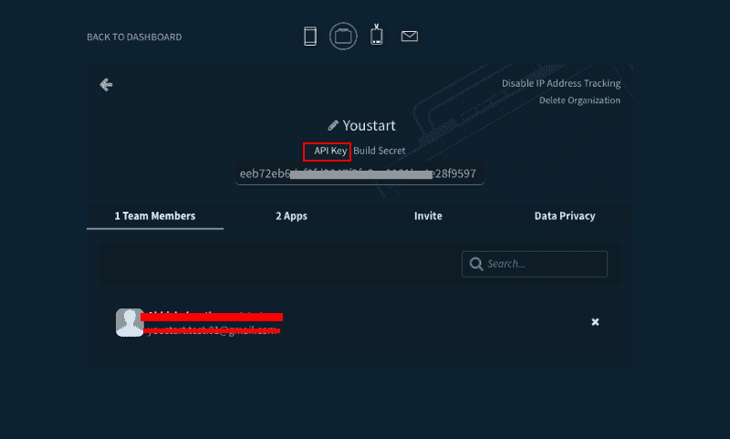
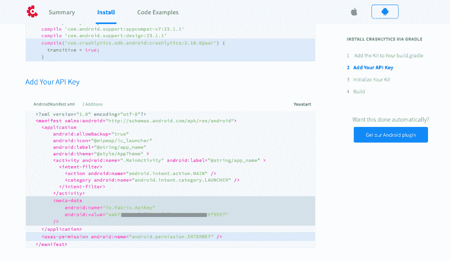
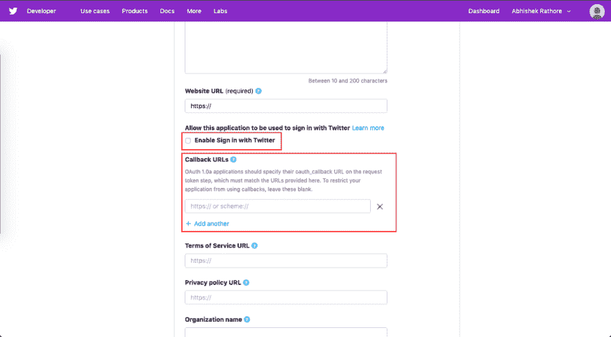
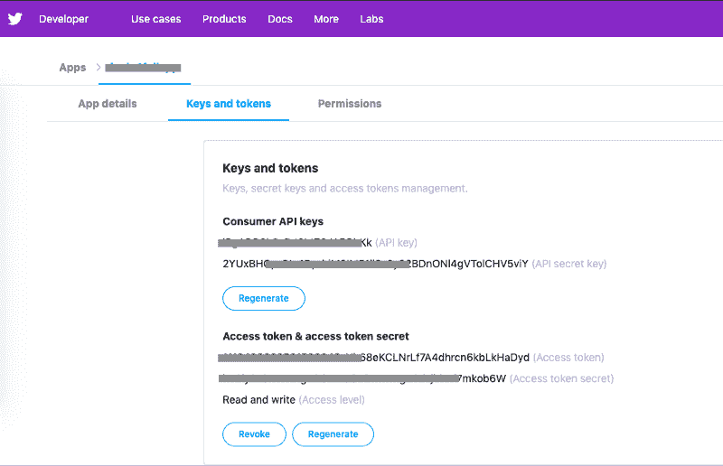
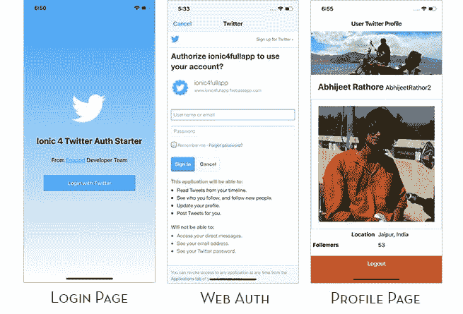
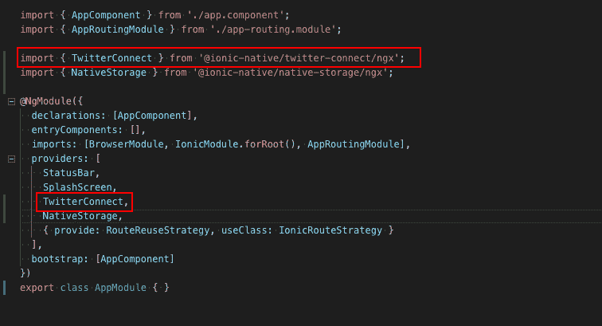

# 使用原生存储在 Ionic 4 应用中登录 Twitter

> 原文：<https://dev.to/enappd/twitter-login-in-ionic-4-apps-using-native-storage-2lhg>

* * *

这是两个帖子系列的第 1 部分。在这篇文章中，你将学习如何使用本地存储在 Ionic 4 应用中实现 Twitter 认证。本系列的第 2 部分讨论了如何在 Firebase 中使用 Twitter 登录🔥

我们将创建一个示例应用程序，用户可以使用他们的 Twitter 帐户登录。登录后，用户可以在主页上看到他们的基本资料信息。

> *本教程的完整源代码可在*[*Ionic-4-Twitter-auth starter 中获得。*](https://store.enappd.com/product/ionic-4-twitter-login/)

### Twitter 登录——什么和为什么

有几个原因让你应该在你的应用中使用 Twitter 登录

*   **易用性** —当新用户使用你的应用程序时，只需点击两个按钮即可使用 Twitter 登录。在其他情况下，用户必须输入电子邮件/密码并登录
*   **没有“忘记密码”** —当你的应用程序使用 Twitter 登录时，用户不必担心忘记你的应用程序的登录密码
*   **没有“验证电子邮件”** —如果您使用自己的自定义电子邮件身份验证，您必须验证该电子邮件是否有效。Twitter 登录将始终关联一个有效的电子邮件/电话号码。
*   **单一解决方案—** Twitter 登录允许您的用户在多个设备上使用单一登录凭证
*   **Twitter 集成** —如果你的应用使用 Twitter 认证，你也可以在你的应用内部使用 Twitter APIs。这可以包括获取用户推文等。
*   **信任** —如今，人们普遍更信任社交登录，而不是自定义电子邮件登录。社交登录遵循标准隐私协议，因此在信息共享方面更加可靠

### 离子认证

Ionic 框架已经存在了 5 年左右，因为它比 Swift / Java 更容易使用，所以在开发人员中非常受欢迎。此外，它要求你有一个 Android 和 iOS 应用程序的单一源代码。开发商还能要求什么呢！

Ionic 4 是 Ionic 的最新版本(在撰写本文时),比以前的版本更加可靠和健壮。

Ionic 4 应用程序中有几种认证方式

*   **创建自己的后端** —你可以在 Node.js、Go、Django 或者 Ruby-on-rails 中创建自己的后端，将你的 app 认证连接到自己的后端。这种方法受到需要完全控制用户身份验证的开发人员的青睐。但这种方法也是最费时间的一种。
*   **后端即服务(BaaS)——**您可以使用预建的 BaaS 平台，轻松将身份验证集成到您的应用中。基本上这些平台给你提供了一个现成的后端，你就不用自己做了。Firebase，Parse，Back4App 都是一些 BaaS 平台。 ***Firebase*** 是其中最受欢迎的移动应用，我们将在下一节研究
*   **社交登录** —社交登录是移动应用中一种流行且简单的认证方式。你一定见过几乎所有现代应用程序中的谷歌、脸书、Instagram 登录。社交登录易于使用，对于快速集成来说更加可靠。

### 本地存储

> 这篇文章只关注本地存储。对于 Firebase 实现，请查看本系列的第 2 部分

Native storage 是一个 Ionic / Cordova 插件，它是由于 Android 和 iOS 的 WebView 中 LocalStorage 的非持久性属性而创建的。在 iOS 中，当设备内存不足时，可以从 LocalStorage 中移除存储的数据。因此，将登录数据保存在永久内存中总是最好的选择。

Twitter 登录完成后，我们将使用本地存储来存储用户配置文件信息。

### 关于 Twitter 认证的一句话

如前所述，我们将使用两种不同的存储方法来实现 Twitter 认证

*   本地存储
*   重火力点

在这两种情况下，我们将使用 Ionic Twitter Connect 插件来与 Twitter 交互并验证用户。登录完成后，我们会收到用户资料信息。这些信息将保存在本机存储/ Firebase 中。这可以作为用户会话的安全存储，因为设备可以删除非持久的本地存储数据。**当用户关闭应用程序并返回应用程序时，保存在本机存储中的信息或存储在 Firebase 中的会话将允许用户自动登录。**

在每种情况下，如何获取配置文件信息完全取决于您。以下是一些可能性

1.  原生存储—您可以将用户登录令牌保存在原生存储中，并每次在应用程序中获取个人资料信息
2.  本地存储—您可以在本地存储中保存登录令牌和用户配置文件信息。无需每次都在应用程序中获取个人资料信息
3.  Firebase——你可以在 Firebase 中保存用户登录令牌，并且每次都可以在应用程序中获取个人资料信息
4.  Firebase —您可以在 Firebase 中保存登录令牌和用户配置文件信息。无需每次都在应用程序中获取个人资料信息

在这篇文章中，我们将使用方法 2。在这篇文章的下一部分，我们将使用方法 3。

### Twitter 认证的步骤

我们将按照这些一步一步的说明来创建带有 Twitter 认证的 Ionic 4 应用程序

*   步骤 1 —获取结构 API 密钥
*   第二步——创建你的 Twitter 应用
*   第三步——创建基本的 Ionic 4 应用程序
*   步骤 4 —集成 Twitter connect 插件并实现身份验证
*   第 5 步—为 iOS 构建您的应用
*   步骤 6 —将 Twitter 个人资料信息存储在本地存储中

下一篇文章

*   步骤 1-将您的应用程序与 Firebase 连接起来
*   步骤 2——将 Twitter 身份验证令牌存储在 Firebase 中
*   步骤 3 —使用 Firebase 自动登录用户

### 步骤 1 —获取结构 API 密钥

Fabric 是 Crashlytics 的扩展，crash lytics 是谷歌旗下的一家公司，其主要产品是一个用于崩溃报告、应用程序日志记录、在线审查和应用程序日志统计分析的 SDK。它支持 [iOS](https://en.wikipedia.org/wiki/IOS "IOS") 、 [Android](https://en.wikipedia.org/wiki/Android_%28operating_system%29 "Android (operating system)") 和 [Unity](https://en.wikipedia.org/wiki/Unity_%28game_engine%29 "Unity (game engine)") 。它早些时候被 twitter 收购，到目前为止，Twitter 登录需要一个 **Fabric API 密钥**

要获取 Fabric API 密钥，请在 [Fabric](https://www.fabric.io) 上注册。一旦进入仪表板，导航会有点混乱。

点击⚙️设置图标->选择**组织。**您将在一个页面中看到您的组织。如果没有，就创建一个。一旦你有了一个组织，点击获取详细信息。在这里，你会得到 **API 键**的链接。单击链接显示您的 API 密钥。



<figure>

<figcaption class="imageCaption">Your Fabric API Key</figcaption>

</figure>

另一种方法是登录到 Fabric，然后转到这个链接([【https://fabric.io/kits/android/crashlytics/install】](https://fabric.io/kits/android/crashlytics/install))。转到**安装**选项卡，向下滚动查看以下部分并复制您的 API 密钥



<figure>

<figcaption class="imageCaption">Your Fabric API Key in code snippet</figcaption>

</figure>

### 第二步——创建你的 Twitter 应用

要实现 twitter 登录，您需要一个 Twitter 应用程序(不是 Twitter 应用程序)，即您需要在 Twitter 开发人员帐户中创建一个应用程序。

*   创建一个 Twitter 开发者账户—[https://developer.twitter.com](https://developer.twitter.com)
*   在 https://developer.twitter.com/en/apps 的 [创建一个 Twitter 应用](https://developer.twitter.com/en/apps)
*   创建应用程序时，确保-启用 **Twitter 登录** -将**回调 URL** 设为`twittersdk://`



<figure>

<figcaption class="imageCaption">Create a Twitter App with required options</figcaption>

</figure>

*   一旦你的应用程序被创建，找到你的消费者 API 密钥和秘密



<figure>

<figcaption class="imageCaption">Twitter consumer API key and secret</figcaption>

</figure>

### 第三步——创建基本的 Ionic 4 应用程序

创建一个基本的 Ionic 4 应用程序非常容易。假设您的系统中已经安装了所有的基本要求，运行

```
$ ionic start IonicTwitter blank
```

这将创建标题为`IonicTwitter`和空白模板的应用程序。

> 关于如何创建一个基本的 Ionic 4 应用程序的更多细节，请参考我们的博客[如何创建一个 Ionic 4 应用程序](https://medium.com/enappd/how-to-create-an-ionic-4-app-for-beginners-e181e116190a)

**最后，我们的演示应用看起来会像这样**



<figure>

<figcaption class="imageCaption">Ionic 4 Twitter Auth app</figcaption>

</figure>

> *这些应用程序屏幕的完整源代码可在*[*Ionic-4-Twitter-auth starter 中获得。*](https://store.enappd.com/product/ionic-4-twitter-login/)

### 步骤 4——集成 Twitter connect 插件

要在 Ionic 4 应用中包含 Twitter 登录，您需要安装 Twitter connect 插件。使用以下命令安装插件

```
$ ionic cordova plugin add twitter-connect-plugin
```

```
$ npm install @ionic-native/twitter-connect
```

安装完成后，在您的`app.module.ts`中导入 Twitter 模块



<figure>

<figcaption class="imageCaption">Import TwitterConnect in app.module.ts</figcaption>

</figure>

#### 登录功能

点击用 Twitter 按钮**登录，调用该功能。总的来说，`home.page.ts`将有如下代码**