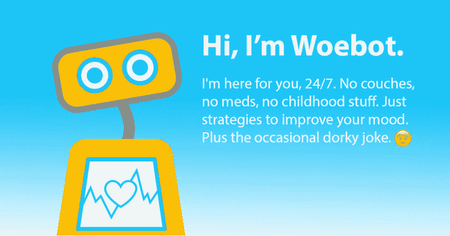
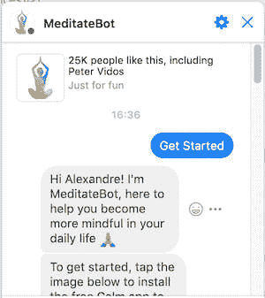
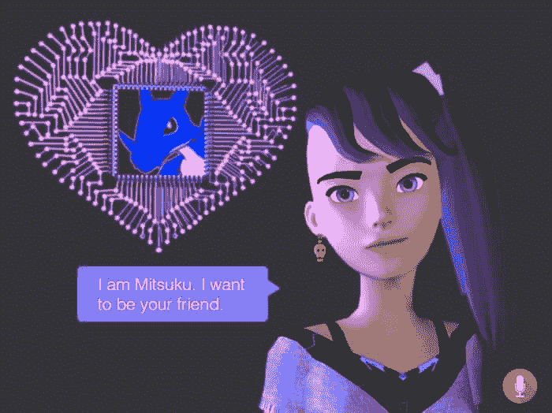
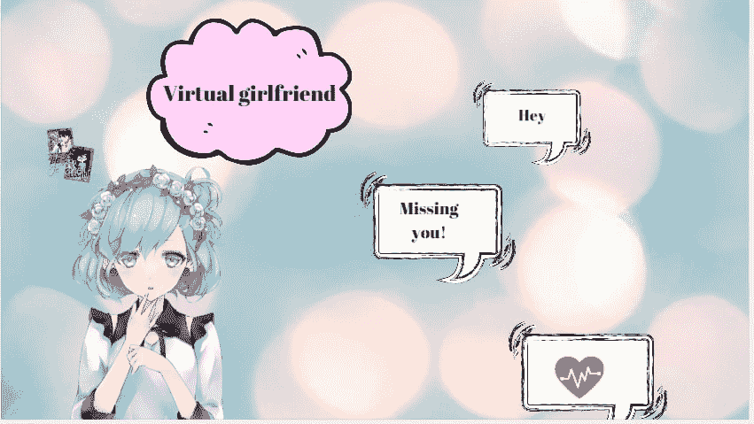
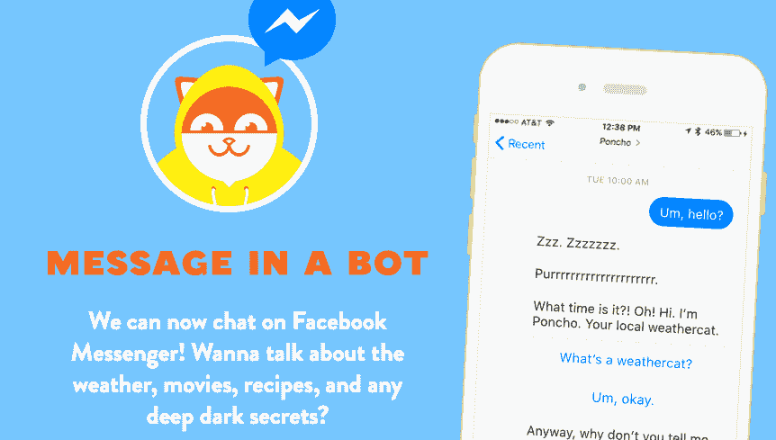

# 聊天机器人的类型以及它们如何帮助用户和企业

> 原文：<https://dev.to/ajaykapoor15/types-of-chatbots-how-they-help-users-businesses-c06>

你可能已经看到了随着人工智能、机器学习等最新技术的到来，IOT(基于人工智能)几乎取代了人类的角色，这可以从**机器人**中看出。

[](https://res.cloudinary.com/practicaldev/image/fetch/s--hJkhZ4v4--/c_limit%2Cf_auto%2Cfl_progressive%2Cq_auto%2Cw_880/https://lh3.googleusercontent.com/Zu108pIrHzcJ1H2urE_Hv1U1JpeFW8MW165tj7XkBztsaMoudomy5AGfYXSJ18PSRFIb2pVTAA0AUzbpB4Q4blEsrsSeADsjMQe7DUkCixZEhzU7okc27y98uxPL9-3zgMldx0VA)

是啊！在这里，我们将谈论由聊天机器人带来的革命。让我们看看聊天机器人如何在完成人工任务的同时让人类生活变得有趣，以及它甚至对一家制作商业软件的[软件开发公司](https://www.pixelcrayons.com/custom-software-development-services)来说有多大的潜力。

什么是聊天机器人&聊天机器人是如何工作的？知道吗？

聊天机器人基本上是一种软件应用程序，其表现类似于扮演人类角色的对话助手，或者可以说，它们模仿人类的书面和对话风格，但根据其中保存的数据。

好了，在这里我们将知道有哪些种类的聊天机器人，以及它们服务于多少部门。

```
 HEALTH 
```

Woebot

Woebot 是最好的医疗保健聊天机器人之一，这是一种治疗聊天机器人，有助于跟踪病人的思想，根据他们的反应确定他的行为模式。

[](https://res.cloudinary.com/practicaldev/image/fetch/s--GRhtCvwy--/c_limit%2Cf_auto%2Cfl_progressive%2Cq_auto%2Cw_880/https://lh4.googleusercontent.com/fsvlYxet7J-3oXihYk0lBbq_uiQ0yHKetXtMEt4vgQJkOJLw1sBXthgIEwgdJyURJGXAb6X3e_NPs5wqMr26JhADCY7jqS3_Qb2XcSnbTiQpaIS7vEKJuPthRSRdfaZvL2eSqf0o)

在确定了患者的所有这些活动之后，这个聊天机器人用各种可能有助于患者认知行为治疗的技术进行指导。

* * *

**Meditatebot**

另一个医疗聊天机器人是人工智能驱动的冥想机器人。很难继续你们的定期调解，许多人被看到失去了对它的奉献精神。

[](https://res.cloudinary.com/practicaldev/image/fetch/s--PEQKg0KB--/c_limit%2Cf_auto%2Cfl_progressive%2Cq_auto%2Cw_880/https://lh6.googleusercontent.com/GuY-yChzWs99GFOMmt6IjamQQph2XKj1CI2EwNGYW5VQAogocT9g4owsHfAADbsk29tbLoX8yBpS7z02VRKHeMIW4EUs2sLRs9Vcz7roh2rY9tNPbRlRuMwVZ3EPZWwYEwZ660B_)

在这个冥想机器人的帮助下，你可以创建和管理日常冥想练习。

* * *

**HealthTap**

到目前为止，我们一直在谈论写作聊天机器人，现在这里有一个有趣的聊天机器人，它是随叫随到的聊天机器人。

Healthtap 是一个随叫随到的在线医生，帮助回答与医疗健康和所有相关的查询。这个聊天机器人基本上与实验室和药房相连，被称为符合 HIPAA 的医疗服务。

* * *

**百度旋律**

这是百度最好的对话机器人之一，专门用于向医生提供准确的信息，以便提出建议和各种治疗方案。

[](https://res.cloudinary.com/practicaldev/image/fetch/s--CAVga8Sq--/c_limit%2Cf_auto%2Cfl_progressive%2Cq_auto%2Cw_880/https://lh6.googleusercontent.com/CV5GYwSHSfIZGKIeFbGgeRmrJoKlKoPNb7X6wQE_1tHRzIAM2kREYRnVEteqqq8AMd4XsEL4ayQqyxQf9jkpzrJIsmMDxQaoVStOmOosNSSuhL1WoF_RQxaH8Y2kd3Jp-yTYUWYr)

* * *

**伊莱莎**

伊莱扎是约瑟夫·韦岑鲍姆在 1966 年创造的自然对话节目之一。它的设计代表了罗杰精神治疗师。您可以在 internet 上找到各种与 ELIZA 应用程序相关的站点。

* * *

```
 PERSONALITY CHATBOTS 
```

**Mitsuku**

四次获得 Loebner prize turning test 的 Mitsuku 声称，这是它被认为是最好的 AI 对话聊天机器人的主要原因。

[](https://res.cloudinary.com/practicaldev/image/fetch/s--bBihAjCm--/c_limit%2Cf_auto%2Cfl_progressive%2Cq_auto%2Cw_880/https://lh3.googleusercontent.com/mXtMDg9b2lEsEPURQSWwxnX8umYd04ewiRNNPFJsVUjviEQ7ugbfkZUzG-cpxkVeTMs_j7zccvQyCEKQKVbrE-t9myEJ9lV4291ZsKYvuL0yZoS6E4FMFdT--iKhaU3eaG8UwGy7)

* * *

欧文

这是另一个由人工智能驱动的聊天机器人，它为你提供谜语/线索，而不涉及广告、电子邮件或其他混乱的营销。

* * *

乔治

这个聊天机器人随时准备与你聊天&如果你行为不端或侮辱他，它会停止说话。每当它回答时，看起来像是在“打”出答案。

* * *

**AIBliss**

有 AI 的虚拟女友。为自己建立角色，和它聊天，它会随着它的发展发展出不同的特性。

[](https://res.cloudinary.com/practicaldev/image/fetch/s--uWSY__34--/c_limit%2Cf_auto%2Cfl_progressive%2Cq_auto%2Cw_880/https://lh3.googleusercontent.com/8pGMyLSRT7U48JNbx55wTwiZ0zC57QUrIgazZ2-esn0VA85u5NV_RqQ-xVQftcHf27ke_LBXgR4Mk1OzEgU9jiJiV_rKOWQfX9trqExeCXMVjs19uwXa8UsYiIzjppjjl-pg3mcg)

最有趣和娱乐性的聊天机器人之一，被称为 AIBliss，一个人工智能驱动的虚拟女朋友，她根据你的兴趣和你交谈，主要是给你带来快乐的事情。

关于这个虚拟女友的一个有趣的事情是，你可以用你自己的方式对待她，随着时间的推移，她会开始知道你的兴趣，并相应地说话。这是一个基于文本的聊天机器人。

虚拟女友聊天机器人的一个主要好处是，它们有利于你的个人成长，尤其是对孤独的人来说，他们可以了解自己的生活到底是什么。认为这些虚拟女友，基本上一个聊天机器人都比心理治疗师强！

* * *

```
 FUN AND SOCIAL 
```

**Jokebot**

jokebot 是基于文本的聊天机器人，它可以用不同的笑话来娱乐你。只要提交你自己的笑话，这个机器人就会给你提供它自己的笑话。

* * *

**报价框**

Quotebot 有助于分享报价，因为您只需提交自己的报价，它就会以自己的报价回复您。

* * *

**晚餐机器人**

这是一个非常有用的聊天机器人，因为它基本上可以帮助你每天或每周提供一份食谱。但是实际上你要做什么呢？

基本上，你需要给它一份配料清单，作为回报，它会为你提供食谱建议。

```
 NEWS AND WEATHER 
```

**雨披**

这个聊天机器人根据你的邮政编码为你提供个性化的天气信息，同时用幽默或诙谐的评论来娱乐你。

[](https://res.cloudinary.com/practicaldev/image/fetch/s--UoMAiXCB--/c_limit%2Cf_auto%2Cfl_progressive%2Cq_auto%2Cw_880/https://lh5.googleusercontent.com/yUr7jgNVl_b6F9YtFzlFiyyqOyXsdQCfhMYSW2e4YX6GvfhXqWeQ53DVJYTzcDnT-dTTNt9S33XYg8Za-BE8HX-q2nYJ1hH_EFOo1CAKMieRACZ_93YuJQDXVhiJboeUUlLRhsjU)

* * *

美国有线电视新闻网

这也是天气信息聊天机器人之一。只需点击 CNN 脸书页面上的信使图标，它就能为您提供最新的新闻报道。

* * *

**遗言**

现在，你一定很熟悉让你的生活变得有趣的各种聊天机器人。

很明显，这些聊天机器人几乎已经取代了人类，所以可以理解的是，他们正在减少劳动力成本，各种网站的所有者可以看到利用这些聊天机器人来代替客户支持等。

对于用户和企业来说，这是一个双赢的局面，因为用户的生活变得不那么复杂和有趣；另一方面，如果用户满意，企业可以获得新用户，也可以留住老用户，这反过来又可以带来更高的利润。