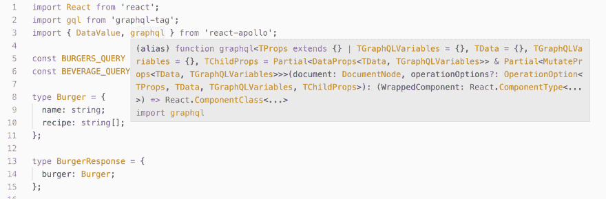

# 打字稿 HOCs 与阿波罗在反应-解释。

> 原文：<https://dev.to/georgeshevtsov/typescript-hocs-with-apollo-in-react-explained-c4e>

Apollo 的 Typescript HOCs 相当棘手。我不知道也许只是我，但这…

这是令人生畏的，但无疑是必要的。你还想让编译器如何检查你的道具进出包装组件？这就是 VSCode helper 对 react-apollo 中 graphql 函数的描述。Typescript 不想伤害和保护你自己。

我将详细阐述并扩展 apollo-graphql 文档中的例子，因为它们缺少一些用例，如链接 HOC 或创建带有 *config.name* ， *config.props* 的查询。

### 我们先来深入了解一下 graphql 这个特设的创建者