# 粉丝微博的 UAAP 实时情感分析

> 原文：<https://dev.to/francisoliver/uaap-real-time-sentiment-analysis-of-fan-tweets-2kpf>

又到了 UAAP 赛季，今年的 82 赛季由雅典耀主办。这是一个很好的机会来看看我在大学四年级时做的我最喜欢的项目之一。这一篇摘自 CS 129.1 的期末专题:软件工程专题:当代数据库技术，在我们的圈子里通常被称为“当代数据库”。为了这个项目，我们对 2018 年 11 月 25 日雅典耀蓝鹰队和 FEU Tamaraws 队最后四场比赛期间的推文进行了实时推文分析。

### 我们想要找出的东西。

对于这个项目，我们想通过数据分析找出三件事。

1.  关于 UAAP 游戏的推文有百分之多少是有毒的？
2.  粉丝群或特遣队哪个更毒？
3.  粉丝用的最频繁的词是什么？

如果你在这些至关重要的大学比赛期间查看 Twitter，你会发现大多数菲律宾趋势都被与比赛相关的话题占据。然而，由于游戏中发生的动作，一些粉丝对他们的推文过于热情。这意味着 Twitter 的 API 提供了很好的数据传输速度，并且我们可以分析很多充满情感的推文。

### 我们使用的技术。

我们使用的主要技术主要是基于 JavaScript 的。NodeJS 作为运行时和 NPM 包。为了收集数据，我们使用了以下方法:

1.  [MongoDB](https://www.mongodb.com/) 带着 [Mongojs](https://npmjs.org/package/mongojs) 当司机
2.  Twit 作为平台 REST 和流媒体 API 的 Twitter SDK 包装器
3.  [感悟](https://npmjs.org/package/sentiment) (NPM 套餐)
4.  确保我们 API 密钥的安全

对于数据可视化，我们通过 express web 应用程序完成，并使用了以下工具:

1.  [快递](https://expressjs.com/)
2.  作为模板引擎的 EJS
3.  [Chartkick.js](https://github.com/ankane/chartkick.js)

```
// Load environment variables
require('dotenv').config();
// Configure twitter API
const Twit = require('twit');
const config = require('./twitter_config');
const twitter = new Twit(config);
// Load sentiment analysis package
const Sentiment = require('sentiment');
const sentiment = new Sentiment();
const filipinoWords = require('./filipino');
// Configure mongoDB
const mongojs = require('mongojs');
const db = mongojs('tweets',['admu', 'feu'])

const filipino = {
    extras: filipinoWords
};

const trackingWords = [
    'ADMU',
    'FEU',
    // Plus many more
]; 
```

### 我们是怎么做到的？

我们遵循这个简单的方法:

1.  使用 Twitter 的流 API，我们订阅了“状态/过滤器”端点。
2.  然后，我们收听与游戏相关的跟踪单词，并将其过滤为英语或菲律宾语单词。
3.  使用情绪分析包分析了推文。
4.  然后，我们将它们“分类”为雅典耀事件或 FEU 事件推文。

对于情感分析，我们简单地想到菲律宾语中有毒的和好的单词，并将其翻译成英语，并将它们的分数设置为与英语分数相同。这不是最好的方法，但对我们来说，这是当时我们能做的最好的方法。我们设法想出了大约 50+有毒的单词和大约 40+好的单词。

```
console.log("Listening for tweets . . .");

const stream = twitter.stream('statuses/filter', {track: trackingWords, language: ['tl','en']})
stream.on('tweet',(tweet)=>{
    if (tweet.retweeted_status === undefined){
        let tweetText;
        if (tweet.extended_tweet == undefined){
            tweetText = tweet.text;
        } else {
            tweetText = tweet.extended_tweet.full_text
        }
        let analysis = sentiment.analyze(tweetText, filipino);
        let tweetScore = tweet;
        tweetScore.sentiment_analysis = analysis;
        classifyTweet(tweetScore);
    }
}); 
```

我们首先收集和分析来自 Twitter API 的推文，并将其保存到一个 MongoDB 集合中，其中包含情绪得分和标记化的推文，基于一个简单的分类逻辑:对于负面情绪得分的推文，如果它谈论某个学校或团队，它将被分类到对立的一方。另一方面，对于积极和中立的得分推文，我们将其归类为他们谈论的球队的球迷。这种分类随着推文的出现而发生。

```
function classifyTweet(tweet){
    let admuClassifiers =[
        // Classifiers for AdMU here.
    ];
    let feuClassifiers = [
        // Classifiers for FEU here.
    ];
    let tweetText;
    if (tweet.extended_tweet == undefined){
        regText = tweet.text;
        tweetText = tweet.text.toUpperCase();
    } else {
        regText = tweet.extended_tweet.full_text;
        tweetText = tweet.extended_tweet.full_text.toUpperCase();
    }

    for (let admu of admuClassifiers){
        if (tweetText.includes(admu.toUpperCase())){
            if (tweet.sentiment_analysis.score >= 0){
                console.log(`Inserted to ADMU: Score ${tweet.sentiment_analysis.score} - ${regText}`);
                return db.admu.insert(tweet);
            } else {
                console.log(`Inserted to FEU: Score ${tweet.sentiment_analysis.score} - ${regText}`);
                return db.feu.insert(tweet);
            }
        }
    }

    for (let feu of feuClassifiers){
        if (tweetText.includes(feu.toUpperCase())){
            if (tweet.sentiment_analysis.score >= 0){
                console.log(`Inserted to FEU: Score ${tweet.sentiment_analysis.score} - ${regText}`);
                return db.feu.insert(tweet);
            } else {
                console.log(`Inserted to ADMU: Score ${tweet.sentiment_analysis.score} - ${regText}`);
                return db.admu.insert(tweet);
            }
        }
    }
} 
```

聚会结束后，我们对三个不同用例的标记化推文进行了地图缩减，在地图缩减阶段，我们没有包括从教授那里获得的英语和菲律宾语的停用词。

1.  最常用的单词/表情符号
2.  使用最多的正面词汇/表情符号。
3.  最常用的负面词汇/表情符号。

```
// Map functions
function getTokens1(){
   var stopWords = [];
   var tokens = this.sentiment_analysis.tokens
   for(var token of tokens) {
       if (token != "" && !stopWords.includes(token.toLowerCase())){
           emit(token, 1)
       }
   }
}
function getTokens2(){
   var stopWords = [];
   var tokens = this.sentiment_analysis.positive
   for(var token of tokens) {
       if (token != "" && !stopWords.includes(token.toLowerCase())){
           emit(token, 1)
       }
   }
}
function getTokens3(){
   var stopWords = [];
   var tokens = this.sentiment_analysis.negative
   for(var token of tokens) {
       if (token != "" && !stopWords.includes(token.toLowerCase())){
           emit(token, 1)
       }
   }
}

// Reduce Function
function aggregateCount(key, values){
   var count = 0;
   for(var value of values){
       count += value;
   }
   return count;
}

// Map Reduce Command Run in the MongoDB Shell
results = db.runCommand({
    mapReduce: 'admu',
    map: getTokens1,
    reduce: aggregateCount,
    out: 'admu.wordcount'
});

results = db.runCommand({
    mapReduce: 'feu',
    map: getTokens1,
    reduce: aggregateCount,
    out: 'feu.wordcount'
});

results = db.runCommand({
    mapReduce: 'admu',
    map: getTokens2,
    reduce: aggregateCount,
    out: 'admu.positive'
});

results = db.runCommand({
    mapReduce: 'feu',
    map: getTokens2,
    reduce: aggregateCount,
    out: 'feu.positive'
});

results = db.runCommand({
    mapReduce: 'admu',
    map: getTokens3,
    reduce: aggregateCount,
    out: 'admu.negative'
});

results = db.runCommand({
    mapReduce: 'feu',
    map: getTokens3,
    reduce: aggregateCount,
    out: 'feu.negative'
}); 
```

### 结果

对于我们在 web 应用程序中的结果，我们主要看了以下内容:使用条形图，我们看了最常用的词，最常用的正面词，最常用的负面词。除此之外，我们还做了双方最积极的 10 条推文和最消极的 10 条推文。使用 chartkick.js，我们使用一个 API 端点来获取性能数据(必须有快速的页面加载)。

#### 一般结果

<figure>[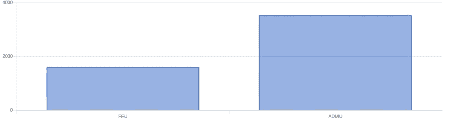](https://res.cloudinary.com/practicaldev/image/fetch/s--iu7nIeT7--/c_limit%2Cf_auto%2Cfl_progressive%2Cq_auto%2Cw_880/https://francisoliver.dev/assets/img/blog/uaap-real-time-sentiment-analysis/general/count.jpg) 

<figcaption>推文总数</figcaption>

</figure>

<figure>[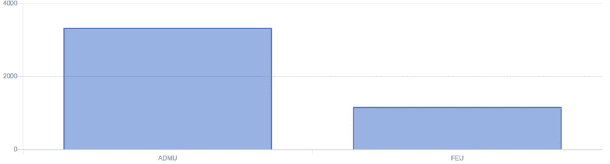](https://res.cloudinary.com/practicaldev/image/fetch/s--mu-mk8CA--/c_limit%2Cf_auto%2Cfl_progressive%2Cq_auto%2Cw_880/https://francisoliver.dev/assets/img/blog/uaap-real-time-sentiment-analysis/general/count-positive.jpg) 

<figcaption>正面推文总数</figcaption>

</figure>

<figure>[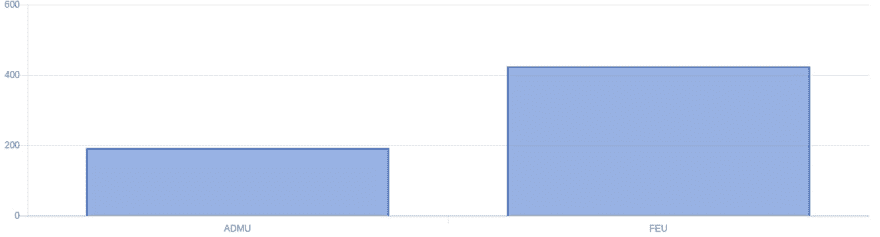](https://res.cloudinary.com/practicaldev/image/fetch/s--Wo5dpgXc--/c_limit%2Cf_auto%2Cfl_progressive%2Cq_auto%2Cw_880/https://francisoliver.dev/assets/img/blog/uaap-real-time-sentiment-analysis/general/count-negative.jpg) 

<figcaption>负面推文总数</figcaption>

</figure>

<figure>[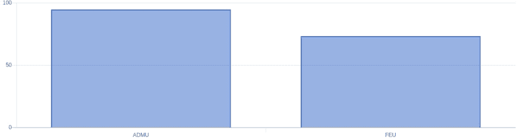](https://res.cloudinary.com/practicaldev/image/fetch/s--1N1PSc6r--/c_limit%2Cf_auto%2Cfl_progressive%2Cq_auto%2Cw_880/https://francisoliver.dev/assets/img/blog/uaap-real-time-sentiment-analysis/general/percent-positive.jpg) 

<figcaption>总正面推文百分比</figcaption>

</figure>

<figure>[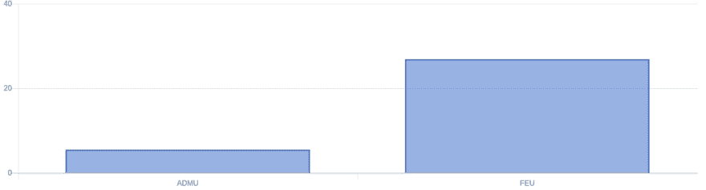](https://res.cloudinary.com/practicaldev/image/fetch/s--PMeou2d3--/c_limit%2Cf_auto%2Cfl_progressive%2Cq_auto%2Cw_880/https://francisoliver.dev/assets/img/blog/uaap-real-time-sentiment-analysis/general/percent-negative.jpg) 

<figcaption>负面推文总百分比</figcaption>

</figure>

#### 看着雅典耀的推文

<figure>[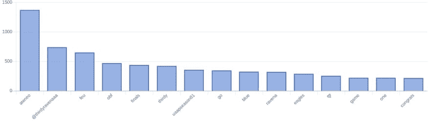](https://res.cloudinary.com/practicaldev/image/fetch/s--mjNOgw6Y--/c_limit%2Cf_auto%2Cfl_progressive%2Cq_auto%2Cw_880/https://francisoliver.dev/assets/img/blog/uaap-real-time-sentiment-analysis/ateneo/count.jpg) 

<figcaption>最常用的词语/表情符号</figcaption>

</figure>

<figure>[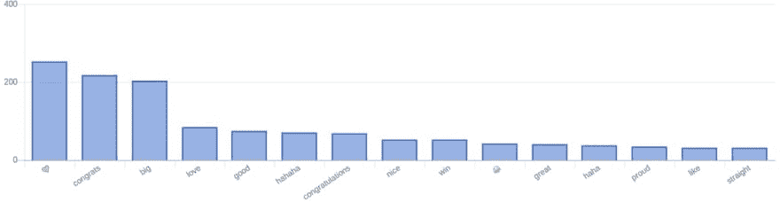](https://res.cloudinary.com/practicaldev/image/fetch/s--IkFn42qg--/c_limit%2Cf_auto%2Cfl_progressive%2Cq_auto%2Cw_880/https://francisoliver.dev/assets/img/blog/uaap-real-time-sentiment-analysis/ateneo/positive.jpg) 

<figcaption>最常用的正面词语/表情符号</figcaption>

</figure>

<figure>[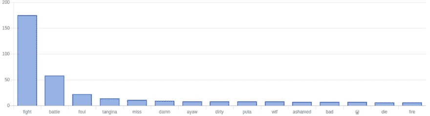](https://res.cloudinary.com/practicaldev/image/fetch/s--aymUuYvv--/c_limit%2Cf_auto%2Cfl_progressive%2Cq_auto%2Cw_880/https://francisoliver.dev/assets/img/blog/uaap-real-time-sentiment-analysis/ateneo/negative.jpg) 

<figcaption>最常用的否定词/表情符号</figcaption>

</figure>

#### 雅典耀粉丝的一些正面推文示例

| 自录音再现装置发出的高音 | 情感得分 |
| --- | --- |
| 爱你的能量💙呜哇！加林，加林！ | Fourteen |
| Thirdy 从高中开始的每一年的成熟都是惊人的！更神奇的不是他的啤酒花的成熟而是他的二头肌三头肌和肩膀的成熟！！！💪🏻我说的对吗？哈哈！干得好@ ThirdyRavenaaa！！！ | Fourteen |
| 决赛来了！！💙祝贺你们，雅典耀蓝鹰队😃祝你期末考试好运😊💙#BEBOB #UAAPFinalFour #OBF | Thirteen |

#### 现在一些来自雅典耀粉丝的负面推文

| 自录音再现装置发出的高音 | 情感得分 |
| --- | --- |
| 中国勇#21 sa FEU？哈拉唐哈拉塔昂帕邦戈凯伊萨克阿巴！！Gago ka？？我们可以再玩一次吗？扯淡 ka。 | -9 |
| 在斯托克顿的篮球场上拉屎。那不可能是篮球运动员。UAAP 应该禁止那个傻瓜。#OBF | -9 |
| @alecstockton2 你现在在防空洞里过得怎么样？坏脾气先生 | -6 |

#### 看着 FEU 的推文

<figure>[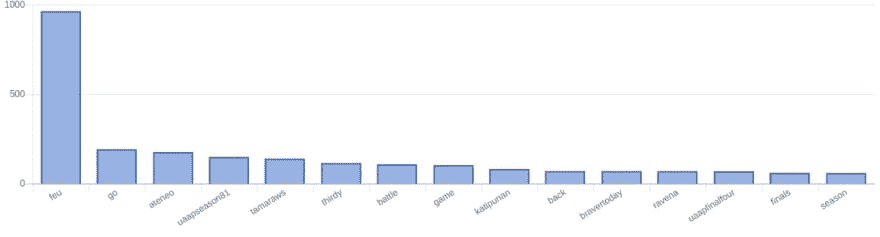](https://res.cloudinary.com/practicaldev/image/fetch/s--IvWaswFQ--/c_limit%2Cf_auto%2Cfl_progressive%2Cq_auto%2Cw_880/https://francisoliver.dev/assets/img/blog/uaap-real-time-sentiment-analysis/feu/count.jpg) 

<figcaption>最常用的词语/表情符号</figcaption>

</figure>

<figure>[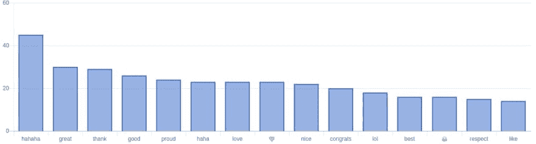](https://res.cloudinary.com/practicaldev/image/fetch/s--zhiZbvmm--/c_limit%2Cf_auto%2Cfl_progressive%2Cq_auto%2Cw_880/https://francisoliver.dev/assets/img/blog/uaap-real-time-sentiment-analysis/feu/positive.jpg) 

<figcaption>最常用的正面词语/表情符号</figcaption>

</figure>

<figure>[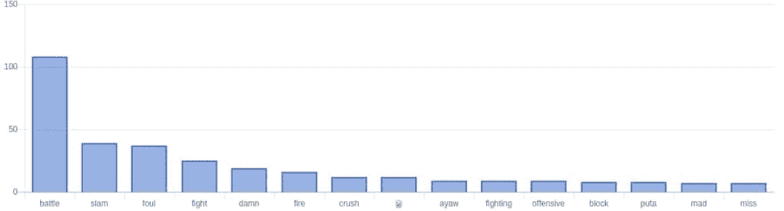](https://res.cloudinary.com/practicaldev/image/fetch/s--AVD5WsiO--/c_limit%2Cf_auto%2Cfl_progressive%2Cq_auto%2Cw_880/https://francisoliver.dev/assets/img/blog/uaap-real-time-sentiment-analysis/feu/negative.jpg) 

<figcaption>最常用的否定词/表情符号</figcaption>

</figure>

#### 来自 FEU 粉丝的正面推文示例

| 自录音再现装置发出的高音 | 情感得分 |
| --- | --- |
| 我将永远为你们感到骄傲！！你打得很好！让我们明年反弹吧！！更勇敢！！💪向我们所有的毕业生致敬👏你们让 FEU 社区如此自豪！！谢谢我们勇敢的塔姆！马哈尔·那敏·卡约！！💚💛 | Seventeen |
| 虽然远离家乡，我们的脚可以漫游我们的爱仍然是真实的我们的声音将联合起来，以赞美你的名字，我们将珍惜在我们心中的火焰！竖起号角，塔玛拉！💚💛🔰至少我们进入了 4 强。一点也不差，恭喜你！🤣 | Fifteen |
| 对福州男篮只有爱和尊重💚💛你们做得很好！我们将在下个赛季强势反弹。 | Ten |

#### 现在一些来自 FEU 粉丝的负面推文

我们甚至还收到了 Bisaya 的推文。

| 自录音再现装置发出的高音 | 情感得分 |
| --- | --- |
| WALA 康礼仪 GAGO！！！！MGA 球迷 NG 雅典耀布卡约 MGA QAQO | -9 |
| thirdy ravena ayaw paawat sus | -7 |
| Dili jud ni mawala ang 偏向 pag magdula ang ATENEO ayy。Yawa mani si Thirdy Ravena。扮演受害者皮斯托伊🤬🤬🤬迪凯科加观看 ug 篮球，但普塔西亚✌🏼 | -7 |

### 齐夫定律

它显示的结果和曲线让我想起了我以前看过的一个 VSauce 视频。点击此处查看视频:

[https://www.youtube.com/embed/fCn8zs912OE](https://www.youtube.com/embed/fCn8zs912OE)

简而言之，Zipf 定律只是指出，给定一个使用的大样本单词，任何单词的频率都与其在频率表中的排名成反比。在数学术语中，一个单词数 n 的频率与 1/n 成正比。

### 最后的话

我和我的团队不是数据科学家，我们使用的方法并不完美。我们专门为数据库类做了这个项目，不一定是模式识别或数据建模类。分类逻辑可以得到显著改善，在推文中有更多的东西可以分析，而不是情绪。我鼓励使用 Twitter 的优秀 API 来研究更多可能的数据科学用例。我还加入了我们的[展示平台](https://docs.google.com/presentation/d/e/2PACX-1vR-ozGHpy96TgR2rwHNDmMHsRF1sC3QV5ojjzUYoqP3-8eg_lgkXFUL3oYiyErHXTdcrxH5QhAwir8p/pub?start=false&loop=false&delayms=3000)，它包含了这里提出的大部分观点，以及我们的采集者和分类者在游戏过程中的视频。