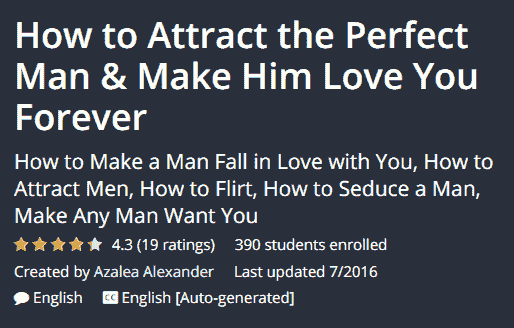
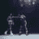
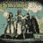

# Udemy 需要复习课程，审核导师

> 原文：<https://dev.to/ashleemboyer/udemy-needs-to-review-courses-and-vet-instructors-54ch>

封面图片 alt: Header 阅读这篇博文的标题。背景是一个大讲堂，浅棕色的木椅，白墙。

*这篇文章最初发布于[我的个人博客网站](https://ashleemboyer.com/udemy-needs-to-review-courses-and-vet-instructors)。*

* * *

> *触发警告:对妇女的暴力*

* * *

今天，我在推特上发了一条关于厌恶女性的 Udemy 课程的推文，这条推文引起了我的关注，幸好已经从网站上删除了。这篇文章是关于从我看到的第一条推文，到充满问题回复和发现更多应该删除的课程的一天结束的事件过程。我会尽可能的把内容打散。

## 目录

1.  第一条推特
2.  课程及其问题
3.  有问题的回复和转发
4.  更多要删除的课程
5.  你能做什么

* * *

## 第一条推文

我看到了 Twitter 用户 [@ryzokuken](https://twitter.com/ryzokuken) 关于这个课程的第一条推文。课程名为:“如何黑女孩:现实生活版。”链接预告描述说，“通过黑她的大脑让她成为一个被你吸引的女人！”(嗷，语法。)

> Ujjwal Sharma ✈️犰狳@ ryzokuken搞什么鬼， [@udemy](https://twitter.com/udemy) 。
> 
> 2019 年 9 月 15 日下午 17:38

我在午夜左右发了微博，并附上了课程基本信息的截图。除了上面提到的标题和描述，它还显示:

*   来自 36 条评论的 2.9 / 5 星评级
*   自 2019 年 5 月以来注册的 3，231 名学生的数量
*   教练的名字:佩德罗·普拉纳斯
*   45%的折扣价格为 10.99 美元，以此价格剩余 5 个小时

> 亚什🐯[@ ashleemboyer](https://dev.to/ashleemboyer)这太恶心了。 [@udemy](https://twitter.com/udemy) 需要立即删除该课程。2019 年 9 月 16 日上午 03:58

我的推文被看了上万次。数百人喜欢它。显然我不是唯一一个觉得有问题的人。

## 航向&其议题

首先，女人不是硬件也不是软件，因此不能被黑。我们是人类。其次，你不能让女人被你吸引，如果她们不愿意的话。这就是所谓的权利，女人不成比例地被骚扰、攻击，甚至被谋杀，因为她们拒绝那些认为她们有权得到我们的身体和关注的男人。在你试图和我辩论这个观点之前，这里有五篇文章你应该读一读:

*   女人分享了男人拒绝她们后最糟糕的反应
*   [“拒绝杀人”需要跟踪](https://gen.medium.com/revenge-killings-need-to-be-tracked-37e78a1cf6ce)
*   多伦多货车袭击案的嫌疑人痴迷于被女性拒绝。他并不是暴力人群中唯一的一个
*   男人每年会因为说不而杀死成千上万的女人
*   20 个可怕的故事解释了为什么女人害怕拒绝男人

从最后一个要点开始的原始帖子已经不在了，但是你可以看看帖子中第一条 tweet 的这些引用 tweet。

我们再来看看课程描述:

> “你有没有过这样的感觉:**她没有注意到你，结果她和那个坏男人在一起，而你却被无望地抛弃了？如果这是你的情况，你只需点击几下鼠标，就能让她**被你**吸引，所以你最终会成为和她在一起的那个人。这是一个视频课程，教你如何**通过理解女人的想法来破解女孩的大脑**，如何提高你的整体吸引力和基于科学的心理技巧，这些技巧会让你在让她喜欢你时变得很棒！**”

所有的强调、严重的拼写错误和可怕的语法都是作者的描述。

叹气。有这么多东西要打开。

1.  女人不欠任何人的关注
2.  [女人不是女孩](https://everydayfeminism.com/2015/06/grown-women-are-not-girls/)
3.  “好人”这个比喻由来已久

## 有问题的回复和转发

这里有一堆糟糕的回复和转发，被分成有趣的小类别。

### 何物主义

> Alex 捐@ alexddonate[@ ashleemboyer](https://twitter.com/ashleemboyer)[@ udemy](https://twitter.com/udemy)确定！还有这个...2019 年 9 月 16 日上午 10:20

> 詹姆斯菲利普斯@ jphillips _ data[@ ashleemboyer](https://twitter.com/ashleemboyer)[@ SQL world wide](https://twitter.com/SqlWorldWide)[@ udemy](https://twitter.com/udemy)你看过如何让前任回来的那些吗？2019 年 9 月 17 日上午 00:55

> Uxfra@ Uxfra[@ ashleemboyer](https://twitter.com/ashleemboyer)[@ udemy](https://twitter.com/udemy)不知道内容要求删除没错但是...亚马逊或任何书店中有多少关于同一主题的书？指责太多是不公平的...他们只需要更快地审核用户反馈2019 年 9 月 16 日下午 21:16

### 烦人，非笑话

> 【ren Christian nshogoza】[@ filschrisist](https://dev.to/filschristian)我的天啊😊【2019 年 9 月 16 日上午 11:43】

> 塔尔哈·沙赫扎德@ _ 塔尔哈·沙赫扎德 _[@ ashleemboyer](https://twitter.com/ashleemboyer)[@ udemy](https://twitter.com/udemy)黑掉一个女孩只要 10 美元，没什么大不了的 btw:p14:59PM-16 Sep 2019

> bean _ potato@ bean _ potato 1[@ ashleemboyer](https://twitter.com/ashleemboyer)[@ udemy](https://twitter.com/udemy)别急，这只针对真正的女生2019 年 9 月 11:37 日

> Natural _ Zeros@ Natural Zeros[@ ashleemboyer](https://twitter.com/ashleemboyer)[@ CurseofSebs](https://twitter.com/CurseofSebs)[@ udemy](https://twitter.com/udemy)他们连一句话都不会写...我怀疑他们能黑进大脑...lol2019 年 9 月 19:05PM-16

> 米奇·斯泰基-艾凡提斯@ lesson _ shop[@ ashleemboyer](https://twitter.com/ashleemboyer)[@ udemy](https://twitter.com/udemy)Lol 你生气的样子真可爱😊2019 年 9 月 16 日上午 11:16

### 苦口婆心

> Shanthan Reddy[@ shanthanreddy 77](https://dev.to/shanthanreddy77)[@ ashleemboyer](https://twitter.com/ashleemboyer)[@ udemy](https://twitter.com/udemy)这多少让他们有些不安全。男人可以随意，自然，做他们自己，这样才能得到一个好女人，这样的策略只会让所有物质至上的女人涌向男人。uff:)2019 年 9 月 16 日下午 16:54

### 只是...不

> 德里克·多尔曼@德里克·多尔曼这不是见不得人也不需要立即行动[twitter.com/ashleemboyer/s…](https://t.co/A0Of4IFom8)2019 年 9 月 19 日下午 19:53

> ANTHONYYYYYYYYYY@ JV _ thc[@ ashleemboyer](https://twitter.com/ashleemboyer)Lmaoo，ashleee get a life &学会什么时候闭嘴。这是推特，不是你的下一次白人至上、女权主义、反互联网会议。
> 他妈的松了。2019 年 9 月 16 日下午 12:52

### 言论自由

> Iseljenik@ Iseljenik[@ ashleemboyer](https://twitter.com/ashleemboyer)[@ udemy](https://twitter.com/udemy)没人逼你报读。宽以待人2019 年 9 月 16 日上午 06:59

## 更多课程删除

这不是 Udemy 第一次不得不删除课程。Twitter 用户  在 10 个月前发布了一系列有问题的课程:

*   "如何退出友谊区(或避免陷入其中)"
*   "男人约会——如何逃离友谊区！"
*   “给可爱男生的重要约会建议”(也提到了友谊区)
*   “如何让男人和女孩约会”(更多朋友圈垃圾)

幸运的是，Udemy 通过相同的指导者移除了他们和其他人。但是为什么他们一直让这种事情发生？为什么他们没有针对所有试图添加的课程的审查和批准流程？

以下是我今天花了几分钟搜索找到的一些课程，也分为有趣的类别。

### 能干

*   [“我如何治愈 2500 多名聋哑人的秘密”](https://www.udemy.com/course/how-over-2500-deaf-and-mute-got-healed/)(不可能，但可以)
*   [“催眠——用自我催眠提高你的听力”](https://www.udemy.com/course/hypnosis-improve-your-hearing-using-self-hypnosis/)(也不可能，但无所谓)
*   [自信地迎接残疾同事和客户](https://www.udemy.com/course/disability-confident-training/)(残疾人不是可以“打交道”的东西，但是谢谢)

### 性别歧视

去看看描述吧。在附近放一个你可以呕吐的桶。

*   [“让女人爱上你。(《诱惑的秘密》)](https://www.udemy.com/course/make-women-fall-in-love-with-you-the-secret-to-seduction/)
*   [“如何吸引完美男人&让他永远爱你”](https://www.udemy.com/course/how-to-attract-the-perfect-man-make-him-love-you-forever/)
*   [《变得不可抗拒:吸引男人完全指南》](https://www.udemy.com/course/become-irresistible-the-complete-guide-to-attract-the-man/)
*   [《遇见&吸引女人——今天学习如何》](https://www.udemy.com/course/meetwomen/)

## 你能做什么

Udemy 希望你给他们发一封电子邮件。

我要你大量提及他们。

迫使他们做出改变。报可怕的课程。现在是 2019 年，我们有很多人想编写软件来过滤这种垃圾，没有理由让付费用户面临危险。注意到 Udemy 从来没有对此发表过公开的推文吗？他们想保持低调。别让他们得逞。

* * *

你知道我有时事通讯吗？📬

如果你想在我发布新的博客帖子或宣布重大项目时得到通知，请联系 https://ashleemboyer.com/newsletter。

* * *

*[图片](https://unsplash.com/photos/ewGMqs2tmJI)由[内森·杜姆劳](https://unsplash.com/@nate_dumlao)上 [Unsplash](https://unsplash.com)*