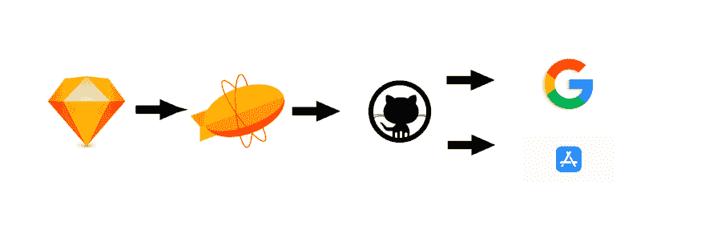
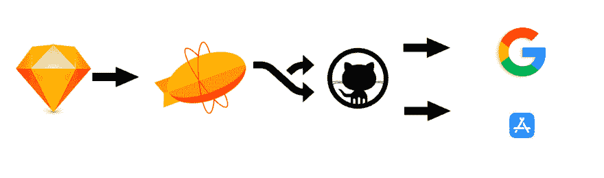
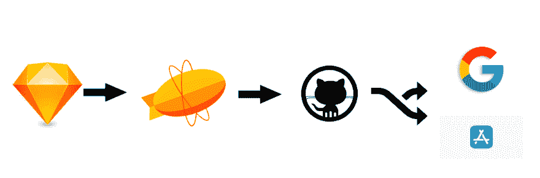
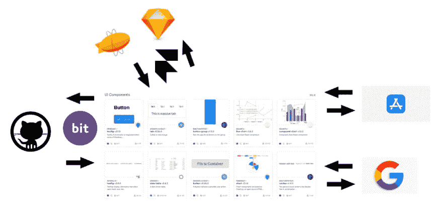
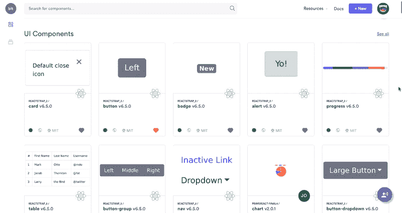
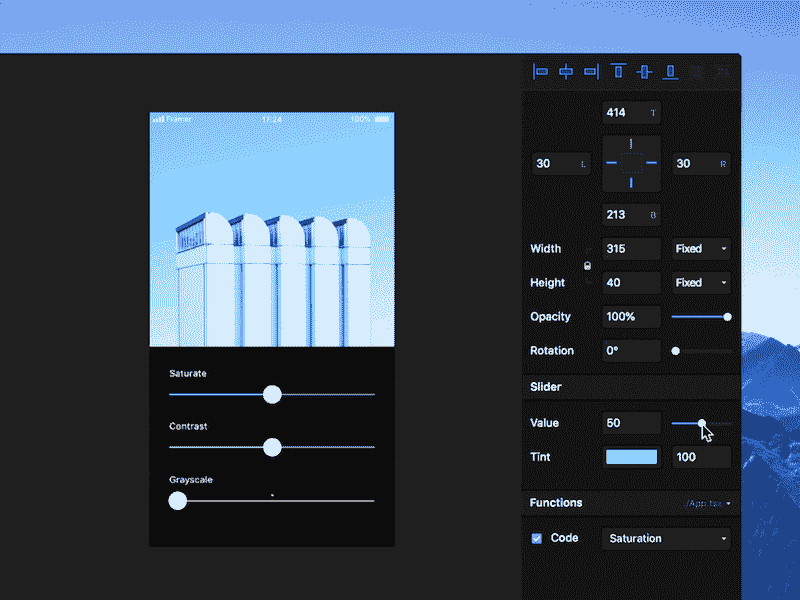
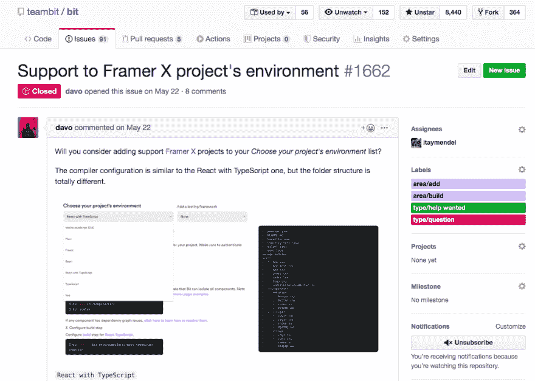

# UI 设计系统和组件库:哪里有问题

> 原文：<https://dev.to/giteden/ui-design-system-and-component-library-where-things-break-4n1d>

对于 UI 组件来说，设计师和开发者之间的工作流是不是断了？而 2020 年会更好吗？

 *那么，你实际设计的系统是哪个部分呢？*

这里有个问题……"**你的设计体系到底是什么**"

**问一个设计师**，他们会说是一些图像和指引。除了组件之外，它还包括字体、大小、边距、位置以及你提供给人们的视觉体验的其他重要方面的指导方针。

**作为开发者**，他们会说这是 GitHub 上的一个库，用 React、Vue、Angular 或者只是普通的 JavaScript 写的。可能还会提到泽普林。

这是一个真正的问题，因为你的想象和希望与几年后你最终拥有的东西之间的差距每天都在增长。为什么？因为有些东西在视觉和代码之间的转换中丢失了，而且随着时间的推移，现实迫使开发人员改变东西。这就是生活。

因此，让我们暂时离开我们今天所知道的**Sketch->Zeplin->GitHub->Apps**工作流程，尝试探索未来可能的样子。我们还将访问一些工具，它们可能有助于巩固当前的工作流程。

这篇文章是基于 30 多个团队在不同阶段构建组件设计系统的经验而写的。如果你有任何想法、见解或建议，请随时在下面发表评论。它也会帮助其他人学习。享受:)

## 你的设计系统是什么，真的？

 ](https://res.cloudinary.com/practicaldev/image/fetch/s--3CMsx6K7--/c_limit%2Cf_auto%2Cfl_progressive%2Cq_auto%2Cw_880/https://cdn-images-1.medium.com/max/2400/1%2AxmoQ2YoPFwI6rSmk38hL2g.png) * **Airbnb 的* *组件[设计系统](https://airbnb.design/building-a-visual-language/) *

唯一真实的事实是:

你真正的设计体系是**你的用户得到的。* *多多少少没什么。

你可以在 Figma 或 Sketch 中拥有最令人惊叹的组件，以及为令人惊叹的设计系统编写的最佳指南。如果不是你的开发者用的，不是你的用户得到的，那就不是你的设计体系。

你甚至可以拥有用 React、Vue 或 Angular 编写的最好的 UI 组件库。如果开发人员构建你的应用程序只是从你的库中复制粘贴代码或修改东西，那就不是你的设计系统。

这就是为什么一个实用的设计系统必须适应图像和代码之间的差距，以及计划和随时间演进之间的差距。使用正确的思维和工具，您今天就可以找到一个实用的解决方案。展望未来，这个工具链和工作流程应该真正得到整合。我们将研究像[钻头](https://bit.dev)、[成帧器](https://www.framer.com/)和其他可以实现它的工具。

*   另见:[构建 UI 组件设计系统](https://blog.bitsrc.io/building-a-consistent-ui-design-system-4481fb37470f)

## 设计和 UI 库之间的差距

像[优步设计](https://dev.toundefined)和 [AirbnbEng](https://dev.toundefined) 很多公司都在搭建 UI 组件设计系统(见[优步的](https://www.uber.design/case-studies/rebrand)和 [Airbnb 的](https://airbnb.design/building-a-visual-language/)可视化语言)。

为了将这些系统翻译成应用程序中使用的代码，他们实现了 UI 组件库(参见惠普、[阿特拉斯](https://atlaskit.atlassian.com/)、 [Pinterest](https://github.com/pinterest/gestalt) 和其他人的库)。这些库依次安装并用于不同的应用程序。

### 修建图书馆的缺口

但是，当开发人员必须将图像转换成代码时，事情可能会与预期的有所不同。像 Zeplin 这样的工具可以让这变得更容易，但是变化往往是不可避免的。例如，相对与绝对定位是一个常见的问题。字体和组件中字体的使用也是如此。

当设计需要适合真实世界的应用程序中使用的真实世界的适用组件时，开发人员必然要做出一些选择。即使在与设计师协商时，分歧也必然会形成。

### 随着时间的推移差距不断扩大

随着时间的推移，这个库必须由 2、20 或 200 个开发人员在 2、20 或 200 个应用程序中使用。有些人需要修改一些东西，以使这个库适用于他们正在从事的项目。否则，他们就不会使用它( [Bit](https://bit.dev) 可以极大地帮助减轻这种痛苦，我们稍后会讲到)。

其中一些更改可能会返回到库中，更改代码以使其更适用于您正在构建的应用程序。然后，设计和代码之间的差距进一步扩大。

## UI 库和应用开发者之间的鸿沟

UI 组件也可以作为 UX 组件，为用户提供功能和视觉上的一致性。

一个基于组件的设计系统可以让你的应用程序在视觉和功能上保持一致，让你的用户有一种宾至如归的感觉，并且可以轻松地完成与你的产品的交互。

有时候，构建 app 的开发者因为各种原因无法使用库。例如，组件的样式或边距不合适。或者，可能库给一个需要轻便快捷的 app 增加了太多的权重。

当一个开发人员需要改变库中的一些东西时，他们必须在一个未知的日期发出一个拉请求，这个请求可能会被接受，也可能不会被接受。这是采用这种库的一个严重且常见的障碍。

### 应用开发者不会一直使用这个库

那么真正发生的是，一些开发人员不会使用这个库，而是构建他们自己的组件。或者，他们可能将库中的代码复制粘贴到他们自己的项目中，并在表格下进行一些更改。

你不能真的责怪开发人员，因为他们需要完成工作。你不能强制你的设计系统，因为它应该被切实可行地采用。你需要接受改变是必要的，并且更喜欢监管、透明和合作而不是强制执行。一直都是。

使用 [Bit](https://bit.dev) 这变得容易多了，任何开发人员都可以从他们正在构建的任何项目中建议对组件进行更新，因此您可以协作进行更改，并进行监管以跟踪更改，而不是忽略它们。

## 巩固设计开发？

 ](https://res.cloudinary.com/practicaldev/image/fetch/s--1whmDgiC--/c_limit%2Cf_auto%2Cfl_progressive%2Cq_auto%2Cw_880/https://cdn-images-1.medium.com/max/2000/1%2AHK2_PKA4oP5T0PsrneN0iA.jpeg) *让我们把人聚在一起；[图片来源](http://ph.m.jeshield.com/arts/around-the-campfire)*

正如生活中的许多其他事情一样，你需要将人们团结在一起，以实现更大的成就。在这种情况下，您需要为 3 个不同的受众创建共同的基础，以便一起构建和迭代您的组件:

*   uidesigner

*   UI 组件库开发人员

*   应用程序开发人员(使用库)

只有当你为这三者创造一个整合的空间来协作时，你才能(希望)确保用户的最终体验与设计者设定的设计准则和视觉资产相一致。

这里我们遇到了真正的问题:

设计师不用 GitHub，也不用 React/Vue/Angular 读代码。库开发人员必须进行翻译，你永远不能期待一切。应用程序开发人员只是真的想找到并使用组件来构建应用程序。

Sketch 或 Zeplin 或 GitHub 都无法满足所有这些需求，在它解决之前，我们将不得不经历一个有些破碎的工作流。但是，今天有工具已经可以做到这一点吗？让我们检查一下。

## 未来的 UI 组件工具

让我们快速回顾一下几个工具，展望未来，它们可以帮助弥合开发人员和设计人员之间的差距。

## Bit 和 bit.dev(针对开发者)

[Bit 是一个开源工具](https://github.com/teambit/bit)，用于将组件变成共享的构建块。使用 Bit 和 [bit.dev](https://bit.dev) 组件平台，开发人员可以立即将组件从他们的库和项目中隔离并共享到一个“类似播放列表”的集合中，这使得他们可以在任何地方可视化地发现和使用。

从这个集合中，可以跨不同的项目安装(npm/yarn)甚至开发(bit import)组件，因此开发人员和开发团队可以轻松地在 UI 组件上共享和协作来构建应用程序。

通过 bit.dev，实际的代码组件(React、Vue、Angular)被渲染和可视化，以便开发人员和设计人员可以准确地了解他们的组件在用户看来是什么样子、如何表现以及感觉如何。他们甚至可以在任何时候，在一个可编辑的操场上玩这些组件。

当开发人员对特定组件进行更改和更新版本时，设计人员可以立即看到新版本并监控更改，以确保实际组件适合他们的设计系统。

当开发人员在必要时可以灵活地对组件进行更改，并从他们自己的项目中提出更新建议时，这就创造了一种平衡，而设计人员可以随着时间的推移协作检查更改。

### Framer 和 FramerX(针对设计者)

FramerX 是一个快速原型开发工具，让设计人员在 React 中创建逼真的组件，并为他们的应用程序设计高级交互。

React 组件的内置使用使设计人员更接近高保真原型。在大多数设计工具中，设计大多是可视化的——按钮、滑块或开关的图片。[框架团队](https://dev.toundefined)的编辑意味着设计现在可以变得更具互动性。多亏了 React 组件，像滚动、点击、移动和处理输入这样的交互现在已经成为可能。

在幕后，Framer X 构建在 framer.js 之上，这是一个开源库，负责将 React 代码转换为交互式设计。可以产生这些设计交互的 React 组件可以(由您)从头开始编码，或者从应用内设计商店下载。

还检出:[* *强子](https://hadron.app/) **

## FramerX 和 bit.dev 一起？

通过[集成 Framer 和 Bit](https://hadron.app/) 你可以创建一个工作流，你可以使用 FramerX 设计 React 组件并将其共享给 bit.dev。这里是一个用 Framer 设计并共享给 bit.dev 的基本 React 按钮组件的[示例，因此它现在可以很容易地被发现并在不同的应用程序中使用。](https://bit.dev/itaymendel/framer-demo/framer/button)

展望不久的将来，将这两个强大的工具结合在一起可以弥合 UI 组件的设计和开发之间的差距，从而巩固设计人员和开发人员之间的工作流。很酷，对吧？

## 结论

展望未来，我们可以希望为设计者和开发者设计和构建组件的工作流将得到整合。

我们为工具链中的错误留出的空间越少，我们为与我们的产品和应用程序交互的人们构建的体验就越好。这种合作应该从一开始就统一起来，并随着我们的设计系统和组件的成长和发展而保持活力。

希望我们能尽快看到这一幕。在此之前，请随时分享您自己对如何处理这一复杂工作流程的看法，以及您认为如何可以做得更好。感谢阅读，希望你喜欢:)

