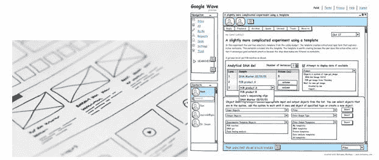
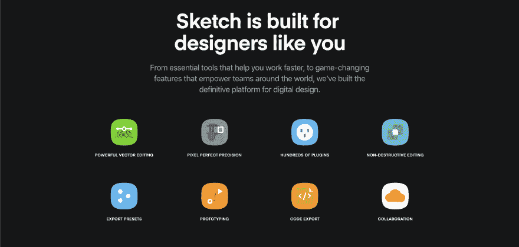
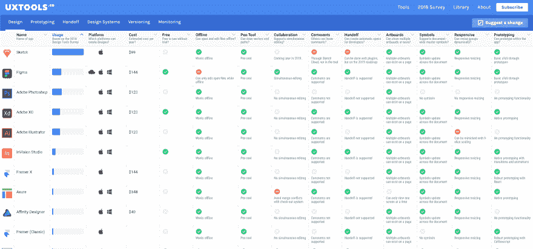
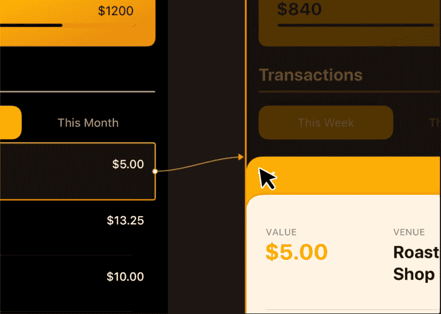

# 面向初学者的 UI/UX 工具:草图设计和原型制作

> 原文：<https://dev.to/ramotiondev/ui-ux-tools-for-beginners-designing-and-prototyping-in-sketch-1gm9>

作为一名新设计师，你可能想知道为了在新领域取得成功，你应该学习哪些工具。选择是广泛的，它可以压倒一切。虽然每个设计商店、公司和个人都有他们的最爱，素描已经成为最广泛使用的一种。继续读下去找出原因，一旦你了解了一点，看看我们的 [UI/UX 设计公司](https://www.ramotion.com/agency/ui-ux-design)提供的一些[草图模型](https://store.ramotion.com/product/sketch-mockups)。

## UI/UX 中的设计和原型

正如你可能已经了解到的，线框和原型是 UI/UX 设计交付的重要组成部分。早期的手绘想法，在纸上或只是在白板上草草写下，通常会与其他设计师合作进行审查和完善。最好的实体模型被进一步细化为更正式的线框图，无论是手工还是软件，然后应用样式和设计，最后为高保真、可测试的原型添加交互。

###### 手绘(左)和计算机绘制(右)低保真度原型的示例。(版权所有:VFS 数码设计公司，Flickr。版权条款和许可:CC BY 2.0)

尼尔森/诺曼小组的视频中的设计师们解释说，这并不总是一个线性的过程。其中一位设计师喜欢在早期与其他设计师一起在纸上或白板上工作，但他认为高保真设计最适合与利益相关者分享。想法可以更早地共享，每种方法都有其利弊。当设计不够漂亮时，利益相关者通常无法想象最终产品。另一方面，期望需要被管理，以防止涉众认为最终产品看起来太漂亮时就已经完成了。

像 Sketch 这样的工具有助于加速和简化将早期想法转化为更精细设计的过程，并进一步转化为真正的可点击原型。

## 素描是做什么的

Sketch 是专门为用户界面设计开发的。他们考虑了从早期设计到高保真原型的一切，包括与用户测试和开发团队的合作。而且，任何 Sketch 还不成熟的地方，插件都是可用的。

Sketch 的制作者特别关注他们用户的反馈，发布频繁的更新、新功能和错误修复，而无需昂贵的升级费用。未来的版本将通过增加协作功能来拓展设计者在工具中的工作方式。

## 主要特点

已经有很多很棒的特性了，正如前面提到的，开发者一直在改进。这里有一些我们最喜欢的。

*   这是一个基于矢量的工具，保持文件大小小，使调整大小顺利。
*   设计一致性可以通过符号、库、页面和其他与设计系统直接相关的元素来实现。
*   资产、代码和其他输出可以无缝导出。
*   平面设计可以被链接以快速创建和更新可点击的原型。
*   多格式预览让您看到每个设计在不同平台和不同浏览器上的外观。

## 插件和兼容工具

Sketch 建立在开放的格式上，允许开发人员创建插件和扩展来与其他流行工具集成，或者添加 Sketch 尚不具备的功能。例如:

*   zeplin——通过编译规范使开发人员的工作变得容易。
*   stark–帮助设计师为残障人士创造无障碍设计。
*   用户流——简化流程图和站点地图的创建。

## 与其他工具的比较

Sketch 是为 UI/UX 设计师设计的，而其他工具如 Photoshop 和 Illustrator 实际上是为非常不同的用途设计的(分别是编辑照片和创建线条画)。草图创建者确实记住，许多有经验的 UI/UX 设计师已经使用 PSD 和 Illustrator 多年，并且习惯了界面。因此，他们通过模仿工作区的大部分功能，使得 Sketch 的用户界面易于学习和适应。

除了这些工具，还有很多其他的选择。UXtools.co 提供了一个与其他常用设计和原型工具的很好的比较。正如你所看到的，他们的数据显示 Sketch 比其他工具更受 UX/UI 设计师的欢迎。而且理由很充分。

###### [uxtools.co/tools/design](https://uxtools.co/tools/design/)

## Photoshop 和 Illustrator

虽然在 Illustrator 这样的矢量工具中工作比 Photoshop 好得多，但由于可扩展性和其他因素，Illustrator 仍然不是一个 UX/UI 专用工具。随着时间的推移，已经添加了一些功能来实现这一目的，但它缺乏关键功能，其他功能只是简单的笨重。例如，当移动到一个可点击的原型时，- Sketch 在定义行为方面要优越得多。- Sketch 允许无限制的画板，并有一个名为 pages 的功能，可让您将它们分组到容易导航的区域。-它不会经常崩溃。

###### [sketch.com](https://www.sketch.com)

## 其他独立工具

另一个更流行的工具是 Axure。Axure 非常适合线框、简单原型和其他可交付成果，如用户旅程。但是它没有丰富的可视化工具，资源需要在另一个工具中创建，如 PSD，然后导入到资源库中。可惜它没有素描的插件。Balsamiq 是另一个伟大的线框工具。它也缺乏创造高保真视觉效果的能力。

Figma 是一个基于浏览器的工具。这是协作和原型制作的另一个好选择。不过它的定价是基于订阅的。如果安全性是一个问题，您的 IT 团队可能不允许。

## 结论

虽然有太多的工具可以让你了解所有的工具，但是 Sketch 对于初学者来说是一个很好的起点。它价格低廉，易于使用，功能丰富。带它兜一圈，看看你有什么想法。