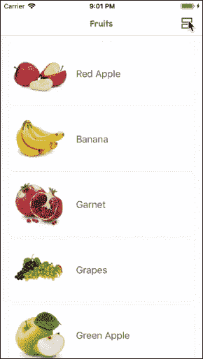
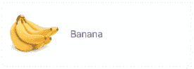
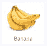
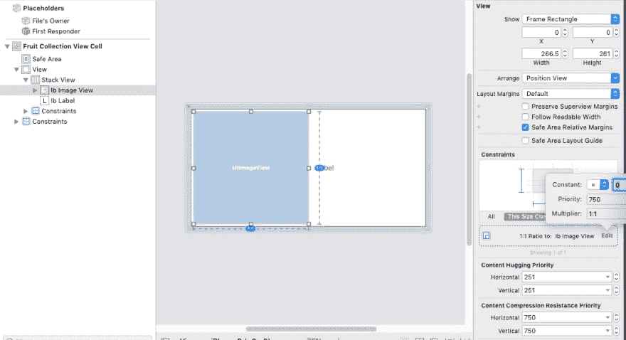

# UICollectionView 教程:动态更改演示文稿

> 原文：<https://dev.to/indeemasoftware/uicollectionview-tutorial-changing-presentation-on-the-fly-4f9o>

原文- [UICollectionView 教程](https://indeema.com/blog/uicollectionview-tutorial--changing-presentation-on-the-fly)

在本文中，我们将介绍各种元素表示方法的使用，以及它们的重用和动态变化。这里不介绍使用收藏和自动布局的基础知识。

下面是我们将得到的结果:

[](https://res.cloudinary.com/practicaldev/image/fetch/s--j6GGPIlG--/c_limit%2Cf_auto%2Cfl_progressive%2Cq_66%2Cw_880/https://indeema.cimg/articles/UICollectionView-Tutorial-Changing-presentation-on-the-fly/Copy%2520of%2520CollectionExampleGIF.gif)

在开发移动应用程序时，我们经常会遇到表格视图不够用的情况，我们需要以一种更独特和有趣的方式显示元素列表。此外，改变显示格式的能力可以成为你的应用程序的杀手锏。

使用 UICollectionView 和各种 UICollectionViewDelegateFlowLayout 协议实现，可以非常简单地实现上述所有功能。

你可以在[https://github.com/IndeemaSoftware/CustomCollectionLayout](https://github.com/IndeemaSoftware/CustomCollectionLayout)找到完整的项目代码

为了实现元素列表的不同显示格式，我们需要:

*   FruitsViewController:UICollectionView controller 类，我们将在其中存储水果数组、UICollectionView 和元素表示对象。
*   水果数据模型

    结构水果{\
    字母名称:字符串\
    字母图标:UIImage\
    }

    |

*   fruitcollectionview cell:uicollectionview cell 类

具有 UIImageView 和 UILabel 元素的单元格，用于显示水果。\
我们将在单独的。xib 文件，以便能够在其他集合视图中重用它。

正如我们从设计中看到的，可以有两个单元格替代，文本显示在图像的右侧和下方:

[ ](https://res.cloudinary.com/practicaldev/image/fetch/s--DkuiZS9o--/c_limit%2Cf_auto%2Cfl_progressive%2Cq_auto%2Cw_880/https://indeema.cimg/articles/UICollectionView-Tutorial-Changing-presentation-on-the-fly/Copy%2520of%2520Screen%2520Shot%25202019-02-17%2520at%25207.37.08%2520PM.png) [ ](https://res.cloudinary.com/practicaldev/image/fetch/s--_UWA43zX--/c_limit%2Cf_auto%2Cfl_progressive%2Cq_auto%2Cw_880/https://indeema.cimg/articles/UICollectionView-Tutorial-Changing-presentation-on-the-fly/Copy%2520of%2520Screen%2520Shot%25202019-02-17%2520at%25207.37.26%2520PM.png)

可能有完全不同类型的细胞。在这种情况下，您需要创建两个单独的对象类，并使用合适的一个。

对于这个例子，我们不需要这样的区分，1 个带有 UIStackView 的单元格就足够了。

**FruitCollectionViewCell 接口** \
[](https://res.cloudinary.com/practicaldev/image/fetch/s--2_rbJHed--/c_limit%2Cf_auto%2Cfl_progressive%2Cq_auto%2Cw_880/https://indeema.cimg/articles/UICollectionView-Tutorial-Changing-presentation-on-the-fly/Copy%2520of%2520Screen%2520Shot%25202019-02-17%2520at%25208.09.30%2520PM.png)

要创建单元界面:

1.  Add UIView.
2.  在 UIView 中，添加 UIStackView(水平)。
3.  在 UIStackView 中，添加 UIImageView 和 UILabel。
4.  对于 UILabel，设置水平和垂直内容压缩阻力优先级= 1000。
5.  对于 UIImageView，添加纵横比 1:1，并将优先级更改为 750。

我们将需要这个在水平模式下精确显示。

接下来，我们将编写以水平和垂直模式显示单元格的逻辑。

我们将单元格大小作为水平显示的主要标准。也就是说，如果有足够的空间，我们将水平显示它。作为“足够的空间”,我们认为宽度是高度的两倍，因为图像应该是正方形。

以下是该单元的代码:

类 fruitcollectionview cell:uicollectionview cell { \
静态 let reuseID = String(描述:FruitCollectionViewCell.self)\
静态 let nib = UINib(nibName: String(描述:fruitcollectionview cell . self)，bundle: nil)

@IBOutlet 私弱 var stackView: UIStackView！

@IBOutlet 私弱 var ibImageView: UIImageView！\
@IBOutlet 私有弱 var ibLabel: UILabel！

覆盖 func awake from nib(){ \
super . awake from nib()\
background color =。怀特\
clips tobounds = true \
layer . corner radius = 4 \
IB label . font = ui font . system font(of size:18)\
}

覆盖 func layout subviews(){ \
super . layout subviews()\
updateContentStyle()\
}

func update(title: String，image:ui image){ \
ibimageview . image = image \
IB label . text = title \
}

private func updateContentStyle(){ \
let isHorizontalStyle = bounds . width>2 * bounds . height \
let old axis = stack view . axis \
let newAxis:NSLayoutConstraint。Axis = isHorizontalStyle？。水平:。垂直\
守护旧轴！= newAxis else { return }

```
 stackView.axis = newAxis\
   stackView.spacing = isHorizontalStyle ? 16 : 4\
   ibLabel.textAlignment = isHorizontalStyle ? .left : .center\
   let fontTransform: CGAffineTransform = isHorizontalStyle ? .identity : CGAffineTransform(scaleX: 0.8, y: 0.8)

   UIView.animate(withDuration: 0.3) {\
       self.ibLabel.transform = fontTransform\
       self.layoutIfNeeded()\
   }\ 
```

}\
}

|

让我们进入主要部分，设置显示和切换单元格类型背后的控制器和逻辑。

我们将为所有可能的呈现状态创建 enum PresentationStyle。在导航栏中，我们还将添加一个在状态之间切换的按钮。

| class FruitsViewController:uicollectionview controller { \
私有枚举 PresentationStyle: String，CaseIterable {\
事例表\
事例默认网格\
事例自定义网格

```
 var buttonImage: UIImage {\
       switch self {\
       case .table: return  imageLiteral(resourceName: "table")\
       case .defaultGrid: return  imageLiteral(resourceName: "default_grid")\
       case .customGrid: return  imageLiteral(resourceName: "custom_grid")\
       }\
   }\ 
```

}

private var selected style:presentation style =。表{ \
didSet { updatePresentationStyle()} \
}

private var data source:[Fruit]= fruits provider . get()

override func viewDidLoad(){ \
super . viewDidLoad()\
self . collection view . register(fruitcollectionview cell . nib，\
forCellWithReuseIdentifier:fruitcollectionview cell . reuseid)\
collection view . content inset =。zero \
updatePresentationStyle()

```
 navigationItem.rightBarButtonItem = UIBarButtonItem(image: selectedStyle.buttonImage, style: .plain, target: self, action: #selector(changeContentLayout))\ 
```

}

private func updatePresentationStyle(){ \
navigation item . rightbarbuttonitem？。image = selected style . button image \
}

@ objc private func change content layout(){ \
let all cases = presentation style . all cases \
guard let index = all cases . first index(of:selected style)else { return } \
let next index =(index+1)% all cases . count \
selected style = all cases[next index]

}\
}

//MARK:UICollectionView data source & UICollectionView delegate \
extension fruitsview controller { \
override func collection view(_ collection view:UICollectionView，numberOfItemsInSection section section:Int)->Int { \
return data source . count \
}

override func collection view(_ collection view:UICollectionView，cellForItemAt index path:index path)-> UICollectionView cell { \
guard let cell = collection view . dequeuereusablecell(withreuseiidentifier:fruitcollectionview cell . reuseid，\
for: indexPath) as？fruitcollectionview cell else { \
fatal error("错误单元格")\
} \
let fruit = data source[index path . item]\
cell . update(title:fruit . name，image:fruit . icon)\
return cell \
} \
} |

```
The ***UICollectionViewDelegateFlowLayout*** protocol contains all data about display methods of collection elements. Therefore, to remove any implementations from the controller and create independent reusable elements, we create a separate implementation of this protocol for each presentation type. 
```

然而，我们应该考虑到:

1.  该协议还定义了小区选择方法(didSelectItemAt:)。
2.  有些方法和逻辑对于所有 N 个显示方法都是相同的(在我们的例子中，N=3)。

因此，我们将创建一个***collectionviewselectableitemcdelegate***协议，该协议将扩展基本的***UICollectionViewDelegateFlowLayout***协议。该协议将确定单元格选择的结束，如果需要，还将确定任何附加的属性和方法(例如，如果使用不同的显示类型，则返回单元格类型)。这将解决第一个问题。

protocol collectionviewselectableitemcdelegate:class，UICollectionViewDelegateFlowLayout { \
var didSelectItem:(_ index path:index path)->Void)？{获取设置}\
}

|

为了解决第二个问题，即逻辑复制问题，我们将创建一个包含所有公共逻辑的基类。

class defaultcollectionview delegate:ns object，collectionviewselectableitemcdelegate { \
var didSelectItem:(_ index path:index path)->Void)？\
let section insets = UIEdgeInsets(上:16.0，左:16.0，下:20.0，右:16.0)

func collectionView(_ collectionView: UICollectionView, didSelectItemAt indexPath: IndexPath) {\
didSelectItem?(indexPath)\
}

func collection view(_ collection view:UICollectionView，dihighlight item at index path:index path){ \
let cell = collection view . cellforitem(at:index path)\
单元格？。background color = ui color . clear \
}

func collection view(_ collection view:UICollectionView，didunhiglightitem at index path:index path){ \
let cell = collection view . cellforitem(at:index path)\
单元格？。background color = ui color . white \
}

}

|

在我们的例子中，公共逻辑包括选择单元格时的闭包调用以及切换到突出显示状态时的单元格背景变化。

接下来，我们将描述 3 种表示实现:表格、每行 3 个元素以及前两者的组合。

**表格展示:**

类 tabledcontentcollectionview delegate:defaultcollectionview delegate { \
//MARK:-UICollectionViewDelegateFlowLayout \
func collection view(_ collectionView:UICollectionView layout:UICollectionView layout，
size for item at index path:index path)->CGSize { \
let padding space = section insets . left+section insets . right \
let width peritem = collection view

func collection view(_ collection view:UICollectionView，\
layout collectionView layout:UICollectionView layout，\
insetForSectionAt section:Int)->UIEdgeInsets { \
returnsectioninsets \
}

func collection view(_ collection view:UICollectionView，\
layout collectionView layout:UICollectionView layout，\
minimumlinespacingforsection at section:Int)->CG float { \
return 10 \
} \
}

|

**每行显示 3 个元素:**

class defaultgriddcontentcollectionview delegate:defaultcollectionview delegate { \
private let items perrow:CG float = 3 \
private let minimu itemspacing:CG float = 8

//MARK:-UICollectionViewDelegateFlowLayout \
func collection view(_ collection view:UICollectionView，
layout collectionView layout:UICollectionView layout，
size for item at index path:index path)->CGSize { \
let padding space = section insets . left+section insets . right+minimuitemspacing *(items perrow-1)
let available width = collection view . bounds . width-padding space

func collection view(_ collection view:UICollectionView，\
layout collectionView layout:UICollectionView layout，\
insetForSectionAt section:Int)->UIEdgeInsets { \
returnsectioninsets \
}

func collection view(_ collection view:UICollectionView，\
layout collectionView layout:UICollectionView layout，\
minimumlinespacingforsection at section:Int)>CG float { \
return 20 \
}

func collection view(_ collection view:UICollectionView，\
layout collectionView layout:UICollectionView layout，\
minimumInteritemSpacingForSectionAt section:Int)->CG float { \
return minimuitemspacing \
} \
}

|

**表格和每行 3 个演示选项的组合:**

class customgriddecontedcontentcollectionview delegate:defaultcollectionview delegate { \
private let items perrow:CG float = 3 \
private let minimu itemspacing:CG float = 8

//MARK:-UICollectionViewDelegateFlowLayout \
func collection view(_ collection view:UICollectionView，
layout collectionView layout:UICollectionView layout，
size for item at index path:index path)->CGSize { \
let itemSize:CGSize \
if index path . item % 4 = = 0 { \
let item width = collection view . bounds . width-(section sets . left+section insets . right)

func collection view(_ collection view:UICollectionView，\
layout collectionView layout:UICollectionView layout，\
insetForSectionAt section:Int)->UIEdgeInsets { \
returnsectioninsets \
}

func collection view(_ collection view:UICollectionView，\
layout collectionView layout:UICollectionView layout，\
minimumlinespacingforsection at section:Int)>CG float { \
return 20 \
}

func collection view(_ collection view:UICollectionView，\
layout collectionView layout:UICollectionView layout，\
minimumInteritemSpacingForSectionAt section:Int)->CG float { \
return minimuitemspacing \
} \
}

|

在最后一个阶段，我们向控制器添加显示数据，并为集合设置适当的委托。

**重要通知:**由于集合的委托比较弱，所以在控制器中，我们需要对呈现对象有一个强引用。

在控制器中，让我们创建一个包含所有可用表示类型的字典:

private var style delegates:[presentation style:collectionviewselectableitemcdelegate]= { \
let result:[presentation style:collectionviewselectableitemcdelegate]=[\
。tabledcontentcollectionview delegate()，\
。default grid:defaultgriddecontedcontentcollectionview delegate()，\
。custom grid:customgriddcontentcollectionview delegate()，\
]\
result . values . foreach { \
$ 0 . didselectitem = { _ in \
print(" Item selected ")\
} \
} \
返回结果\
}()

|

此外，对于**updatePresentationStyle()**方法，让我们添加集合委托的动画更改。

```
 collectionView.delegate = styleDelegates[selectedStyle]\
   collectionView.performBatchUpdates({\
       collectionView.reloadData()\
   }, completion: nil) 
```

|
|\
|

这就是我们制作元素从一种状态到另一种状态的动画所需的全部内容；)

[](https://res.cloudinary.com/practicaldev/image/fetch/s--j6GGPIlG--/c_limit%2Cf_auto%2Cfl_progressive%2Cq_66%2Cw_880/https://indeema.cimg/articles/UICollectionView-Tutorial-Changing-presentation-on-the-fly/Copy%2520of%2520CollectionExampleGIF.gif)

使用这种方法，我们能够在任何屏幕上以任何方式显示元素，并在呈现状态之间动态切换。最重要的一点是，代码是松散耦合的、可重用的和可伸缩的。

你可以在[https://github.com/IndeemaSoftware/CustomCollectionLayout](https://github.com/IndeemaSoftware/CustomCollectionLayout)找到完整的项目代码