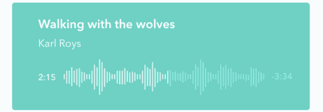
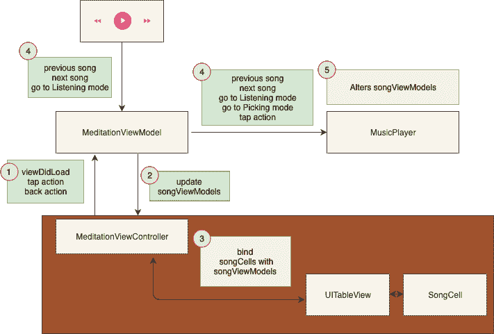

# UITableView 与 MVVM 的业务逻辑管理

> 原文：<https://dev.to/elpassion/uitableview-vs-managing-business-logic-in-mvvm-24ji>

在 iOS 开发中越来越受欢迎，考虑到上个月的❤️，这是我最喜欢的

最近我完成了🧘‍♂️的放松的点滴镜头

今天，我想和你分享我是如何解决`song management functionality in MVVM`世界的细节。我希望你会发现它很有用，并在你心爱的 iOS 开发中找到灵感🤠

下面你可以看到来自`music player`的 iPhone 模拟器录音

| 播放器演示 |
| --- |
|  |

## 型号

如您所见，有两种屏幕类型:

*   采摘
*   倾听

总共有四种不同的 SongCell 模式:

| 。采摘(。未选中) | 。采摘(。已选择) | 。听力(。可播放) | 。听力(。正在播放) |
| --- | --- | --- | --- |
|  |  |  |  |

将它们结合在一起，我们将建立如下结构:

```
enum Picking: Equatable {
    case selected, unselected
}

enum Listening: Equatable {
    case playable, playing, hidden
}

enum SongMode: Equatable {
    case picking(Picking)
    case listening(Listening)
} 
```

还有一个`.listening(.hidden)`的附加模式。在监听模式下，所有未选中的单元格都不可见。

## viewmode

在 MVVM 世界中，每个子视图都有相应的视图模型。在我们的例子中，每个 SongCell 都有自己的 SongViewModel。看一下它的界面:

```
 protocol SongViewModeling: class {
    var title: String { get }
    var subtitle: String { get }
    var time: String { get }
    var songMode: SongMode { get set } // 1
    var songModeHandler: SongModeHandling { get } //2
} 
```

我们应该仔细研究两个有趣的属性:

`1` -我们将使用该模型进行单元配置

`2` - [SongModeHandling](https://github.com/elpassion/meditation-ios-demo/blob/master/MeditationAppShowcase/MeditationAppShowcase/Screens/Meditation/SongPicker/SongModeEmitter.swift) 是一个观察者模式协议。更新 songMode 时，songModeHandler 应发出当前模式。我们将使用它来更新可见的单元格状态。重复使用单元☝️时，记得取消订阅

## 将视图模型与单元格绑定

剩下的最后一部分是将 [songViewModels](https://github.com/elpassion/meditation-ios-demo/blob/master/MeditationAppShowcase/MeditationAppShowcase/Screens/Meditation/SongPicker/SongViewModel.swift) 与其对应的 [songCells](https://github.com/elpassion/meditation-ios-demo/blob/master/MeditationAppShowcase/MeditationAppShowcase/Screens/Meditation/SongPicker/SongViewCell.swift) 绑定在一起。我们将在[的冥想视图控制器](https://github.com/elpassion/meditation-ios-demo/blob/master/MeditationAppShowcase/MeditationAppShowcase/Screens/Meditation/MeditationViewController.swift)中实现该逻辑，因为它已经是 tableView 的代表和数据源。下面是一个简化的 MVVM 架构流程:

| 简化的 MVVM 架构流程 |
| --- |
|  |

`1` - [冥想视图控制器](https://github.com/elpassion/meditation-ios-demo/blob/master/MeditationAppShowcase/MeditationAppShowcase/Screens/Meditation/MeditationViewController.swift)更新其关于视图生命周期和 UI 动作的[冥想视图模型](https://github.com/elpassion/meditation-ios-demo/blob/master/MeditationAppShowcase/MeditationAppShowcase/Screens/Meditation/MeditationViewModel.swift)

`2` - [冥想视图模型](https://github.com/elpassion/meditation-ios-demo/blob/master/MeditationAppShowcase/MeditationAppShowcase/Screens/Meditation/MeditationViewModel.swift)用[歌曲视图模型](https://github.com/elpassion/meditation-ios-demo/blob/master/MeditationAppShowcase/MeditationAppShowcase/Screens/Meditation/SongPicker/SongViewModel.swift)更新[冥想视图控制器](https://github.com/elpassion/meditation-ios-demo/blob/master/MeditationAppShowcase/MeditationAppShowcase/Screens/Meditation/MeditationViewController.swift)

`3` - [冥想视图控制器](https://github.com/elpassion/meditation-ios-demo/blob/master/MeditationAppShowcase/MeditationAppShowcase/Screens/Meditation/MeditationViewController.swift)将[歌曲视图模型](https://github.com/elpassion/meditation-ios-demo/blob/master/MeditationAppShowcase/MeditationAppShowcase/Screens/Meditation/SongPicker/SongViewModel.swift)与[歌曲单元](https://github.com/elpassion/meditation-ios-demo/blob/master/MeditationAppShowcase/MeditationAppShowcase/Screens/Meditation/SongPicker/SongViewCell.swift)
绑定

```
func configure(cell: SongViewCell, with viewModel: SongViewModeling) {
        cell.interactiveView.songView.titleLabel.text = viewModel.title
        cell.interactiveView.songView.subtitleLabel.text = viewModel.subtitle
        cell.interactiveView.songView.timeLabel.text = viewModel.time
        cell.update(mode: viewModel.songMode, animated: false)
        cell.disposable = viewModel.songModeHandler.addHandler(target: cell,
                                                               handler: SongViewCell.update)
    } 
```

`4` - [冥想视图模型](https://github.com/elpassion/meditation-ios-demo/blob/master/MeditationAppShowcase/MeditationAppShowcase/Screens/Meditation/MeditationViewModel.swift)管理业务逻辑。它监听 [ActionViewModel](https://github.com/elpassion/meditation-ios-demo/blob/master/MeditationAppShowcase/MeditationAppShowcase/Screens/ActionController/ActionViewModel.swift) 事件并将工作委托给 [MusicPlayer](https://github.com/elpassion/meditation-ios-demo/blob/master/MeditationAppShowcase/MeditationAppShowcase/Screens/Meditation/MusicPlayer.swift)

`5` - [MusicPlayer](https://github.com/elpassion/meditation-ios-demo/blob/master/MeditationAppShowcase/MeditationAppShowcase/Screens/Meditation/MusicPlayer.swift) 包含改变歌曲视图模式的聚合方法——无状态实体

## 总结

在 MVVM 架构中，我们将视图控制器和视图都命名为视图，它不应该有任何业务逻辑，而只是监听它的视图模型命令。在我们的冥想示例中，视图([冥想视图控制器](https://github.com/elpassion/meditation-ios-demo/blob/master/MeditationAppShowcase/MeditationAppShowcase/Screens/Meditation/MeditationViewController.swift))完全没有业务逻辑。它只有视图逻辑，比如构建子视图并用子视图模型( [songViewModels](https://github.com/elpassion/meditation-ios-demo/blob/master/MeditationAppShowcase/MeditationAppShowcase/Screens/Meditation/SongPicker/SongViewModel.swift) )来配置它们

这样，所有的业务逻辑都可以提取到 ViewModel ( [沉思录 ViewModel](https://github.com/elpassion/meditation-ios-demo/blob/master/MeditationAppShowcase/MeditationAppShowcase/Screens/Meditation/MeditationViewModel.swift) )及其助手中，使代码可读，并划分到单个责任实体中:

*   歌曲视图模型管理器[音乐播放器](https://github.com/elpassion/meditation-ios-demo/blob/master/MeditationAppShowcase/MeditationAppShowcase/Screens/Meditation/MusicPlayer.swift)
*   屏幕状态操作员[沉思屏幕状态操作员](https://github.com/elpassion/meditation-ios-demo/blob/master/MeditationAppShowcase/MeditationAppShowcase/Screens/Meditation/MeditationScreenStateOperator.swift)

有关更多详情，请参见 [meditaion-ios-demo](https://github.com/elpassion/meditation-ios-demo)

尽情享受吧！❤️

## 执照

版权所有 2019 [EL Passion](https://www.elpassion.com)