# 了解跨来源资源共享(CORS)

> 原文：<https://dev.to/miguelmota/understanding-cross-origin-resource-sharing-cors-2i3e>

*跨源资源共享* ( [CORS](https://en.wikipedia.org/wiki/Cross-origin_resource_sharing) )是一种从一个地方向另一个地方发出 HTTP 请求的方式。历史上，浏览器只允许来自同一个域的 JavaScript 请求，同源策略防止跨源类型的请求。

CORS 向服务器授权谁可以发出请求以及允许什么类型的请求。浏览器是执行 CORS 策略的客户端。

服务器可以配置:

*   允许哪些域发出 HTTP 请求
*   允许哪些 HTTP 方法(GET、POST、PUT、DELETE 等)。
*   请求中允许哪些标头。
*   请求是否可以包含 cookie 信息。
*   客户端可以读取哪些响应头。

介绍 Intro

> CORS 允许不同主机上的客户端访问服务器上的受限资源。

#### 在本教程中，除了`Access-Control-Allow-Origin: *`之外，我们将涵盖所有你需要知道的关于 CORS 的事情。是的，有很多东西要学！

## 同源 vs 跨源

出于简化的目的，一个*同源*请求就像两个人在一所房子里交流。

[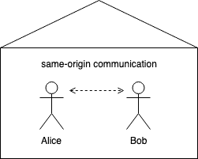](https://res.cloudinary.com/practicaldev/image/fetch/s--r2CpIxzE--/c_limit%2Cf_auto%2Cfl_progressive%2Cq_auto%2Cw_880/https://thepracticaldev.s3.amazonaws.com/i/t13focfa7t6umqlwx3ve.png)

爱丽丝和鲍勃之间没有交流障碍，因为他们住在同一栋房子里(同源)。

**对**

一个*跨源*请求就像有两个不同的房子，一个房子里的人和另一个房子里的人通信。

[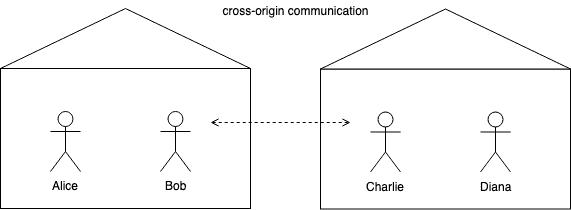](https://res.cloudinary.com/practicaldev/image/fetch/s--pNpq1EQc--/c_limit%2Cf_auto%2Cfl_progressive%2Cq_auto%2Cw_880/https://thepracticaldev.s3.amazonaws.com/i/imfzw6o5hb8isupbz92i.png)

因为 Bob 想要与住在不同房子的 Charlie 通信，所以这被认为是跨起源通信，因为这些房子住在不同的起源。由于 Bob 发起呼叫，那么 Charlie 所在的房子需要批准 Bob 的呼叫。

TLDR；

> 同源请求是指从一台主机向同一台主机发出请求，而跨源请求是指从一台主机向另一台主机发出请求。

### 同源请求

举个例子，我们先做一个同源请求。我们将创建一个简单的服务器，为客户机提供一个端点，并提供一个 HTML 页面。为了简单起见，在本教程中，我们将使用 Node.js 和 [express](https://expressjs.com/) 服务器。

文件`server.js`

```
const express = require('express')
const app = express()
const port = 8000

app.use(express.static(__dirname))
app.get('/api/posts', (req, res) => {
  res.json([
    {id: 1, content: 'foo'},
    {id: 1, content: 'bar'},
  ])
})
app.listen(port, () => {
  console.log(`listening on port ${port}`)
}) 
```

Enter fullscreen mode Exit fullscreen mode

文件`index.html`

```
 <!DOCTYPE html>
<html lang="en-US">
<head>
  <meta charset="UTF-8">
  
</head>
<body>
  <script>
    (async () => {
      const res = await fetch('http://localhost:8000/api/posts')

      console.log(await res.json())
    })()
  </script>
</body>
</html> 
```

Enter fullscreen mode Exit fullscreen mode

```
$ node server.js
listening on port 8000 
```

Enter fullscreen mode Exit fullscreen mode

如果你访问 [http://localhost:8000/](http://localhost:8000/) 你可以看到请求成功了。没有什么疯狂和期待的，因为它来自同一个起源。

[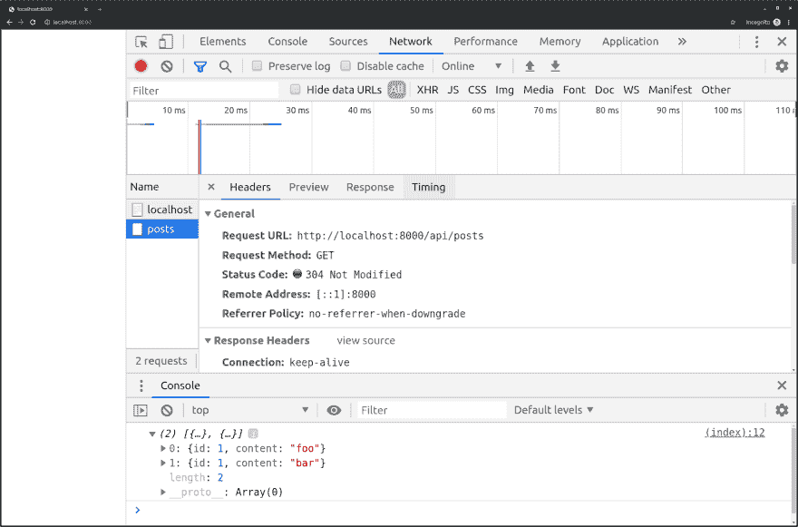](https://res.cloudinary.com/practicaldev/image/fetch/s--PU61ApFt--/c_limit%2Cf_auto%2Cfl_progressive%2Cq_auto%2Cw_880/https://thepracticaldev.s3.amazonaws.com/i/im6fdmddwo2efdawwpkp.png)

### 跨产地请求

现在，为了展示一个跨源请求，让我们启动一个新的服务器来服务在不同端口监听的 HTML 文件。

文件`server2.js`

```
const express = require('express')
const app = express()
const port = 9000

app.use(express.static(__dirname))
app.listen(port, () => {
  console.log(`listening on port ${port}`)
}) 
```

Enter fullscreen mode Exit fullscreen mode

```
$ node server.js
listening on port 8000 
```

Enter fullscreen mode Exit fullscreen mode

```
$ node server2.js
listening on port 9000 
```

Enter fullscreen mode Exit fullscreen mode

让我们看看在 [http://localhost:9000/](http://localhost:9000/) 访问第二台服务器的网页时会发生什么

[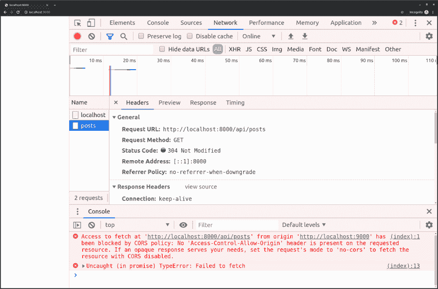](https://res.cloudinary.com/practicaldev/image/fetch/s--oAxvQSsl--/c_limit%2Cf_auto%2Cfl_progressive%2Cq_auto%2Cw_880/https://thepracticaldev.s3.amazonaws.com/i/zn3ea6vxrxjn5vunipn1.png)

浏览器抛出错误:

```
Access to fetch at 'http://localhost:8000/api/posts' from origin 'http://localhost:9000' has been blocked by CORS policy: No 'Access-Control-Allow-Origin' header is present on the requested resource. If an opaque response serves your needs, set the request's mode to 'no-cors' to fetch the resource with CORS disabled. 
```

Enter fullscreen mode Exit fullscreen mode

为了演示为什么会发生这种情况，让我们用一个简单的聊天例子来看看浏览器和服务器是如何通信的。

**浏览器:**" hello server**[http://127 . 0 . 0 . 1:8000](http://127.0.0.1:8000)**请在/api/posts 给我数据，让我知道**[http://localhost:9000](http://localhost:9000)**的客户端是否可以访问。下面是 HTTP 消息:“

```
Get /api/posts HTTTP1.1
User-Agent: Chrome
Host: 127.0.0.1:8000
Accept: */*
Origin: http://localhost:9000 
```

Enter fullscreen mode Exit fullscreen mode

**服务器:**“这里是数据，客户端无法访问，因为我没有原点**[http://localhost:9000](http://localhost:9000)**作为允许访问数据的原点。”

```
HTTP/1.1 200 OK 
```

Enter fullscreen mode Exit fullscreen mode

服务器用数据进行响应，但是浏览器不会把数据交给 JavaScript 客户机，除非服务器说基于它们的来源客户机是允许的。

服务器必须做的是设置`Access-Control-Allow-Origin`响应头，以允许跨源请求。

现在，让我们再次尝试在服务器上设置 CORS，为每个请求添加一个新的头。我们将在`Access-Control-Allow-Origin`中添加一个通配符`*`值，告诉浏览器任何来源都可以访问资源。

文件`server.js`

```
const express = require('express')
const app = express()
const port = 8000

app.use(express.static(__dirname))
app.use((req, res, next) => {
  res.set('Access-Control-Allow-Origin', '*')
  next()
})
app.get('/api/posts', (req, res) => {
  res.json([
    {id: 1, content: 'foo'},
    {id: 1, content: 'bar'},
  ])
})
app.listen(port, () => {
  console.log(`listening on port ${port}`)
}) 
```

Enter fullscreen mode Exit fullscreen mode

重启服务器:

```
$ node server.js
listening on port 8000 
```

Enter fullscreen mode Exit fullscreen mode

```
$ node server2.js
listening on port 9000 
```

Enter fullscreen mode Exit fullscreen mode

旁注:`server2.js`在本教程中不会改变，所以你可以让它运行。从现在开始我们只改变`server.js`。

好，现在让我们看看当我们在 [http://localhost:9000/](http://localhost:9000/) 访问第二台服务器的网页时会发生什么

[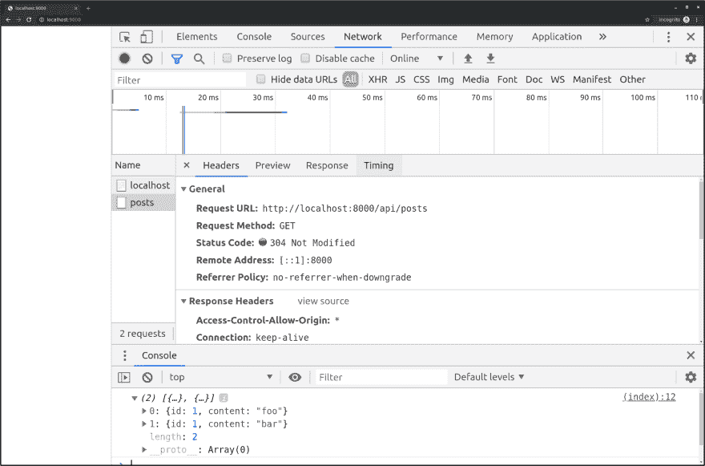](https://res.cloudinary.com/practicaldev/image/fetch/s--vBIIuR-E--/c_limit%2Cf_auto%2Cfl_progressive%2Cq_auto%2Cw_880/https://thepracticaldev.s3.amazonaws.com/i/eyo6rdkn0bip28n85iv8.png)

为了演示它现在为什么工作，让我们再次用一个简单的聊天例子来看看浏览器和服务器是如何通信的。

**浏览器:**" hello server**[http://127 . 0 . 0 . 1:8000](http://127.0.0.1:8000)**请在/api/posts 给我数据，让我知道**[http://localhost:9000](http://localhost:9000)**的客户端是否可以访问。下面是 HTTP 消息:“

```
Get /api/posts HTTTP1.1
User-Agent: Chrome
Host: 127.0.0.1:8000
Accept: */*
Origin: http://localhost:9000 
```

Enter fullscreen mode Exit fullscreen mode

**服务器:**“这是数据，是的，任何客户端都可以访问:“

```
HTTP/1.1 200 OK
Access-Control-Allow-Origin: * 
```

Enter fullscreen mode Exit fullscreen mode

## 访问-控制-允许-起源

最重要的 CORS 标题是:

*   `Origin`请求头
*   `Access-Control-Allow-Origin`响应报头

原点是主机，由协议、主机名和端口组成:

```
Origin = protocol + hostname + port 
```

Enter fullscreen mode Exit fullscreen mode

示例协议:

*   超文本传送协议（Hyper Text Transport Protocol 的缩写）
*   https

主机名示例:

*   本地主机
*   example.com
*   foo.example.com

示例端口:

*   Eighty
*   Four hundred and forty-three
*   Eight thousand

示例来源:

*   [http://localhost:3000](http://localhost:3000)
*   [https://example.com](https://example.com)
*   [https://example.com:8000](https://example.com:8000)
*   [https://foo.example.com:8000](https://foo.example.com:8000)

当不能确定浏览器来源时，例如当使用绝对文件路径如`file:///Users/alice/wwww/index.html`时，值`null`可以用作`Origin`的有效值

浏览器不允许改变源头，否则客户端可以伪装成其他人。

`Access-Control-Allow-Origin`头的值可以是通配符或原始值。

有效标题示例:

```
Access-Control-Allow-Origin: *
Access-Control-Allow-Origin: http://localhost:8000
Access-Control-Allow-Origin: http://example.com
Access-Control-Allow-Origin: null 
```

Enter fullscreen mode Exit fullscreen mode

您只能有一个值，因此像这样有多个值是无效的:

```
# Not valid values, can't have multiple!
Access-Control-Allow-Origin: http://localhost:8000, http://example.com 
```

Enter fullscreen mode Exit fullscreen mode

为了支持多个来源，您必须用发出请求的当前来源动态替换头值。

例如，您将首先检查来源是否在白名单中，然后设置头:

```
if (whitelist.contains(req.get('origin')) {
  res.set('Access-Control-Allow-Origin', req.get('origin'))
} 
```

Enter fullscreen mode Exit fullscreen mode

对于本地主机条目，您可以使用正则表达式来匹配所有端口号，例如

正则表达式`/^http://\/\/localhost(:\d+)?$/i`匹配

```
http://localhost
http://localhost:1
http://localhost:10
http://localhost:100
http://localhost:1000 
http://localhost:2000 etc 
```

Enter fullscreen mode Exit fullscreen mode

您可以使用硬编码的白名单、正则表达式或数据库查询。黑名单聊胜于无，但不推荐。

原产地验证的步骤:

*   从`Origin`标题读取数值
*   使用白名单验证来源
*   将原点设置为`Access-Control-Allow-Origin`的值

如果你不介意原点未设置，你可以将`null`添加到你的白名单中。

```
Access-Control-Allow-Origin: null 
```

Enter fullscreen mode Exit fullscreen mode

TLDR；

> **使用`Access-Control-Allow-Origin`头告诉浏览器允许哪些来源访问数据。**

## 飞行前请求

对于某些 HTTP 方法，浏览器通过所谓的 *[预检请求](https://developer.mozilla.org/en-US/docs/Web/HTTP/CORS#Preflighted_requests)* 来请求许可。如果浏览器批准了来自预检请求的响应，则发出实际请求。如果浏览器不批准来自预检请求的响应，那么实际的请求将永远不会发出。

触发预检请求的 HTTP 方法有:

*   `PUT`
*   `PATCH`
*   `DELETE`
*   `TRACE`

不触发预检请求的 HTTP 方法被称为 *[简单请求](https://developer.mozilla.org/en-US/docs/Web/HTTP/CORS#Simple_requests)* ，它们是:

*   `HEAD`
*   `GET`
*   `POST`

预检请求是在主请求之前从浏览器向服务器发出的一个小请求，包含使用哪种 http 方法以及是否存在任何 HTTP 头等信息。服务器通过返回 2xx HTTP 状态代码或返回一个指示客户端不应该发送实际请求的错误来确定浏览器是否应该发送实际请求。

**预检请求保护服务器不接收它们可能不想要的跨来源请求。**如果服务器支持 CORS，它将知道如何处理预检请求并做出相应的响应。如果服务器不理解或不关心 CORS，那么服务器不会发送正确的预检响应。

预检请求使用`OPTIONS` HTTP 方法。

**在下列情况下触发预检:**

*   客户端请求使用的方法不同于`GET`、`POST`或`HEAD`(它们被称为*简单方法*)

*   客户端使用以下值以外的值设置`Content-Type`请求报头:

    *   `application/x-www-form-urencoded`
    *   `multipart/form-data`
    *   `text/plain`
*   客户端设置附加请求头，这些请求头不是:

    *   `Accept`
    *   `Accept-Language`
    *   `Content-Language`

预检响应应该在`200`范围内(HTTP 代码 204 是标准的)并且不包含正文。包含主体也会让开发人员感到困惑。

让我们提出一个`DELETE`请求来演示一个飞行前请求。首先，我们将检查该请求是否为飞行前请求。如果是，则返回 HTTP `204 No Content`状态码。

文件`server.js`

```
const express = require('express')
const app = express()
const port = 8000

const isPreflight = (req) => {
  return (
    req.method === 'OPTIONS' &&
    req.headers['origin'] &&
    req.headers['access-control-request-method']
  )
}

app.use(express.static(__dirname))
app.use((req, res, next) => {
  res.set('Access-Control-Allow-Origin', '*')

  if (isPreflight(req)) {
    res.status(204).end()
    return
  }

  next()
})
app.get('/api/posts', (req, res) => {
  res.json([
    {id: 1, content: 'foo'},
    {id: 1, content: 'bar'},
  ])
})
app.delete('/api/posts', (req, res) => {
  res.json({success: true})
})
app.listen(port, () => {
  console.log(`listening on port ${port}`)
}) 
```

Enter fullscreen mode Exit fullscreen mode

文件`index.html`

```
<!DOCTYPE html>
<html lang="en-US">
<head>
  <meta charset="UTF-8">
  
</head>
<body>
  <script>
    (async () => {
      const res = await fetch('http://localhost:8000/api/posts', {
        method: 'DELETE'
      })

      console.log(await res.json())
    })()
  </script>
</body>
</html> 
```

Enter fullscreen mode Exit fullscreen mode

重启服务器:

```
$ node server.js
listening on port 8000 
```

Enter fullscreen mode Exit fullscreen mode

```
$ node server2.js
listening on port 9000 
```

Enter fullscreen mode Exit fullscreen mode

现在让我们看看当我们在 [http://localhost:9000/](http://localhost:9000/) 访问第二台服务器的网页时会发生什么

[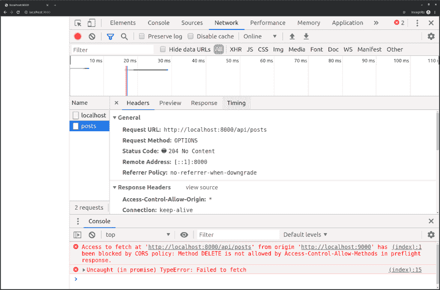](https://res.cloudinary.com/practicaldev/image/fetch/s--au3bOvlP--/c_limit%2Cf_auto%2Cfl_progressive%2Cq_auto%2Cw_880/https://thepracticaldev.s3.amazonaws.com/i/ebwb7zz05vqbizeq1rr2.png)

我们可以看到错误消息说 CORS 不允许使用方法`DELETE`:

```
Access to fetch at 'http://localhost:8000/api/posts' from origin 'http://localhost:9000' has been blocked by CORS policy: Method DELETE is not allowed by Access-Control-Allow-Methods in preflight response. 
```

Enter fullscreen mode Exit fullscreen mode

请记住，像`GET`、`POST`或`HEAD`这样的简单请求不会启动预检请求，它们是 CORS 自动允许的方法，但是像`DELETE`或`PUT`这样的方法需要服务器明确允许。

为了允许客户端执行`DELETE`方法，我们需要在预检请求中添加响应头`Access-Control-Allow-Methods`。

文件`server.js`

```
app.use((req, res, next) => {
  res.set('Access-Control-Allow-Origin', '*')

  if (isPreflight(req)) {
    res.set('Access-Control-Allow-Methods', 'DELETE') // Add this!
    res.status(204).end()
    return
  }

  next()
}) 
```

Enter fullscreen mode Exit fullscreen mode

现在,`DELETE`请求按预期工作:

[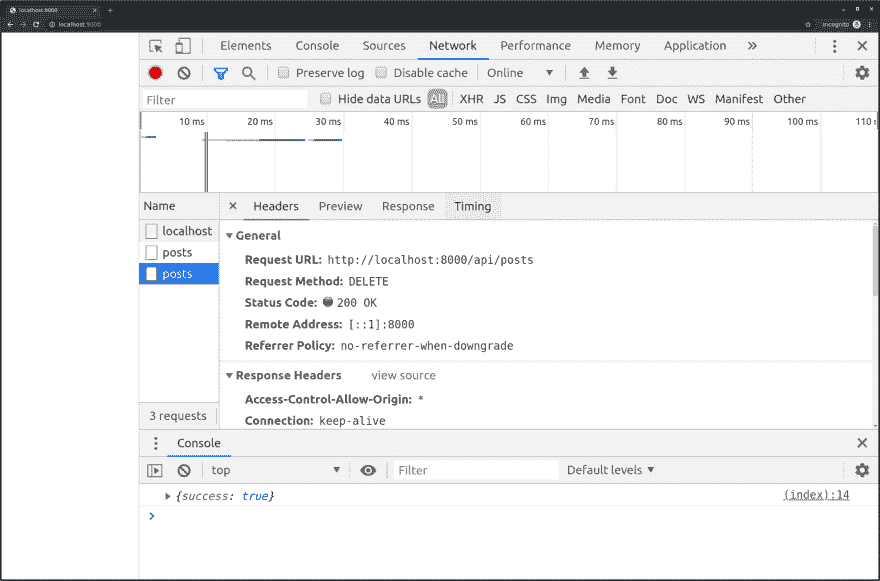](https://res.cloudinary.com/practicaldev/image/fetch/s--N8AMOdXb--/c_limit%2Cf_auto%2Cfl_progressive%2Cq_auto%2Cw_880/https://thepracticaldev.s3.amazonaws.com/i/y24d3v1v33k2dectegp3.png)

注意两个截图中不同数量的请求。

*   在第一个截图中，飞行前请求失败，因此实际的`DELETE`请求从未发出，仅创建了一个请求。

[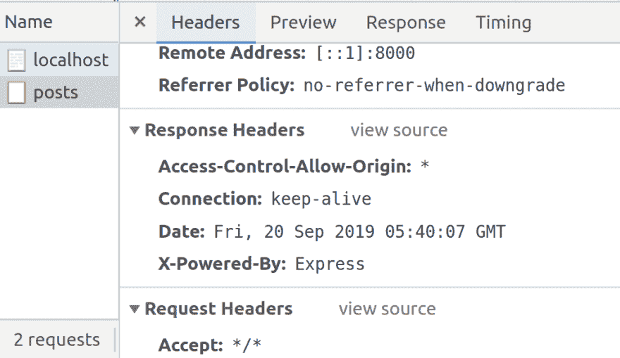](https://res.cloudinary.com/practicaldev/image/fetch/s--GsRKl4iC--/c_limit%2Cf_auto%2Cfl_progressive%2Cq_auto%2Cw_880/https://thepracticaldev.s3.amazonaws.com/i/gr7jcon19nzvsh86tgf1.png)

*   在第二个屏幕截图中，飞行前请求成功，因此发出了实际的`DELETE`请求，创建了 2 个请求。

[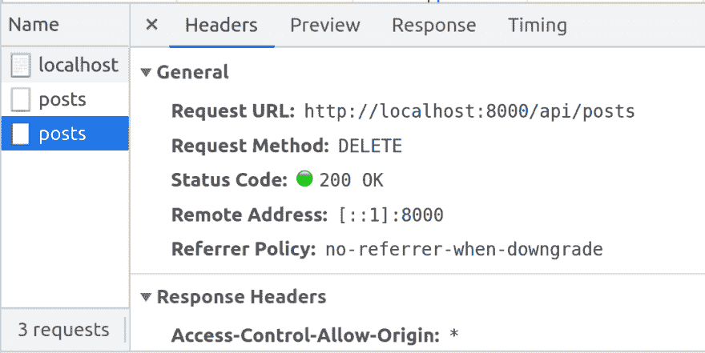](https://res.cloudinary.com/practicaldev/image/fetch/s--cQ8X0UjB--/c_limit%2Cf_auto%2Cfl_progressive%2Cq_auto%2Cw_880/https://thepracticaldev.s3.amazonaws.com/i/9fod10sj5yor5kqrezar.png)

**拒绝预检请求:**

*   省略`Access-Control-Allow-Origin`标题。
*   在`Access-Control-Allow-Methods`中返回一个与`Access-Control-Request-Method`标题不匹配的值。
*   如果飞行前请求有一个`Access-Control-Request-Header`
    *   省略`Access-Control-Allow-Headers`标题。
    *   在`Access-Control-Allow-Headers`头中返回一个与`Access-Control-Request-Headers`头不匹配的值。

飞行前响应和实际响应都需要`Access-Control-Allow-Origin`头。

浏览器可以将来自第一个请求的预检响应缓存到来自该源的资源，以避免总是发送额外的查询。

预检是无状态的，这意味着实际的请求不包含任何与预检请求相关的信息。

预检请求永远不会跟随重定向。如果尝试发出预检请求，但服务器尝试重定向，则预检请求将失败。您可以手动检查`Location`头，看看服务器试图将您重定向到哪里。只有简单的 CORS 请求(GET、POST、HEAD)会跟随重定向。

如果重定向的是同一个服务器，那么`Origin`头会保持不变，否则会设置为`null`。

TLDR；

> **预检请求根据服务器允许的内容确定是否允许客户端发出实际请求。该请求必须是一个`OPTIONS`方法，具有`Access-Control-Request-Method`头(如`DELETE`或`PUT`)，并包含被视为预检请求的`Origin`头。**

## 访问-控制-请求-方法

`Access-Control-Request-Method`是一个请求头值，请求使用特定 HTTP 方法的许可。当客户端发送一个非简单的方法请求时，这个头由浏览器设置。

`Access-Control-Request-Method`仅在飞行前请求中发送。

下面的屏幕截图显示了飞行前请求中的`Access-Control-Request-Method`请求标题，以及我们之前执行`DELETE`请求时的飞行前响应中的响应标题`Access-Control-Allow-Methods`。

[](https://res.cloudinary.com/practicaldev/image/fetch/s--G4W7dY9s--/c_limit%2Cf_auto%2Cfl_progressive%2Cq_auto%2Cw_880/https://thepracticaldev.s3.amazonaws.com/i/zkrggkd37s991aqv54hx.png)

使用准确的预检标题来保护您的服务器免受意外请求的影响。如果你的服务器只允许`GET`请求，那么不要在`Access-Control-Allow-Methods`头中放入其他头。

TLDR；

> **浏览器将在预检请求中发送`Access-Control-Request-Method`请求头，让服务器知道它打算在实际请求中使用所请求的方法。如果服务器允许该方法，那么浏览器将发出实际的请求。**

## 访问-控制-允许-方法

`Access-Control-Allow-Methods`用于飞行前请求，告诉客户哪些方法是 CORS 允许的。

例如，使用`Access-Control-Allow-Methods: DELETE`头表示服务器允许客户端向 URL 发出`DELETE`请求。

`Access-Control-Allow-Methods`请求头可以有多个值，例如:

```
Access-Control-Allow-Methods: HEAD, GET, POST, PUT, PATCH, DELETE 
```

Enter fullscreen mode Exit fullscreen mode

请记住，`GET`、`POST`和`HEAD`是简单的方法，总是被允许的，所以在标题中使用它们是多余和不必要的，但是有些人喜欢在标题中使用它们，因为这样对他们来说更清楚，也避免了混淆。

显示允许的 PUT 和 DELETE(除了简单方法之外)的示例:

[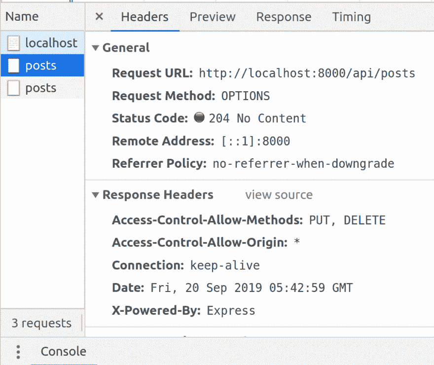](https://res.cloudinary.com/practicaldev/image/fetch/s--NvyVOiWL--/c_limit%2Cf_auto%2Cfl_progressive%2Cq_auto%2Cw_880/https://thepracticaldev.s3.amazonaws.com/i/nozz6gpbg1kmr5y0j0ks.png)

TLDR；

> **服务器应该用`Access-Control-Allow-Methods`响应头进行响应，让浏览器知道允许客户端使用哪些 HTTP 方法。**

## 访问-控制-请求-报头

在预检请求中发送`Access-Control-Request-Headers`请求报头，让服务器知道客户端将在实际响应中发送哪些报头。

让我们试着向服务器发送一个自定义头。

文件`index.html`

```
<!DOCTYPE html>
<html lang="en-US">
<head>
  <meta charset="UTF-8">
  
</head>
<body>
  <script>
    (async () => {
      const res = await fetch('http://localhost:8000/api/posts', {
        headers: new Headers({
          'My-Custom-Header': 'hello world'
        })
      })

      console.log(await res.json())
    })()
  </script>
</body>
</html> 
```

Enter fullscreen mode Exit fullscreen mode

现在让我们看看当我们在 [http://localhost:9000/](http://localhost:9000/) 访问第二台服务器的网页时会发生什么

[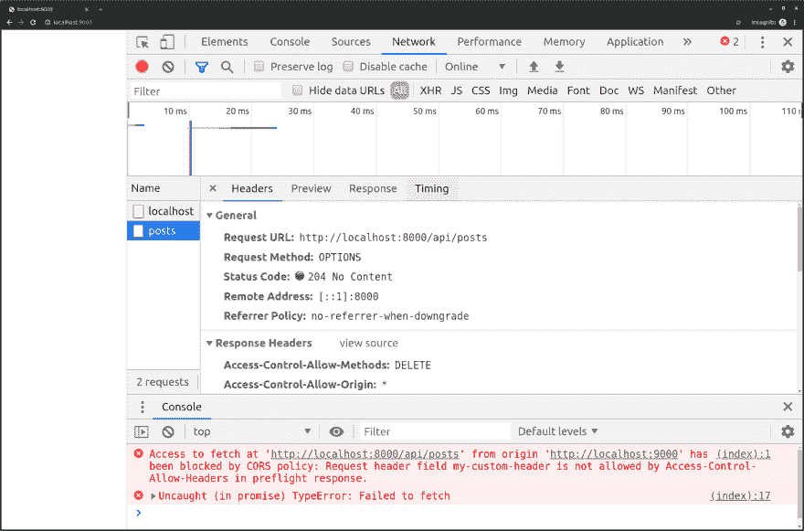](https://res.cloudinary.com/practicaldev/image/fetch/s---3MrheOL--/c_limit%2Cf_auto%2Cfl_progressive%2Cq_auto%2Cw_880/https://thepracticaldev.s3.amazonaws.com/i/zznneu3moks9y7ch9wqc.png)

浏览器回应错误:

```
Access to fetch at 'http://localhost:8000/api/posts' from origin 'http://localhost:9000' has been blocked by CORS policy: Request header field my-custom-header is not allowed by Access-Control-Allow-Headers in preflight response. 
```

Enter fullscreen mode Exit fullscreen mode

由于浏览器执行 CORS 策略，因此 JavaScript 无法设置的标题有:

*   `Accept-Charset`
*   `Accept-Encoding`
*   `Access-Control-Request-Headers`
*   `Access-Control-Request-Method`
*   `Connection`
*   `Content-Length`
*   `Cookie`
*   `Cookie2`
*   `Date`
*   `DNT`
*   `Expect`
*   `Host`
*   `Keep-Alive`
*   `Origin`
*   `Referer`
*   `TE`
*   `Trailer`
*   `Transfer-Encoding`
*   `Upgrade`
*   `User-Agent`
*   `Via`
*   以`Proxy-`或`Sec-`开头的标题

这些标题只能由浏览器设置，因为它们有特殊的含义。浏览器将简单地忽略您为这些标题设置的值。

对于其他头，服务器必须允许客户端在跨源请求中包含自定义请求头。

我们可以看到浏览器请求访问预检请求中的自定义标题，标题为`Access-Control-Request-Headers`:

[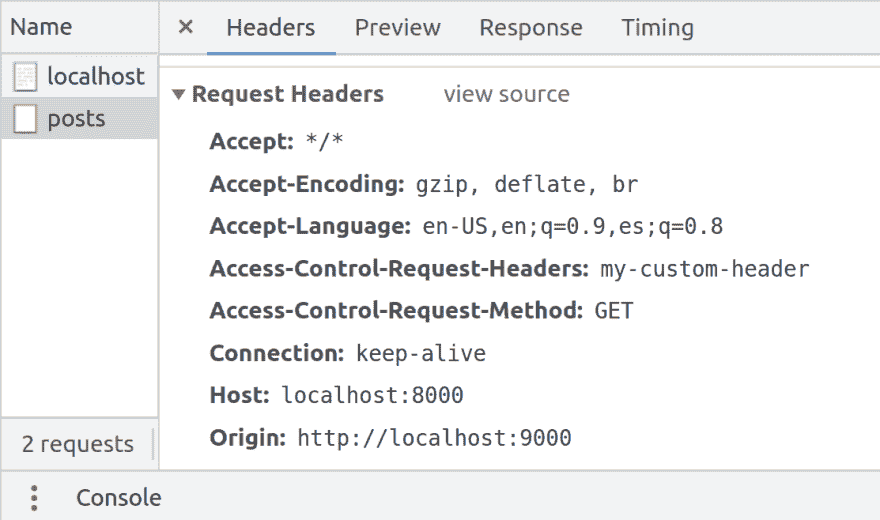](https://res.cloudinary.com/practicaldev/image/fetch/s--9DFbpeA1--/c_limit%2Cf_auto%2Cfl_progressive%2Cq_auto%2Cw_880/https://thepracticaldev.s3.amazonaws.com/i/sagpfs8qoppl0elvotmu.png)

服务器需要将批准的定制请求头列入白名单，如果不将请求头列入白名单，那么请求将失败。

如果进行同源请求，那么该请求可以包括任何自定义请求头，因为该源是可信的。

默认情况下，CORS 只允许客户端读取这些响应头:

*   `Cache-Control`
*   `Content-Language`
*   `Content-Type`
*   `Expires`
*   `Last-Modified`
*   `Pragma`

如果服务器设置了额外的响应头，那么客户端将看不到它们。为了让客户端看到额外的响应头，服务器会公开这些头，我们稍后会讲到。

因此，为了让服务器能够接受客户端的自定义标头，它需要通过在预检响应中设置响应标头`Access-Control-Allow-Headers`来明确允许该标头。

文件`server.js`

```
const express = require('express')
const app = express()
const port = 8000

const isPreflight = (req) => {
  return (
    req.method === 'OPTIONS' &&
    req.headers['origin'] &&
    req.headers['access-control-request-method']
  )
}

app.use(express.static(__dirname))
app.use((req, res, next) => {
  res.set('Access-Control-Allow-Origin', '*')

  if (isPreflight(req)) {
    res.set('Access-Control-Allow-Methods', 'DELETE')
    res.set('Access-Control-Allow-Headers', 'My-Custom-Header') // Add this!
    res.status(204).end()
    return
  }

  next()
})
app.get('/api/posts', (req, res) => {
  res.json([
    {id: 1, content: 'foo'},
    {id: 1, content: 'bar'},
  ])
})
app.delete('/api/posts', (req, res) => {
  res.json({success: true})
})
app.listen(port, () => {
  console.log(`listening on port ${port}`)
}) 
```

Enter fullscreen mode Exit fullscreen mode

重启服务器:

```
$ node server.js
listening on port 8000 
```

Enter fullscreen mode Exit fullscreen mode

```
$ node server2.js
listening on port 9000 
```

Enter fullscreen mode Exit fullscreen mode

现在让我们看看当我们在 [http://localhost:9000/](http://localhost:9000/) 访问第二台服务器的网页时会发生什么

[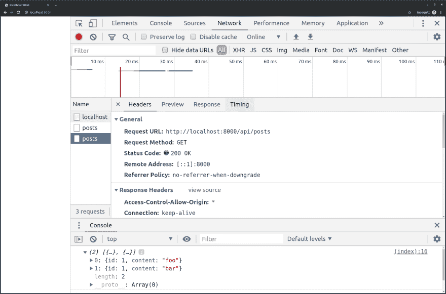](https://res.cloudinary.com/practicaldev/image/fetch/s--VOnF7WHa--/c_limit%2Cf_auto%2Cfl_progressive%2Cq_auto%2Cw_880/https://thepracticaldev.s3.amazonaws.com/i/xuat3puelnwijmjzvsea.png)

预检使用允许的标题进行响应，因此浏览器会继续发送自定义请求标题来发出实际请求。

[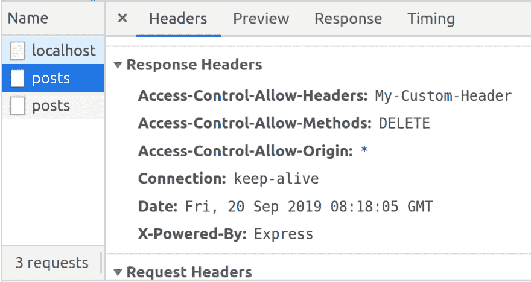](https://res.cloudinary.com/practicaldev/image/fetch/s--o0PWx2x0--/c_limit%2Cf_auto%2Cfl_progressive%2Cq_auto%2Cw_880/https://thepracticaldev.s3.amazonaws.com/i/dns7r2g7xr5p189plp4f.png)

请记住，以`Access-Control-Request-`开头的头是浏览器请求服务器许可的请求头，以`Access-Control-Allow-`开头的头是服务器向浏览器授予许可时发送的响应头。

仅需要出现在飞行前响应中。

TLDR；

> **浏览器在预检请求中发送一个`Access-Control-Request-Headers`请求头，让服务器知道实际请求将请求指定的头。如果服务器拒绝请求这些头，那么实际的请求将不会被发送。**

## 访问-控制-暴露-标题

预检使用`Access-Control-Allow-Headers`头来指示请求中允许哪些头，而实际响应使用`Access-Control-Expose-Headers`头来指示哪些响应头对客户端可见。

如果服务器没有在 expose 头中设置，客户端将无法读取响应头。

始终向客户端公开的头是简单的头,它们是:

*   `Cache-Control`
*   `Content-Language`
*   `Content-Type`
*   `Expires`
*   `Last-Modified`
*   `Pragma`

例如，让我们尝试读取客户端上的所有响应头:

文件`index.html`

```
<!DOCTYPE html>
<html lang="en-US">
<head>
  <meta charset="UTF-8">
  
</head>
<body>
  <script>
    (async () => {
      const res = await fetch('http://localhost:8000/api/posts')

      console.log(Array.from(await res.headers.entries()))
    })()
  </script>
</body>
</html> 
```

Enter fullscreen mode Exit fullscreen mode

现在让我们看看当我们在 [http://localhost:9000/](http://localhost:9000/) 访问第二台服务器的网页时会发生什么

[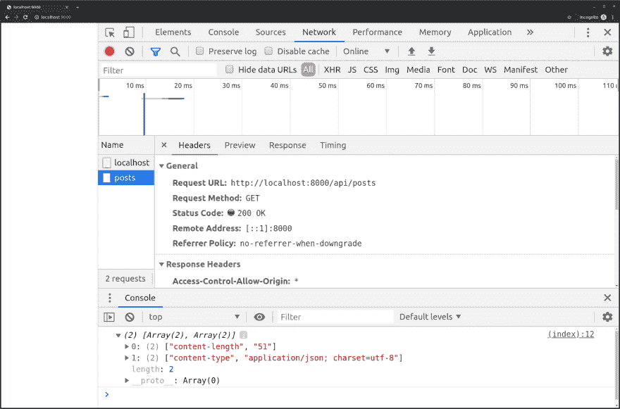](https://res.cloudinary.com/practicaldev/image/fetch/s--LezQ4Dy7--/c_limit%2Cf_auto%2Cfl_progressive%2Cq_auto%2Cw_880/https://thepracticaldev.s3.amazonaws.com/i/g6b7q3tzmz8866eskbnv.png)

没有什么令人惊讶的，我们得到了标准的标题。

让我们在服务器端设置一个定制的响应头。

```
const express = require('express')
const app = express()
const port = 8000

const isPreflight = (req) => {
  return (
    req.method === 'OPTIONS' &&
    req.headers['origin'] &&
    req.headers['access-control-request-method']
  )
}

app.use(express.static(__dirname))
app.use((req, res, next) => {
  res.set('Access-Control-Allow-Origin', '*')

  if (isPreflight(req)) {
    res.set('Access-Control-Allow-Methods', 'DELETE')
    res.set('Access-Control-Allow-Headers', 'My-Custom-Header')
    res.status(204).end()
    return
  } else {
    res.set('Timezone-Offset', '240') // Add this!
  }

  next()
})
app.get('/api/posts', (req, res) => {
  res.json([
    {id: 1, content: 'foo'},
    {id: 1, content: 'bar'},
  ])
})
app.delete('/api/posts', (req, res) => {
  res.json({success: true})
})
app.listen(port, () => {
  console.log(`listening on port ${port}`)
}) 
```

Enter fullscreen mode Exit fullscreen mode

现在让我们看看当我们在 [http://localhost:9000/](http://localhost:9000/) 访问第二台服务器的网页时会发生什么

[](https://res.cloudinary.com/practicaldev/image/fetch/s--LezQ4Dy7--/c_limit%2Cf_auto%2Cfl_progressive%2Cq_auto%2Cw_880/https://thepracticaldev.s3.amazonaws.com/i/g6b7q3tzmz8866eskbnv.png)

等等，我们只看到相同的标题。未提供新标题。这是因为服务器需要设置哪些头允许带有`Access-Control-Expose-Headers`响应头的客户端读取。

让我们添加`Access-Control-Expose-Headers`作为常规的响应头，告诉浏览器允许客户端读取自定义头:

文件`server.js`

```
const express = require('express')
const app = express()
const port = 8000

const isPreflight = (req) => {
  return (
    req.method === 'OPTIONS' &&
    req.headers['origin'] &&
    req.headers['access-control-request-method']
  )
}

app.use(express.static(__dirname))
app.use((req, res, next) => {
  res.set('Access-Control-Allow-Origin', '*')

  if (isPreflight(req)) {
    res.set('Access-Control-Allow-Methods', 'DELETE')
    res.set('Access-Control-Allow-Headers', 'My-Custom-Header')
    res.status(204).end()
    return
  } else {
    res.set('Access-Control-Expose-Headers', 'Timezone-Offset') // Add this!
    res.set('Timezone-Offset', '240')
  }

  next()
})
app.get('/api/posts', (req, res) => {
  res.json([
    {id: 1, content: 'foo'},
    {id: 1, content: 'bar'},
  ])
})
app.delete('/api/posts', (req, res) => {
  res.json({success: true})
})
app.listen(port, () => {
  console.log(`listening on port ${port}`)
}) 
```

Enter fullscreen mode Exit fullscreen mode

重启服务器:

```
$ node server.js
listening on port 8000 
```

Enter fullscreen mode Exit fullscreen mode

```
$ node server2.js
listening on port 9000 
```

Enter fullscreen mode Exit fullscreen mode

现在让我们看看当我们在 [http://localhost:9000/](http://localhost:9000/) 访问第二台服务器的网页时会发生什么

[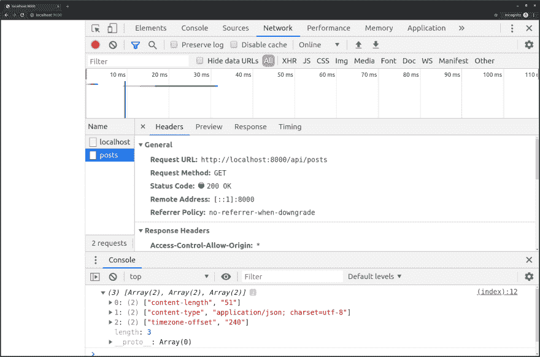](https://res.cloudinary.com/practicaldev/image/fetch/s--M0GPEUGA--/c_limit%2Cf_auto%2Cfl_progressive%2Cq_auto%2Cw_880/https://thepracticaldev.s3.amazonaws.com/i/1c7606jebrmitrzh0e4n.png)

我们现在可以在客户机中读取服务器发送给浏览器的自定义头。

TLDR；

> **使用`Access-Control-Expose-Headers`允许客户端读取额外的非简单头。**

## 访问控制最大年龄

`Access-Control-Max-Age`标题指示预检响应应该保持缓存多长时间(秒)。让我们通过设置预检响应中的标题`Access-Control-Max-Age`来告诉浏览器缓存预检响应 2 分钟(120 秒)。

文件`server.js`

```
app.use((req, res, next) => {
  res.set('Access-Control-Allow-Origin', '*')

  if (isPreflight(req)) {
    res.set('Access-Control-Allow-Methods', 'DELETE')
    res.set('Access-Control-Allow-Headers', 'My-Custom-Header')
    res.set('Access-Control-Max-Age', '120') // Add this!
    res.status(204).end() 
    return
  } else {
    res.set('Access-Control-Expose-Headers', 'Timezone-Offset')
    res.set('Timezone-Offset', '240')
  }

  next()
}) 
```

Enter fullscreen mode Exit fullscreen mode

重启服务器:

```
$ node server.js
listening on port 8000 
```

Enter fullscreen mode Exit fullscreen mode

```
$ node server2.js
listening on port 9000 
```

Enter fullscreen mode Exit fullscreen mode

我们可以在预检响应标题中看到`Access-Control-Max-Age`标题:

[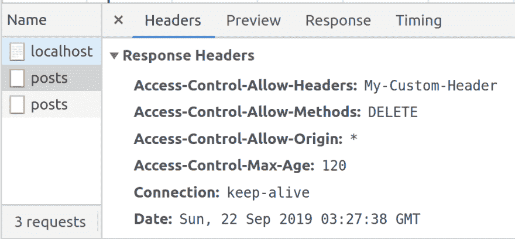](https://res.cloudinary.com/practicaldev/image/fetch/s--NSXRhVWx--/c_limit%2Cf_auto%2Cfl_progressive%2Cq_auto%2Cw_880/https://thepracticaldev.s3.amazonaws.com/i/ewm3oj6rw5ldncvcwf6x.png)

Firefox 不允许项目缓存超过 24 小时，而 Chrome、Opera 和 Safari 最多缓存 5 分钟。如果没有指定`Access-Control-Max-Age`，那么 Firefox 不会缓存预检，而 Chrome、Opera 和 Safari 会缓存预检 5 秒钟。

通过减少网络请求的数量，最大化`Access-Control-Max-Age`标题以获得更好的移动体验。

为了防止代理服务器缓存来自一个客户端的响应并将它们发送到不同的客户端，使用`Vary: Origin`响应头来表示`Access-Control-Allow-Origin`将不同并且不应该被缓存

```
Vary: Origin 
```

Enter fullscreen mode Exit fullscreen mode

例如:

```
if (isPreflight(req)) {
  if (whitelist.contains(req.get('origin'))) {
    res.set('Access-Control-Allow-Origin', req.get('origin'))
  }

  res.set('Vary', 'Origin')
} else {
  res.set('Access-Control-Allow-Origin', '*')
} 
```

Enter fullscreen mode Exit fullscreen mode

TDLR；

> **`Access-Control-Max-Age`告诉浏览器缓存预检响应的时间(以秒为单位)。**

## 访问-控制-允许-凭证

`Access-Control-Allow-Credentials`头用于允许客户端在跨源请求中发送敏感信息，如 cookies。

出于安全原因，Cookies 需要额外配置，因为它们包含敏感信息。如果选择加入功能一直处于启用状态，意外地将个人信息发送到不同来源的网站将会非常危险。

JavaScript `document.cookie` API 不能从另一个原点读取或写入值。调用`document.cookie`只返回客户自己的 cookie，不返回跨来源的 cookie。cookie 本身使用同源策略，每个 cookie 都有一个路径和一个域，只有路径和域匹配的页面才能读取 cookie。

Cookies 在以下情况下效果最佳:

*   您希望在自己的客户机和服务器生态系统中授权用户。
*   您确切地知道哪些客户端将访问您的服务器。

网站通过用户凭证来识别用户，最流行的形式是 cookie。服务器使用 cookies 来存储一个唯一的标识符来标识使用，例如与用户 ID 相关联的会话 ID。

同源 HTTP 请求将总是包含 cookie，但是默认情况下跨源不包含 cookie。

启用客户端中的凭证选项以发送:

*   饼干
*   基本认证
*   客户端 SSL 证书

让我们在服务器上设置一个 cookie，并在客户机上读取这个 cookie。对于这个例子，让我们对帖子的 GET 请求进行处理。cookie 的响应头将是一个简单的键/值，可以从任何路径读取。

```
Set-Cookie: username=alice; Path=/ 
```

Enter fullscreen mode Exit fullscreen mode

文件`server.js`

```
const express = require('express')
const app = express()
const port = 8000

const isPreflight = (req) => {
  return (
    req.method === 'OPTIONS' &&
    req.headers['origin'] &&
    req.headers['access-control-request-method']
  )
}

app.use(express.static(__dirname))
app.use((req, res, next) => {
  res.set('Access-Control-Allow-Origin', '*') 

  if (isPreflight(req)) {
    res.set('Access-Control-Allow-Methods', 'DELETE')
    res.set('Access-Control-Allow-Headers', 'My-Custom-Header')
    res.set('Access-Control-Max-Age', '120')
    res.status(204).end()
    return
  } else {
    res.set('Access-Control-Expose-Headers', 'Timezone-Offset')
    res.set('Timezone-Offset', '240')
  }

  next()
})
app.get('/api/posts', (req, res) => {
  res.set('Set-Cookie', 'username=alice; Path=/') // Add this!
  res.json([
    {id: 1, content: 'foo'},
    {id: 1, content: 'bar'},
  ])
})
app.delete('/api/posts', (req, res) => {
  res.json({success: true})
})
app.listen(port, () => {
  console.log(`listening on port ${port}`)
}) 
```

Enter fullscreen mode Exit fullscreen mode

文件`index.html`

```
<!DOCTYPE html>
<html lang="en-US">
<head>
  <meta charset="UTF-8">
  
</head>
<body>
  <script>
    (async () => {
      const res = await fetch('http://localhost:8000/api/posts')

      console.log(document.cookie)
    })()
  </script>
</body>
</html> 
```

Enter fullscreen mode Exit fullscreen mode

重启服务器:

```
$ node server.js
listening on port 8000 
```

Enter fullscreen mode Exit fullscreen mode

```
$ node server2.js
listening on port 9000 
```

Enter fullscreen mode Exit fullscreen mode

现在让我们看看当我们在 [http://localhost:9000/](http://localhost:9000/) 访问第二台服务器的网页时会发生什么

[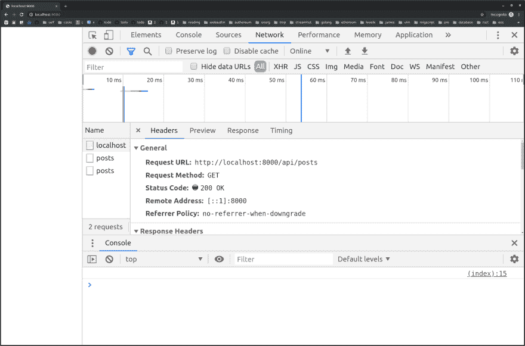](https://res.cloudinary.com/practicaldev/image/fetch/s--He0zYMBX--/c_limit%2Cf_auto%2Cfl_progressive%2Cq_auto%2Cw_880/https://thepracticaldev.s3.amazonaws.com/i/2fbz7xbmt28eyrhmqibh.png)

没有记录任何内容！这是因为跨来源请求默认允许读取 cookies。我们可以通过在获取请求选项上设置`credentials: 'include'`来告诉服务器我们希望读取 cookies。

在 JavaScript fetch 调用中，您需要设置`credentials: 'include'`来发送跨来源请求的 cookies。如果使用`XMLHttpRequest`，则需要设置`withCredentials: true`。

文件`index.html`

```
<!DOCTYPE html>
<html lang="en-US">
<head>
  <meta charset="UTF-8">
  
</head>
<body>
  <script>
    (async () => {
      const res = await fetch('http://localhost:8000/api/posts', {
        credentials: 'include'
      })

      console.log(document.cookie)
    })()
  </script>
</body>
</html> 
```

Enter fullscreen mode Exit fullscreen mode

现在让我们看看当我们在 [http://localhost:9000/](http://localhost:9000/) 访问第二台服务器的网页时会发生什么

[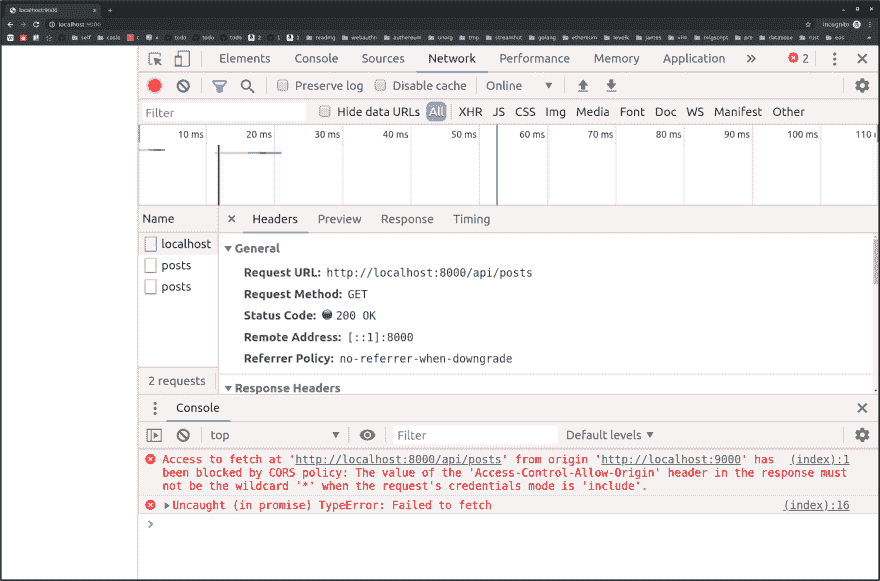](https://res.cloudinary.com/practicaldev/image/fetch/s--0y2a0fIY--/c_limit%2Cf_auto%2Cfl_progressive%2Cq_auto%2Cw_880/https://thepracticaldev.s3.amazonaws.com/i/zqwzz44lgxoaakz9xsnz.png)

我们得到的错误:

```
Access to fetch at 'http://localhost:8000/api/posts' from origin 'http://localhost:9000' has been blocked by CORS policy: The value of the 'Access-Control-Allow-Origin' header in the response must not be the wildcard '*' when the request's credentials mode is 'include'. 
```

Enter fullscreen mode Exit fullscreen mode

这意味着为了让客户端读取 cookie，`Access-Control-Allow-Origin`不能是通配符`*`，它必须被显式设置为允许读取 cookie 的源。

很简单，我们可以动态地将允许的原点设置为请求头中的原点。在真实世界的应用程序中，您会更加安全，并被设置到允许读取 cookies 的源的白名单中。

文件`server.js`

```
app.use((req, res, next) => {
  // res.set('Access-Control-Allow-Origin', '*') // remove this!
  res.set('Access-Control-Allow-Origin', req.get('origin')) // Add this!

  if (isPreflight(req)) {
    res.set('Access-Control-Allow-Methods', 'DELETE')
    res.set('Access-Control-Allow-Headers', 'My-Custom-Header')
    res.set('Access-Control-Max-Age', '120')
    res.status(204).end()
    return
  } else {
    res.set('Access-Control-Expose-Headers', 'Timezone-Offset')
    res.set('Timezone-Offset', '240')
  }

  next()
}) 
```

Enter fullscreen mode Exit fullscreen mode

重启服务器:

```
$ node server.js
listening on port 8000 
```

Enter fullscreen mode Exit fullscreen mode

```
$ node server2.js
listening on port 9000 
```

Enter fullscreen mode Exit fullscreen mode

现在让我们看看当我们在 [http://localhost:9000/](http://localhost:9000/) 访问第二台服务器的网页时会发生什么

[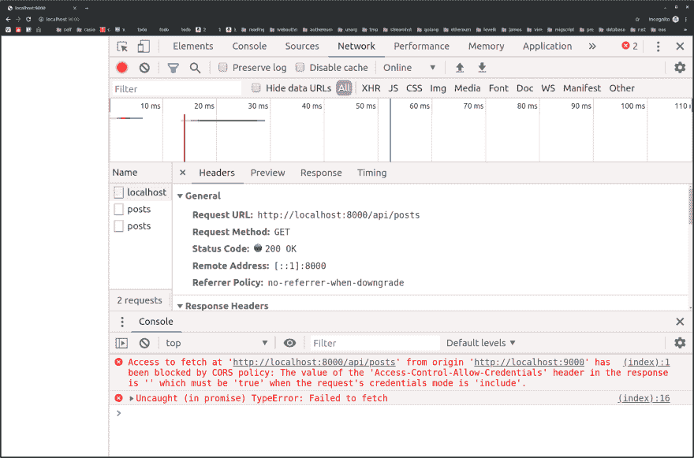](https://res.cloudinary.com/practicaldev/image/fetch/s--g4sHAia9--/c_limit%2Cf_auto%2Cfl_progressive%2Cq_auto%2Cw_880/https://thepracticaldev.s3.amazonaws.com/i/dex8qiv81v78hehdpiz2.png)

我们得到以下错误:

```
Access to fetch at 'http://localhost:8000/api/posts' from origin 'http://localhost:9000' has been blocked by CORS policy: The value of the 'Access-Control-Allow-Credentials' header in the response is '' which must be 'true' when the request's credentials mode is 'include'. 
```

Enter fullscreen mode Exit fullscreen mode

这是因为浏览器需要知道服务器允许从跨源请求中读取 cookies。

要启用 cookie 支持，服务器必须将`Access-Control-Allow-Credentials`报头设置为`true`，以指示允许客户端读取 cookie 以及服务器允许接收 cookie。

标题`Access-Control-Allow-Credentials`唯一可以拥有的值是`true`。

```
Access-Control-Allow-Credentials: true 
```

Enter fullscreen mode Exit fullscreen mode

文件`server.js`

```
app.use((req, res, next) => {
  res.set('Access-Control-Allow-Origin', req.get('origin'))

  if (isPreflight(req)) {
    res.set('Access-Control-Allow-Methods', 'DELETE')
    res.set('Access-Control-Allow-Headers', 'My-Custom-Header')
    res.set('Access-Control-Max-Age', '120')
    res.status(204).end()
    return
  } else {
    res.set('Access-Control-Expose-Headers', 'Timezone-Offset')
    res.set('Access-Control-Allow-Credentials', 'true') // Add this!
    res.set('Timezone-Offset', '240')
  }

  next()
}) 
```

Enter fullscreen mode Exit fullscreen mode

重启服务器:

```
$ node server.js
listening on port 8000 
```

Enter fullscreen mode Exit fullscreen mode

```
$ node server2.js
listening on port 9000 
```

Enter fullscreen mode Exit fullscreen mode

现在让我们看看当我们在 [http://localhost:9000/](http://localhost:9000/) 访问第二台服务器的网页时会发生什么

[](https://res.cloudinary.com/practicaldev/image/fetch/s--z6RlA0vW--/c_limit%2Cf_auto%2Cfl_progressive%2Cq_auto%2Cw_880/https://thepracticaldev.s3.amazonaws.com/i/26nnxbosodhp7o9w907b.png)

客户端现在可以读取 cookies 了！

我们可以看到`Access-Control-Allow-Credentials`被设置为`true`并且`Access-Control-Allow-Origin`被设置为实际的原点，而不是通配符，这两个头文件都是客户端允许 cookies 所必需的。

[](https://res.cloudinary.com/practicaldev/image/fetch/s--8ZnBTMR0--/c_limit%2Cf_auto%2Cfl_progressive%2Cq_auto%2Cw_880/https://thepracticaldev.s3.amazonaws.com/i/umue5jjw06ys0kptxh3e.png)

`Access-Control-Allow-Credentials`标题可以出现在预检和实际请求中，但 cookie 将只在实际请求中发送。只有非预检响应才需要标题。

TLDR；

> **设置响应头`Access-Control-Allow-Credentials: true`允许客户端读取 cookies 等敏感信息。使用`credentials: 'include' if using the fetch API or use` withCredentials: true `if using the XMLHttpRequest API.`在请求凭据时，Access-Control-Allow-Origin '不能是通配符。**

## CSRF

CSRF 令牌是客户端和服务器之间共享的不可访问令牌，用于防止[跨站点请求伪造](https://en.wikipedia.org/wiki/Cross-site_request_forgery) (CSRF)攻击。服务器将页面提供给客户端，令牌作为页面头，客户端在每次请求时发送 CSRF 令牌。如果服务器无法验证令牌，则请求无效。当客户端使用 cookie 请求受保护的数据时，需要拒绝 CSRf 保护。

用 cURL 欺骗`Origin`是可能的，也是容易的，但是用 cookie 欺骗更难，因为 cURL 不能直接或远程访问浏览器 cookie。

如果可能，考虑同源请求，而不是使用 CSRF，因为它更安全。

如果构建公共 API，使用 cookie 以外的东西来验证用户，比如使用 Oauth2。

## 浏览器支持

CORS 完全支持:

*   铬 3+
*   火狐 3.5 以上版本
*   Safari 4+
*   IE 10+的
*   Opera 12+
*   iOS 3.2 以上
*   Android 2.1+版本

## 结论

我们报道了 CORS 的各种标题，包括:

*   [T2`Access-Control-Allow-Origin`](https://developer.mozilla.org/en-US/docs/Web/HTTP/Headers/Access-Control-Allow-Origin)
*   [T2`Access-Control-Request-Method`](https://developer.mozilla.org/en-US/docs/Web/HTTP/Headers/Access-Control-Request-Method)
*   [T2`Access-Control-Request-Headers`](https://developer.mozilla.org/en-US/docs/Web/HTTP/Headers/Access-Control-Request-Headers)
*   [T2`Access-Control-Allow-Headers`](https://developer.mozilla.org/en-US/docs/Web/HTTP/Headers/Access-Control-Allow-Headers)
*   [T2`Access-Control-Allow-Methods`](https://developer.mozilla.org/en-US/docs/Web/HTTP/Headers/Access-Control-Allow-Methods)
*   [T2`Access-Control-Expose-Headers`](https://developer.mozilla.org/en-US/docs/Web/HTTP/Headers/Access-Control-Expose-Headers)
*   [T2`Access-Control-Allow-Credentials`](https://developer.mozilla.org/en-US/docs/Web/HTTP/Headers/Access-Control-Allow-Credentials)
*   [T2`Access-Control-Max-Age`](https://developer.mozilla.org/en-US/docs/Web/HTTP/Headers/Access-Control-Max-Age)

添加 CORS 支持时要问的问题:

*   为什么服务器需要支持跨源请求？
*   CORS 是新增服务还是现有服务？
*   哪个客户端应该有权访问站点？
*   用户将通过什么浏览器和设备访问网站？
*   服务器支持哪些 HTTP 方法和头？
*   API 应该支持特定于用户的数据吗？
*   cookies 会被用来认证用户吗？

TLDR；

> 只有在绝对必要的情况下才允许跨源请求，并且要非常明确地说明允许哪些源、方法、头和凭证。

资源:

*   [MDN -跨产地资源共享(CORS)](https://developer.mozilla.org/en-US/docs/Web/HTTP/CORS)
*   [维基百科-跨产地资源共享](https://en.wikipedia.org/wiki/Cross-origin_resource_sharing)
*   [测试 CORS 请求的网页](https://www.test-cors.org/)
*   [Node.js CORS 中间件](https://github.com/expressjs/cors)
*   [CORS 在行动](https://livebook.manning.com/book/cors-in-action/about-this-book/)