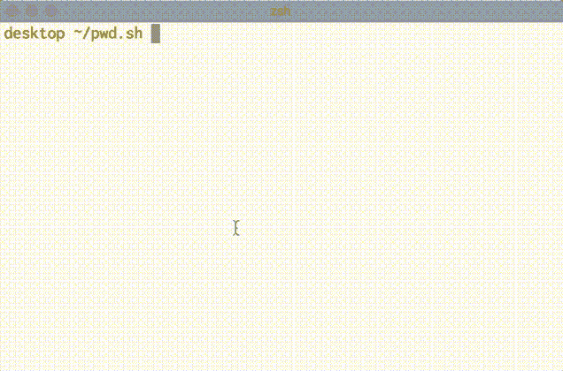

# p.1 我尝试构建一个密码管理器

> 原文：<https://dev.to/caffiendkitten/understanding-password-managers-and-my-attempt-at-building-one-p-1-1nid>

作为一名熨斗学校的学生，我决定更好地理解密码管理器，并构建了一个基本的密码管理器。这将是一个非常简单的密码管理器，可能不会像它应该的那样安全，但将是一个很好的基础，以了解事情是如何制作，保护，他们应该如何存储/访问，希望这将是一个项目，我可以成长，因为我了解更多。
[在这里结账我的工作密码管理员！！！](https://flatiron-passwordmanager.netlify.com/)

现在，**建立一个密码管理器不是一件简单的小事**。我还没有完全理解许多加密技术和数据管理，但作为我更好地理解事物和独自研究事物的良好起点，这里有一些需要首先理解的事情。

1.  密码学与克尔克霍夫原理
2.  安全编码实践
3.  密码的正确存储
4.  密码摘要/ JWT/序列化程序
5.  本地存储/会话存储
6.  加密/解密
7.  王国的钥匙藏起来很重要
8.  部署

## 1。密码学与克尔克霍夫原理

Kerckhoffs 的原理是 19 世纪的密码学原理，它指出“即使除了密钥之外，关于系统的一切都是公开的，密码系统也应该是安全的。”(1)

因此，如果安全性依赖于对所使用的加密算法保密，那么暴露这种“脆弱”的系统会导致在开发、测试和分发新算法的实现时出现困难。相比之下，如果对算法使用的密钥保密很重要，那么密钥的公开只需要更简单、成本更低的生成和分发新密钥的过程。

随着技术进步和系统变得越来越大，后者似乎是公司更常见的事情。密钥或密码可能是独一无二的，难以猜测，并且可以每隔几个月更换一次，以确保与之相关的信息安全。这是一个更好的实践，而不是每次数据改变时都重新创建轮子。
[T3】](https://i.giphy.com/media/d8isjk1UBPFTm0EBbd/giphy.gif)

## 2。安全编码实践

安全可以到位，但如果有人不遵守既定的做法，那么安全是无用的，因为攻击者会找到办法。
[T3】](https://i.giphy.com/media/MCEqshuu4pyMw/giphy.gif)

> 1.  Verify input! Verify the input from any data source, because it can eliminate the vast majority of vulnerabilities.
> 2.  Pay attention to compiler warnings and compile the code with the highest warning level available.
> 3.  Architect, designed for security policy. Create a software architecture and design your software to implement and enforce security policies.
> 4.  Keep the design as simple and compact as possible, because complex design will increase the possibility of mistakes in implementation, configuration and use.
> 5.  Set the default denial process, and make access decisions based on permission rather than exclusion.
> 6.  Adhere to the principle of least privilege, and every process should be executed with the least privilege set required to complete the task.
> 7.  Sort out all data sent to other systems and all data transferred to complex subsystems.
> 8.  Practice defense in depth. Use multiple defense strategies to manage risks, so that if one layer of defense is insufficient, another layer of defense can prevent security defects from becoming exploitable vulnerabilities and/or limit the consequences of successful exploitation.
> 9.  Use effective quality assurance technology. Good quality assurance technology can effectively identify and eliminate vulnerabilities.

## 3。密码的正确存储

信息系统以各种受保护的形式存储密码/凭证，正确存储密码/凭证对于防止恶意使用凭证或盗窃等问题非常重要。保持密码安全涉及加密哈希和良好的密码存储方案。
加密哈希是一种数学算法，可用于生成校验和，或通常用于检测数据错误的值。
通过加密哈希，供应商可以通过交叉检查其校验和与数据库中的校验和来验证密码是否正确，而不必知道密码实际上是什么。(4)
“密码存储方案对用户提供的新密码进行编码，以便以编码方式存储。这使得某人很难或不可能从编码值中确定明文密码。”(5)密码存储方案的几个例子是 [AES](https://docs.oracle.com/en/middleware/idm/unified-directory/12.2.1.3/oudcr/aes-password-storage-scheme.html) 、 [Base64](https://docs.oracle.com/en/middleware/idm/unified-directory/12.2.1.3/oudcr/base64-password-storage-scheme.html) 、 [Blowfish](https://docs.oracle.com/en/middleware/idm/unified-directory/12.2.1.3/oudcr/blowfish-password-storage-scheme.html) 、 [Clear](https://docs.oracle.com/en/middleware/idm/unified-directory/12.2.1.3/oudcr/clear-password-storage-scheme.html) 或 [Crypt](https://docs.oracle.com/en/middleware/idm/unified-directory/12.2.1.3/oudcr/crypt-password-storage-scheme.html) 。

## 4。密码摘要/ JWT/序列化程序。

**密码摘要**是用于存储密码的认证栏。在利用 Bcrypt 进行主要的日志处理时，我能够为用户的登录凭证创建一个“password_digest”列，然后 Bcrypt 和 Rails 能够看到用户有一个密码，并相应地散列它。

" **JSON Web Token (JWT)** 是一种开放标准，它定义了一种紧凑的自包含方式，以 JSON 对象的形式在各方之间安全地传输信息。该信息可以被验证和信任，因为它是数字签名的。jwt 可以使用秘密(使用 HMAC 算法)或使用 RSA 或 ECDSA 的公钥/私钥对进行签名(6)
我用的 JWT 用的是“JWT.decode(token，ENV[HASH_KEY]，true，算法:' HS256 ')”。HS256 是

**序列化器**知道模型和 current_user，所以您可以根据用户是否被授权查看内容来定制序列化。简而言之，序列化器用面向对象的开发取代了哈希驱动的开发。这是一种非常有趣的学习方法，可以在不构建一个信息位表的情况下嵌套相关信息。我能够将每个模型分离到不同的表中，并为每个模型使用一个序列化程序来关联它们。这不是超级的，因为 Rails Serializer 显然已经停止支持 is 的新更新，大多数都开始使用[快速 JSON](https://github.com/Netflix/fast_jsonapi#serializer-definition) 。

## 5。本地存储/会话存储

与“sessionStorage”类似，localStorage 是一个只读属性，允许访问“文档来源的存储对象；存储的数据跨浏览器会话保存。(7)注意:存储在 localStorage 中的数据没有到期时间，因此如果需要，必须设置它。对于我的项目，我决定使用 sessionStorage 而不是 localStorage。我这样做是因为 sessionStorage 在每次选项卡关闭时都会清除其关联的缓存，从而使 XSS 浏览器的本地存储和访问用户的 JWT 或其他可能存储的凭据变得更加困难。
在我的例子中，当用户登录时，我需要在 JWT 对象的 sessionStorage 对象上设置 Item 方法，并将其保存在浏览器中，然后在用户注销后清除 JWT 对象的 sessionStorage。这将允许清除和重置所有与用户相关的状态信息，这样其他人就无法使用他们的登录凭据。
尽可能使用 sessionStorage！！查看我在上面找到的另一篇 [Dev 文章](https://dev.to/rdegges/please-stop-using-local-storage-1i04)或[我在上面的文章](https://dev.to/caffiendkitten/localstorage-vs-sessionstorage-f9k)。

## 6。加密/解密

在我的项目中，我想加密用户存储的数据，并在数据到达用户手中时解密。理论上是通过在发送之前对其进行加密，一旦接收到它...它有望更安全，更不易受到中间人攻击，因为数据将在易受攻击的地方加密。但是，这意味着我需要想出一种方法来加密数据，而不使密钥变得如此容易被访问/可见。

对于我的项目，我找到了 Cryptr npm 包，它允许我创建一个密钥，并在信息被发送到后端之前对其进行加密。现在，这并不是 100%安全的，因为总有一些数据是以纯文本格式显示的。但是，通过在它到达数据库之前加密它

## 7。王国的钥匙藏起来很重要

任何散列、加密/解密都需要密钥。这是一些需要保护，但很难隐藏，同时仍然使其可用的东西。我遇到了这个问题，我的 Rails 后端可能有一个。env 文件来制作我自己的密钥，并防止它被上传到我的 GitHub。然后 Heroku 可以将它与我的应用程序分开，这样我的密钥仍然是隐藏的。酷毙了。但在前端，这有点困难。由于我在将数据发送到后端之前对其进行了加密，所以我需要一个可以在前端访问的密钥，并且最好不要存储。显然这是个问题。因此，我开始学习如何创建安全的密钥，而不是以纯文本的形式保存它们，但是仍然使它们可访问并且是唯一的。理想情况下，我希望每个用户都有自己的密钥，或者用户能够为他们保存的每个项目设置一个密钥。现在，由于我的项目在技术上已经完成，这不是一个高度优先事项，但它是我想继续学习和工作的东西。

## 8。部署

一旦我让我的应用程序达到可以工作的程度，我觉得是时候把它部署到这个世界上了。是的，我的一些同学从一开始就部署了，但我想等到我有更多的东西来展示。为了将它部署到互联网上，我用了 [Heroku](https://www.heroku.com/) 做后端，用 [Netlify](https://www.netlify.com/) 做前端。这让我可以不顾一切地维护事物，但要了解彼此，如果其中一部分出了问题，我可以更好地与那一部分合作。在使用 Heroku 之前，你需要确保你的后端使用了 Postgres，并且 gem 的正确版本是 dotenv-rails。一旦我做到了这一点，设置 Heroku 使用哪个 g it 分支以及在各自的存储库中使用哪个 Git 分支就变得非常容易了。

#### 参考文献

1.  [https://en.wikipedia.org/wiki/Kerckhoffs%27s_principle](https://en.wikipedia.org/wiki/Kerckhoffs%27s_principle)
2.  [https://wiki . sei . CMU . edu/confluence/display/sec code/Top % 2b 10% 2b secure % 2b coding % 2b practices](https://wiki.sei.cmu.edu/confluence/display/seccode/Top%2B10%2BSecure%2BCoding%2BPractices)
3.  [https://www . OWASP . oimg/0/08/OWASP _ SCP _ Quick _ Reference _ Guide _ v2 . pdf](https://www.owasp.oimg/0/08/OWASP_SCP_Quick_Reference_Guide_v2.pdf)
4.  [https://blog . emsisoft . com/en/29524/how-to-create-manage-store-passwords/](https://blog.emsisoft.com/en/29524/how-to-create-manage-store-passwords/)
5.  [https://docs . Oracle . com/en/middleware/IDM/unified-directory/12 . 2 . 1 . 3/oudcr/password-storage-scheme . html](https://docs.oracle.com/en/middleware/idm/unified-directory/12.2.1.3/oudcr/password-storage-scheme.html)
6.  [https://jwt.io/introduction/](https://jwt.io/introduction/)
7.  [https://developer . Mozilla . org/en-US/docs/Web/API/Window/local storage](https://developer.mozilla.org/en-US/docs/Web/API/Window/localStorage)
8.  [https://dev . to/caffiendkitten/local storage-vs-session storage-f9k](https://dev.to/caffiendkitten/localstorage-vs-sessionstorage-f9k)

###### 请注意，我是学生，还在学习。如果我说的不正确，请告诉我。我很想了解更多我可能不完全了解的东西。