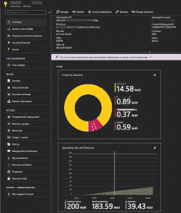

# 了解 Azure 中的租户、订阅、区域和地理位置

> 原文：<https://dev.to/simonwaight/understanding-tenants-subscriptions-regions-and-geographies-in-azure-550h>

如果你开始使用 Azure，你可能会遇到一些关键术语，很好地理解它们是很重要的。在这篇文章中，我将讨论我认为的四个关键问题。

## 房客

与 Azure 相关的租户指的是 Azure Active Directory 的单个实例，或者通常称为“Azure AD”。Azure AD 是微软云平台的一个关键部分，因为它提供了一个单一的地方来管理用户、组以及他们持有的与 Azure AD 保护的应用程序相关的权限。

Azure AD 提供访问的主要微软应用程序包括 Office 365、Dynamics 365 和 Azure。是的，你没看错，Azure 被当作一个‘应用’。你还可以使用 Azure AD 来控制对许多其他第三方应用程序的访问，如 [Salesforce](https://docs.microsoft.com/en-us/azure/active-directory/saas-apps/salesforce-tutorial) ，甚至是 [AWS 管理控制台](https://docs.microsoft.com/en-us/azure/active-directory/saas-apps/amazon-web-service-tutorial)。作为一名应用开发者，你可以[在 Azure AD 中注册自己的应用](https://docs.microsoft.com/en-us/azure/active-directory/develop/quickstart-register-app)，以允许用户访问。

Azure AD 租户是全球唯一的，使用以“onmicrosoft.com”(即 myazuread.onmicrosoft.com)结尾的域来确定范围，每个租户都有一个以 [UUID/GUID](https://en.wikipedia.org/wiki/Universally_unique_identifier) 形式的“租户 ID”。一些客户选择将他们的内部 Active Directory 环境连接到 Azure AD，以允许他们的员工进行单一或相同的登录，并且还将使用自定义域，而不是默认的“onmicrosoft.com”。

当您访问 [Azure 门户](https://portal.azure.com/)或使用命令行工具之一管理订阅中的 Azure 资源时，您将始终通过与您想要访问的订阅相关联的 Azure AD 租户进行身份验证。您可以采取的操作将取决于您在目标订阅中被分配的角色。

最后，Azure 广告租户可以与多个订阅相关联(通常在较大的组织中)，但一个订阅在任何时候都只能与一个 Azure 广告租户相关联。

**开发者提示:**如果你想开发一个使用 Azure AD 的应用，但没有权限在你公司的 Azure AD 租户中注册应用(或者你想要一个“开发者”Azure AD 租户)，你可以选择[在 Azure 门户中创建一个新的 Azure AD 租户](https://portal.azure.com/#create/Microsoft.AzureActiveDirectory)。请确保在您的应用程序中，您可以轻松地更改 Azure AD 租户详细信息，以允许您根据需要进行重新部署。Azure AD 有一个免费层，应该适合大多数开发目的。

**IT Pro 提示:**你可以为你的租户更改显示名称——这是我强烈推荐的，特别是因为 [Azure AD B2B](https://docs.microsoft.com/en-us/azure/active-directory/b2b/what-is-b2b) 将意味着其他人如果被邀请将会看到你的目录名称，如果显示名称不清楚，他们可能会感到困惑。请注意，您是*而不是*能够更改默认的 onmicrosoft.com 域名。

## 订阅

Azure 中的订阅是一个逻辑容器，可以在其中部署任意数量的资源(虚拟机、Web 应用、存储帐户等)。它还可以用于对这些资源的粗粒度访问控制，尽管目前正确的方法是利用[基于角色的访问控制(RBAC)](https://docs.microsoft.com/en-us/azure/role-based-access-control/overview) 或[管理组](https://docs.microsoft.com/en-us/azure/azure-resource-manager/management-groups-overview)。订阅中包含的资源的所有发生的成本也将在这一级别上累计(参见下面的示例)。

如上所述，订阅在任何时候都只与单个 Azure AD 租户相关联，尽管有可能授予该租户之外的用户访问权限。您还可以选择[为订阅](https://docs.microsoft.com/en-gb/azure/active-directory/fundamentals/active-directory-how-subscriptions-associated-directory)更改 Azure AD 租户。如果您希望将现收现付(PAYG)订阅转移到现有的[企业注册](https://azure.microsoft.com/en-us/pricing/enterprise-agreement/)，此功能非常有用。订阅既有显示名称(您可以更改),也有订阅 ID (UUID/GUID ),您无法更改。

订阅没有绑定到 Azure 区域，因此可以包含来自任意数量区域的资源。这并不意味着你可以访问所有地区，因为一些地区和地区是被限制使用的——我们将在接下来详细讨论这一点。

包含在订阅中但部署到不同地区的资源仍会产生跨地区的资源费用(如果适用)。

人们有时用“租户”一词代替“订阅”，反之亦然。希望你现在能明白这两者之间的区别。

## 地区和地理

Azure 在向客户提供服务的方式上不同于其他主要的云提供商。因此，在撰写本文时，Azure 提供了位于世界各地的 54 个地区。

区域是一组数据中心，它们共同构成工作负载的部署位置。除了像 Azure AD 或 [Azure Traffic Manager](https://docs.microsoft.com/en-us/azure/traffic-manager/traffic-manager-overview) 这样的地理部署服务，你总是会被问到你希望将工作负载部署到哪个区域。

区域的命名基于一般的地理位置，而不是数据中心的确切位置。例如，在澳大利亚，我们有四个区域——澳大利亚东部、澳大利亚东南部、澳大利亚中部 1 和澳大利亚中部 2。

与 Azure 相关的地理位置可以用来描述一个特定的市场——通常是一个国家(澳大利亚),尽管有时是一个地理区域(亚洲、欧洲)。通常，在一个地理区域内，您会发现两个区域会配对为客户提供高可用性选项。谁能找出在同一地理区域中没有配对的区域？

有几个特殊区域不对所有人开放——美国政府区域、整个德国地理区域和中国。在今天的澳大利亚，为了访问澳大利亚中央 1 号和 2 号，你必须通过一个白名单程序才能获得访问权。

当您在地区之间复制数据或服务时，您将为地区之间的数据传输和/或二级地区的重复托管成本支付增加的费用。Azure Storage 和 Azure SQL Database 等一些服务提供了地理冗余选项，在这些选项中，您可以支付增量成本将数据复制到辅助区域。在其他情况下，您将需要根据您的应用程序及其托管基础架构来设计自己的复制方法。

一旦您将服务部署到一个区域，您就不能再移动它——如果您需要将主要位置放在其他地方，您必须重新配置它。

最后一点，虽然有一个区域可用性模型(区域间的服务复制)，但微软也引入了[可用性区域](https://docs.microsoft.com/en-us/azure/availability-zones/az-overview)的概念。可用性区域仍在全球推广，而不仅仅是区域间的逻辑叠加。有趣的时代！

现在我们有了一个快速的概述，一些你在开始使用 Azure 时应该熟悉的关键术语。像往常一样，如果有任何不清楚的地方或者你有任何问题，请随时在 Twitter 上向我提问。

如果你想了解更多，那么 Microsoft Learn 上的 [Azure Fundamentals track](https://docs.microsoft.com/en-us/learn/paths/azure-fundamentals/) 是一个很好的实践和学习获得认证所需知识的地方。

🆒