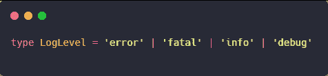
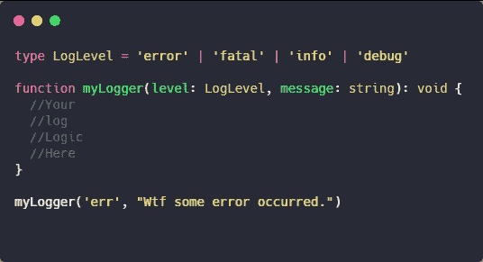
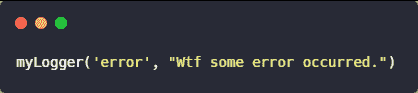
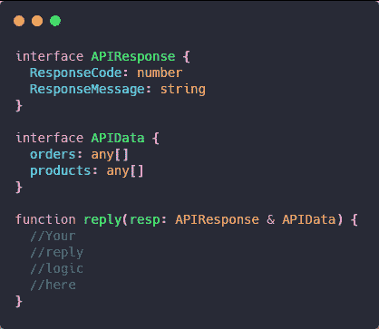
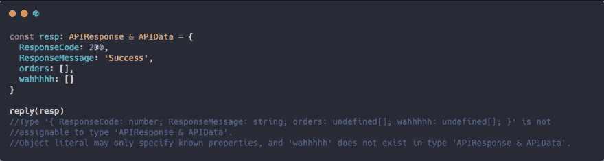
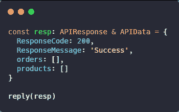

# 并集和交集类型

> 原文：<https://dev.to/macmacky/union-and-intersection-types-2p82>

### 嗨伙计们日安！

**|** 操作符告诉我们可以让**或者**在右边的表达式中选择一个类型或者值。

在这个例子中， **LogLevel** 类型意味着我们可以有一个值“**错误**”、“**致命**”、“**信息**”或“**调试**”。

在上面的例子中，我们创建了一个名为 **myLogger** 的函数，它有两个参数 **level** ，其类型为 **LogLevel** 和 **message** ，其值可以是**字符串**或**对象**。

我们调用 **myLogger** 函数，其值分别为**级别**和**消息**参数的**【err】**和**【Wtf some error occurs】**。如果您使用 **VS 代码**作为您的编辑器，将会看到一个编译时错误，并显示一条消息**“类型为“err”的参数不可分配给类型为“LogLevel”的参数。”**。显然这意味着 **"err"** 值与我们的类型 **LogLevel** 不兼容。

但是如果我们将**“err”**改为**“error”**，编译时错误将会消失。

**&** 操作符告诉我们可以**组合**右边表达式上的值或类型。

在上面的例子中，我们有两个接口 **APIResponse** 和 **APIData** 。
和一个叫**的函数回复**。 **resp** 参数具有 **APIResponse** 和 **APIData** 的**组合**类型，这意味着我们可以在 **resp** 参数中拥有两个接口的所有属性或成员。

在上面的例子中，我们制作了一个变量 **resp** ，它具有组合类型 **APIResponse** 和 **APIData** 。然后我们指定一个成员**wahhhh _ in _ _ resp**对象，它在两个接口中都不存在。将显示编译错误，并显示一条**类型的消息“{ response code:number；response message:string；订单:未定义[]；wahhhh:undefined[]；“}”不可赋给类型“APIResponse & APIData”。
Object literal 只能指定已知的属性，类型“APIResponse & APIData”中不存在“wahhhhh”。**。这表明**‘wahhhh’**属性显然在两个接口中都不存在。

但是如果我们将**“wahhhhhh”**改为**“产品”**，编译时错误将会消失。

感谢各位阅读这篇文章。

## 过得愉快😃！。