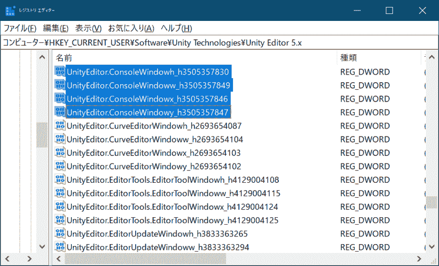
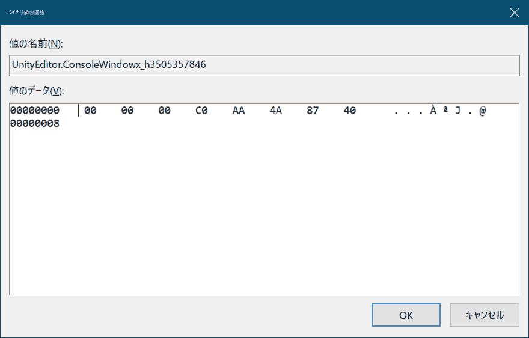

# 重置在 Unity 中移动到画面外的窗口的位置

> 原文：<https://dev.to/shiena/unity-38ii>

# 前言

有时会因为某种原因在 Unity 中将 Hierarchy 或 Console 窗口移动到画面外。 这个窗口是 Unity 独自管理的，所以不能用按照 OS 的方法移动，所以我设法调查了重置的方法。

# Windowsの場合

1.  退出 Unity。
2.  在注册表编辑器中打开`HKEY_CURRENT_USER\Software\Unity Technologies\Unity Editor 5.x`并查找类似的键。
3.  例如，在 Console 窗口中，因为像 scash 一样有坐标和大小 4 个键，所以打开`UnityEditor.ConsoleWindowx_h3505357846`和`UnityEditor.ConsoleWindowy_h3505357847`，用 0 复盖所有的值。 请注意，删除键本身或位数不同时不会反映出来。
4.  打开 Unity 时，屏幕左上角会显示一个窗口。

键名末尾的`_h3505357847`是哈希值，所以在找键名的时候可以无视。

[T6】](https://res.cloudinary.com/practicaldev/image/fetch/s--qoaffxPw--/c_limit%2Cf_auto%2Cfl_progressive%2Cq_auto%2Cw_880/https://dev-to-uploads.s3.amazonaws.com/i/hy36xrut9hsd5og9qdo1.png)

说句题外话，4K 显示器和全高清显示器混在一起，在 4K 端配置了 Unity，在全高清端配置了某个窗口的时候，自己的环境有可能会移动到画面外。 此时，将 Unity 移动到全 HD 侧，重置布局后重新启动 Unity，则移动到画面外的窗口的位置被重置。

# macOS 的情况

在`~/Library/Preferences/com.unity3d.UnityEditor5.x.plist`中保存了与 Windows 同样的设定，但是即使变更了也没有反映……