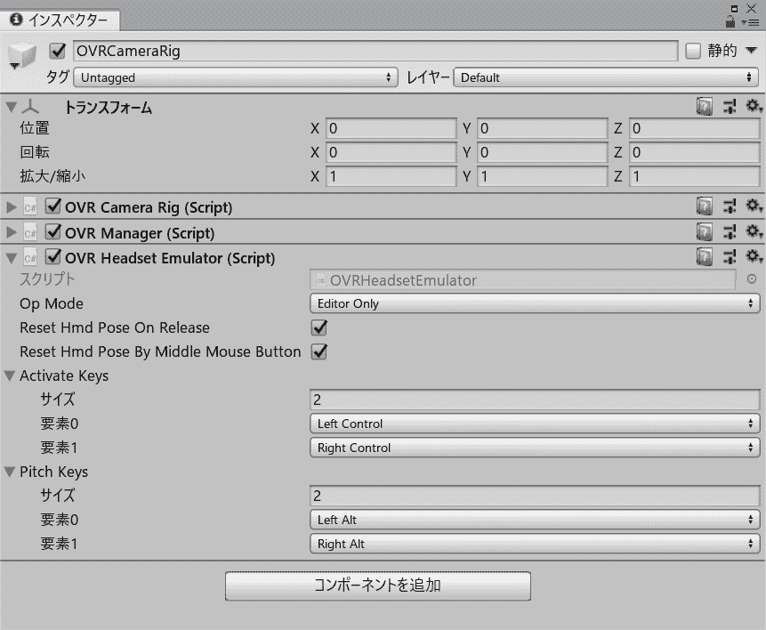

# 在 Unity 中修复面向 Oculus 的环境中损坏的 OVRHeadsetEmulator

> 原文：<https://dev.to/shiena/unity-oculus-ovrheadsetemulator-2clf>

# 前言

Unity 的 Oculus Integration 有一个`OVRHeadsetEmulator`，可以在编辑器上模拟摄像机的移动。

[](https://res.cloudinary.com/practicaldev/image/fetch/s---8I7Gpzs--/c_limit%2Cf_auto%2Cfl_progressive%2Cq_auto%2Cw_880/https://dev-to-uploads.s3.amazonaws.com/i/grz5hvcighfd7fsx2kva.png)

*   [https://developer . oculus . com/documentation/unity/latest/concepts/unity-HMD-emulation/](https://developer.oculus.com/documentation/unity/latest/concepts/unity-hmd-emulation/)
*   [https://qiita.com/numa08/items/8f67026b59f8b72174a3](https://qiita.com/numa08/items/8f67026b59f8b72174a3)

由于此组件附加到了`OVRCameraRig.prefab`和`OVRPlayerController.prefab`，所以可以立即使用，但是在 v1.38 和 v1.39 中支持 OpenVR 的时候就不动了。 因为是难得的方便组件，所以试着修改了一下使其工作。
※1.37 以前和 1.40 保持原样动作。

## correction method

在编辑器中忽略是否执行`InitOVRManager()`的判定。 这与 OpenVR 支持前的行为相同。

```
diff --git a/Assets/Oculus/VR/Scripts/OVRManager.cs b/Assets/Oculus/VR/Scripts/OVRManager.cs
index bff7d992..4f6f3d45 100644 --- a/Assets/Oculus/VR/Scripts/OVRManager.cs +++ b/Assets/Oculus/VR/Scripts/OVRManager.cs @@ -1294,7 +1294,9 @@ public class OVRManager : MonoBehaviour
        private void Awake()
        {
                //If OVRPlugin is initialized on Awake(), or if the device is OpenVR, OVRManager should be initialized right away.
+#if !UNITY_EDITOR
                if (OVRPlugin.initialized || (Settings.enabled && Settings.loadedDeviceName == OPENVR_UNITY_NAME_STR))
+#endif
                {
                        InitOVRManager();
                } 
```

# 另一方法

Oculus 的论坛也有修正方法，反转`OVRPlugin.initialized`执行`InitOVRManager()`。 但是这个属性没有文档，不知道行为，所以如上所述只在编辑器的时候更改比较安全。

*   [https://forums . oculus VR . com/developer/discussion/Comment/700778/# Comment _ 700778](https://forums.oculusvr.com/developer/discussion/comment/700778/#Comment_700778)
*   [http://Honda soft . com/2019/06/25/oculus-integration-1-38% E7 % 99% BB % E5 % A0 % B4 % EF % BC % 81/](http://hondasoft.com/2019/06/25/oculus-integration-1-38%E7%99%BB%E5%A0%B4%EF%BC%81/)

```
diff --git a/Assets/Oculus/VR/Scripts/OVRManager.cs b/Assets/Oculus/VR/Scripts/OVRManager.cs
index bff7d992..30ee8cde 100644 --- a/Assets/Oculus/VR/Scripts/OVRManager.cs +++ b/Assets/Oculus/VR/Scripts/OVRManager.cs @@ -1294,7 +1294,7 @@ public class OVRManager : MonoBehaviour
        private void Awake()
        {
                //If OVRPlugin is initialized on Awake(), or if the device is OpenVR, OVRManager should be initialized right away.
-               if (OVRPlugin.initialized || (Settings.enabled && Settings.loadedDeviceName == OPENVR_UNITY_NAME_STR)) +               if (!OVRPlugin.initialized || (Settings.enabled && Settings.loadedDeviceName == OPENVR_UNITY_NAME_STR))
                {
                        InitOVRManager();
                } 
```