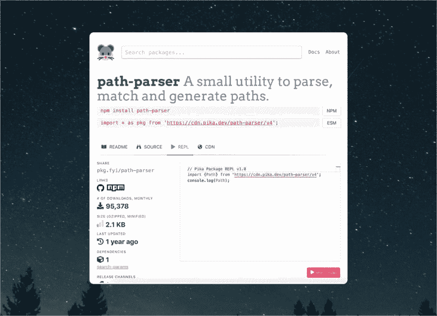
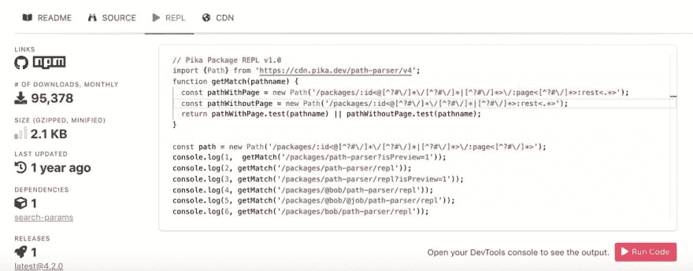
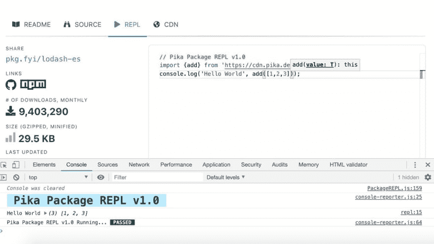

# 展开:介绍鼠兔 REPL

> 原文：<https://dev.to/pika/unrolled-introducing-the-pika-repl-1pbh>

今天我们发布了对 [pika.dev](https://www.pika.dev) 的新重写，其中包括一个新的[包 REPL](https://pika.dev/packages/async/repl) 用于包视图页面。这是刚刚在 Twitter 上宣布的，但我想我会展开并在这里快速转发所有感兴趣的人。

你可以在这里阅读我们的整个发布线程，包括今天所有的发布:[https://twitter.com/pikapkg/status/1158765492191911936](https://twitter.com/pikapkg/status/1158765492191911936)

什么是包裹 REPL？请继续阅读，寻找答案...

> 鼠兔📦@ Pikapkg✨介绍:pika 包 REPL
> 
> 直接在浏览器中测试包，不需要在本地安装任何东西。非常适合在将包引入重要项目之前快速评估它们。
> 
> 今天就试试:[pika.dev/packages/path-…](https://t.co/csuo48a64l)2019 年 8 月 06 日下午 16:0537

> 鼠兔📦@ pikapkg真实故事:当我们第二次使用这个特性时，我们最终需要它来快速测试我们自己站点的路径解析逻辑。我们可以快速迭代代码片段，而不是调试整个应用程序...就在浏览器中🤘2019 年 8 月 06 日下午 16:0500

> 鼠兔📦@ pikapkg这是由 ristretto 内部提供的:一个来自 Polymer 团队的非常整洁的模块化测试库。
> 
> 2019 年 8 月 06 日下午 16:0501

## [polymer labs](https://github.com/PolymerLabs)/[ristretto](https://github.com/PolymerLabs/ristretto)

### 一个可扩展的测试跑步者☕️

<article class="markdown-body entry-content container-lg" itemprop="text">

*<g-emoji class="g-emoji" alias="rotating_light" fallback-src="https://github.githubassets.cimg/icons/emoji/unicode/1f6a8.png">🚨</g-emoji> **项目状态:实验性** <g-emoji class="g-emoji" alias="rotating_light" fallback-src="https://github.githubassets.cimg/icons/emoji/unicode/1f6a8.png">🚨该产品正处于试验阶段。团队中有人认为这是一个值得探索的想法，但可能不会比这更进一步。使用风险自担。</g-emoji>*

# 里斯特雷托

Ristretto 是一个可扩展的测试运行程序。

JavaScript 生态系统中有几个成熟的测试者( [Mocha](https://mochajs.org/) 、 [Jasmine](https://jasmine.github.io/) 和 [Jest](https://facebook.github.io/jest/) 举几个比较突出的例子)。Ristretto 的创建是为了解决现有项目未能解决的特性最佳点。

Ristretto 具有以下品质:

*   简单、简洁、基于类的因子分解
*   可作为模块使用，带有浏览器兼容的路径说明符 OOB
*   最流行的测试语法(BDD/TDD)包含电池
*   为可扩展性而设计(mixins、专用报告器和规范作为数据结构的理念)
*   附带 mixinss，这些 mixin 通过强大的功能增强了规格(例如，夹具和测试隔离)
*   用打字稿创作
*   不需要使用构建工具
*   “JavaScript 是本地语言，网络是……

</article>

[View on GitHub](https://github.com/PolymerLabs/ristretto)

> 鼠兔📦@ pikapkg您的代码片段是作为一个假的 ristretto“测试”运行的，在沙盒 iframe 中，直接在浏览器中。打开开发工具，你会看到任何控制台输出！2019 年 8 月 06 日下午 16:0501

> 鼠兔📦@ pikapkg这只是一个开始，我们会在接下来的几个月里继续添加！两个我迫不及待的补充:
> 1⃣包类型定义&类型检查
> 2⃣日志输出/错误到页面如果你在移动2019 年 8 月 06 日下午 16:1500

额外收获:想知道在 REPL 使用一个软件包后它是如何工作的吗？

> 鼠兔📦@ pikapkg“源代码”标签是另一个非常有用但又微妙的附加功能:一个内置在页面中的 [@unpkg](https://twitter.com/unpkg) 浏览器。
> 
> 不离开 Pika 查看任意包源，或者点击顶部链接直接进入[unpkg.com](https://t.co/CekBJwNeOl)。2019 年 8 月 06 日下午 16:3600