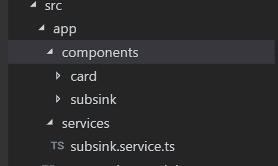
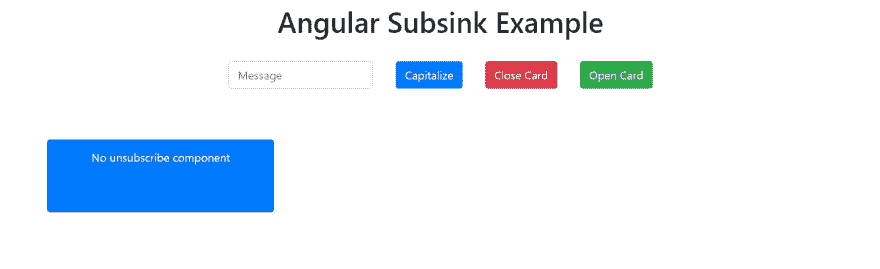
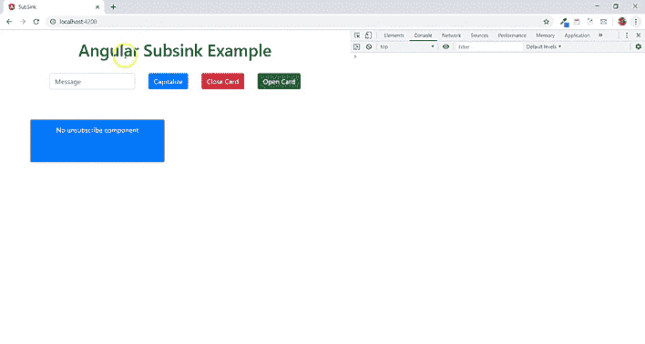
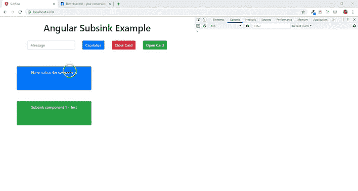

# 使用 sunsilk 取消订阅 rxjs 订阅

> 原文：<https://dev.to/uzochukwueddie/unsubscribe-from-rxjs-subscriptions-using-subsink-3ick>

在本文中，我们将学习如何使用子链接模块取消订阅 rxjs 订阅。

Angular 使用 RxJS 作为 Angular 应用程序的主干。RxJS 是一个 javascript 库，它给我们带来了网络反应式编程的概念。换句话说，RxJS 是一个库，它使用 observables 来更容易地编写回调基代码或异步代码 [RxJS Docs](https://rxjs-dev.firebaseapp.com/) 。

RxJS 使用了可观测量和观察者的概念，其中可观测量是数据的来源，观察者使用数据。每当一个可观察对象产生数据时，观察者就会得到通知，数据在 subscribe 方法中得到处理。需要注意的是，如果这种订阅处理不当，可能会导致内存泄漏。

另外，为了防止由于可观察的订阅而导致的内存泄漏，可以使用来自 RxJS 的不同方法或操作符以及模块。

让我们构建一个示例 angular 应用程序，然后使用子链接模块来取消订阅。

# 应用程序设置

首先，我们需要创建一个新的 angular 项目(假设您有 angular cli)。运行命令

```
ng new sub-sink 
```

安装引导程序 4

```
npm i bootstrap 
```

将此添加到您的 styles.css 文件

```
@import '~bootstrap/dist/css/bootstrap.min.css'; 
```

我们需要两个新组件和一个服务。第一个组件将只订阅可观察对象，而第二个组件将使用子链接订阅可观察对象，然后在组件的 ngOnDestroy 方法中取消订阅。该服务将包含两个简单的方法。

生成一个组件

```
ng g component components/card
ng g component components/subsink 
```

ng generate 命令在组件目录中创建两个组件。组件目录是可选的。

接下来，创建服务文件

```
ng g s services/subsink --flat --skipTests=true 
```

添加到上述命令中的标志选项将创建不带规范的服务文件，并有自己的目录。

[](https://res.cloudinary.com/practicaldev/image/fetch/s--s1UV0Zif--/c_limit%2Cf_auto%2Cfl_progressive%2Cq_auto%2Cw_880/https://thepracticaldev.s3.amazonaws.com/i/lxr38btcefoe9h1cnaqs.PNG)

在服务文件中，添加

```
private capitalizeFirstLetter$ = new Subject();

constructor() { }

capitalizeFirstLetter(value: string) {
    if (typeof value === undefined) {
      return;
    }
    let str = value.charAt(0);
    str = str ? str.toUpperCase() + value.slice(1) : '';
    this.capitalizeFirstLetter$.next(str);
}

getString() {
    return this.capitalizeFirstLetter$;
} 
```

同样，导入主题

```
import { Subject } from 'rxjs'; 
```

`capitalizeFirstLetter`方法只是将字符串的第一个字母转换成大写，然后将值传递给主题[(文档)](https://rxjs-dev.firebaseapp.com/guide/subject)的`next`方法，主题是属性`capitalizeFirstLetter$`。`getString`方法返回传递给主题的下一个方法的值。

添加到 app.component.ts 文件

```
showCards = true;

constructor(private subsinkService: SubsinkService) {}

capitalizeFirstLetter(value) {
    this.subsinkService.capitalizeFirstLetter(value);
}

displayCards() {
    this.showCards = true;
}

hideCards() {
    this.showCards = false;
} 
```

并且还导入子链接服务

```
import { SubsinkService } from './services/subsink.service'; 
```

`capitalizeFirstLetter`方法从子链接服务获取将首字母转换成大写的方法。`displayCards`方法使用`showCards`属性显示组件的卡片，而`hideCards`隐藏组件。

将这些代码添加到 app.component.html 模板文件中。它包含一个窗体和作为子窗体的组件。

```
<br>
<div class="container" style="text-align: center">
  <h1>Angular Subsink Example</h1>
  <br>
  <div class="row mt-12" >
    <form class="form-inline" style="margin: 0 auto; text-align: center">
      <div class="form-group mx-sm-3">
        <input type="text" class="form-control" #field placeholder="Message">
      </div>
      <div class="form-group mx-sm-3">
        <button type="button" class="btn btn-primary" (click)="capitalizeFirstLetter(field.value)">Capitalize</button>
      </div>
      <div class="form-group mx-sm-3">
        <button type="button" class="btn btn-danger" (click)="hideCards()">Close Card</button>
      </div>
      <div class="form-group mx-sm-3">
        <button type="button" class="btn btn-success" (click)="displayCards()">Open Card</button>
      </div>
    </form>
  </div>
  <br>
  <div class="row mt-5">
    <app-card *ngIf="showCards"></app-card>
  </div>
  <div class="row mt-5">
    <app-subsink *ngIf="showCards"></app-subsink>
  </div>
</div>

<router-outlet></router-outlet> 
```

[](https://res.cloudinary.com/practicaldev/image/fetch/s--ducncLLo--/c_limit%2Cf_auto%2Cfl_progressive%2Cq_auto%2Cw_880/https://thepracticaldev.s3.amazonaws.com/i/ucue5mppbzsresddcpef.PNG)

该模板由一个带有输入和三个按钮表单组成。第一个按钮调用`capitalizeFirstLetter`方法，第二个按钮用于隐藏卡片，第三个按钮用于显示卡片。默认情况下，会显示卡片。

现在要在 card 组件中使用`getString`方法，添加到 card.component.ts 文件中，并导入子链接服务文件

```
name = 'No unsubscribe component';
message: string;

constructor(private subsinkService: SubsinkService) { }

ngOnInit() {
    this.subsinkService.getString()
      .subscribe((message: string) => {
        this.message = message;
        console.log(`${this.name} - ${message}`);
      });
} 
```

```
import { SubsinkService } from './../../services/subsink.service'; 
```

定义了名称和消息变量。子链接服务被注入到类的构造器中。在 ngOnInit 方法中，我们订阅了`getString`方法，然后控制台记录这些值。卡模板文件中使用了消息和名称属性。

```
<div class="col">
  <div class="card text-center bg-primary text-white" style="width: 20rem;">
    <div class="card-header">{{name}}</div>
    <div class="card-body">
      <h5 class="card-title">{{message}}</h5>
    </div>
  </div>
</div> 
```

[](https://res.cloudinary.com/practicaldev/image/fetch/s--Scgc-vUb--/c_limit%2Cf_auto%2Cfl_progressive%2Cq_66%2Cw_880/https://thepracticaldev.s3.amazonaws.com/i/68vpfzrw1xml69gcydkj.gif)

您可以在上面看到，当用户键入一个值，然后单击大写按钮时，它会在卡组件中显示文本，并在浏览器的控制台中记录一些值。这是正常的行为，因为组件在 DOM 中是活动的。当单击 close card 按钮并且卡片被销毁时，您可以看到，当单击 capitalize 按钮时，组件仍然订阅 RxJS 可观察值。这不是我们想要的行为，这是不退订可观察的结果。如果这种行为持续下去，将会导致内存泄漏。

修复该行为的许多解决方案之一是使用子链接模块 [(npm)](https://www.npmjs.com/package/subsink) 。该模块吸收数组中的 RxJS 订阅，当调用 unsubscribe 方法时，它会优雅地取消订阅所有添加的订阅。

首先，安装子链接模块

`npm i subsink`

将它添加到 the subsink.component.ts 文件中，并导入子链接模块和服务文件

```
name = 'Subsink component 1 - Test';
message: string;

private subs = new SubSink();

constructor(private subsinkService: SubsinkService) { }

ngOnInit() {
  this.subs.sink = this.subsinkService.getString()
    .subscribe((message: string) => {
      this.message = message;
      console.log(`${this.name} - ${message}`);
    });
}

ngOnDestroy() {
  this.subs.unsubscribe();
} 
```

```
import { SubSink } from 'subsink';
import { SubsinkService } from 'src/app/services/subsink.service'; 
```

就像我们对 card 组件所做的一样，我们在这里添加了额外的子链接属性。创建子链接类的一个实例。然后，`getString`方法的订阅被设置为等于 SubSink 类的 sink 属性。

```
this.subs.sink = this.subsinkService.getString()
  .subscribe((message: string) => {
    this.message = message;
    console.log(`${this.name} - ${message}`);
  }); 
```

`sink`属性用于分配订阅，以便将其添加到被跟踪的订阅中。该订阅在 ngOnDestroy 方法中被移除。也就是说，当组件被破坏时。添加模板

```
<div class="col">
  <div class="card text-center bg-success text-white" style="width: 20rem;">
    <div class="card-header">{{name}}</div>
    <div class="card-body">
      <h5 class="card-title">{{message}}</h5>
    </div>
  </div>
</div> 
```

[](https://res.cloudinary.com/practicaldev/image/fetch/s--lfyAb9Zy--/c_limit%2Cf_auto%2Cfl_progressive%2Cq_66%2Cw_880/https://thepracticaldev.s3.amazonaws.com/i/pjvk25kgj92yi4u6uhvj.gif)

从上图可以看出，当 DOM 中的两个组件都处于活动状态时，它们订阅了 Observable，但是当两个组件都被销毁时，subsink 组件的订阅会停止，而另一个 card 组件仍会订阅。在上面的代码中，只有一个订阅。可能会出现在同一个类中需要多个订阅的情况。子链接提供了一种方法，可用于将所有订阅添加到数组中，并一次性自动取消订阅。

将这段代码添加到模板文件

```
<div class="col">
  <div class="card text-center bg-warning text-white" style="width: 20rem;">
    <div class="card-header">{{name2}}</div>
    <div class="card-body">
      <h5 class="card-title">{{msg}}</h5>
    </div>
  </div>
</div> 
```

此外，向子链接组件类添加

```
name2 = 'Subsink component 1 - Test';
msg: string;

subSinkSubscriptions() {
  this.subs.add(
    this.subsinkService.getString()
      .subscribe((message: string) => {
        this.message = message;
        console.log(`${this.name} - ${message}`);
      }),
    this.subsinkService.getString()
      .subscribe((message: string) => {
        this.msg = message;
        console.log(`${this.name2} - ${message}`);
      })
  );
} 
```

注释 ngOnInit 方法中的代码，并添加这个新方法

```
this.subSinkSubscriptions(); 
```

在上面的方法中，来自 subsink 的`add`方法用于将订阅添加到被跟踪的订阅中。使用这个`add`方法，您可以向数组添加多个订阅，并在组件被销毁时取消订阅。

# 结论

当一个组件被销毁时，需要手动取消订阅所有的自定义观察器。子链接方法不是可用于取消订阅 RxJS 观察值的唯一可用方法。有来自 RxJS 的运算符像`takeWhile`和`takeUntil`可以使用。此外，AsyncPipe 可以用来取消订阅一个可观察对象，以及从 RxJS `Subscription`类取消订阅的方法。

[点击此处](https://github.com/uzochukwueddie/ng-subsink-unsubscribe)找到示例应用的 github repo。

[如果你喜欢看这篇文章的视频教程，你可以点击这里查看](https://youtu.be/gg3LxW-5_Y4)

如果你对更多与角度相关的东西感兴趣，你可以关注我的 [Twitter](https://twitter.com/uzochukwueddie) ，也可以订阅我的 [YouTube 频道](https://www.youtube.com/channel/UCqTEGhqVPcjfhs7_bQjnoRA/videos?view_as=subscriber)。