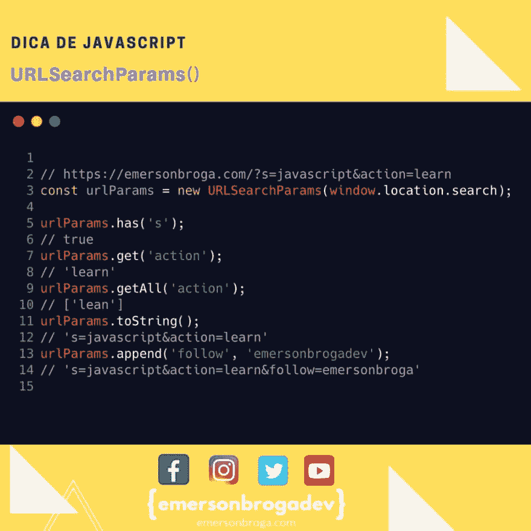

# URLSearchParams()

> 原文：<https://dev.to/emersonbroga/urlsearchparams-4pej>

个人化的浪潮，

在今天的提示中，我将展示 URLSearchParams()！

在 JavaScript 中使用 url 参数的简单方法！

[Participe da nossa lista de devs](http://emersonbroga.com/e/participe/)

# javascript #react #nodejs