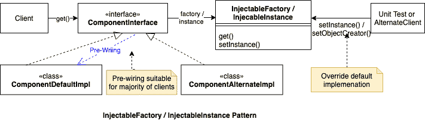

# 使用 InjectableFactory 代替依赖注入

> 原文：<https://dev.to/jianwu/use-injectablefactory-instead-of-dependency-injection-5747>

依赖注入几乎已经成为一种宗教信仰，人们错误地认为它是所有依赖耦合和测试问题的最终解决方案。对于 DI 框架，人们试图用 DI everything 方法来滥用 DI。出于单元测试的目的，人们试图暴露所有导致巨大意外复杂性的内部依赖。虽然 DI 适合于公开显式依赖，但它不是公开隐式依赖的合适工具，隐式依赖是实现细节，应该尽可能隐藏得深。

在后端和静态类型的语言社区中，我看到很多组织使用 DI 框架只是为了寻求 DI 作为一种信仰，而忘记了它试图解决的实际问题是什么。开发人员遭受了很多痛苦，但仍然毫不犹豫地坚持下去。DI 框架已经成为一个巨大的生产力杀手，也是代码模糊、脆弱和不可维护的原因。在前端和动态类型语言社区如 ruby、javascript 中，情况要好得多，人们试图用更务实和创造性的方法来解决单元测试问题。但是一些前端框架，比如 Angular，仍然坚持在它的核心中使用 DI 概念，这导致了不必要的复杂性，阻碍了它的采用。

作为一个组件设计者，我们应该总是**为用户设计，而不是测试**。我们不想仅仅为了测试而污染使用边界。对于可测试性和定制，除了 DI 还有更好的选择。在这里，我将介绍一种静态类型语言的替代方案**可注入工厂** / **可注入实例**。该模式还与以下模式相关:工厂、单例、服务定位器、可变单例、可变值容器和[环境上下文](https://freecontent.manning.com/the-ambient-context-anti-pattern/)。根据 DI 的书，这些都被认为是反模式。但是 InjectableFactory 的设计避免了它们的警告，并且在实践中很好地解决了我们的问题。

下面是模式图:
[](https://res.cloudinary.com/practicaldev/image/fetch/s--45Ldp8dH--/c_limit%2Cf_auto%2Cfl_progressive%2Cq_auto%2Cw_880/https://cdn-images-1.medium.com/max/1600/1%2AkVWq0EUn-cM6-pDxNZ19Iw.png)

这里有一个如何使用`InjectableInstance`的例子。`TimeProvider`是对系统`Date`的抽象，因此应用程序可以通过调用`TimeProvider.get()`而不是使用`new Date()`来获得系统时间，以避免对系统日期的直接依赖。所以在单元测试中，我们可以很容易地模仿`TimeProvider`来模拟不同的时刻。

```
public interface TimeProvider {
  InjectableInstance<TimeProvider> instance = InjectableInstance.of(Impl.class);  //【1】
  static TimeProvider get() { return instance.get(); }                            //【2】

  class Impl implements TimeProvider {                                            //【3】
    @Override public Date getDate() { return new Date(); }
    @Override public long getTimeMillis() { return System.currentTimeMillis(); }
  }

  @Accessors(chain = true)
  class Mock implements TimeProvider {                                            //【4】
    @Setter @Getter long timeMillis = System.currentTimeMillis();
    @Override public Date getDate() { return new Date(timeMillis); }
    public void add(long offset) { timeMillis += offset; }
  }

  Date getDate();
  long getTimeMillis();
}

// OrderService will use TimeProvider
public class OrderService {
  public final static InjectableInstance<OrderService> instance
      = InjectableInstance.of(OrderService.class);
  static OrderService get() { return instance.get(); }

  public CreateOrderResponse createOrder(CreateOrderRequest request) {
    // ....
    Order order = new Order().setCreated(TimeProvider.get().getDate());           //【5】
    // ...
    return new CreateOrderResponse().setOrder(order);
  }

  public final static long EXP_TIME = 24 * 3600 * 1000; // 24 hours
  public boolean isOrderExpired(Order order) {
    return TimeProvider.get().getTimeMillis() - order.getCreated().getTime() > EXP_TIME;
  }
}

// In Unit test
public class OrderServiceTest {
  private final static TimeProvider.Mock timeMock = new TimeProvider.Mock();     //【6】

  @Before public void before() {
    TimeProvider.instance.setInstance(timeMock);                                 //【7】
  }

  @Test public void testOrderExpired() {
    CreateOrderResponse resp = OrderService.get().createOrder(new CreateOrderRequest());
    assertEqual(timeMock.getDate(), resp.getOrder.getCreated());

    timeProviderMock.add(3600 * 1000);  // 1 hour passed                         //【8】 
    assertFalse(OrderService.get().isOrderExpired(resp.getOrder()));

    timeProviderMock.add(48 * 3600 * 1000);  // 2 days passed
    assertTrue(OrderService.get().isOrderExpired(resp.getOrder()));
  }
} 
```

[可注入工厂](https://github.com/eBay/jsonex/blob/master/core/src/main/java/com/jsonex/core/factory/InjectableFactory.java)和[可注入实例](https://github.com/eBay/jsonex/blob/master/core/src/main/java/com/jsonex/core/factory/InjectableInstance.java)很容易从头实现。我们在开源项目 [jsonex](https://github.com/eBay/jsonex) 中有一个参考实现，它们只是非常简单的类，没有任何外部依赖性。关于如何使用它的完整示例代码，请参考 [github repo](https://github.com/jianwu/InjectableFactorySample)

关于更详细的信息和背后的哲学，你可以看看我的媒体博客:[依赖间接注入工厂](https://medium.com/@jianwu_23512/dependency-indirection-with-injectable-factory-d6f2f60cced1)