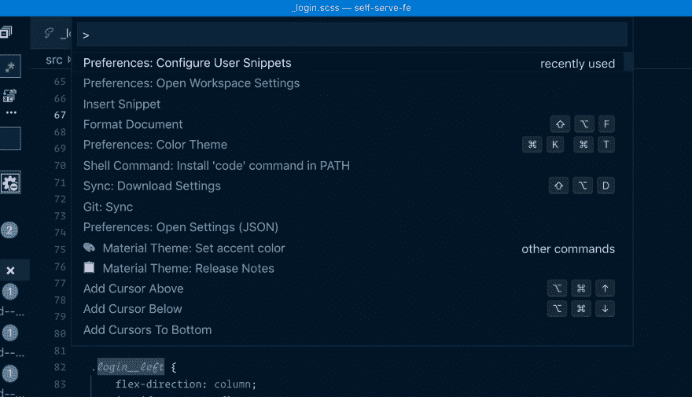
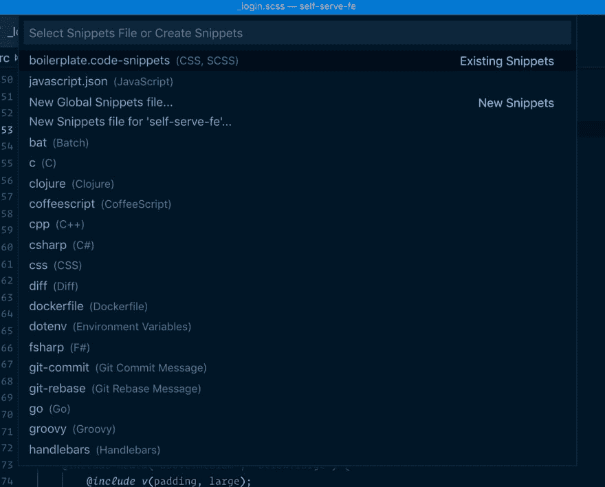
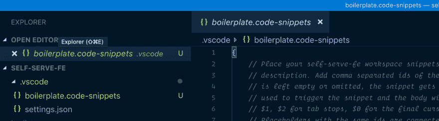
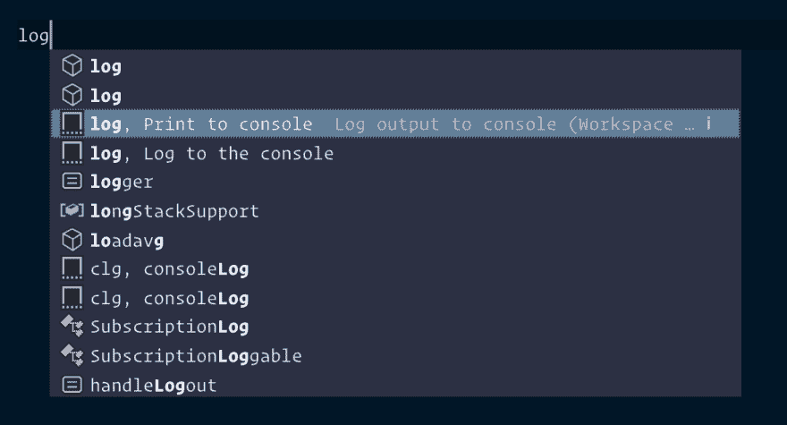

# 在 VS 代码中使用代码片段，以提高您的生产力和简化您的工作！

> 原文：<https://dev.to/iamarek/use-snippets-in-vs-code-to-boost-your-productivity-and-simplify-your-work-1nim>

先说片段。您多久重复一次存储库中代码的特定部分，或者寻找某种混合或函数的语法？

您需要使用媒体查询或函数的频率有多高，而您只是希望尽可能快地键入并继续您的代码？

有一个非常简单的方法可以让这个过程变得更加愉快。您可以创建代码片段，这将提高您的工作效率👏L👏O👏T.

# 工作原理

让我们以媒体查询为例。而不是键入:

```
@media screen and (min-width: $breakpoint-desktop) {

} 
```

你可以简单地输入(这只是一个例子)`md`并按回车键。这将创建上面的结构，并将制表器放入其中。

您可以创建多个这样的片段，您可以在其中定义:

(*命名约定这里只是一个例子*

`mm` -移动媒体
`mt` -平板媒体
`md` -桌面媒体

您可以使用稍微不同的方法，将 min-width 留空，并在按 enter 键后填充它(这样您就不必为同一目的创建多个代码片段)

# 用例

片段的一些简单用例:

1)您的样板文件中有您不需要/不想记住的自定义混音。也许您已经习惯了您使用的其他样板文件中的不同语法，并且您希望通过创建代码片段来统一这些语法。

2)你厌倦了每次调试时都键入`console.log()`。

3)你讨厌键入@media 查询。

4)你有一些自定义的 SCSS 函数。

5)你讨厌为你的 React 组件创建导入和函数的结构。

和👏因此👏很多👏更多

# 让我们构建我们的代码片段

1)打开您想要处理的项目的 VS 代码
2)点击`⌘ + ⇧ + P`，这将打开命令列表(在 Windows 上为 ctrl+shift+p)。

[](https://res.cloudinary.com/practicaldev/image/fetch/s--GM0WHXTS--/c_limit%2Cf_auto%2Cfl_progressive%2Cq_auto%2Cw_880/https://thepracticaldev.s3.amazonaws.com/i/vpqelneztf36d1f8rap0.png)

3)搜索`Preferences: Configure User Snippets`。这将打开另一个模态，而不是命令列表。

[](https://res.cloudinary.com/practicaldev/image/fetch/s--JuhAZkTr--/c_limit%2Cf_auto%2Cfl_progressive%2Cq_auto%2Cw_880/https://thepracticaldev.s3.amazonaws.com/i/jkvikugeykzf5lg529ef.png)

4)这里我们有几个不同的选项:

*   创建将在所有存储库中工作的全局片段(选择`New global snippets file`)。

*   创建本地片段，这些片段将在单个存储库中工作(选择`New snippets file for '<NAME_OF_YOUR_REPOSITORY'>`)。

*   选择要为其创建代码片段的编程语言。

5)如果您选择本地片段，这将在您的存储库中创建一个包含文件的`.vscode`文件夹。该文件将有一个片段的例子，您可以使用它作为起点。

[](https://res.cloudinary.com/practicaldev/image/fetch/s--3x4flp5x--/c_limit%2Cf_auto%2Cfl_progressive%2Cq_auto%2Cw_880/https://thepracticaldev.s3.amazonaws.com/i/x39wumyf6v7oe0niqxny.png)

6)现在，当您准备好文件后，让我们从文件中选取示例并尝试理解它。

```
"Print to console":  {  "scope":  "javascript,typescript",  "prefix":  "log",  "body":  [  "console.log('$1');",  "$2"  ],  "description":  "Log output to console"  } 
```

# 逐行

1) `"Print to console"`是对代码片段的描述，它将帮助您在建议选项中找到它。

[](https://res.cloudinary.com/practicaldev/image/fetch/s--Lg1TXwV_--/c_limit%2Cf_auto%2Cfl_progressive%2Cq_auto%2Cw_880/https://thepracticaldev.s3.amazonaws.com/i/2c189cqo8jjusfxq5qec.png)

2)在`"scope"`中，你需要添加你需要代码片段工作的所有语言(你不希望看到 console.log 代码片段编写你的 CSS，对吗？)

3) `"prefix"`实际上是一个名字，你需要在你的代码中输入这个名字来让代码片段工作。

4) `"body"`是最重要的部分。它是一个数组，接受字符串，每个字符串是下一行代码(在本例中，代码片段将创建两行代码)。你可能注意到了身体内部的`$1`和`$2`。这些是制表位。这意味着在你使用代码片段后，制表器将首先在`$1`停止，在下一次点击 tab 键后，它将跳转到`$2`。那超级有用。

> 你也可以使用`\n`来创建一个新的行，并保持整个主体为一个单独的字符串

5) `"description"`，那只是一个更长的描述片段。

就是这样。您刚刚创建了自己的代码片段！👏👏👏

# 几个片段的例子

```
"Media queries mixin":  {  "scope":  "css, scss",  "prefix":  "rwd",  "body":  [  "@include rwd($1) {",  "  $2",  "}"  ],  "description":  "Snippet is using custom mixin from boilerplate"  } 
```

```
"React with Styled-Components":  {  "prefix":  "rs",  "body":  [  "import React from 'react';",  "import styled from 'styled-components';",  "",  "const $1 = () => (",  "  $2",  ");",  "",  "export default $1;"  ]  } 
```

```
"setTimeout":  {  "prefix":  "st",  "body":  [  "setTimeout(() => {",  "$1",  "}, $2)",  ],  "description":  "SetTimeout function"  } 
```

对你来说，片段最常见的用例是什么？请在评论中告诉我！

PS。有很多扩展为特定目的提供了代码片段(React 代码片段、Vue 代码片段、ES6 代码片段、SCSS 代码片段等)。)

# 其他 VS 代码提示&招数

*   [在 VS 代码中操作多个窗口](https://dev.to/iamarek/working-on-multiple-windows-in-vs-code-style-title-bars-to-increase-your-productivity-2oii)