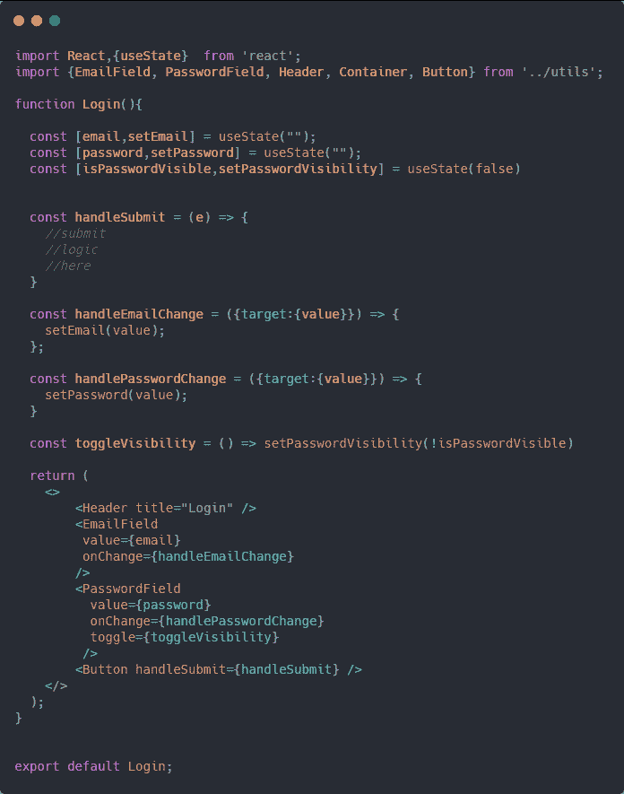
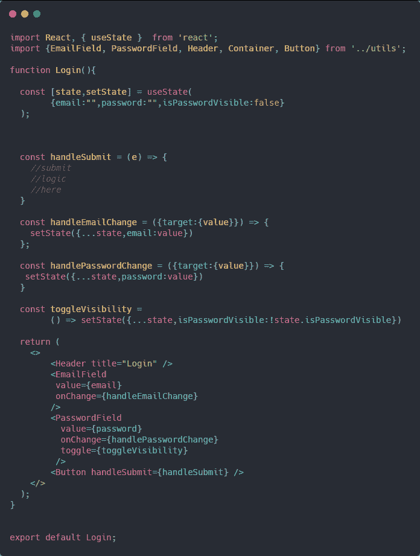
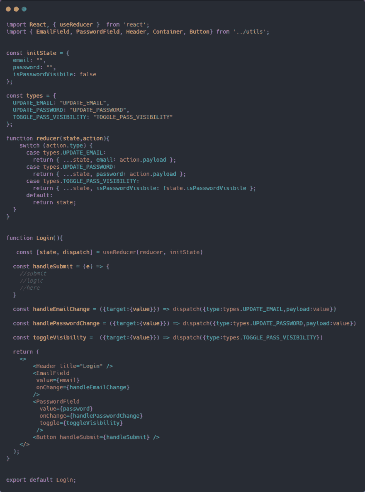

# useReducer === Redux 的缩减器

> 原文：<https://dev.to/macmacky/usereducer-redux-s-reducer-4jee>

嗨，下午好。

在发布几天后，我一直在使用钩子 API。
我花了很长时间才意识到我一直在代码中的任何地方使用 **useState** 钩子。

也许我可以把我的代码改成这样，让它看起来更干净。
[T3】](https://res.cloudinary.com/practicaldev/image/fetch/s--tDHKAkvg--/c_limit%2Cf_auto%2Cfl_progressive%2Cq_auto%2Cw_880/https://thepracticaldev.s3.amazonaws.com/i/9q6z42dy85xxddtbhahr.png)

是的，看起来比第一个干净。但是有一天，我回到文档，读了几分钟后，意识到 **useState** 并不意味着对象或任何复杂的数据。这种用法的挂钩是 **useReducer** 。

基本上， **useReducer** 钩子将一个函数作为第一个参数，第二个参数是初始状态。**缩减器**是一个纯粹的函数，它获取前一个状态和一个动作，并返回下一个状态
或基于被分派的动作的更新状态。如果你之前用过 **Redux** ，那你就知道我在说什么了。

下面是使用 **useReducer** 钩子更新的代码。
T3T5】

这里要记住的重要事情是**阅读文档**。
有时文档中会有一些你无法理解的单词或概念，但这在这个领域是意料之中的。除了**阅读**和**理解**文档会让你成为更好的开发者。

谢谢😄！祝大家有美好的一天👍。