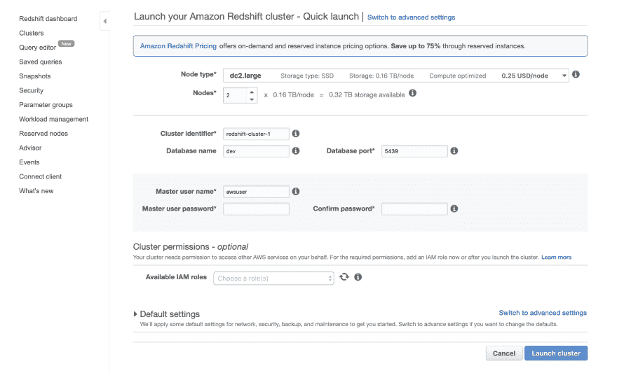
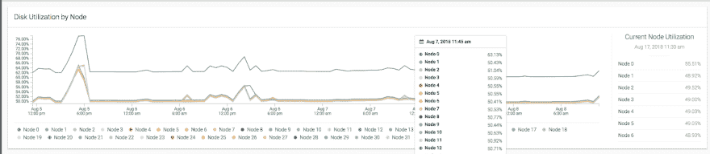

# 使用亚马逊红移作为您的数据仓库

> 原文：<https://dev.to/hackersandslackers/using-amazon-redshift-as-your-data-warehouse-3ldm>

[](https://res.cloudinary.com/practicaldev/image/fetch/s--pL26e7TO--/c_limit%2Cf_auto%2Cfl_progressive%2Cq_auto%2Cw_880/https://hackersandslackers.com/conteimg/2019/07/redshift.jpg)

Redshift 正迅速取代其位置，成为世界上最受欢迎的将大量淫秽数据转储到存储器的解决方案。很高兴看到优秀的服务蓬勃发展，而笨重的基于 Hadoop 的堆栈却在经历漫长而痛苦的死亡。无论您是在数据科学、数据工程还是分析领域，我们所有人使用世界上最流行的数据仓库只是时间问题。

虽然红移的崛起是理所应当的，但任何服务的一致流行都会带来问题...也就是说，默认任何事实上的行业解决方案所带来的知识差距。我们大多数人仅仅因为是 AWS 的客户而被默认锁定在红移。虽然我们节省了研究和比较解决方案的时间，但这可能会以回答一些重要问题为代价，比如“为什么要红移？，“或者“我该如何开始做这件事？”如果你在寻找一些容易消化的平庸答案，你来对地方了。

## 引擎盖下

如果你碰巧是红移或数据仓库的新手，你会很高兴。如果关系数据库是本田 Civics，Redshift 就是一级方程式赛车。虽然一级方程式赛车可能在各种指标上超过你的本田，但 F1 赛车的保养和维护费用会使它不适合休闲使用。有效地使用红移比构建一个区分 ACID 事务优先级的系统需要更多的底层数据库技术知识。

与传统的数据库相比，数据仓库做出了大量的权衡来优化对大量数据的分析。维护一个红移星团需要大量的工作。因此，在做出如此重大的架构决策之前，理解红移的利弊是至关重要的(这个概念已经被比我更聪明的人阐述过了)。

### 红移聚类

每个红移集群都由多台机器组成，每台机器只存储我们数据的一小部分。这些机器中的每一台都并行工作来保存和检索数据，这给我们应该如何处理数据增加了大量的复杂性。

执行计算的节点被称为**计算节点**。这些节点由一个**领导节点**管理，该节点负责管理其他节点之间的数据分发和查询执行。

每个计算节点实际上被分成多个分区，这些分区本身被称为**片**。根据群集中节点的大小，每个计算节点可能支持 2-32 个片。每个**片**是一个单独的分区，包含我们数据集的一部分。当切片的数据分布接近相等时，红移的性能最佳。当数据不均衡地分布在各个片上时，这种现象称为**偏斜**(我们稍后会谈到如何针对偏斜进行优化)。

红移可以在一个集群中容纳可变数量的机器，从而使红移**在水平方向上可伸缩**，这是一个关键优势。红移可以几乎无限地向外扩展，这使得红移非常适合于我们需要查询大量数据的情况。

### 面向列的数据库管理系统

红移对于数据分析来说很棒，但是我们*不应该*使用红移来驱动生产就绪的应用。要理解为什么一个考虑因素无疑是**列存储**的相关权衡。Redshift 是一个面向列的数据库管理系统，这意味着我们的数据是按*列*而不是*行*进行分区的。

在传统数据库中，为行分配一个索引**来惟一地标识行:通过索引检索一行将返回该行的全部内容。有索引的关系数据库比没有索引的关系数据库执行速度快得多，因为查询按逻辑排序的行更快。要理解为什么，想象一下我让你试着在一个凌乱的车库里找东西。如果我要求找到“我放在这里的前 100 件物品”，如果我先把所有的东西按照我放入车库的顺序排列好，完成起来会容易得多。**

列数据库利用传统索引的优势来解决一个随着规模变得越来越重要的问题:*从磁盘读取记录的时间*。如果您的表有数百万行和数以吨计的列，仅仅检索整行就会产生瓶颈。通过*列*对数据进行分区意味着每次我们从一个分区中检索一个值时，我们现在只能从每个分区中检索一个值:这大大减少了我们在硬盘上的负载，从而提高了处理大量数据的整体速度。

当处理用户信息或事务等生产级信息时，保持应用程序运行所需的数据相对较少。在发生大量数据库交互时，应用程序应该优先考虑保持功能正常和尽量减少数据丢失。数据仓库解决了一个不同的问题，它允许以一种高性能的方式对大量数据进行分析，通常在任何给定的时间处理少量的事务。

### 关于红移光谱的一个注记

通过首先将数据移入作为静态文件(CSV、JSON 等)存储在 S3 存储桶中的文件，将数据添加到红移中。一旦到了 S3，数据就可以加载到 Redshift 中。这个**流水线> S3 >红移**的工作流程被**红移谱**的引入稍微改变了一下。

与常规红移不同，**红移谱**可以直接查询跨 S3 桶存储的数据。这可以让那些不一定想为出现在他们面前的每条数据编写脚本的人的生活变得轻松一些:这是一种筛选大量历史数据以满足特定请求的好方法。我们现在不会太关心红移光谱。

### 定价

红移按正常运行时间收费，最小的单节点集群每小时收费**$ 0.25**。运行单节点集群毫无意义，因此可以很有把握地假设任何生产红移集群每小时至少要花费 1 美元。对于只是想学习诀窍的爱好者来说，这是一个很高的价格。在实践中，生产红移集群将很容易打破每年数十万美元的成本。

很明显，从价格上来看，红移并不是为“业余爱好者”设计的，因此实际上很难跟上红移管理的速度，除非一家公司碰巧支付了与你搞清楚你在做什么相关的费用。

Redshift 的传统定价结构可以与谷歌 BigQuery 等竞争对手形成对比。BigQuery 根据每个单独查询的大小收费，这允许任何规模的公司在证明专用集群的成本之前开始使用数据仓库。由于这些解决方案之间的基本技术差异，Redshift 执行查询的速度要比 BigQuery 快得多，相关的开销也反映了这一点。

## 红移入门

为了更进一步了解，我们将快速看一下红移星系团的形成过程。

像 AWS 中的大多数东西一样，开始使用 Redshift 是从亚马逊令人痛苦的 IAM 权限开始的。一旦我们有了一个拥有适当权限的用户，我们就可以使用 Redshift 的“快速启动”来创建我们的集群。最后，我们需要确保我们设置了适当的安全组，以防止我们的集群被外部世界掠夺。

让我们来关注一下创建集群的过程:

[](https://res.cloudinary.com/practicaldev/image/fetch/s---A5SxV0z--/c_limit%2Cf_auto%2Cfl_progressive%2Cq_auto%2Cw_880/https://storage.googleapis.com/hackersandslackers-cdn/2019/07/Screen-Shot-2019-06-08-at-9.13.58-PM.png) 

<figcaption>创造一个新的红移星团。</figcaption>

默认设置使创建红移星团变得容易。除了命名约定和与用户相关的选项，我们需要做的就是选择我们想要的节点类型和节点总数。

## 加载数据成红移

Redshift 有两种加载数据的独特方式:LOAD 或 COPY。理解这些方法之间的区别是理解数据仓库如何工作的一个好方法。

### 复制

复制是加载数据的首选方法:这是一种将大量数据加载到 Redshift(这是我们的主要用例)的快速方法。与 INSERT 不同，COPY 旨在通过利用并行加载来整体加载数据。当我们通过复制将数据移动到集群中时，集群中的每个节点协同工作，一次从多个源加载数据(例如 S3 存储桶中的多个文件)。将传入数据分割到多个文件中会加快复制的加载速度。

```
COPY table_name [column_list] FROM data_source CREDENTIALS access_credentials [options] 
```

COPY 接受来自 4 种来源的数据:S3、EMR、Dynamo，甚至通过 SSH 直接从一台机器上接受数据。这些选项中有 3/4 是 AWS 产品，如果这样做是为了激励客户坚持使用 AWS 架构以利用 COPY 的卓越优化，我不会感到惊讶。

红移允许您通过运行`UNLOAD`查询来执行`COPY`的保留。使用`UNLOAD`将把查询结果加载到 S3 桶中，如下所示:

```
UNLOAD(“YOUR_QUERY”)
TO ‘S3_BUCKET_PATH’
AUTHORIZATION (BUCKET_AUTHORIZATION) 
```

### 插入

然后我们有了 INSERT:这个词在 SQL 中应该看起来很熟悉。插入总是比复制慢，以这种方式加载数据时，数据压缩效率很低。INSERT 最常见的用例是当 COPY 不可用时。

```
INSERT INTO table_name [( column [, ...] ) ] {DEFAULT VALUES | VALUES ( { expression | DEFAULT } [, ...] ) [, ( { expression | DEFAULT } [, ...] ) [, ...] ] | query } 
```

### 添加数据后真空分析

Redshift 有两个内务操作，在 Redshift 中添加或修改大量数据后运行:VACUUM 和 ANALYZE。使用 VACUUM 清除标记为删除的数据，从而恢复空间并允许更新记录的排序顺序。以前，真空是一项需要红移管理员手动运行的操作。对我们来说幸运的是，红移已经更新为在操纵后自动在后台运行真空。不管怎样，我们应该知道 VACUUM 做什么，什么时候运行。

```
VACUUM [FULL | SORT ONLY | DELETE ONLY | REINDEX] [[ table_name] [TO threshold PERCENT] ] 
```

为了在查询过程中最有效地找到记录，Redshift 查看给定表的统计元数据，以帮助确定记录可能隐藏在哪里。ANALYZE 更新给定表的元数据。运行 ANALYZE 的最佳时间是在表的相当大的一部分被修改之后。

```
ANALYZE [VERBOSE] [[ table_name [ ( column_name [, ...] ) ] ] [PREDICATE COLUMNS | ALL COLUMNS] 
```

## 表格分布样式

我们应该知道的一个重要话题是表**分布类型**。分布样式是在创建时在表上设置的，它决定了*行*将如何在集群中的片之间分布。可以设置**自动**、**均匀**、**按键**或**全部:**

*   **ALL** :具有 ALL 分布的表将被复制到集群中的每个片上。由于行将存在于所有片上，所以 Redshift 不需要命中簇中的所有片来完成对具有 all 分布的表的查询。设置 ALL 分布最适合行数较少(数千行)的表。
*   **EVEN**:EVEN 分布的表将在一个集群中的所有片上均匀地填充行。甚至适用于不相连的表。
*   **KEY** :行基于一个分布键分布在片上，共享一个键值的行将保证在同一个片上(我们将在下一节研究如何设置分布键)。
*   **AUTO** :自动分配通常是最安全的分配方式，因为它允许 Redshift 动态管理表的分配方式。红移根据表的内容选择推断出的最佳分布，并知道在表的内容发生显著变化时自动更改分布样式(红移自动为小表提供 all 分布，即使添加了大量行，也会将样式更改为)。

## 索引和按键

与传统数据库不同，Redshift 不支持索引。相反，Redshift 使用**排序键**和**距离键**来帮助组织和检索行。

### 排序键

通过在表上设置排序键，我们告诉 Redshift，该列中的值是在表中查找数据的有用指标。如果你回想一下算法 101，很容易想象处理排序数据对搜索查询有什么好处，类似于在排序数组和未排序数组中查找值。因此，如何设置排序键将对查询的执行速度产生重大影响。

如何定义排序关键字应该根据您计划如何查询数据而有所不同。在数据上设置无意义的排序键实际上会降低查询速度，因为 Redshift 试图通过一些无价值的指示器来查找数据。尝试根据以下列设置排序键:1)以连贯的方式排序，2)对您期望的数据查询方式有用。在创建表的过程中，只能设置排序键*和*,所以尝试一下就设置排序键很重要:

```
CREATE TABLE automobile_sales (
  model_number INTEGER,
  sold_at timestamp
) SORTKEY(model_number); 
```

无论是创建表还是查询已经确定了排序键的现有表，了解 Redshift 期望如何查找数据都是非常重要的。

### 分配键

在上面的例子中，我们按照名为`model_number`的列对名为`automobile_sales`的表进行了排序(一个“型号”可能是一个表示售出汽车类型的 ID)。因为我们正在处理分布在多台机器上的数据，所以具有相同型号的行很有可能被保存到集群中的不同节点上。如果我们能够在相同的集群节点上明确地将具有相同型号的行聚集在一起，那么找到具有福特金牛座型号的记录将会容易得多，因为我们将告诉 Redshift 福特金牛座的所有记录都位于**节点 A** (或者其他什么地方)。

分布键告诉 Redshift 将共享一列中的值的所有行存储在同一台机器上，以提高查询性能。如果没有分配键，Redshift 将被迫访问我们集群中的每台机器，并执行聚合来查看每台机器上是否存在 Ford Tauruses。为了防止这种情况发生，我们可以在排序键上设置一个额外的分布键:

```
CREATE TABLE automobile_sales (
  model_number INTEGER,
  sold_at timestamp
) DISTKEY(model_number) SORTKEY(model_number); 
```

如果所有售出的汽车中有 90%碰巧是同一型号的，会怎么样？这将突然使 **model_number** 成为排序键/分布键的弱候选项，因为所有这些行将成为单台机器的瓶颈。这种跨存储片的不成比例的数据分布被称为**偏斜**。要直观地了解偏斜如何对查询时间产生负面影响，请查看在严重偏斜的红移集群上的查询性能:

[](https://res.cloudinary.com/practicaldev/image/fetch/s--vtMJp8mf--/c_limit%2Cf_auto%2Cfl_progressive%2Cq_auto%2Cw_880/https://hackersandslackers.com/conteimg/2019/07/skew.png) 

<figcaption>集群上的节点利用率严重不对称。</figcaption>

我们可以清楚地看到，**节点 0** 正在成为我们整个查询的瓶颈，因为它承担了查询的大部分负载，而其他节点却处于空闲状态。这就是为什么当我们决定分布键时，考虑我们的数据分布有多均匀是很重要的。

在我们的`automobile_sales`例子中，我们可以依赖更均匀分布的东西，比如交易日期:

```
CREATE TABLE automobile_sales (
  model_number INTEGER,
  sold_at timestamp
) DISTKEY(sold_at) SORTKEY(sold_at); 
```

设置有用的排序键和分布键在很大程度上取决于您的数据集以及您计划如何与这些数据进行交互。红移没有放之四海而皆准的答案。性能调优是一个不断变化的目标，只有您才能确定最适合您的数据。我建议调查查询执行时间，并使用 Redshift 的性能工具试验不同的排序键/分布键组合。

### 约束

红移共享来自关系数据库的**唯一键**、**主键**和**外键**的相同概念，但是这些键的存在 ***严格用于信息目的。*** 红移实际上不会强制唯一键的唯一性，这是由红移之前存在于 ETL 管道中的任何层强制的。

有趣的是，这些键*的存在确实有助于红移在查询过程中推断出有关数据的事情，这有助于执行查询，例如那些涉及`SELECT DISTINCT`子句的查询。值得注意的是，在实际上不包含唯一值的列上设置主键或唯一键会导致查询返回不正确的结果。*

## 进一步优化红移

为了继续优化红移查询的性能，AWS 实际上在其文档中提供了一个[有用的查询来检查您的表:](https://docs.aws.amazon.com/redshift/latest/dg/c_analyzing-table-design.html)

```
SELECT SCHEMA schemaname,
       "table" tablename,
       table_id tableid,
       size size_in_mb,
       CASE
         WHEN diststyle NOT IN ('EVEN','ALL') THEN 1
         ELSE 0
       END has_dist_key,
       CASE
         WHEN sortkey1 IS NOT NULL THEN 1
         ELSE 0
       END has_sort_key,
       CASE
         WHEN encoded = 'Y' THEN 1
         ELSE 0
       END has_col_encoding,
       CAST(max_blocks_per_slice - min_blocks_per_slice AS FLOAT) / GREATEST(NVL (min_blocks_per_slice,0)::int,1) ratio_skew_across_slices,
       CAST(100*dist_slice AS FLOAT) /(SELECT COUNT(DISTINCT slice) FROM stv_slices) pct_slices_populated
FROM svv_table_info ti
  JOIN (SELECT tbl,
               MIN(c) min_blocks_per_slice,
               MAX(c) max_blocks_per_slice,
               COUNT(DISTINCT slice) dist_slice
        FROM (SELECT b.tbl,
                     b.slice,
                     COUNT(*) AS c
              FROM STV_BLOCKLIST b
              GROUP BY b.tbl,
                       b.slice)
        WHERE tbl IN (SELECT table_id FROM svv_table_info)
        GROUP BY tbl) iq ON iq.tbl = ti.table_id; 
```

该查询返回关于表的有益的高级信息，例如存在哪些键，以及数据分布如何倾斜。如果只是为了识别不对称，这个查询可能会更有帮助:

```
SELECT
    trim(pgn.nspname) AS SCHEMA,
    trim(a.name) AS TABLE,
    id AS tableid,
    decode(pgc.reldiststyle, 0, 'even', 1, det.distkey, 8, 'all') AS distkey,
    dist_ratio.ratio::decimal (10,
        4) AS skew,
    det.head_sort AS "sortkey",
    det.n_sortkeys AS "#sks",
    b.mbytes,
    decode(b.mbytes, 0, 0, ((b.mbytes / part.total::decimal) * 100)::decimal (5, 2)) AS pct_of_total,
    decode(det.max_enc, 0, 'n', 'y') AS enc,
    a.rows,
    decode(det.n_sortkeys, 0, NULL, a.unsorted_rows) AS unsorted_rows,
    decode(det.n_sortkeys, 0, NULL, decode(a.rows, 0, 0, (a.unsorted_rows::decimal (32) / a.rows) * 100))::decimal (5,
        2) AS pct_unsorted
FROM (
    SELECT
        db_id,
        id,
        name,
        sum(ROWS) AS ROWS,
        sum(ROWS) - sum(sorted_rows) AS unsorted_rows
    FROM
        stv_tbl_perm a
    GROUP BY
        db_id,
        id,
        name) AS a
    JOIN pg_class AS pgc ON pgc.oid = a.id
    JOIN pg_namespace AS pgn ON pgn.oid = pgc.relnamespace
    LEFT OUTER JOIN (
        SELECT
            tbl,
            count(*) AS mbytes
        FROM
            stv_blocklist
        GROUP BY
            tbl) b ON a.id = b.tbl
    INNER JOIN (
        SELECT
            attrelid,
            min(
                CASE attisdistkey
                WHEN 't' THEN
                    attname
                ELSE
                    NULL
                END) AS "distkey",
            min(
                CASE attsortkeyord
                WHEN 1 THEN
                    attname
                ELSE
                    NULL
                END) AS head_sort,
            max(attsortkeyord) AS n_sortkeys,
            max(attencodingtype) AS max_enc
        FROM
            pg_attribute
        GROUP BY
            1) AS det ON det.attrelid = a.id
    INNER JOIN (
        SELECT
            tbl,
            max(mbytes)::decimal (32) / min(mbytes) AS ratio
        FROM (
            SELECT
                tbl,
                trim(name) AS name,
                slice,
                count(*) AS mbytes
            FROM
                svv_diskusage
            GROUP BY
                tbl,
                name,
                slice)
        GROUP BY
            tbl,
            name) AS dist_ratio ON a.id = dist_ratio.tbl
    JOIN (
        SELECT
            sum(capacity) AS total
        FROM
            stv_partitions
        WHERE
            part_begin = 0) AS part ON 1 = 1
WHERE
    mbytes IS NOT NULL
ORDER BY
    mbytes DESC; 
```

我们可以花一整周的时间来研究红移性能调优，但我认为我们已经为红移介绍文章做了足够多的准备。