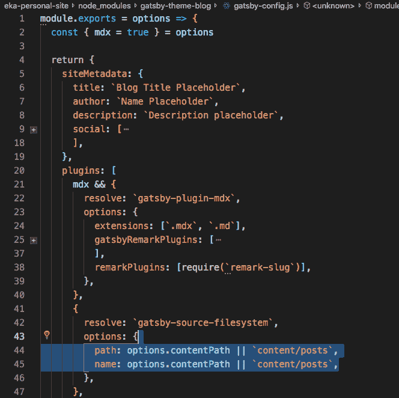
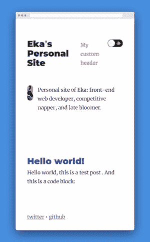
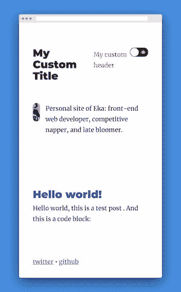
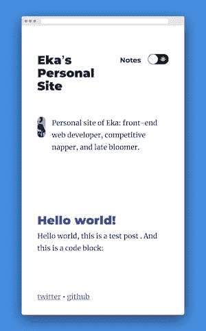
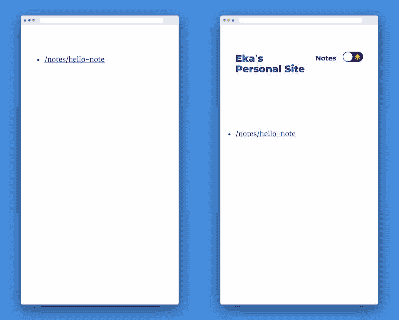
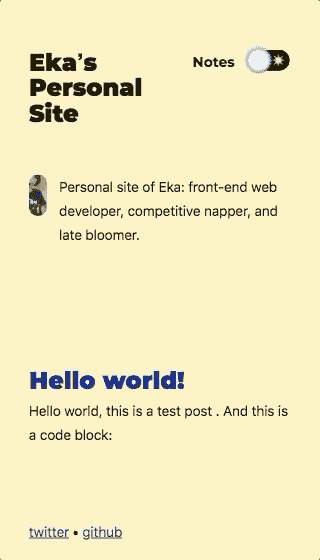

# 没有入门网站，从头开始使用和定制官方盖茨比主题

> 原文：<https://dev.to/ekafyi/using-and-customizing-multiple-official-gatsby-themes-from-scratch-without-starter-sites-2441>

一个盖茨比**主题**是一个盖茨比站点的*可重用块，可以*共享、扩展和定制* ( [源](https://youtu.be/SV2zu9FvUTw?t=406))。它使我们能够分离我们站点的功能，以模块化的方式在多个站点中共享、重用和修改。*

本周初，盖茨比主题是[宣布稳定](https://www.gatsbyjs.org/blog/2019-07-03-announcing-stable-release-gatsby-themes/)！他们有两个官方主题，[博客主题](https://www.npmjs.com/package/gatsby-theme-blog)和[笔记主题](https://www.npmjs.com/package/gatsby-theme-notes)。他们也有三个入门网站([Gatsby-starter-blog-theme](https://github.com/gatsbyjs/gatsby-starter-blog-theme)、[Gatsby-starter-notes-theme](https://github.com/gatsbyjs/gatsby-starter-notes-theme)和 [gatsby-starter-theme](https://github.com/gatsbyjs/gatsby-starter-theme) )让你开始分别使用 blog 主题、notes 主题和两种主题。

在下列情况下，使用起始站点是理想的:

*   你想快点开始吗
*   您还没有现有的网站

但是，我想从头开始建立一个盖茨比网站:

*   更好地了解主题是如何工作的
*   查看运行网站的最小可能修改

跟随我创建一个网站，添加主题，添加我自己的内容和定制！你可以在[我的 Github 的`using-official-themes-without-starter`分支](https://github.com/ekafyi/eka-personal-site/tree/using-official-themes-without-starter)下找到这篇文章的代码。

**目录**

1.  创建一个盖茨比网站
2.  安装主题
3.  修改主题选项和元数据
4.  添加降价内容和头像图像
5.  阴影布局和生物组件
6.  自定义样式

⚠️ **注:**这个帖子描述了我第一次使用官方主题的*个人*经历和视角。如果你想学习盖茨比主题，最好从他们的[文档](https://www.gatsbyjs.org/docs/themes/using-a-gatsby-theme/)和[教程](https://www.gatsbyjs.org/tutorial/using-a-theme/)开始。

* * *

## 1)创建一个盖茨比网站

我通过在我的根文件夹中手动创建一个最小的`package.json`文件，然后运行`yarn install`来做到这一点。如果你愿意，你也可以使用任何常规的、非主题的入门网站，比如[Gatsby-starter-hello-world](https://github.com/gatsbyjs/gatsby-starter-hello-world)。

```
{
  "name": "eka-personal-site",
  "private": true,
  "description": "Personal site of @ekafyi",
  "version": "0.1.0",
  "license": "MIT",
  "scripts": {
    "build": "gatsby build",
    "develop": "gatsby develop",
    "start": "npm run develop",
    "serve": "gatsby serve",
  },
  "dependencies": {
    "gatsby": "^2.13.4",
    "react": "^16.8.6",
    "react-dom": "^16.8.6"
  }
} 
```

## 2)安装主题

我们正在给*安装两个*官方主题，`gatsby-theme-blog`和`gatsby-theme-notes`。

我们用同样的方法安装任何常规的 Gatsby 插件；首先，我们通过运行`yarn add gatsby-theme-blog gatsby-theme-notes`来安装主题包。

接下来，我们将它添加到`gatsby-config.js`中的`plugins`数组中。我正在创建一个新文件，因为我是从零开始的；如果您在现有的站点中这样做，您的配置文件将与我的不同。确切的内容并不重要，只要我们像这样在`plugins`中添加我们的主题:

```
// gatsby-config.js
module.exports = {
  plugins: [
    {
      resolve: `gatsby-theme-notes`,
      options: {}
    },
    {
      resolve: `gatsby-theme-blog`,
      options: {}
    }
  ],
  siteMetadata: {
    title: "`Ekaʼs Personal Site`"
  }
}; 
```

如您所见，我从最基本的配置开始。我的元数据中只有`title`，我还没有修改任何选项。让我们在下一步做那件事。

## 3)修改主题选项和元数据

我们如何知道哪些选项可以修改？我环顾四周，发现有两个地方可以找到这些信息:

1.  已发布的主题包
2.  `node_modules`中的主题文件

在撰写本文时，这三个特定主题的入门网站都没有提供详尽的主题选项列表。

#### 3a)修改博客主题选项

我们可以在[盖茨比主题博客包自述](https://www.npmjs.com/package/gatsby-theme-blog#theme-options)中看到以下主题选项:

*   `basePath`
*   `contentPath`
*   `assetPath`
*   `mdx`

假设我们想要将博客文章文件夹从默认的`/content/posts`更改为`/content/writing`。我们可以通过将`contentPath`传递给主题的`options`来实现。

```
// gatsby-config.js
module.exports = {
  plugins: [
    // gatsby-theme-notes
    {
      resolve: `gatsby-theme-blog`,
      // Default options are commented out
      options: {
        // basePath: `/`, // Root url for all blog posts
        contentPath: `content/writing`, // Location of blog posts
        // assetPath: `content/assets`, // Location of assets
        // mdx: true, // Configure gatsby-plugin-mdx
      }
    }
  ],
  // siteMetadata
}; 
```

该主题的自述文件还包含一个[附加配置](https://www.npmjs.com/package/gatsby-theme-blog#additional-configuration)部分，描述了支持哪些`siteMetadata`项。我适时地用我的名字、网站描述和社交链接更新了我的配置。

#### 3b)修改笔记主题选项

与博客主题一样，我们可以在 [gatsby-theme-notes 包 README](https://www.npmjs.com/package/gatsby-theme-notes#options) 中找到主题选项:

*   `basePath`
*   `contentPath`
*   `mdx`
*   `homeText`
*   `breadcrumbSeparator`

我要把`homeText`修改成“家”，把`breadcrumbSeparator`修改成`»`。 *( **注:**原来面包屑只用于子文件夹中的笔记，所以我们不会在这篇文章中看到面包屑的作用。)*

```
// gatsby-config.js
module.exports = {
  plugins: [
    {
      resolve: `gatsby-theme-notes`,
      // Default options are commented out
      options: {
        basePath: `/notes`, // Root url for all notes pages
        // contentPath: `content/notes`, // Location of notes content
        // mdx: true, // Configure gatsby-plugin-mdx
        homeText: "Home", // Root text for notes breadcrumb trail
        breadcrumbSeparator: "»", // Separator for the breadcrumb trail
      }
    }
    // gatsby-theme-blog
  ],
  // siteMetadata
}; 
```

你可以在这里看到我的[完整`gatsby-config.js`档案](https://github.com/ekafyi/eka-personal-site/blob/d3dcebfb0861b87f0f16dcc6a2744efa8285a038/gatsby-config.js)。

#### 奖励:`node_modules`中的主题文件

到目前为止，入门网站在主题选项方面都有很好的文档记录。如果我们在软件包自述文件中使用非官方的主题和最少的信息会怎样？😕

我们可以在主题的存储库中评估主题文件，或者更快，在我们项目的`node_modules`文件夹中。例如，要查看博客主题文件，我们可以打开`node_modules/gatsby-theme-blog`。在那里，我们可以看到主题代码实际上如何类似于一个常规的 Gatsby 站点，以及有哪些选项可用。

[](https://res.cloudinary.com/practicaldev/image/fetch/s---yWU82rV--/c_limit%2Cf_auto%2Cfl_progressive%2Cq_auto%2Cw_880/https://thepracticaldev.s3.amazonaws.com/i/lnauxa4swsjxtrixabt2.png)

上面截图显示的是`node_modules/gatsby-theme-blog/gatsby-config.js`。我们可以看到`options`对象被传递到配置中，并在寻找我们的内容文件的`gatsby-source-filesystem`插件中使用。我们还了解到，如果我们不定义`contentPath`，那么`content/posts`将被用作默认值。

所以—我们已经安装并修改了我们的主题，但是我们还没有任何内容。让我们在下一步添加它们。

## 4)添加降价内容和头像图片

现在，我们正在将我们的内容添加到降价文件中。基于上一步，我们在我的项目根目录下创建一个名为`content`的文件夹，其中包含三个文件夹:

*   `content/writing` —包含博客文章文件
*   `content/notes` —包含注释文件
*   我不知道“资产”到底是什么，所以我将把它留空

我将通过命令行来完成此操作，尽管您也可以在其他地方完成(从 Finder、Windows 资源管理器或您的代码编辑器)。

```
mkdir content content/writing content/notes content/assets 
```

我在`content/writing/hello-world.mdx`中创建了一篇简短的博客文章，在`content/notes/hello-note.mdx`中创建了一条注释。你可以在这里看到我的 [`content`文件夹。](https://github.com/ekafyi/eka-personal-site/tree/c3859f3ae0b37a84d2cc12ab158ea7d0162505f4/content)

到目前为止，我们已经:安装了主题，修改了主题选项，并添加了内容。甚至没有一个`src`文件夹也能运行一个网站吗？当我第一次运行这个网站时，我们将会知道答案。

我运行`gatsby develop`并得到以下错误:

```
There was an error in your GraphQL query:

- Unknown field 'childImageSharp' on type 'File'.

File: node_modules/gatsby-theme-blog/src/components/bio.js 
```

我打开有问题的组件，发现我们需要一个名为`avatar`的 PNG/JPG/GIF 图像文件。

```
// node_modules/gatsby-theme-blog/src/components/bio.js
const bioQuery = graphql`
  query BioQuery {
    site {
      siteMetadata {
        author
      }
    }
    avatar: file(absolutePath: { regex: "/avatar.(jpeg|jpg|gif|png)/" }) {
      childImageSharp {
        fixed(width: 48, height: 48) {
          ...GatsbyImageSharpFixed
        }
      }
    }
  }
` 
```

我偷看了一下[博客主题启动器](https://github.com/gatsbyjs/gatsby-starter-blog-theme)，发现我们的`content/assets`文件夹中应该有头像图片。我适时地在那里添加了一个(糟糕的、做作的彩色自拍)头像，然后重新运行这个应用程序。啊…它起作用了！

[](https://res.cloudinary.com/practicaldev/image/fetch/s--BY1UmQ7f--/c_limit%2Cf_auto%2Cfl_progressive%2Cq_66%2Cw_880/https://thepracticaldev.s3.amazonaws.com/i/54tcnkec3093fvgr45b3.gif)

网站标题、头像和社交链接都正确地指向了我的。我甚至没有一个`src`文件夹就运行了一个网站！😯

然而，有几个问题:

*   传记文本仍然使用默认设置(在主题的自述文件或[开头的](https://github.com/gatsbyjs/gatsby-starter-theme)中没有提到)😕)
*   `/notes`目录确实存在，并显示我的笔记内容，但它不是从标题导航链接的

接下来，我们将“隐藏”组件来解决这些问题。

## 5)阴影布局和生物组件

组件隐藏是一种技术，它允许我们覆盖一个主题的组件，而不需要直接修改或派生主题。

现在我们将*阴影*的三个组成部分:

*   博客主题的个人简介->使用我自己的个人简介
*   博客主题的标题->添加“笔记”链接到导航
*   注意主题的布局->所以它匹配网站的其余部分(即。匹配博客页面)

对于第二和第三部分，我从 [gatsby-starter-theme](https://github.com/gatsbyjs/gatsby-starter-theme) 中复制，因为这似乎是最快的方法！

#### 5a)影子博客主题的生物成分

我首先检查了[博客主题的`bio.js`组件](https://github.com/gatsbyjs/gatsby/blob/master/themes/gatsby-theme-blog/src/components/bio.js)，但结果是它呈现了另一个名为`<BioContent>`的组件。我打开 [`bio-content.js`](https://github.com/gatsbyjs/gatsby/blob/master/themes/gatsby-theme-blog/src/components/bio-content.js) 没错，那就是我们的罪魁祸首。

隐藏主题文件的步骤:

*   在我们的`src`文件夹中创建一个主题名称的文件夹
    *   *举例:*为了阴影`gatsby-theme-blog`，我创建了文件夹`src/gatsby-theme-blog`
*   在上面的文件夹中创建组件文件，文件/文件夹结构类似于主题的结构后的 **   *例如:*我们要阴影的原始文件是`node_modules/gatsby-theme-blog/src/components/bio-content.js`。我们将上面步骤中的`components/bio-content.js`复制到我们的主题文件夹中。因此我们的档案在`src/gatsby-theme-blog/components/bio-content.js`。* 

 *TL；DR 版本，相对于我们的项目根目录:

*   原文:`node_modules/gatsby-theme-blog/src/components/bio-content.js`
*   影子:`src/gatsby-theme-blog/components/bio-content.js`

我创建了一个简单的文件，复制了最初的`bio-content.js` 的[，并修改了生物文本。](https://github.com/gatsbyjs/gatsby/blob/master/themes/gatsby-theme-blog/src/components/bio-content.js) 

```
// src/gatsby-theme-blog/components/bio-content.js
import React, { Fragment } from "react"
export default () => (
  <Fragment>
    Personal site of Eka, front-end web developer and competitive napper.
  </Fragment> ) 
```

我重启应用程序，现在它显示我的简历文本。👌🏾

#### 5b)影子博客主题的头组件

对于 header 组件，如果我对 bio 组件(即导出一个新组件)，我会用*覆盖整个头*。

```
// src/gatsby-theme-blog/components/header.js
import React, { Fragment } from "react"
export default () => (
  <Fragment>
    My custom header <br/>
    The entire header is gone! 😱
  </Fragment> ) 
```

[](https://res.cloudinary.com/practicaldev/image/fetch/s--Iybk-OhA--/c_limit%2Cf_auto%2Cfl_progressive%2Cq_auto%2Cw_880/https://thepracticaldev.s3.amazonaws.com/i/406c56sejsfhq8fhlx1i.png)

这是*而不是*我想要的，因为现在我对网站标题、黑暗模式切换按钮(UI 和功能)和简介很满意；我想做的就是*添加一个链接*到注释页面。

这里我们可以看到*隐藏不仅仅是覆盖一个组件*。根据需要，我们还可以与主题的组件及其原始道具进行交互。

如博客主题的`header.js` 中的[所示，`<Header>`组件接受站点标题和黑暗模式开关之间的`children`道具，在那里我们可以传递我们的内容。](https://github.com/gatsbyjs/gatsby/blob/70311ec585f704f49a8718b13b95470e63dba751/themes/gatsby-theme-blog/src/components/header.js#L111)

现在我们将要:(1)在我们的站点中创建阴影文件，(2)导入头部组件，以及(3)使用我们的自定义`children`呈现头部。

```
// src/gatsby-theme-blog/components/header.js
import React from "react";
import Header from "gatsby-theme-blog/src/components/header";

export default props => {
  return (
    <Header {...props}>
      <div style={{ color: "red" }}>My custom header</div>
    </Header>
  );
}; 
```

这很有效——我可以添加自己的内容，而不必重写整个 header 组件！💃🏽

[](https://res.cloudinary.com/practicaldev/image/fetch/s--ke2kpZXG--/c_limit%2Cf_auto%2Cfl_progressive%2Cq_auto%2Cw_880/https://thepracticaldev.s3.amazonaws.com/i/qhea03iwfh16buqpb337.png)

您还可以将 props 传递给组件(前提是组件支持它)。例如，这里我将`title`道具修改为“我的自定义标题”。

```
// src/gatsby-theme-blog/components/header.js
import React from "react";
import Header from "gatsby-theme-blog/src/components/header";

export default props => {
  return (
    <Header {...props} title="My Custom Title">
      <div style={{ color: "red" }}>My custom header</div>
    </Header>
  );
}; 
```

这是结果。

[](https://res.cloudinary.com/practicaldev/image/fetch/s--74s4oTMq--/c_limit%2Cf_auto%2Cfl_progressive%2Cq_auto%2Cw_880/https://thepracticaldev.s3.amazonaws.com/i/6rlggob8g3q297kexi5l.png)

最后，我将使用[Gatsby-starter-theme/header . js](https://github.com/gatsbyjs/gatsby-starter-theme/blob/master/src/gatsby-theme-blog/components/header.js)中的代码添加一个到 Notes 页面的链接。这里我们使用了来自[主题 UI](https://theme-ui.com) 的功能，这是一个由博客主题使用的主题库。简而言之，主题 UI 的`Styled`组件和`css` prop 允许我们将 HTML 元素与主题的`theme-ui`样式一起使用，例如匹配主题的`heading`字体系列。`Styled`还支持`as`道具(由 Emotion 和 Styled Component 之类的库推广)，所以我们可以通过带有`<Styled.a as={Link}>`的`Link`组件来利用 Gatsby 的内置路由(意思是:使用带有`<a>`样式的`<Link>`组件)。

```
import React from "react";
import { Link } from "gatsby";
import { css, Styled } from "theme-ui";
import Header from "gatsby-theme-blog/src/components/header";

export default props => {
  return (
    <Header {...props}>
      <Styled.a
        as={Link}
        to="/notes"
        css={css({
          // styles
        })}
      >
        Notes
      </Styled.a>
    </Header>
  );
}; 
```

有用！你可以在这里看到完整的代码。

[](https://res.cloudinary.com/practicaldev/image/fetch/s--da_Tnx0u--/c_limit%2Cf_auto%2Cfl_progressive%2Cq_auto%2Cw_880/https://thepracticaldev.s3.amazonaws.com/i/ged986k2l91za78606ce.png)

#### 5c)阴影注释主题的布局组件

我们已经在`/notes`(即。localhost:8000/notes)，但是它还没有页眉和页脚。这是因为这个视图来自 Notes 主题，与呈现页眉和页脚的 Blog 主题是分开的。

现在我们将在`src/gatsby-theme-notes/components/layout.js`中隐藏布局组件，导入博客主题的布局组件，并在后者中包装我们的内容。

与上一步一样，我们站点中的阴影组件从原始组件(即注释主题的布局)，所以我们可以包装整个`props.children`(即。注释内容)而不必重写任何其他内容。

```
// src/gatsby-theme-notes/components/layout.js
import React from "react"
import BlogLayout from "gatsby-theme-blog/src/components/layout"

export default props => <BlogLayout {...props}>{props.children}</BlogLayout> 
```

重启应用程序，瞧，博客主题布局(页眉和页脚)现在也适用于注释部分了！

<figure>

[](https://res.cloudinary.com/practicaldev/image/fetch/s--5l6SQUtC--/c_limit%2Cf_auto%2Cfl_progressive%2Cq_auto%2Cw_880/https://thepracticaldev.s3.amazonaws.com/i/1njjptd29ox7888k1tha.png)

<figcaption>Before (left) and after (right)</figcaption>

</figure>

## 6)自定义样式

除非你碰巧喜欢主题的默认紫色，否则你很可能想要修改你的主题驱动的站点的视觉风格，比如颜色和排版。

博客主题使用我们上面简单讨论过的主题库，主题 UI。主题 UI 本身是一个“主题插件”，从 [`gatsby-theme-blog/src/gatsby-plugin-theme-ui`](https://github.com/gatsbyjs/gatsby/tree/master/themes/gatsby-theme-blog/src/gatsby-plugin-theme-ui) 中导出一个`theme`对象。查看[主题 UI 的文档](https://theme-ui.com/getting-started)来阅读更多关于`theme`对象的信息。

博客主题将`theme-ui`对象分解成单独的文件(颜色、组件等)，这些文件导入到 [`gatsby-plugin-theme-ui`索引文件](https://github.com/gatsbyjs/gatsby/blob/master/themes/gatsby-theme-blog/src/gatsby-plugin-theme-ui/index.js)中。相应地，如果我们只想自定义颜色，我们可以隐藏`colors.js`文件，等等。

我们通过像隐藏任何其他组件一样隐藏`gatsby-plugin-theme-ui`文件来定制样式。例如，为了遮蔽`node_modules/gatsby-theme-blog/src/gatsby-plugin-theme-ui/colors.js`，我们将`src` ( `gatsby-plugin-theme-ui/colors.js`)之后的部分放入我们的遮蔽文件夹`src/gatsby-theme-blog`。因此，我们在`src/gatsby-theme-blog/gatsby-plugin-theme-ui/colors.js`创建我们的文件。

现在我们要修改颜色，使用[博客主题启动器的文件](https://github.com/gatsbyjs/gatsby-starter-blog-theme/blob/master/src/gatsby-theme-blog/gatsby-plugin-theme-ui/colors.js)作为参考。因为我们不想替换*所有*的颜色，我们导入主题的默认主题颜色，并将它们与我们修改后的颜色合并。我们还导入了 [lodash 的`merge`](https://lodash.com/docs/4.17.11#merge) 来深度合并样式对象。这不是必需的，但它有助于我们进行深度合并；如果我们想自己编码深度合并或者不需要与默认主题合并(即我们重写了整个主题风格。

```
// src/gatsby-theme-blog/gatsby-plugin-theme-ui/colors.js
import merge from "lodash.merge";
import defaultThemeColors from "gatsby-theme-blog/src/gatsby-plugin-theme-ui/colors";

export default merge({}, defaultThemeColors, {
  text: "rgba(0,0,0,0.9)",
  primary: "#0e43c5",
  background: "#fff1c1",
  modes: {
    dark: {
      text: "rgba(255,255,255,0.9)",
      primary: "#f7e022",
      background: "#151f48"
    }
  }
}); 
```

其他主题造型尝试:

*   `gatsby-plugin-theme-ui/typography.js`
    *   结果:✅❌部分成功。我可以把默认的*梅里韦瑟*字体改成*系统界面*，但是我不能改变`fonts.heading`。这可能是因为`fonts.heading`值在`gatsby-plugin-theme-ui/index` 中被[覆盖为*蒙特塞拉*。这就把我们带到了…](https://github.com/gatsbyjs/gatsby/blob/master/themes/gatsby-theme-blog/src/gatsby-plugin-theme-ui/index.js#L11)
*   `gatsby-plugin-theme-ui/index.js`
    *   结果:❌失败了。我的跟踪似乎没有被发现。我通过运行`console.log(‘Hello’)`进行测试，但没有打印出来。
*   `gatsby-plugin-theme-ui/styles.js`
    *   结果:✅成功了！我修改了悬停链接的样式，添加了下划线并使用了`secondary`颜色。

你可以在这里看到这三个文件。

**关于主题顺序注意:**如果多个主题使用`theme-ui`，我们`gatsby-config.js`中`plugins`数组指定的*最后一个主题*获胜。

这是这篇文章中的步骤的最终结果。

[](https://res.cloudinary.com/practicaldev/image/fetch/s--_U-tP6bn--/c_limit%2Cf_auto%2Cfl_progressive%2Cq_66%2Cw_880/https://thepracticaldev.s3.amazonaws.com/i/jtf0b0kcfq6j2t3a5nms.gif)

* * *

## 结论

以下是我尝试过官方题材后的感想。

*   主题帮助你快速开始构建一个简单的、基本的 Gatsby 站点，甚至不需要一个`src`文件夹。更高级的用户可以利用主题来创建他们站点的模块化、可扩展、可组合的模块(尽管我个人还没有达到这一点)。
*   官方主题是开始使用、修改(通过阴影)和剖析主题的好地方。
*   使用和隐藏主题的难度很大程度上取决于主题的文档，例如，什么选项可用，需要什么数据。

你有构建和/或使用非官方主题的例子吗？请在评论中告诉我！

下一站，学习做更高级的定制和/或建立我自己的主题。感谢阅读，直到下一个帖子！👋🏾*