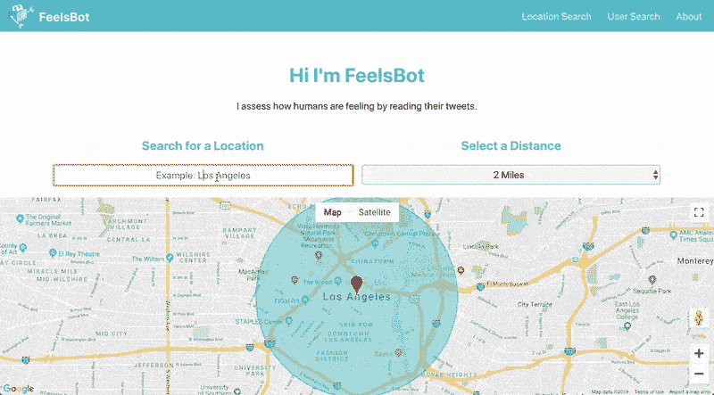

# 使用人工智能来理解推文中的情绪

> 原文：<https://dev.to/novvum/using-artificial-intelligence-to-understand-emotions-in-tweets-47mf>

你好，互联网！昨天我介绍了 [Feelsbot](https://www.feelsbot.me/) 。今天我将讨论 Feelsbot 如何使用人工智能来分析推文中的情感情绪。Feelsbot 可以分析任何地理位置或任何公共 Twitter 个人资料的推文。

### 什么是人工智能和机器学习？

**人工智能(AI)** 这几天好像满天飞，但到底是什么呢？使用人工智能理解推文的 Feelsbot 是帮助回答这个问题的一个很好的例子。

人工智能是计算机科学的一个领域，致力于创造能够做出智能决策的机器。你可以把人工智能当成一个目标。我们可以通过机器学习达到这个目标。**机器学习**是一种教会机器如何在没有明确编程的情况下进行预测或决策的方法。

机器学习模型被称为*学习*，因为它们不是被编程来做事，而是被*训练*。通过向模型展示大量示例数据点并在示例中寻找模式来训练模型。一旦识别出来，这些模式将被用来对新的数据做出决策。

Feelsbot 使用 IBM 创建的机器学习模型，将文本分类为快乐、悲伤、愤怒、厌恶或恐惧。这个模型被训练成通过展示大量快乐、悲伤、愤怒、厌恶和恐惧的文本来检测情绪。模型检测到的模式可能涉及关键字，如“哭泣”或“欢呼”，或者它们可能涉及每个句子中的字数。无论模式是什么，它们都聚集在一起形成了机器学习模型。

**自然语言处理**是 AI 的一个子集，旨在理解人类语言。为 Feelsbot 提供动力的机器学习模型也可以称为自然语言处理。

### 创作 Feelsbot 的灵感

我决定创建 Feelsbot 有几个原因。首先，我的灵感来自于使用 IBM 和 Google 的一些机器学习 API 是多么容易。此外，我想创建一个软件项目来帮助人们更好地理解人工智能是如何工作的。

Feelsbot 强调了一些关于人工智能和自然语言处理的重要事情。

*   许多机器学习模型对情感的看法相当简单，无法察觉微妙的事情，例如讽刺。
*   有时，比喻可以摆脱模型，例如，“我太高兴了，我可以哭了”被检测为悲伤，有 65%的信心。

虽然 Feelsbot 并不完美，但它比你想象的更准确！我经常惊讶于它能如此好地分类更模糊的推文。自己试试看。

*注意:推文很短，经常使用俚语，这对于用常规文本摘录训练的机器学习模型来说并不总是很好。对于这个项目，我没有训练我自己的模型，但创建一个只使用 tweets 训练的机器学习模型会很有趣。*

### feels bot 如何查找和分类推文

如前所述，Feelsbot 正在使用 IBM 的机器学习模型来分析推文中的情绪。使用这个模型，Feelsbot 将推文分为五类:快乐、悲伤、愤怒、恐惧和厌恶。这种模式只适用于英语，限制了 Feelsbot 可以分析的推文数量。每条推文都会收到一个分数，称为置信度分数，表示它与其中一个类别的匹配程度。Feelsbot 将置信度高于 65%的推文归入每个类别。一旦推文被分类，快乐指数被计算为快乐推文相对于其他情绪的百分比。

当使用地图时，Feelsbot 使用 Twitter 的 API 来获取最后 100 条在输入位置附近有地理标记的推文。如果该位置附近最近没有太多地理标记的推文，Twitter 会获取其个人资料位置在附近的用户的推文。当分析特定 Twitter 账户的推文时，Feelsbot 获取该账户的最后 150 条推文。Twitter 个人资料需要公开，Feelsbot 才能发挥作用。

### Feelsbot 的下一步是什么？

看看 Feelsbot，让我知道你的想法！根据请求，标签搜索目前正在进行中，所以请密切关注更新。

此外，我只触及了什么是机器学习和人工智能的表面，但如果你喜欢这个帖子，并希望更深入的解释，请在下面留下评论！

### 贡献者

*   非常感谢[novum](https://www.novvum.io/)对 Feelsbot 开发的支持。
*   Feelsbot 是由[艾莉森·科尔耶](https://twitter.com/allicolyer)创造的。
*   机器人图纸是由[鲁比·里奥斯](https://rubyrios.com/)创作的。