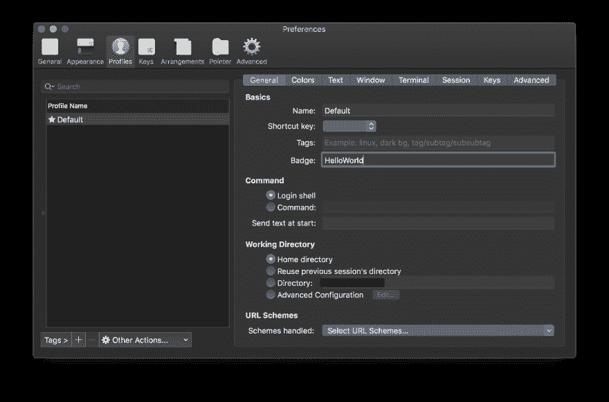
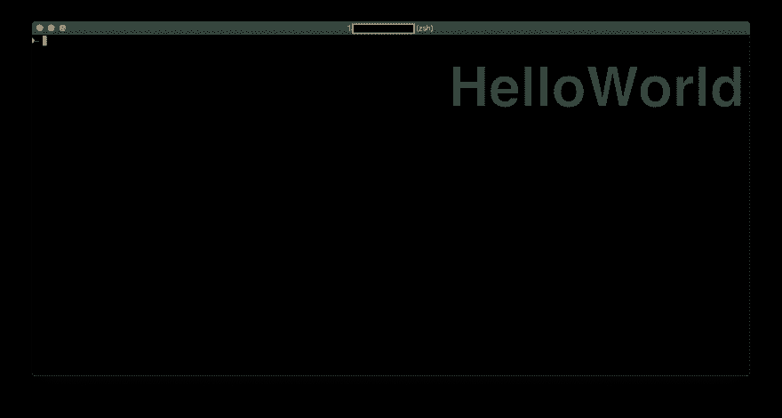
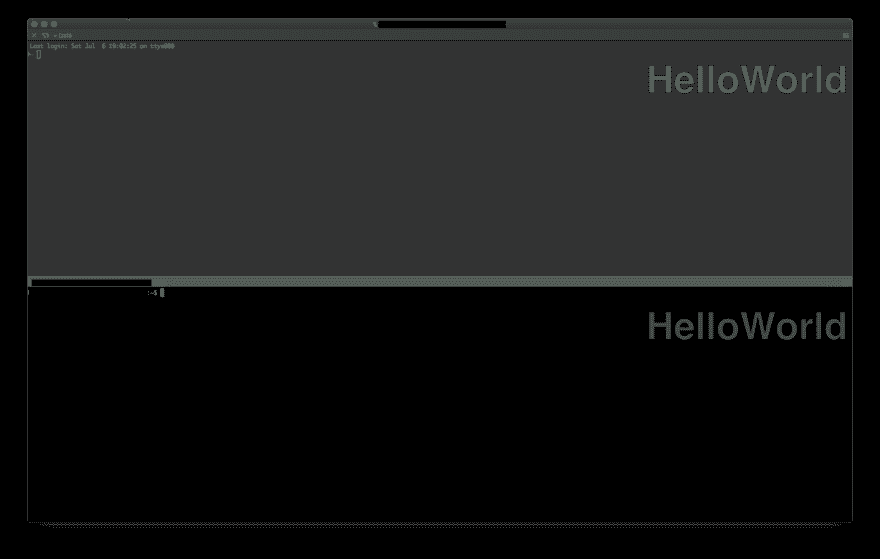
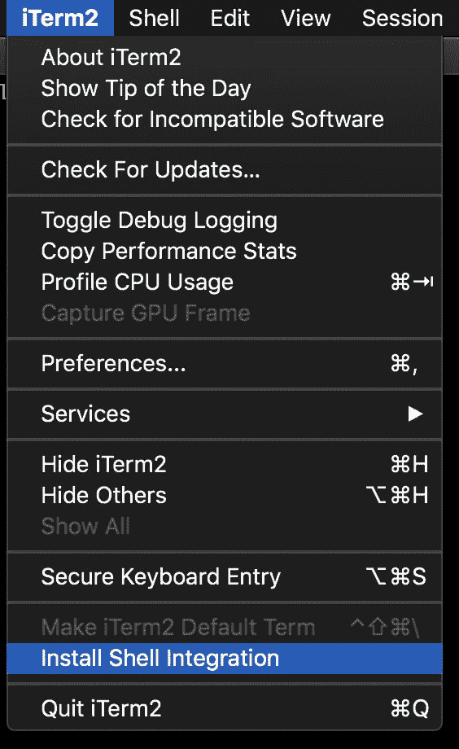
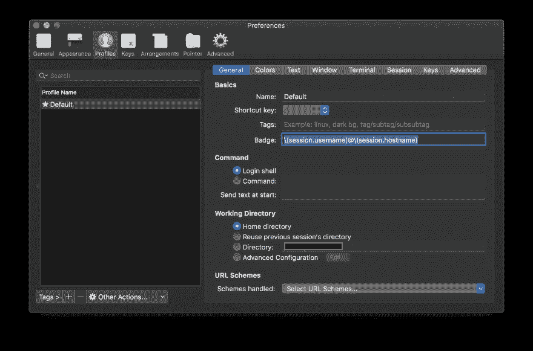
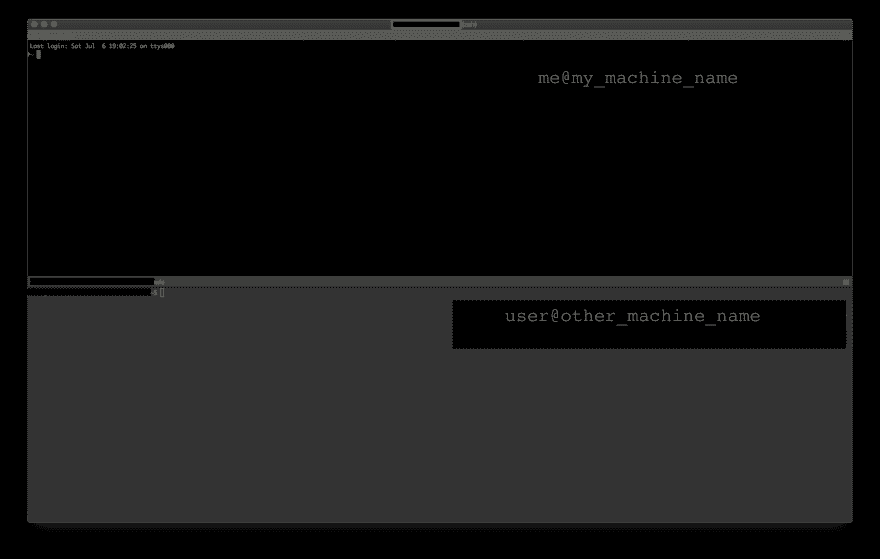

# 在 iTerm2 中使用徽章

> 原文：<https://dev.to/vivekkodira/using-badges-in-iterm2-4cce>

更新:2019 年 8 月 1 日:这篇文章中提到的例子现在是多余的。使用 iTerm 的[状态栏](https://www.iterm2.com/3.3/documentation-status-bar.html)代替。

iTerm2 是内置终端的一个非常强大的替代品。你可以在这里阅读更多关于为什么[。](https://dev.to/t/iterm2)

这篇文章将关注我最近探索并发现有用的一个特定功能:[徽章](https://www.iterm2.com/documentation-badges.html)，是为不熟悉 iTerm2 的初学者准备的

## 你好世界

让我们从一个“Hello World”的例子开始。

*   进入“iTerm2 >首选项>配置文件”
*   将文本“HelloWorld”添加到输入“General -> Basics -> Badge”

*   如果您打开一个新的 iTerm2 窗口，您现在应该会看到以下内容:

*   此徽章将显示在每个选项卡中。将窗口分成两个选项卡，这就是你将看到的。
    [T3】](https://res.cloudinary.com/practicaldev/image/fetch/s--Nzn8V4Mf--/c_limit%2Cf_auto%2Cfl_progressive%2Cq_auto%2Cw_880/https://thepracticaldev.s3.amazonaws.com/i/nr1ed7ftfuh1l3paklrm.png)

*   现在让徽章显示一些有用的东西，比如用户名和机器名。为此，我们首先需要安装[外壳集成](https://www.iterm2.com/documentation-shell-integration.html)
    

*   现在，回到首选项面板，将徽章更改为`\(session.username)@\(session.hostname)`
    

*   iTerm 现在会显示一个更有用的徽章
    

*重要提示*:在看到正确的标签之前，必须在*通过 ssh 连接到的每个*主机上完成“安装 Shell 集成”步骤。

享受吧，Vivek。

页（page 的缩写）s:徽章还支持更高级的特性，比如用户定义的变量。尝试它们以获得您需要的外观和感觉。您需要知道的只是一些基本的 bash 脚本

### 参考文献

*   [iTerm2](https://www.iterm2.com/)
*   [iTerm2 徽章](https://www.iterm2.com/documentation-badges.html)
*   [iTerm2 外壳集成](https://www.iterm2.com/documentation-shell-integration.html)