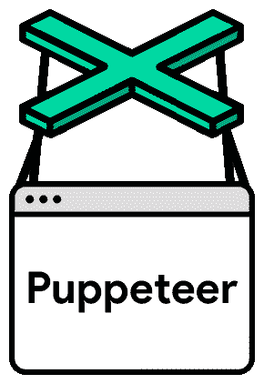

# 使用 Cookies、Puppeteer & NodeJS 在 macOS 上镜像 Chrome 配置文件

> 原文：<https://dev.to/rubengmurray/using-cookies-puppeteer-nodejs-to-mirror-a-chrome-profile-on-macos-1l6m>

* * *

[](https://res.cloudinary.com/practicaldev/image/fetch/s--JZ0rs23q--/c_limit%2Cf_auto%2Cfl_progressive%2Cq_auto%2Cw_880/https://rubensbits.co/media/puppeteer.png)

在 Puppeteer 中镜像一个现有 Chrome 配置文件的状态对于本地项目和测试非常有用。

除非您对模拟整个登录过程感兴趣，否则利用预先存在的设置——在本例中是 cookies 可以显著减少您复制计算机上其他地方存在的状态所花费的时间。

*接下来的过程需要 [NodeJS](https://nodejs.org/en/download/) 、 [NPM](https://docs.npmjs.com/downloading-and-installing-node-js-and-npm) 和[木偶师](https://pptr.dev/)。在继续下一步之前，您需要按顺序安装所有这些项目。按照各自网站上的说明将它们安装到您的系统上*

* * *

第一个问题是访问 cookies。Cookies 被加密是有原因的:它们包含敏感信息。在 macOS 上，它们用 Chrome 加密密钥“签名”到由 OS keychain 管理的 SQLite 数据库中。为了解密签名的 cookies，您的节点应用程序必须能够访问 keychain 中的 Chrome 密钥。这需要登录的 macOS 用户的授权。

[](https://res.cloudinary.com/practicaldev/image/fetch/s--aosm7GQQ--/c_limit%2Cf_auto%2Cfl_progressive%2Cq_auto%2Cw_880/v1/./../../media/csn1.png)

谢天谢地，有一个 NPM 模块 [`chrome-cookies-secure`](https://github.com/bertrandom/chrome-cookies-secure) 被设置来处理这个过程。在您的终端中(在您的项目目录的根目录中)复制并运行下面的代码，将`chrome-cookies-secure`模块添加到您的项目中:

```
npm i --save chrome-cookies-secure 
```

Enter fullscreen mode Exit fullscreen mode

> 如果在模块安装时没有提示您授权节点访问您的钥匙串，请不要担心。当您运行下面描述的基本 NodeJS 应用程序时，会有提示。

接下来你需要确定你想要镜像的 Chrome 配置文件的路径(你可能有多个想要选择的)。

打开 Chrome，确保你浏览的是你想要检索 cookies 的档案，然后导航到`chrome://version`。您将在`Profile Path`下找到当前浏览器会话的配置文件。

[](https://res.cloudinary.com/practicaldev/image/fetch/s--JRsL-xSu--/c_limit%2Cf_auto%2Cfl_progressive%2Cq_auto%2Cw_880/v1/./../../media/cpp1.jpg)

> 您可以在`Users/yourName/Library/Application Support/Google/Chrome`查看您所有的 Chrome 档案目录。
> 
> 这通常被写成`~/Library/Application Support/Google/Chrome`，其中`~`指的是用户的根目录(在 Finder 中`Macintosh HD > Users > userName` = `~`)。

* * *

现在，您已经有了在 Node 应用程序中检索 cookies 所需的基本信息！下面是演示该功能的简单代码片段。让我们看看我们的`https://www.google.com`饼干。

在你的项目文件夹中选择一个文件(我把我的文件命名为`server.js`)粘贴下面的代码:

```
const chrome = require('chrome-cookies-secure');

const url = 'https://www.google.com';

chrome.getCookies(url, 'puppeteer', function(err, cookies) {
    if (err) {
        console.log(err, 'error');
        return
    }
    // do stuff here...
    console.log(cookies, 'cookies');
}, 'yourProfile') // e.g. 'Profile 2' 
```

Enter fullscreen mode Exit fullscreen mode

> 该模块还不完全支持承诺或异步/等待，但我们希望增加支持。您可以在`https://github.com/bertrandom/chrome-cookies-secure`更新时帮助我们添加它！2020 年 3 月-有一个承诺包装的 PR 等待批准-[https://github.com/bertrandom/chrome-cookies-secure/pull/21](https://github.com/bertrandom/chrome-cookies-secure/pull/21)

[](https://res.cloudinary.com/practicaldev/image/fetch/s--0Xk3zEV9--/c_limit%2Cf_auto%2Cfl_progressive%2Cq_auto%2Cw_880/v1/./../../media/gyc1.png)

接下来，确保您在终端的项目根目录中，运行`node yourfilename.js`。您应该会在终端中看到您选择的给定配置文件和 url 的 cookies，例如:

[](https://res.cloudinary.com/practicaldev/image/fetch/s--NvtVjDUa--/c_limit%2Cf_auto%2Cfl_progressive%2Cq_auto%2Cw_880/v1/./../../media/gyc2.png)

> 在本例中，我们正在查看 Google 的 cookies。在下一部分中，您将需要将其更改为您当前登录的网站

* * *

现在你可以在 NodeJS 中看到你的 cookies，你可以把它们加载到 Puppeteer 中！

将您的代码更新为以下代码并运行`node yourfilename.js`。

```
const chrome = require('chrome-cookies-secure');
const puppeteer = require('puppeteer');

const url = 'https://www.yoururl.com';

const getCookies = (callback) => {
    chrome.getCookies(url, 'puppeteer', function(err, cookies) {
        if (err) {
            console.log(err, 'error');
            return
        }
        console.log(cookies, 'cookies');
        callback(cookies);
    }, 'yourProfile') // e.g. 'Profile 2'
}

getCookies(async (cookies) => {
    const browser = await puppeteer.launch({
        headless: false
    });
    const page = await browser.newPage();

    await page.setCookie(...cookies);
    await page.goto(url);
    await page.waitFor(1000);
    browser.close()
}); 
```

Enter fullscreen mode Exit fullscreen mode

你会看到木偶师打开并导航到你选择的站点，如果没有进一步的安全措施，比如 2FA，你会看到你已经登录了！

值得注意的是，Chrome 配置文件中的新 cookies 会延迟 30 分钟才会反映到硬盘上(因此可以在 Node 应用程序中访问)。这是因为 Chrome 每 30 分钟将 cookies 保存到存储器中一次。因此，如果你有新的饼干，给它 30 分钟，并再次检查。

您还需要完全限定 URL，以便检索给定站点的所有可能的 cookies，即`https://www.google.com`而不是`https://google.com`。

但就是这样！

你现在应该可以从你的 Chrome 配置文件中使用登录状态、偏好设置或其他任何东西来做你想做的事情了！