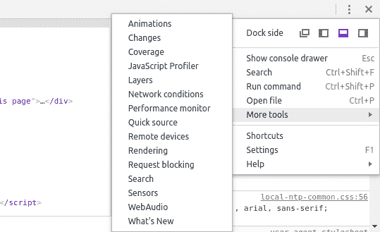
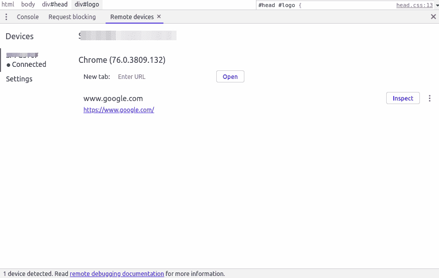

# 在任何移动设备上使用谷歌浏览器控制台！

> 原文：<https://dev.to/dev0x0/using-google-chrome-console-on-any-mobile-device-9ec>

谷歌浏览器是我所有设备的默认浏览器，在这篇文章中，我将与你分享如何在你的移动设备上使用这个控制台。

我们开始吧。

## 安卓

1 -进入**设置** > **关于手机**启用**开发者模式**，然后点击**内部版本号** 7 次。
2 -从**开发者选项**中启用 **USB 调试**。
3 -在桌面上，打开 **DevTools** 点击更多图标，然后点击**更多工具** > **远程设备**。

4 -检查**发现 USB 设备**选项。
5 -打开手机上的 chrome 浏览器。
6 -通过 USB 连接您的手机，然后您会看到一个授权弹出窗口，点击确定。
7 -你将能够看到你的手机标签并**检查**它们。

## iOS 及其他

只需打开新标签并输入:`chrome://inspect`，然后点击**开始记录**按钮，然后访问您想要调试的页面。

我希望这能帮助你🙏