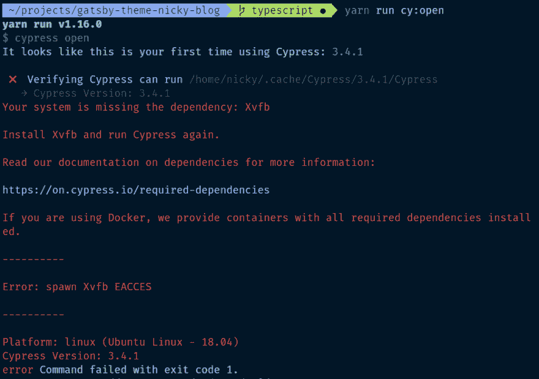
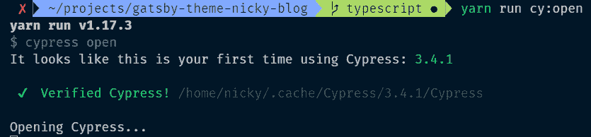
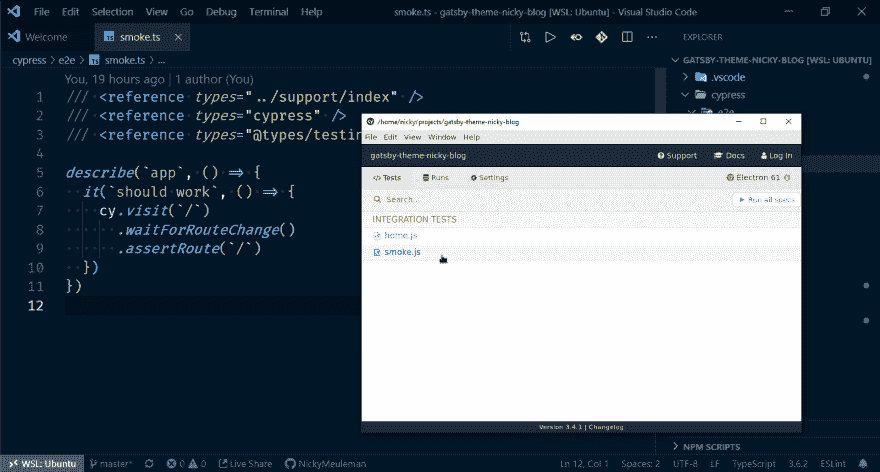

# 在 WSL2 中使用类似 Cypress 的图形用户界面

> 原文：<https://dev.to/nickymeuleman/using-graphical-user-interfaces-like-cypress-in-wsl2-249j>

Linux 的窗口子系统非常强大。探索了一段时间后，我想把它推得更远。

[](/nickymeuleman) [## WSL2、zsh 和 docker。Linux 穿越 Windows。

### 尼基·穆勒曼 6 月 15 日 1911 分钟阅读

#linux #windows #productivity #tutorial](/nickymeuleman/wsl2-zsh-and-docker-linux-through-windows-4e4m)

在你运行 Windows 的电脑上，在 Linux 内部原生运行<abbr title="Graphical User Interfaces">GUI</abbr>不是很酷吗？🤯

> <video loop="" controls=""><source src="https://video.twimg.com/tweet_video/EEmIcY4WwAU3xmH.mp4" type="video/mp4"></video>Nicky Meuleman@ nmuleman刚刚在他们的 GUI 中运行了 [@Cypress_io](https://twitter.com/Cypress_io) 厨房水槽测试。在我的 Windows 机器上的 Linux 上。 [#WSL2](https://twitter.com/hashtag/WSL2)
> 
> 我此时的心情:
> 【gif alt:基丝汀·贝尔试图惊愕地发誓。(在好的地方)】2019 年 9 月 16 日下午 15:26[](https://twitter.com/intent/tweet?in_reply_to=1173619206358753282)[](https://twitter.com/intent/retweet?tweet_id=1173619206358753282)1[](https://twitter.com/intent/like?tweet_id=1173619206358753282)14

## 先决条件

让我们先解决最明显的问题。
<abbr title="Window Subsystem for Linux, version 2">WSL2</abbr> 。我给[写了一个指南](https://dev.to/nickymeuleman/wsl2-zsh-and-docker-linux-through-windows-4e4m)，详细介绍了如何在短时间内从 0 到牛逼。
现在，是时候[把那个刻度盘转到 11](https://youtu.be/4xgx4k83zzc) 了。

更好方法是，更新 linux 安装程序

```
sudo apt update
sudo apt upgrade 
```

### VcXsrv

你可以使用一个叫做 [X-server](https://en.wikipedia.org/wiki/X.Org_Server) 的东西来显示计算机的 Linux 端正在发生什么。

为此我使用了免费程序 [VcXsrc](https://sourceforge.net/projects/vcxsrv/) 。

第一次运行该程序时，当 Windows 防火墙弹出时，允许“公共网络，如机场和咖啡店中的公共网络”。

将在机器 WSL 端启动的程序显示为单独的窗口。我选择了“多个窗口”和“不启动客户端”选项。

在允许您启用额外设置的页面上，确保禁用访问控制。默认情况下，它只允许本地 IP 127.0.0.1。
由于 WSL 有自己的 IP 地址，该地址经常变化，因此允许来自所有客户端的连接。

[](https://res.cloudinary.com/practicaldev/image/fetch/s--6x_9OBK8--/c_limit%2Cf_auto%2Cfl_progressive%2Cq_auto%2Cw_880/https://thepracticaldev.s3.amazonaws.com/i/itvorzjjksnsjmqozu4n.png)

### 柏树

你可以用贵由想运行的任何东西来替换它。对我来说，它是[柏树](https://www.cypress.io/)，所以我确保把它摆好。

在一个项目中安装了 Cypress 之后，我在`package.json`中增加了一个启动的方式。

```
{  "scripts":  {  "cy:open":  "cypress open"  }  } 
```

当我试图运行`cy:open`时，有一堆错误向我打招呼

[](https://res.cloudinary.com/practicaldev/image/fetch/s--wwULNMgC--/c_limit%2Cf_auto%2Cfl_progressive%2Cq_auto%2Cw_880/https://thepracticaldev.s3.amazonaws.com/i/wdle1eg1xa6rdwaadrx9.png)

幸运的是，这是一条有用的错误消息，它指向带有解决方案的文档页面。

```
sudo apt install libgtk-3-dev libnotify-dev libgconf-2-4 libnss3 libxss1 libasound2 
```

安装这些包后，尝试运行`cy:open`不再出错。
它也不做其他任何事情，只永远显示`Opening Cypress`消息。

[](https://res.cloudinary.com/practicaldev/image/fetch/s--Jy8R-yn1--/c_limit%2Cf_auto%2Cfl_progressive%2Cq_auto%2Cw_880/https://thepracticaldev.s3.amazonaws.com/i/6p06592zqpuxn7rw1lvw.png)

## Bash 配置

### `DISPLAY`变数

为了让 Linux GUI 应用程序连接到我们的 X 服务器，必须设置一个 [`DISPLAY`环境变量](https://askubuntu.com/questions/432255/what-is-the-display-environment-variable)。

在你的`.bashrc`(或者`.zshrc`如果你用的是 ZSH)

```
# set DISPLAY variable to the IP automatically assigned to WSL2
export DISPLAY=$(cat /etc/resolv.conf | grep nameserver | awk '{print $2; exit;}'):0.0 
```

当您启动 WSL2 时，它会获得自己的 IP 地址。最长命令将评估 WSL2 设置的 IP。
`DISPLAY`变量的格式为`<host>:<display>.<screen>`。

`<display>`和`<screen>`在这里都被设置为 0，这样 line 将评估为类似于`export DISPLAY=172.17.224.1:0.0`的东西，而`<host>`将更改为正确的 IP。

为了确认这一点，打印出您刚刚在终端中设置的变量。

```
echo $DISPLAY
# 172.17.224.1:0.0 
```

### 自动启动`dbus`

很多 GUI 应用程序使用 [D-Bus](https://en.wikipedia.org/wiki/D-Bus) 进行内部通信。

在`.bashrc`(或`zshrc`)中，在前一行下，添加

```
sudo /etc/init.d/dbus start &> /dev/null 
```

> 可以通过在您的终端中运行`source ~/.bashrc`(或`source ~/.zshrc`)来重新加载该文件。

## 授予`dbus`无密码访问权限

我们需要一个`soduers`文件来授权我们的 linux 用户在没有密码的情况下访问`dbus`。

为此，使用 [`visido`命令](http://manpages.ubuntu.com/manpages/precise/en/man8/visudo.8.html)。这个最佳实践将确保你不会把自己锁在系统之外。`sudoers`档不是随便玩的，像`/etc/sudoers.d/README`里的`README`会告诉你。

```
sudo visudo -f /etc/sudoers.d/dbus 
```

将启动一个 Nano 编辑器。输入下面一行，其中`<your_username>`被替换为-🥁drumroll please🥁- *你的用户名*。

如果您不确定您的 linux 用户名是什么，在终端中运行`whoami`会告诉您。

```
<your_username> ALL = (root) NOPASSWD: /etc/init.d/dbus 
```

在 Nano 编辑器中编写文件几乎和退出 VIM 一样困难。
按`CTRL+O`保存，然后按`Enter`确认。最后，按下`CTRL+X`关闭编辑器。

## 启动您的 GUI 应用程序

关闭您的终端，并在您想要打开 GUI 应用程序的位置打开一个新的终端。

在 Windows 中打开 VcXsrv 程序(称为 XLaunch)。
确保禁用访问控制。

在 Linux 中启动程序。

```
# in the directory I installed Cypress and set up the command to launch it
yarn run cy:open 
```

嘣，一个运行 Linux 应用程序的窗口在 Windows 上打开了🎉

[](https://res.cloudinary.com/practicaldev/image/fetch/s--eL23h8kI--/c_limit%2Cf_auto%2Cfl_progressive%2Cq_auto%2Cw_880/https://thepracticaldev.s3.amazonaws.com/i/fakzfmi2gxvpl7tdyw2p.png)