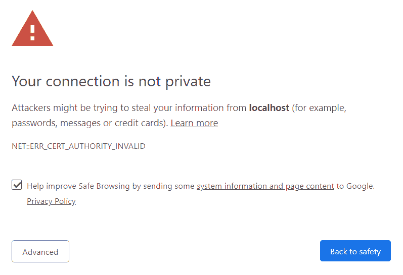

# 将 HTTPS 与 react create 应用程序配合使用(Windows)

> 原文：<https://dev.to/wozzo/using-https-with-react-create-app-windows-fn8>

# 通过 react 创建应用程序使用 HTTPS

## 新版本

本文有一个[更新版本](https://dev.to/wozzo/using-https-with-create-react-app-5337)，它使用了 react-scripts v3.4.0 中发布的新特性。

## 推理

有很多原因可以解释为什么你想要开发一个使用 https 的网站。对于我们，我们部署到 IIS，我们的 web.config 设置为自动将所有 http 流量重定向到 https，我们不想在开发中覆盖这一点。这使得我们的开发环境与生产环境更加相似。

## 启用 https

这是简单的一步。`create-react-app`，或者更准确地说是 [`react-scripts`](https://www.npmjs.com/package/react-scripts) ，当您运行`start`命令并且将一个名为`HTTPS`的[环境变量设置为“true”](https://github.com/facebook/create-react-app/blob/ad51d6280ddd543a9bece732b8230439f6e258e8/packages/react-scripts/scripts/start.js#L95)时，将自动启用 https。设置好这个环境变量后，下次运行`npm start`或`yarn start`时，webpack dev 服务器将启动，并启用 [https 选项](https://github.com/webpack/webpack-dev-server/tree/master/examples/cli/https)。这将自动创建一个自签名证书，有效期为 30 天。但是:
[](https://res.cloudinary.com/practicaldev/image/fetch/s--hZU79DiN--/c_limit%2Cf_auto%2Cfl_progressive%2Cq_auto%2Cw_880/https://thepracticaldev.s3.amazonaws.com/i/nn366f6spc5h010zw44v.png) 
该证书不可信，因此您总是会得到警告。上面的链接描述了如何创建您自己的证书并将其用于 webpack dev server，但是由于 react 脚本的工作方式，您将无法传入指定使用哪个证书的变量，也无法传入用于保护证书的任何密码。

## 创建将要使用的证书

webpack dev 服务器可以使用 pem 文件和 pfx 文件。pfx 文件需要我们传递密码，但我们做不到，所以我们必须使用 pem 文件。这并不像你在 windows 中希望的那样简单。我发现我必须导出一个 pfx 文件，并分别提取密钥和证书，然后将它们放入同一个 pem 文件中。这是必要的，因为 webpack dev 服务器将自动在位于其目录的 ssl 文件夹中的名为“server.pem”的文件中检查这些文件。/node _ modules/web pack-dev-server/SSL/server . PEM”)。我编写了以下脚本来实现这一点，并将 pem 文件保存在所需的位置。您需要安装 openssl。

```
Write-Host  "Creating https certificate"  $certificate  =  New-SelfSignedCertificate  -certstorelocation  cert:\localmachine\my  -dnsname  localhost  $password  =  "AnyPassword"  $securePassword  =  ConvertTo-SecureString  -String  $password  -Force  -AsPlainText  $pfxPath  =  "./localhost.pfx"  $outPath  =  "./node_modules/webpack-dev-server/ssl/server.pem"  Export-PfxCertificate  -Cert  $certificate  -FilePath  $pfxPath  -Password  $securePassword  |  Out-Null  Import-PfxCertificate  -Password  $securePassword  -FilePath  $pfxPath  -CertStoreLocation  Cert:\LocalMachine\Root  |  Out-Null  $keyPath  =  "./localhost-key.pem"  $certPath  =  "./localhost.pem"  openssl  pkcs12  -in  $pfxPath  -nocerts  -out  $keyPath  -nodes  -passin  pass:$password  openssl  pkcs12  -in  $pfxPath  -nokeys  -out  $certPath  -nodes  -passin  pass:$password  $key  =  Get-Content  ./localhost-key.pem  $cert  =  Get-Content  ./localhost.pem  $key  +  $cert  |  Out-File  $outPath  -Encoding  ASCII  Write-Host  "Https certificate written to $outPath" 
```

我将这个脚本保存在项目文件夹根目录下的一个名为“certificates.ps1”的文件中。如果您运行此脚本一次，它将创建 pem 文件并将其放在正确的位置。如果你在运行之后尝试`yarn start`,警告将会消失，你的网站将会加载。然而，我们还没有完成。下次清理 node_modules 目录时，证书将会丢失。或者如果你从不清洗，它将在一年内过期。

## 运行脚本

打开 package.json 文件，找到“脚本”部分。它看起来应该是这样的

```
 "scripts":  {  "start":  "react-scripts start",  "build":  "react-scripts build",  "test":  "react-scripts test",  "eject":  "react-scripts eject",  "storybook":  "start-storybook -p 9009 -s public",  "build-storybook":  "build-storybook -s public",  "postinstall":  "yarn build"  }, 
```

我们可以在那里看到`start`命令。我们将添加一个`prestart`命令，只要你输入`yarn start`，它就会自动运行。这将在每次运行时创建证书，并在 webpack dev 服务器启动时准备好。
在你的脚本部分添加下面一行

```
 "prestart":  "@powershell -NoProfile -ExecutionPolicy Unrestricted -Command ./certificates.ps1", 
```

现在运行您的`start`命令，您应该会看到消息说我们的证书正在被创建。之后，你不应该有任何警告。