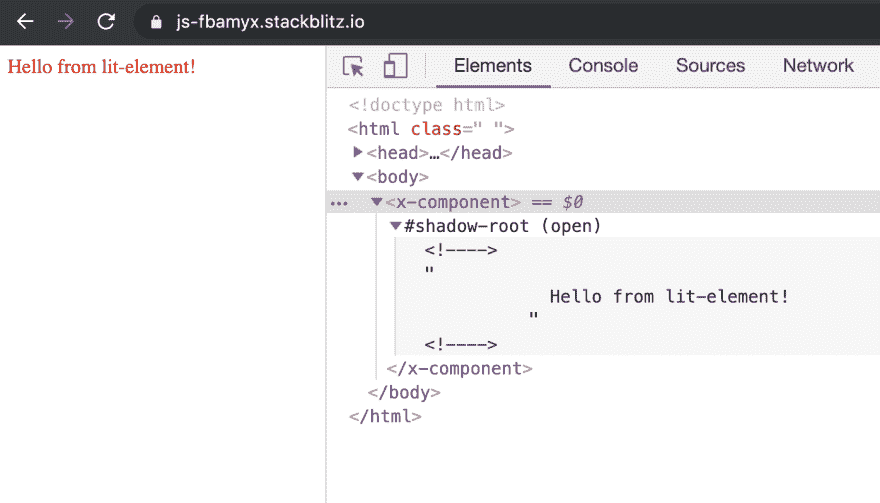

# 使用导入地图和 Lit Element Web 组件

> 原文：<https://dev.to/coryrylan/using-import-maps-and-lit-element-web-components-4aoe>

当使用 JavaScript 模块时，我们经常用节点包路径导入。
浏览器加载 JavaScript 时，由于不是相对目录路径，浏览器不会知道包文件夹在哪里。该路径指向安装我们的包的目录。

```
import { html } from 'lit-element'; 
```

当使用 Webpack 或 Rollup 之类的工具时，他们会更新路径并为我们捆绑这些代码。如果我们想在没有任何构建工具的情况下构建原型，这是一个问题。

浏览器中的 Web 组件 API 是相对低级的 API。我们可以使用 lit-html 和 lit-element 之类的工具来提供高级抽象。当使用 lit-element 构建 Web 组件时，我们通常需要一个构建步骤。Lit-element 作为现代 es2015+ JavaScript 发布；但是，它使用的导入路径不是相对文件路径。幸运的是，即将推出的名为 import maps 的浏览器功能是一个潜在的解决方案，可以将我们从构建工具中解救出来。

## JavaScript 模块导入地图

[导入映射](https://github.com/WICG/import-maps)是 JavaScript 模块的一个新特性。导入映射允许我们在浏览器看到一个模块使用另一个模块的路径时告诉浏览器。我们的例子从`lit-element`导入。

```
import { html } from 'lit-element'; 
```

使用导入映射，我们可以告诉浏览器换出`lit-element`
来使用 CDN URL。

```
<script type="importmap">
  {
    "imports": {
      "lit-html": "https://unpkg.com/lit-html@latest/lit-html.js?module"
    }
  }
</script> 
```

这个片段将我们的导入映射到指向 lit-html 包的 CDN 版本的新路径。

```
import { html } from 'https://unpkg.com/lit-html@latest/lit-html.js?module'; 
```

这种映射很有帮助，因为我们不想使用构建步骤来为我们转换路径。导入映射仍然是一个新提出的特性，所以要使用它们，我们需要使用一个 shim JavaScript 文件来提供该功能。我们将使用 [`es-module-shims`聚合填充](https://github.com/guybedford/es-module-shims)。

```
<!doctype html>
<html>
  <head>
    <script defer src="https://unpkg.com/es-module-shims@latest/dist/es-module-shims.js"></script>
    <script type="importmap-shim">
      {
        "imports": {
          "lit-html": "https://unpkg.com/lit-html@latest/lit-html.js?module",
        }
      }
    </script>
    <script type="module-shim">
      ...
    </script>
  </head>
  <body>
   ...
  </body>
</html> 
```

要使用垫片，我们必须用`shim`作为模块类型的后缀，这样 polyfill/shim 就有时间处理和更新路径。要使用 lit-element，我们需要更新一些路径，因为 lit-element 有一些不同的导入路径。

```
<script type="importmap-shim">
  {
    "imports": {
      "lit-html": "https://unpkg.com/lit-html@latest/lit-html.js?module",
      "lit-element": "https://unpkg.com/lit-element@latest/lit-element.js?module",
      "lit-html/lit-html.js": "https://unpkg.com/lit-html@latest/lit-html.js?module",
      "lit-html/lib/shady-render.js": "https://unpkg.com/lit-html@latest/lib/shady-render.js?module"
    }
  }
</script> 
```

现在我们已经设置好了导入映射，我们可以开始在 JavaScript 中使用 lit-element 了。

```
<!doctype html>
<html>
  <head>
    <script defer src="https://unpkg.com/es-module-shims@latest/dist/es-module-shims.js"></script>
    <script type="importmap-shim">
      {
        "imports": {
          "lit-html": "https://unpkg.com/lit-html@latest/lit-html.js?module",
          "lit-element": "https://unpkg.com/lit-element@latest/lit-element.js?module",
          "lit-html/lit-html.js": "https://unpkg.com/lit-html@latest/lit-html.js?module",
          "lit-html/lib/shady-render.js": "https://unpkg.com/lit-html@latest/lib/shady-render.js?module"
        }
      }
    </script>
    <script type="module-shim">
      // you can also set a external script src with type "module-shim"
      import { LitElement, html, css } from 'lit-element';

      class XComponent extends LitElement {
        static get styles() {
          return css`
            :host {
              color: red;
            }
          `;
        }

        render() {
          return html`
            Hello from lit-element!
          `;
        }
      }

      customElements.define('x-component', XComponent);
    </script>
  </head>
  <body>
    <x-component></x-component>
  </body>
</html> 
```

[](https://res.cloudinary.com/practicaldev/image/fetch/s--F0DBJ-cM--/c_limit%2Cf_auto%2Cfl_progressive%2Cq_auto%2Cw_880/https://thepracticaldev.s3.amazonaws.com/i/vymf5zo3cmb6f5e1krs9.png)

我们现在可以从 lit-element 导入并开始编写我们的 Web 组件。使用 lit-element 导入地图对于快速原型制作和尝试不同的 Web 组件库来说是非常好的。想了解更多关于 lit html 的知识，请查看我的另一篇博文 [Web 组件使用 lit-html 构建 Web 组件](https://coryrylan.com/blog/building-web-components-with-lit-html)。在 [Stackblitz](https://stackblitz.com/edit/js-fbamyx) 上查看完整的工作演示。