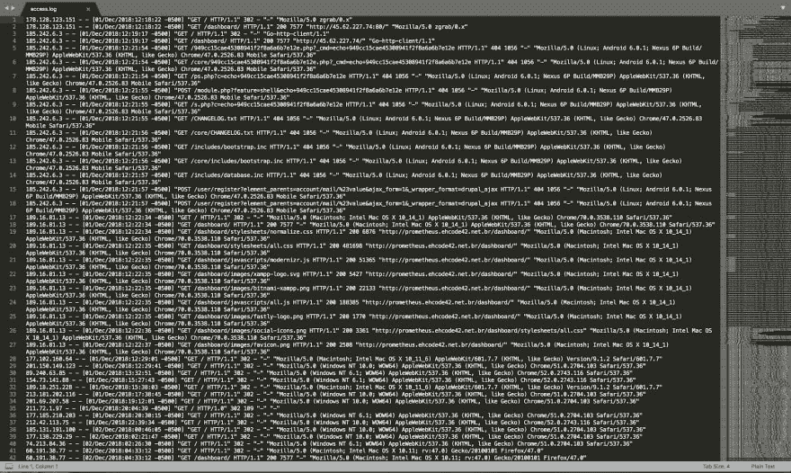

# 使用日志监控 Apache Web 服务器

> 原文：<https://dev.to/jovanhernandex/using-logs-to-monitor-apache-web-server-46ce>

为了有效地管理和监控您的基础设施，web 管理员需要关于其服务器上正在进行的活动类型的清晰透明的信息。服务器日志记录了环境中发生的所有流量和错误。Apache 有两个主要的日志文件，错误日志和访问日志。

**错误日志** — Apache 错误日志提供了服务器正常运行期间发生的诊断信息和描述性错误。这几乎总是您对服务器和环境问题进行诊断和故障排除的第一步。根据您的环境，Apache 错误日志可能位于不同的文件夹中。

**访问日志** — Apache 访问日志将所有传入的请求和流量记录到一个中央文件中。例如，当有人访问您的网站时，会创建一个日志并存储访问者的信息，如 IP 地址、他们访问的页面、浏览器信息以及他们访问的时间。这些信息对于管理员和开发人员来说至关重要，有助于他们深入了解最终用户的行为、他们正在访问的内容、他们从哪里访问站点以及使用的是什么软件和操作系统。

Apache 的一个普通的[日志文件可能有几十万行，管理员需要使用命令行工具和实用程序来解析这些行。如果你对一个环境不熟悉，这可能就像大海捞针。即使对于经验丰富的管理员来说，当您处于时间敏感的情况下，并且您需要找到服务器停机的根本原因时，这通常会很麻烦。如果您管理多台服务器，您的问题会变得更加复杂，如果您在企业环境中管理多个基础架构，问题会成倍增加。](https://www.sumologic.com/blog/apache-web-server-introduction/)

当您可以处理干净的仪表板图形用户界面时，为什么还要处理日志文件呢？这就是相扑逻辑的用武之地。

当正常人的眼睛困惑的时候，相扑逻辑开始拯救世界。即使在低流量的服务器上，存储在日志文件中的数据量也会非常大。最终，该文件会变得太大，进而要求管理员通过移动或删除这些日志文件来轮换它们。配置 Sumo 逻辑来接收这些日志文件可以为您提供完整的历史记录，或者您的系统正在做什么，以及几个月前当您不再拥有这些日志文件的存档时它们是如何执行的。

在维护系统时，仅日志轮换就足以导致信息不一致的问题，所以想象一下，试图与几十台甚至几百台服务器争论。让数百台服务器的日志每天轮换(有些甚至需要每小时轮换一次),会让任何 IT 管理员在试图寻找大海捞针的根本问题时失去理智。即使您是命令行向导，日志文件也会很快变得难以控制。将它们全部存储在云中的一个中央仪表盘中，使管理员能够在一个中央位置监督和维护数百台服务器。

### 深入了解 Apache

如果没有 Sumo Logic 这样的工具，解析 Apache 日志可能会很麻烦

如果你正在阅读一个关于分析软件的技术博客，你可能对这个场景很熟悉。您的团队刚刚构建并部署了一个全新的应用程序。它已经被释放到野外，每个人都很兴奋，渴望得到一些公众的反馈。您注意到了服务器上的活动，但不知道它来自哪里，这些用户是谁，或者他们在做什么。您开始从某些用户那里收到错误报告，但是您无法在自己的终端上重现这些问题。其他用户报告了同样的错误，而一些用户说他们甚至无法登录。您开始跟踪错误日志，并尝试为严格通过 iOS 上的 Safari 访问的用户进行 grepping，但您似乎无法找到所报告问题的根本原因。你如何启动一个应用程序，修复错误，并跟上所有来自最终用户的数据，而不被淹没？如果有一个分析工具，可以解析日志文件中成千上万行代码，帮助识别用户来自哪里，他们运行什么软件，以及他们正在访问哪些页面，那该多好。这就是相扑逻辑的用武之地。

Sumo Logic 捕获并转换您的数据分析，通过清晰易用的仪表板提供全面的可见性，有助于您和您的团队搜索、监控和识别整个应用基础架构中发生的特定事件或异常值。借助高级日志记录、流量分析和隔离关键错误的能力等工具，Sumo Logic 非常适合于性能管理以及识别潜在的安全威胁或漏洞。Sumo 逻辑也可以用来更好地洞察用户如何浏览你的网站，以及他们从访问你的网站到离开时的体验。拥有最终用户分析功能可以为浏览您网站的人提供更好的整体体验，从而为您的业务带来宝贵的信息。

### 为什么要用 Apache 的相扑逻辑？

Sumo Logic 使用分析来优化管理员对活动进行监控和故障排除的能力，使他们能够在问题影响最终用户之前采取主动并做出反应。能够识别根本问题减少了停机时间，提高了可用性，并改善了整体系统性能和用户体验。

解决问题和服务器停机时间当然是有帮助的，但是将 Sumo 逻辑与 Apache 日志数据结合起来也可以为营销人员和开发人员提供信息，而不仅仅是基础设施和系统团队。Sumo Logic 为开发人员提供了工具，使他们能够突出客户与流行网页的交互，识别频繁的推荐人或来源，并确定大多数用户在访问网站或应用程序时使用的设备和操作系统。

Sumo Logic 是多用途的，它允许您将代理安装到基础架构中，以允许不断加载新的日志数据，或者您也可以手动导入自己的日志文件，以便对数据进行分析并显示在您选择构建的自定义仪表板上。您可以选择如何让 Sumo Logic 解析您的数据。有许多不同的指标、变量和参数可以配置，可能性是无穷无尽的。

您可以在 Sumo Logic 中搜索的一些关键指标包括:

*   浏览量
*   IP 地址
*   用户的地理定位
*   状态错误(400 和 500)
*   浏览器和软件版本
*   还有更多…

使用 Sumo Logic，团队可以在一个集中的位置存储和查看所有重要的 Apache 服务器日志。业务团队可以登录并查看具有定制指标过滤器的特定仪表板，以满足他们的业务需求，而开发人员和工程师也可以登录同一帐户，查看他们自己的定制仪表板，分析他们的服务器性能，查看错误，并从 GUI web 门户找到根本原因。

团队和组织不仅可以更好地了解他们的系统基础设施，还可以更好地了解他们的客户和顾客与他们的网站或应用程序的交互。对系统运营和业务发展都是双赢。

* * *

[*注:这篇文章最初发表在相扑逻辑的资源中心博客*](https://www.sumologic.com/blog/monitor-apache-web-server/) 上